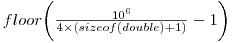
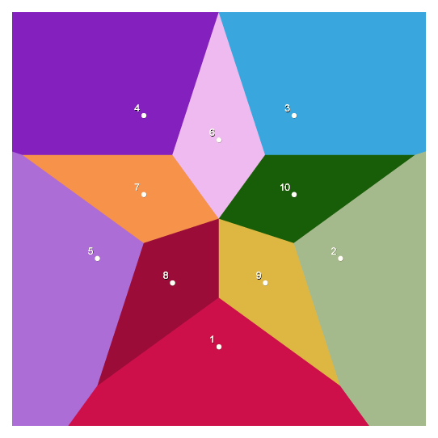

# Most superfluous output

        Francois Boutines
        Toulouse, France
        francois.boutines@gmail.com

## Judges' Comments

### To build

        cc -o boutines boutines.c

### To run

You will need an [SVG] viewer. Look here to find some [SVG Viewer Implementations].

   [SVG]: http://www.w3.org/Graphics/SVG/
   [SVG Viewer Implementations]: http://wiki.svg.org/Viewer_Implementations

The following will create an SVG file,

        perl -e 'map{print rand," ",rand,"n";}(1..20);' | ./boutines > test.svg

Can you explain the author's remark "[generated files] are not as scalable as their name suggests"?

## Author's Comments

_In memory of my father Pierre Boutines-Vignard._

### Walkthrough

My program works as follows:

**Input**
> a list of 2D points in the unit square

**Output**
> a Voronoi diagram of the set as an [SVG] stream

This will possibly save a compressed SVG file and may be useful:

        ./boutines | gzip > result.svgz

Input consists of a list of floating points values separated by whitespaces
(ranging preferably in [0,1]). Alternating an horizontal coordinate, a
whitespace then the other coordinate (pointing downwards in the resulting
graph) and a newline will just go fine :

        0 0
        0 1
        1 0
        1 1
        .5 .5

Strictly speaking, you have to provide a **set** of points. If there are
duplicates in the list, there is no guarantee on the one to be shown (in
addition their labels will overlap) in the resulting colored Voronoi diagram.

### Caution

This program might have been a lot shorter, but nearly impractical even for
medium sized datasets. On the other hand it could have been a lot faster, but
hard to qualify under the IOCCC size limit. So guess what I did a compromise
favoring innermost obfuscation, sacrificing sometimes speed and other tedious
factors.

Therefore this entry is limited to

> 

points and won't even be suitable for more than a few thousand : although
generated files do pass [W3C SVG Validator], and are highly compressible,
they are not as scalable as their name suggests… For serious applications
about Voronoi diagrams, see [Qhull], [CGAL] and the like : but you may
still encounter large output volumes (and have to handle some sort of clipping
in order to represent properly infinite regions of the diagram in SVG).

   [W3C SVG Validator]: http://jiggles.w3.org/svgvalidator/
   [Qhull]: http://www.qhull.org/
   [CGAL]: http://www.cgal.org/

Beware, compilation may report warnings about precision loss, linting may be a
disaster, but the code should remain portable, and the output accurate enough
for most devices (including many inkjet printers). If you ever miss precision
on a particular dataset or peripheral, you may want to dive in and let U be
the next power of `__LINE__`.

Note : bad inputs will be sanctioned by the production of the 42nd Mersenne
prime (ie. 2^25964951 -1), memory will be kept.

### Why I think this code is Obfuscated ?

I'm quite divided on the subject because I wrote :

  * clear SVG key words but complicated output statements
  * no nested loops but loads of function calls
  * easy recursion but no clear data struture
  * easy maths but no use of math.h
  * a single if

Be sure to check the antepenultimate line of code.

### Missing Features

**Color control**
> Cell colors are chosen randomly (with a questionable rejection scheme). It
might have been useful to input them along with sites coordinates, turning the
application into a puzzling graphics engine.

**Site labelling**
> The points are implicitly numbered in the order they were entered
(starting at one). This can be overridden however, via a simple XSL
transformation.

**Site radius**
> The site radius is hardwired in the code, I still wonder why I did not
design it as a function of the underlying cell's area (which can be averaged
for free) or at least a command line parameter. Same with the char set, the
viewport and potentially every SVG property.

## See Also

   [Voronoi at Wikipedia](http://en.wikipedia.org/wiki/Voronoi_diagram),
   [An Excerpt from The Algorithm Design Manual](http://www2.toki.or.id/book/AlgDesignManual/BOOK/BOOK4/NODE187.HTM),
   [Voronoi and Art](http://www.snibbe.com/scott/bf)

## Example Output

> 

