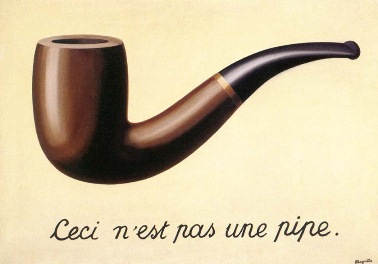

## To build:

``` <!---sh-->
    make
```


## To use:

``` <!---sh-->
    echo "some text" | ./goren
```


## Try:

``` <!---sh-->
    ./try.sh
```


## Judges' remarks:

In the words of [René François Ghislain Magritte Magritte](http://en.wikipedia.org/wiki/Rene_Magritte):



One may ask the surrealist question:

``` <!---sh-->
    echo 'If | is just a representation of a pipe, then how can data stuff it?' | ./goren
```

However if one takes a firm stand and declares:

``` <!---sh-->
    echo '| is just a representation of a pipe because I say so! So stuff it!' | ./goren
```

something happens!  Why?


## Author's remarks:

This program was written in homage to [Rene
Magritte](http://en.wikipedia.org/wiki/Rene_Magritte)'s picture ["La
trahison des images" (The Treachery of
Images)](https://en.wikipedia.org/wiki/The_Treachery_of_Images).

In order to show my unconditional admiration of this work, I avoided
using conditions.

In this work, Magritte points out that a picture of a pipe is not
a pipe.  But what IS a pipe? This program tries to provide an answer.

Magritte's [test for pipes](http://en.wikipedia.org/wiki/The_Treachery_of_Images) is:

```
    The famous pipe. How people reproached me for it! And yet, could
    you stuff my pipe? No, it's just a representation, is it not?
```

Accordingly, this program only approves pipes which can be used for
stuffing data.

One thing I tried to achieve is condition free programming.  Many
have noted that conditions make the code harder to read and understand.
A good example would be: [Brent Burley](../../authors.html#Brent_Burley)'s
winning [2004/burley](../../2004/burley/index.html) entry.

That entry omits conditional statements such as `if` and `while`.
His achievement in improving clarity by omitting conditions is
impressive, but I think it can be taken further, in two ways.

First, conditional operators, such as `?:`, `&&` and `||`, can be thrown away.
Second, using `setjmp(3)` and `longjmp(3)`, which are unfortunately not in
common use, might make it difficult for a novice programmer to understand the
code without referring to the man page.

By removing these, the code is 100% condition free, and every
function runs its instructions in perfect order. Naturally, this
makes the program flow trivial to understand. This can be verified
by disassembling the compiled code and looking for conditional jumps
(when compiled with gcc on x86, there are none).


### Compatibility:

The program should compile with any C compiler, but was tested
mostly with gcc on Linux.

It doesn't support 64 bits (due to integer-pointer casts, and `a >>31`).
It does work on 64-bit Linux, because all functions are below 4GB.


<!--

    Copyright © 1984-2024 by Landon Curt Noll. All Rights Reserved.

    You are free to share and adapt this file under the terms of this license:

        Creative Commons Attribution-ShareAlike 4.0 International (CC BY-SA 4.0)

    For more information, see:

        https://creativecommons.org/licenses/by-sa/4.0/

-->
