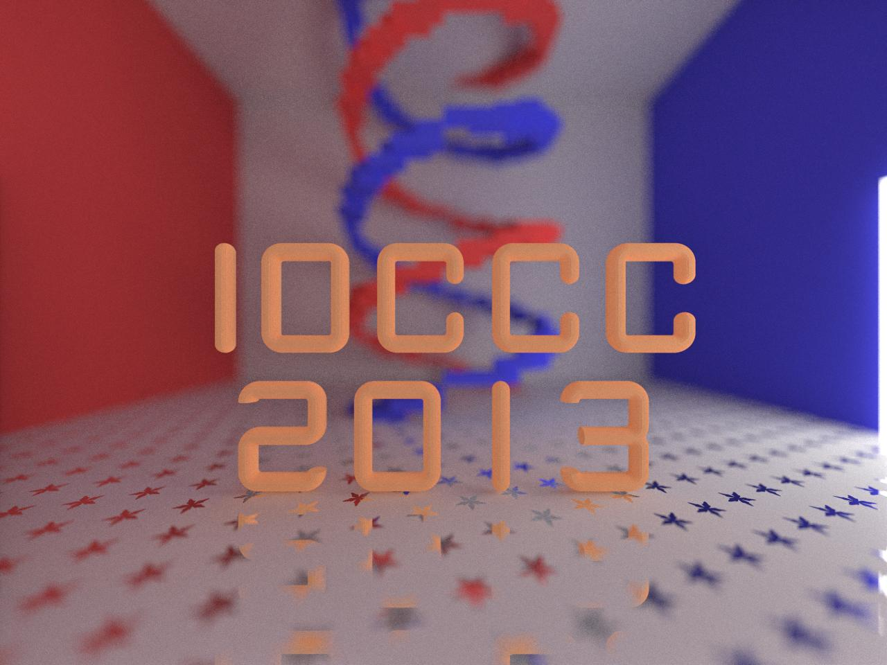
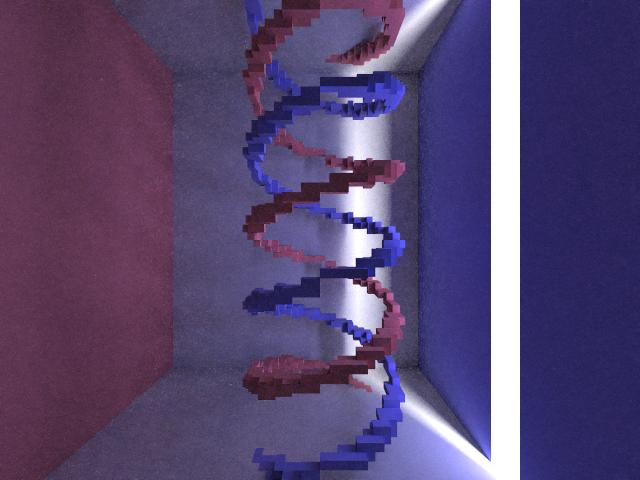

%%REPO_URL%%/## To build:

``` <!---sh-->
    make all
```


### Bugs and (Mis)features:

The current status of this entry is:

```
    STATUS: INABIAF - please **DO NOT** fix
```

For more detailed information see [2013 hou bugs](../../bugs.html#2013_hou).


## To use:

``` <!---sh-->
    ./hou [scene-file-name] [options]
```

Follow the instructions in `stdout`, preferably with an auto-refreshing PPM
image viewer ready.  Refresh the image every time the output refreshes, all
effects should be more or less recognizable when you see 16.


## Try:

``` <!---sh-->
    ./try.sh
```

Try opening the file noted by the program then let the program run a while and
every so often reopen the file, to see how it changes. The author suggests that
you leave the program running overnight to see what happens. If however you do
not have all night :-) then the following JPEG files should show you what
happens with some of the invocations above:






This program does not terminate by itself: you must kill `hou` (but not Qiming
Hou :-) ) in order to end the program.


## Judges' remarks:

You could consider that this program violates the source code size
limit. This is because the first compilation of this program is
really just a decompressor to generate the real source code of the
program.

This program will loop infinitely while progressively refining a
[raytraced](https://en.wikipedia.org/wiki/Ray_tracing_&#x28;graphics&#x29;) image.

NOTE: the author refers to [a.c](%%REPO_URL%%/2013/hou/a.c), placed in a gzipped file `a.c.gz`. We do not
include it but it can be generated like:

``` <!---sh-->
    cc -Wall hou.c -o hou -lm
    ./hou > a.c
```

but there is no need to do this as the Makefile takes care of it without even
needing to create a temporary file.


## Author's remarks:

### Using hou

This program is a programmable rendering engine with a built-in default scene.
The standard command line is:

``` <!---sh-->
    ./hou [scene-file-name] [options]
```

As `hou` runs, it writes a progressively refining image to a ppm file specified
in the scene. The initialization may take a while, but once it's done, a rough
preview should be available in seconds. Leave `hou` running for the night, and you
get a high quality result like the attached `*.jpg` files. Kill `hou` manually
after you're satisfied with the image quality.

To save time and energy for the judges, rendered images for all provided scenes
are provided as attached files.


### Features

* Fully programmable: Almost every stage of the renderer is programmable with
a shader, i.e., a short script that does something rendering-related. In
particular, each scene consists of one or more geometry shaders, a camera
shader, and one or more material shaders. Shaders are written in an
interpreted language that supports basic arithmetic, a few math functions,
variables and procedural calls in the CPS (Continuation Passing Style).
* Fast preview: This renderer isn't just a naive path tracer, it actually uses a
modern global illumination algorithm which is robust against challenging scene
configurations. You can mostly place light sources and specify surface
properties as you please without worrying too much about the convergence speed;
you always get a nice fast preview within one or two minutes. As proof, there
is a comparison: `./hou otherroom.scene` gives a rough idea about the overall
illumination at 16 samples per pixel (i.e., when the program prints 16), whereas
the naive approach `./hou otherroom.scene NAIVE` only produces a mess of white
dots.
* Rich visual effects: The algorithm samples all light path types so most
physically based effects can be produced. The default scene demonstrates quite a
few of them: reflection, area light, soft shadows, color bleeding, caustics, and
depth-of-field blur. Of course, one can also get programmable-shading effects
like procedural texturing and approximated Fresnel terms.
* Accelerated ray tracing: The ray tracing part uses an algorithm better than
the brute-force intersection of everything. The renderer even builds an
acceleration data structure! Despite the double precision and the
single-threadedness, it still runs at about 0.5 million rays per second on the
author's machine.
* Pause and resume: Can't run `./hou` overnight? No problem! You can kill and
resume a rendering session whenever you want. The renderer automatically saves
the progress every 16 samples and resumes where it's left off when restarted.
Also, each scene/parameter combination gets a different saved session so you
don't have to worry about conflicts.


### Abuse of the rules

* [hou.c](%%REPO_URL%%/2013/hou/hou.c) uses compression to get around the size limit. The compression
fully complies with the rules and the guidelines (at least the portion that
shows up in `grep` "size limit"). Please see the [Self-imposed
restrictions](#self-imposed-restrictions) section below for more details.
* `hou` does not terminate (as suggested by the second line of rule 6).


### Self-imposed restrictions

* The building process does not involve any OS tool beyond `cc(1)` and
`make(1)`. No `gzip(1)` compression! `a.c.gz` doesn't fit in 2053 bytes, anyway.
* Neither [hou.c](%%REPO_URL%%/2013/hou/hou.c) nor [a.c](%%REPO_URL%%/2013/hou/a.c) (the *real* decompressed source) uses
`#define` (or `cc -D`) at all.
* The source code is not required at runtime.
* [a.c](%%REPO_URL%%/2013/hou/a.c) does not drop optional features to reduce size. There are pure
optimization code that can be dropped without affecting the converged output
(only affecting the ray tracing speed / convergence rate). All files are
properly `fopen()`ed with `"rb"` / `"wb"` for Windows compatibility. The PPM
header has a comment line for non-standard-compliant viewers (specifically, my
old HDRShop 1.0). And there is a nice text message saying "please wait...".
Despite the messy look, [a.c](%%REPO_URL%%/2013/hou/a.c) and [hou.c](%%REPO_URL%%/2013/hou/hou.c) compile warning-free
([hou.c](%%REPO_URL%%/2013/hou/hou.c) even wastes 18 bytes on `#include<stdio.h>` just for `putchar(3)`).
[a.c](%%REPO_URL%%/2013/hou/a.c) compiles mostly clean in the C99/ANSI modes of clang and gcc (with:

```
-Wall --pedantic
```

The only warning generated is a pedantic one: `"string constant
too long"`.


### Comments and why obfuscated

* Both the compression and the rendering use mathematically involved algorithms.
Understanding the C doesn't help much if one isn't familiar with the math.
* Modern renderers provide shader access to just about any internal state. This
one follows suit and reuses the same shader-accessible array for all important
internal states.
* Infinity and NaN (not-a-number) are used during normal course of execution.
* Previous image-generating entries may take care to hide the "IOCCC" string in
the code, but they leave the text clear in the *result*. This entry takes it
further and obfuscates the output image as well. Can you find the text in the
image? Hint: look up.
* [a.c](%%REPO_URL%%/2013/hou/a.c) leaves all shaders in plain text, but the plain text shader code can't
be taken for its face value; the arithmetic rules subtly diverge from our common
sense.
* [a.c](%%REPO_URL%%/2013/hou/a.c) is less portable than [hou.c](%%REPO_URL%%/2013/hou/hou.c) itself. [hou.c](%%REPO_URL%%/2013/hou/hou.c) only depends
on ASCII and should run just fine on 16-bit, small memory, or
floating-point-incapable machines. [a.c](%%REPO_URL%%/2013/hou/a.c), while still reasonably portable, is
quite memory consuming, requires IEEE754-compliant `double`, and assumes `int` to be
32-bits.
* Though technically endian-dependent, [a.c](%%REPO_URL%%/2013/hou/a.c) remains portable providing that one
doesn't copy saved sessions across different endianness.


### Spoiler

```
    3225  3225  3225  9  9    3225  3225
    1     1  1  1  1  1  1    1     1  1
    4225  1226  1  1  1  1    1222  1226
       1  1     1  1  1  1    1     1 1
    4226  1     4226  8  4222 4226  1  1
```

The program consists of a recursive-descent interpreter, a `3DDDA` (3D Discrete
Differential Analysis) ray tracer, a `PSSMLT` (Primary Sample Space Metropolis
Light Transport) light path sampler, all squeezed into the size limit using a
`PPM` compressor (Prediction by Partial Matching, and yes, the output format is
chosen for the pun..).

`PSSMLT` uses the Metropolis-Hasting algorithm to sample a 32D unit hypercube.
Each point in the hypercube is interpreted as a sequence of random numbers, and
is sent to a path tracer to generate a light path. The point's
Metropolis-Hasting energy is then defined as the corresponding path's
contribution value to the final image. Since each path is sampled with a
probability proportional to its energy, the sample distribution directly
corresponds to the final image, which can then be produced as a simple per-pixel
histogram of all generated paths. The robustness comes from a state mutation
strategy that actively tries to explore the neighborhood of high energy peaks
(e.g., paths that happen to hit the light source in
[otherroom.scene](%%REPO_URL%%/2013/hou/otherroom.scene) file).
In addition, a rudimentary form of lens
path stratification is added to balance the attention each pixel receives. The
Metropolis-Hasting process completely avoids the tell-tale pixel sampling loop
required in most other image generation methods.

The `3DDDA` tracer is chosen for scalability: its performance doesn't get much
worse as scene complexity increases. Another benefit is that with the `DDA` code
in place one can naturally use hierarchical grids as an acceleration structure.
The downside, of course, is that the setup involves quite a few divisions, which
naturally turns into divisions-by-zero. Fortunately, the IEEE754 standard has a
nice set of rules just for this purpose and the arithmetics are organized in a
specific way to take advantage of this. The shader interpreter component is
relatively straightforward, just an expression evaluator stripped to the bare
minimum -- it doesn't even support numerical constants natively. A final little
bit is a just-good-enough PRNG (Pseudo Random Number Generator) to replace the
low precision Windows `rand()` and the non-C99 Unix `drand48(3)`. An overnight
session would run through its short period many times, but that doesn't
necessarily map to the same set of paths in `PSSMLT`. After all,
Metropolis-Hasting used an even worse PRNG in their 1953 paper.

The `PPM` compressor uses statically weighted fixed order contexts with an
arithmetic encoder tweaked for [iocccsize.c](%%REPO_URL%%/2013/iocccsize.c). The encoder emits octet-space pairs
where each octet encodes ~6.5 bits of information and each space encodes 2 bits
(thanks to the generous definition of "space" in [iocccsize.c](%%REPO_URL%%/2013/iocccsize.c) code).
The compressor
actively shuffles the variable names around until the compressed string happens
to contain enough `{}; `s to pass the final [iocccsize.c](%%REPO_URL%%/2013/iocccsize.c) test.
There are a few other tweaks:

* The `PPM` model uses mostly whitespace characters for weights.

* The encoder never emits `'"'` and `'\\'`.

* The decoder uses an O(n^2) algorithm to avoid the gigabytes-sized hash table
frequently found in other `PPM` implementations.


<!--

    Copyright © 1984-2024 by Landon Curt Noll. All Rights Reserved.

    You are free to share and adapt this file under the terms of this license:

	Creative Commons Attribution-ShareAlike 4.0 International (CC BY-SA 4.0)

    For more information, see:

	https://creativecommons.org/licenses/by-sa/4.0/

-->
