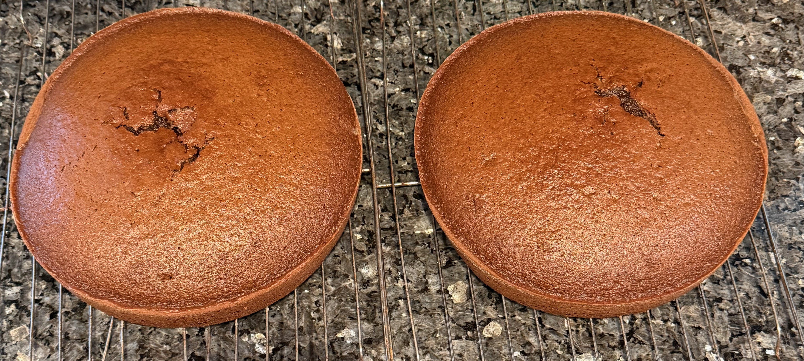

# Double-layered Chocolate Fudge Cake

## Last updated: Wed 08 Jan 2025 17:32:30 UTC

Here's a delicious double-layered chocolate fudge cake that is
something of my mum's speciality. It's complicated and I should warn that nobody
has seemed to get it down as well as she has but it's well worth the effort if
you love chocolate and have the time and patience.

My late stepmum who only liked white 'chocolate' loved this cake! The picture
below was taken for my birthday (14 February) in 2022 as it's the best one I
have:

There are two sets of ingredients and instructions; the cake and the icing. In
addition there are some **VERY IMPORTANT NOTES** to pay attention to; some will
be repeated because they're **VITALLY IMPORTANT** for the quality of the cake.
That cannot be overstated.

Below I have included the ingredients separately but I include them within the
instructions as well and in bold. Also in bold are some of the special notes.

Finally note that depending on where you are in the world this might not work in
the warmer months of the year and for the icing in particular.

Above all, **ENJOY**, and **I'D LOVE TO SEE PHOTOS AND HEAR WHAT YOU THINK** at
[@xexyl@fosstodon.org](https://fosstodon.org/@xexyl). Questions also welcome
there of course. Please make sure to mention me so I get a push notification as
I don't check it very often. Thanks and again enjoy!

## Measurements

This was originally taken from an American magazine for women so the
measurements are in the US standards. There is a
[nice resource](http://www.onlineconversion.com/cooking.htm) that has much more than
just cooking). This will particularly matter for cups, teaspoons, tablespoons and ounces.

## Baker's chocolate

Baker's chocolate is a brand name and the product in question is unsweetened
chocolate bars used for baking. According to a [chocolates FAQ][] it might be
called different things:

> Bitter chocolate contains no sugar and is often called 'unsweetened' or
'baking' chocolate. In some countries it's called 100% cacao since it's composed
only of ground up cocoa beans, and nothing else.

The FAQ suggests that you might have to look for a baking supply shop but I
cannot offer any specific advice other than it's unsweetened chocolate bars for
baking. The FAQ talks about what looks like substitutes but I have no idea what
that would turn out as; I somehow suspect it wouldn't be good.

Either way **PLEASE STILL PAY ATTENTION TO ALL THE NOTES on the chocolate IN THE RECIPE and
RECIPE NOTES BECAUSE THEY'RE _EXTREMELY IMPORTANT!_**

## Special notes for the cake

**PAY CLOSE ATTENTION TO THESE:**

*   **USE _MARGARINE_! DO _NOT_ USE BUTTER!** Butter does not work well. If you
    think it will come out better by using butter you're very mistaken; it will
    come out badly! People have come back saying it didn't come out well and
    they are asked if they used butter or margarine. They had used butter
    because they 'know better' but they were very wrong and it is why the cake
    was ruined.

*   Over the years they changed the size of the unsweetened chocolate squares;
    they used to be one ounce each; now they are 1/4 ounce each square so be sure to
    remember that **THE AMOUNT IS BY OUNCE _NOT SQUARES_ AS LISTED**. See the
    measurements link if there's any doubt.

*   Pay careful attention to the **COOK FOR ONLY THE INDICATED TIME** part. Note
    that if your oven cooks a bit hotter you might have to adjust the timing a
    bit.  This is likely the case if the cake comes out a little bit dry.

*   **REMOVE THE CAKE FROM THE PANS _2 MINUTES AFTER REMOVING FROM OVEN_** and
    then allow to **FULLY COOL _ON RACKS!_** The important point is to **MAKE SURE
    THAT THEY _DON'T OVERCOOK_**.

*   **USE _WHOLE MILK!_** Don't try skim milk or whatever per cent of fat milk you
    have.

*   Use **ONLY _PURE_ VANILLA EXTRACT!** **DO _NOT USE IMITATION VANILLA!_** Not
    following this rule will lead to a worse outcome, including with the icing.

## Cake Ingredients

*   3 oz unsweetened (Baker's) chocolate
*   2 and 1/4 cups flour
*   2 tbsp baking soda
*   1/2 tsp salt
*   2 and 1/4 cups packed brown sugar
*   3 eggs
*   1 and 1/2 tsp **PURE VANILLA EXTRACT (_NOT IMITATION VANILLA!_)**
*   1/2 cup **MARGARINE (_NOT BUTTER!_)**
*   1 cup (boiling) water
*   1 cup sour cream

## Cake Preparation

1.  Lightly grease **TWO 9 x 1.5 INCH ROUND PANS**; lightly dust with flour.

2.  Preheat oven to **350 F / 176.67 C**.

## Cake Directions

1.  Melt **3 OZ UNSWEETENED CHOCOLATE** in double boiler or small bowl over
    **hot (*BUT NOT BOILING*) water**; let cool whilst proceeding.

2.  Sift **2 and 1/4 CUPS FLOUR**, **2 TSP BAKING SODA**, and **1/2 TSP SALT**

3.  Beat **1 STICK MARGARINE (_NOT BUTTER!_)** in large bowl *until soft*. Again
    **MARGARINE, _NOT BUTTER!_**

4.  Add **2 and 1/4 CUPS PACKED BROWN SUGAR** and **3 EGGS**. Beat until light and
    fluffy.

5.  Beat in **1 1/2 TSP _PURE_ VANILLA EXTRACT (_NOT IMITATION VANILLA!_)** and
    **_COOLED_ MELTED CHOCOLATE**.

6.  Stir in dry ingredients alternately with **1 CUP SOUR CREAM**; always beat
    until smooth.

7.  Stir in **1 CUP *BOILING* WATER**.

8.  Pour into prepared pans.

9.  Bake for **ONLY 35 MINUTES** (**NO LONGER!**) at **350 F / 176.67 C**.

10. When you take the cake out put the cake pans on a cooling rack for **_ONLY
    TWO MINUTES AND THEN _IMMEDIATELY TURN CAKES OUT ON TO RACK_**. Let **COOL
    _COMPLETELY!_**

Assuming you use round cake pans, if everything is okay, it might look something
like this after pulling it out of the oven and putting it on cooling racks,
though these are very old cake pans and cooling racks:

## Icing Ingredients

*   4 oz unsweetened chocolate (Baker's chocolate)
*   1/2 cup **MARGARINE (_NOT BUTTER!_)**
*   4 cups powdered sugar
*   1/2 cup whole milk
*   2 tsp **_PURE_ VANILLA EXTRACT (_NOT IMITATION VANILLA!_)**

You will also need a bigger pan or bowl that can have ice water that the icing
bowl can sit in.

## Special notes for the icing

**PAY CLOSE ATTENTION TO THESE:**

*   **MAKE SURE** that the melted chocolate and **MARGARINE (_NOT BUTTER!_)**
    do not get solid.

*   For step #4 put **8 to 10 ICE CUBES** in a pan or big bowl (that's big
    enough that another bowl can fit in it). **ADD AN INCH OF WATER** and **SET
    THE BOWL WITH THE ICING IN THE PAN OR BOWL** of ice water. **DO NOT LET THE
    ICING GET WET!**

*   **DO NOT LET ICING GET TOO THICK.**

*   **USE _WHOLE MILK!_** Don't try skim milk or whatever per cent of fat milk you
    have.

*   Use **ONLY PURE VANILLA EXTRACT**! **DO NOT USE IMITATION VANILLA!** Not
    following this rule will lead to a worse outcome. As I recall the icing was
    quite a bit worse (but still chocolaty at least) the times we had imitation
    vanilla (simply because we couldn't get pure vanilla at the time we needed
    it). Just don't do it.

*   When the recipe was first written they sold powdered sugar in a box; now
    it's confectionery sugar in a bag. My mum experimented with the amount and
    found that 4 cups seems about right. This can be adjusted to your taste.

*   If you have leftover icing after icing the cake, for next time, it might be
    that you didn't put as much between the layers as we do. Of course you could
    put it elsewhere if you wish to.

## Icing Directions

1.  Combine **4 OZ UNSWEETENED CHOCOLATE** and **1/2 CUP *MARGARINE (NOT
    BUTTER!)*** in pan. Melt and remove from heat. **DO NOT LET IT GET SOLID!**

2.  Combine **4 CUPS POWDERED SUGAR**, **1/2 CUPS WHOLE MILK** and **2 TSP
    ***PURE* VANILLA EXTRACT (_NOT IMITATION VANILLA!_)** into a bowl. **STIR
    UNTIL SMOOTH**.

3.  Add chocolate mixture.

4.  Set bowl in pan/bowl of ice and water. Beat with spoon/mixer until it's
    thick BUT not too thick. **Make *SURE* ICING DOES *NOT* GET WET!** The idea is to
    **MAKE THE BOWL IT'S IN COLD *BUT TO NOT LET THE ICING GET WET!***

[IOCCC and chocolate]: cake.jpg
[chocolates FAQ]: https://www.davidlebovitz.com/chocolate-faqs/

Jump to: [top](#)

<!--

    Copyright © 1984-2025 by Landon Curt Noll. All Rights Reserved.

    You are free to share and adapt this file under the terms of this license:

        Creative Commons Attribution-ShareAlike 4.0 International (CC BY-SA 4.0)

    For more information, see:

        https://creativecommons.org/licenses/by-sa/4.0/

-->
