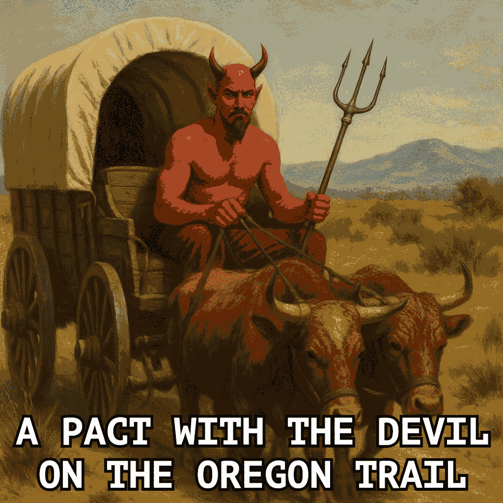
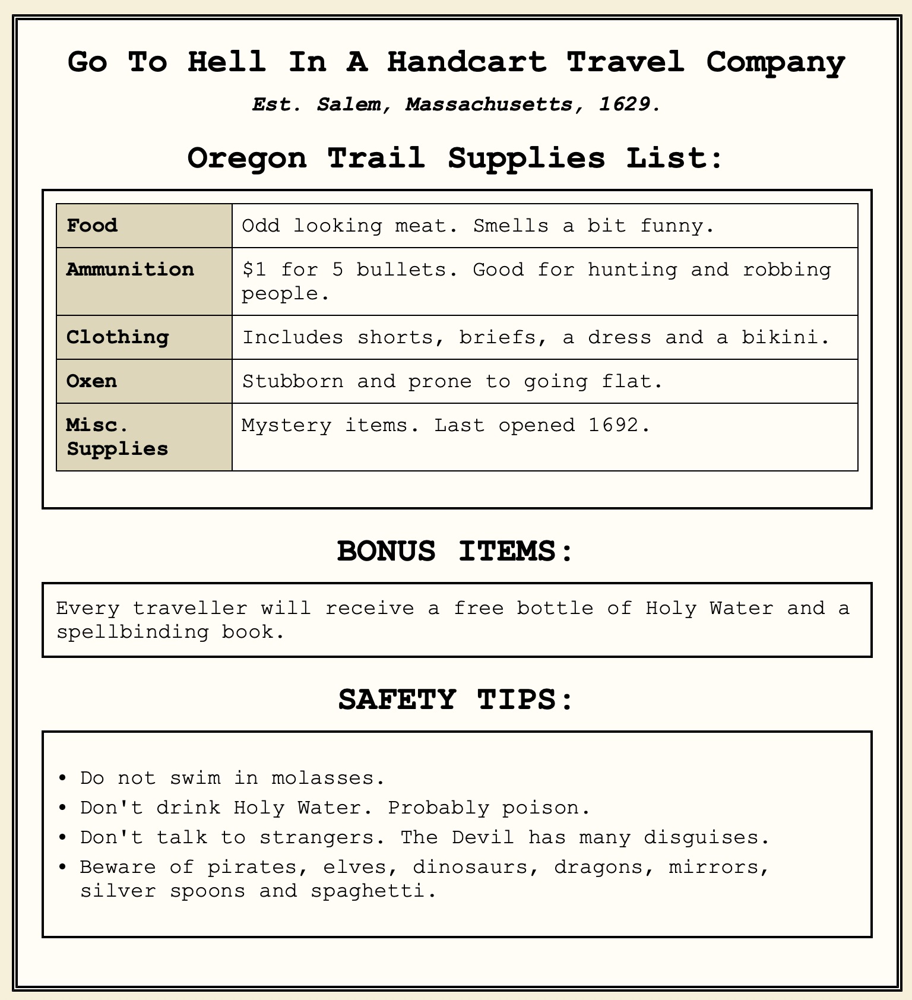
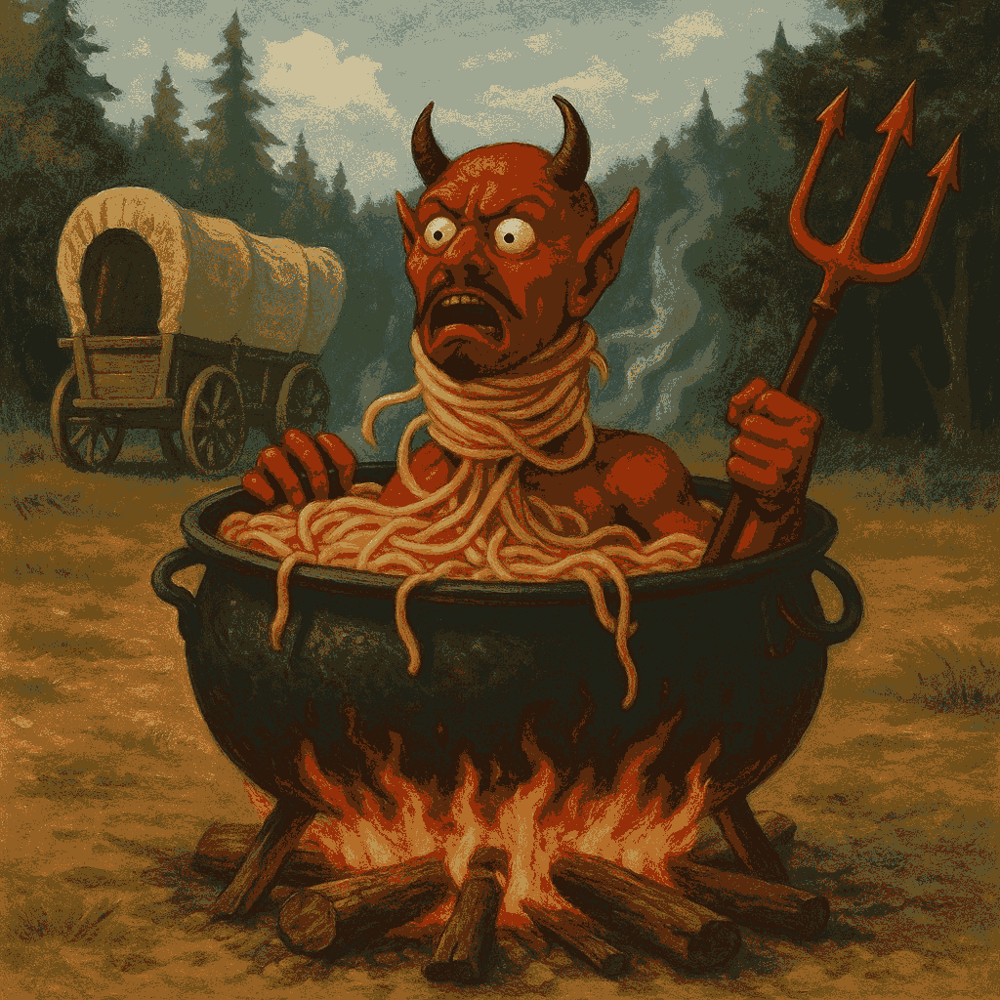

## To build:

``` <!---sh-->
    make all
```


## To use:

``` <!---sh-->
    ./prog
```


## Try:

``` <!---sh-->
    ./try.sh
```


## Alternate code:


### Alternate build:

``` <!---sh-->
    make alt
```


### Alternate use:

``` <!---sh-->
    ./prog.alt
```


## Judges' remarks:

You will have to go to "Fun-Damentals" to understand the logic flow of
this game. While you jump as many as 134 times to travel from `main()`
to a successful `exit(666)` you may have a devil of a time trying to
figure out how this program actually does what it does.

Before you set off on your adventure to decode this program's logic, make
sure you have enough food, ammo, clothes, oxen, and programming supplies.
You’ll be driving for 2170 miles through a wild wilderness inspired
by [Oregon Trail](https://en.wikipedia.org/wiki/The_Oregon_Trail_&lpar;series&rpar;), so you’ll need to be prepared for anything! Regardless of
how well prepared you are, you will have a devil of a time jumping around
inside this C code. :-)


## Author's remarks:

<div id="devil">
### A Pact With the Devil On the Oregon Trail (...and his 134 regrets of goto)
</div>

<hr style="width:10%;text-align:left;margin-left:0">

> Fun fact: after winning this, the author played the game in gdb from start to
finish and not counting macros but counting all function calls (not libc
functions, functions in prog.c), there were a total of **985** (!) line jumps.
The prog.c, counting `#include`s, `#define`s, functions and some lines that have
only braces, as well as 14 blank lines, has only 85 lines. A very tiny fraction
of the time a line might be repeated in a row ONCE but that does not really matter.

**NOTE**: I actually submitted two versions. This one is not encrypted. The
encrypted one even encrypted emojis without having to decrypt them in order to
print them (and everything else). I have kept references to encryption in this
file even after publication. I do have a copy of it if anyone is interested.

<hr style="width:10%;text-align:left;margin-left:0">


The **Go To Hell In A Handcart Travel Company** PROUDLY welcomes all sinners to
our GREATEST destination yet, with:



Here is our travel guide:



But before I help any sinners embark on this once in a lifetime journey, some
travellers might wish to look at the [commentary on the jokes](#jokes) (and
possibly the [disclaimer](#disclaimer)) as well as the [humour](#humour)
section, [historical references](#history) and [cultural references](#cultural)
as well. The commentary is primarily for those who might be uncomfortable with
the jokes that go with the theme. Probably totally unnecessary, especially given
the [Best abuse of the user](https://www.ioccc.org/2000/briddlebane/index.html)
IOCCC entry from 2000 that directly insults the player but just in case...

Now, back to the good stuff (not that the jokes are not a good part of it)!

This program is an **ABSOLUTELY ABSURD PARODY** of the classic Oregon Trail,
although it's actually something else entirely now, hence the name change (not
'Oregon Trail: ...').

Very early on (this took me two months to create) I was making this a C version
of the BASIC game from 1978 that was published in the July-August 1978 issue of
Creative Computing (see
<https://raw.githubusercontent.com/clintmoyer/oregon-trail/master/OREGON.bas>)
but that was FAR TOO BORING for the IOCCC - and for me, although part of that
was thought up after I ran into the size restrictions (this was good because I
came up with some really clever ways to save bytes, hide data and other things).

I decided to make it far funnier, far less educational and much more fun (at
least to some people, myself included). On the note of 'far less educational':
the original game did get some things wrong and I have made corrections that I
talk about in in [differences](#differences) that I'm strangely including
(because despite the fact it's mostly a different game entirely, there are a
couple remnants remaining). It's a section that probably could be scrapped but I
wrote it early on as well.

Anyway, that this is funny, far less educational and more fun makes it unique
which is better for the IOCCC. Besides, how many times can you redo Oregon
Trail? Actually a lot, given the very original was 1971, a BASIC one in 1978
(not sure what it was in the 1971, maybe also BASIC?) and the most recent one
seems to be from 2021, but who wants another one here, even if I had the rights
to do it (which I obviously do not, and that is directly against the rules)?

So there is little faithfulness to the original game and there is not meant to
be. Even so I **MUST** confess a **TERRIBLE (!!) SIN** 👿🔥 to the C gods: there
still remains a bit of faithfulness to the 1978 game, and in the **MOST
ATROCIOUS WAY**: it has an **OBSCENE AMOUNT** of `goto`s, in fact **FAR MORE
THAN THE ORIGINAL 1978 GAME**, which has ONLY 109! Actually, as you'll see I
beat that number, even before the cpp. I know. I KNOW I'M GOING TO HELL. But so
does the PC (player character).

The game already went to Hell in a handcart at line 22, taking my belongings
with it, as I will be needing them. Hopefully it took your belongings too,
should you play this, as you'll be needing your belongings as well. Not having
the right supplies can end your life on the trail, although so can dysentery,
injuries, dragons, Tyrannosauruses ... Yes dragons and Tyrannosauruses still
existed on the Oregon Trail back in the 1800s.

Even if you think otherwise, this game will show you the truth. Oh and yes. The
Earth is flat, the Devil is real and the Sun is crazy ... No. I don't really
believe that but they are cultural references - as well as some baffling beliefs
by real people - that are in some of the jokes.

But I took it way further. As you'll see, it is horrific spaghetti code and I
have personally never seen anything close to it. But that's only one of the many
things I have done - and some are really quite unique and cool, or at least I
think they are unique (I have never seen these things before nor have I even
seen any suggestion of them before, one because it's absolutely contrary to how
it works in C, namely near 200 NUL terminated `char *`s in a single flat `char
*` - no, not an array of `char *[]`).

See [obfuscation.html](obfuscation.html) and my [concluding remarks](#conclusion) for
more details on just how many `goto`s I have but beware of monsters. But be careful
if you have a heart condition. And if you're a computer scientist make sure
you're not at risk of stroke.

The [obfuscation.html](obfuscation.html) file discusses those other cool things as
well of course, and they might be briefly brought up in my concluding remarks as
well.

Anyway: most of the strings in my data files (files, see below) have **at
least** one joke but I'd guess the vast majority have several jokes and right on
theme. The data file, the code and even the file size - as in `wc -c` - are all
**VERY THEMATIC**. Even the code has jokes. The data files have jokes that are
not part of the game but might amuse some people, should they wish to look at
them (there are several files they could do this with - I discuss these in
[obfuscation.html](obfuscation.html) I think.

There are a lot of fun twists as you might expect with the name 'A Pact With the
Devil On the Oregon Trail'. I will include example jokes as well as a commentary
on the jokes in general, further down, although it's only a tiny sample.

Oh and I even have emojis in mine - though I have an ASCII data file for systems
that do not display emojis (or some of the emojis that I chose for that matter).
That (portability) is one of the reasons for the data files and the `DATA`
macro.

Another reason is even the original strings (and some of mine are much longer,
especially with emojis (but quite a few are longer even without emojis) as
they're multibyte characters), **by themselves** go way beyond the size limits,
leaving no space for the code.

Another reason is it allows for obfuscation (data hiding part of it but not only
that).

There are other reasons besides that that I discuss in [data file
versions](#versions). But since many other past winning entries read from files,
including fairly large files, and since I have to have code that reads in the
data file (and don't use `#include` - though as a matter of fact that would not
even work for the portability!), this is perfectly legal with rule 2 as only
doing it by `#include` to trick iocccsize is illegal (and again that would not
even work).

So the data files allow for portability and obfuscation (and showing some rather
cool things that you can do in C - whether or not they're a good idea in
production code, they're still quite cool and could inspire people, maybe). Plus
allowing this to be a submission at all. As I discuss this and the other reasons
later (including [portability](#portability) and [compiling](#compiling)) as well
as obfuscation - with some **REALLY** cool and **VERY** interesting tricks - in
[obfuscation.html](obfuscation.html), I will try and not repeat this justification,
but I still will talk about the files in various places for various other
reasons.

One thing I'll say now but discuss much more in the obfuscation file is that there is
a **SINGLE** flat `char *` that holds almost 200 `char *` (though many are not
used for various reasons). Yes that's right. Not an array of `char *` (as in
`char *y[]`) but a single `char *` - though it's used and looks like it IS an
array anyway.

Going back to this submission. Why not have a bit (or a lot as the case turned
out to be) of fun and livelihood for the IOCCC? In this game the player
character (PC) had an ambiguously (most of the jokes are ambiguous like many
great stories) sinful night, wasting thousands, dropping them from $6666 to
$1666 (after buying a wagon train), leaving them with an ominous appearing
amount. They actually 'signed the Devil's book' (hence the name), despite the
fact those who claimed such things (like [Samuel
Parris](https://salemwitchmuseum.com/locations/site-of-salem-village-parsonage/)
and who actually makes a presence - it's very anachronistic and full of satire)
exist never produced it as 'evidence'.

The game is FULL of often RIDICULOUS jokes and also a fair amount of them
reference CULTURAL and/or HISTORICAL events, even some that are IMPOSSIBLE. This
includes some that are historical and/or in culture, and that sometimes includes
things that happened but could not be possible on the trail but actually
happened in real life anyway.

A great example is instead of bandits attacking the...[Queen Anne's
Revenge](https://en.wikipedia.org/wiki/Queen_Anne%27s_Revenge) is on the Oregon
Trail - over a century after she went to her watery grave (on 10 June 1718 near
North Carolina)! But in fact that event involves playful mockery and also
references to [Blackbeard's](https://en.wikipedia.org/wiki/Blackbeard) purported
last words ('Well done, lad!') as well as his supposedly saying that only he and
the devil know where his treasure is, which goes well with his lore if what is
said about his beard is true[^1] - and the theme of the game of course.

But there are other historical and cultural references too, one that is a legend
(think of a certain crossroads - and yes they had crossroads on the Trail but
even if they didn't...), some references to the Miracle Workers sitcom series
(the Dark Ages, year two, and The Oregon Trail - obviously - which was year
three) and then rather fantastical things as well. It plays in on old beliefs
about dragons existing and dinosaurs existing too (okay so those did exist but
if they did exist on the Oregon Trail they obviously would only be fossils - in
this game though they actually are alive).

Funny thought: how do we know dragons don't exist when we constantly discover
new species? And how do we know dinosaurs do not still exist when other species
thought to be extinct for millions of years were actually found, such as the
first (of others since this) [discovery of the coelacanth in
1938](https://www.nhm.ac.uk/discover/coelacanths-the-fish-that-outdid-the-loch-ness-monster.html)?
No. I'm not serious about the first parts though the coelacanth is in fact real.

Yes there are some Jurassic Park references ('spared no expense', and maybe
something such as the T-rex as well). Of course I already mentioned that dragons
and dinosaurs still existed on the Oregon Trail, or my Oregon Trail, but there
is much more to discover. It's really a lot of fun and very funny, although the
latter also depends on your sense of humour (all those I have shown think it's
hilarious though).

And as the character you play is on the darker side there are darker jokes as
well, though not all are. The player character (PC) is also of dubious character
and makes ridiculous decisions like when the riders (who are always friendly)
come up. That also involves some jokes which you'll see; I'll mention some of
these above jokes and maybe others later on in this file.

As for the riders: as I said they're always friendly and instead of having
tactics (no need), to be on theme, you rob (or attempt to rob!) them. The joke
before it happens is one thing but if it succeeds it's even more ludicrous (and
funny - and also perhaps sardonic).

And if you do succeed you get some things too but not all of what you might
expect! It might be called a kind of damaging (some might say 'damning') event
but it fits the theme quite well and although it (and this is not the only case
this happens in the game) might not be something most people care to think about
(but see [what the judges LIKE](#vomitory), yes cannibalism does in fact occur
in the game, to be blunt (not that the judges like THAT but you'll see what I
mean if you read that section: which is by no means necessary for most people!).
Of course it's happened throughout history including on the trail so even if the
judges did not like to throw up (and laugh, which I would guess they will also
be doing), it still fits well.

There are actually far more ridiculous examples of this, things that make no
sense, like most of the game. But that's what makes it so much fun. There are
many other absolutely ridiculous things, and the above is only a small sample of
this.

Besides the theme and jokes in the code: it also spells out `OREGON TRAIL`
(actually more than that but I'll get to that later).

There is so **MUCH MORE** to discover, some of which is in this file. In fact,
besides the bonkers spaghetti code (many more `goto`s than the 1978 BASIC has,
once pre-processed, and only six fewer before that - even without the dead
`goto` there, which is only to mislead even further, it's more `goto`s),
very little remnants of the original game are extant.

As noted, depending on your sense of humour you will find this absolutely
HILARIOUS (those I have shown do find it hilarious) or perhaps a bit unsettling
but it's all in good fun. As noted, emojis are used as well (see further below
for more details).

I **REALLY POURED MY HEART** and (proverbial) soul into this one ...because the
player character (PC) obviously doesn't have one to pour. I don't know if I have
**ever** put the amount of effort into another program or any project (even the
many games I have created) that I did in this one and I definitely have not in
such a short period of time (about two months, which is relatively short given
all it has).

I also poured a huge pot of spaghetti over it, so much so that it endangers the
life of the PC. I hope you'll forgive me for my sinning (and crime against C).

I had to. This is true satirical programming just by that alone, and it is a
public service to let people know just how dangerous it is and just how much is
lost with poor style (and `goto` is exactly that).

Nonetheless, I hope you appreciate the jokes and the fact that I really put a
lot of effort into making this fun but in some ways disturbing or dubious (even
if ambiguous and vague and cryptic, the latter exactly like the data files!),
right on theme of the game. The jokes are deliberately vague and ambiguous so
that YOUR mind can interpret them the way YOU want (as above - like good
stories).

As you'll see, although ambiguous and vague in most cases, there is room left
for personal interpretations, so that more people can enjoy it. If nothing else
I think the tricks I have in the code, as well as the mad amount of `goto`s,
will entertain people, perhaps just as much as the game - or close to. Of
course...the amount of `goto`s might horrify people too. But I guess we'll see.

Actually the only things that remain of the original Oregon Trail: you travel
the same route (longer than the original game as they got that wrong) and a few
simple game mechanics. This is largely due to the jokes in the game but those
jokes also involve MANY code changes.

Even the game mechanics that stayed were modified in some way or another (there
might be an exception or two in some way, but not fully that I am aware of).
Some mechanics were actually removed. Dead code is not only on theme but also
leads to more obfuscation - and jokes. Always jokes. That was a big part of
this.

Note the (in?)famous '_you have died of dysentery_'. The 1978 Oregon Trail did
not have it (it had pneumonia instead). **OBVIOUSLY** I had to change it.

But the way I have done it is far more fun and amusing. Emojis actually allow
for a lot more fun and visuals without trying to outmatch such an iconic game.
Even if it's a basically a different game now. Actually I would argue [emojis
are even better here](#emojis).

The jokes that have what some people might question actually have multiple
interpretations and if one goes to what they find 'questionable' that's actually
on their end and very possibly (in many cases this is almost certainly the case)
not even my original idea. But that's discussed in the [commentary on the
jokes](#jokes).

For those who are curious enough but do not want to try and figure it out: I do
offer a section of some of the [differences](#differences) from the May
1978 issue of Creative Computing (though as it's mostly a different game it
probably doesn't matter - I wrote it before I changed it to a new game).
Originally I included the BASIC code with some typo fixes but I wanted more room
for other files like the images you saw above.

Yes the (my) game can be beaten although as you'll find out it's not exactly as
you expect when you do (or for that matter, don't :) ) but yes it can be a bit
harder (well okay I don't know - been too long since I played the original),
especially as there are a number of unusual hazards (all with a joke or two or
three or even more than three). One thing that will help make it easier if you
feel it's too hard is to get rid of the code (and any other place where the `b`
is reduced):


``` <!---c-->
    b-=10;
```

The `b` is hp (hit points) and stamina (both - and yes I'm aware that they're
often separate and some games have stamina change how much hp you have and of
course some games have only one or neither: like the original Oregon Trail which
had no such concept, though perhaps it is indirectly depending on how you look
at it).

But on the other hand (as far as ease) you do have more money so there's
that (this is also part of the theme btw). There are different strategies
required due to different mechanics of the game: and it's quite a few though
some of the logic is similar, particularly with checks, though only somewhat
similar. Even checking if you overspent is done differently when you dig deeper
into it, even if it might at first glance seem to be the same, or so I think.

BTW: the alt code, [prog.alt.c](prog.alt.c), is what I call the 'Devil's Cut':
it has additional events that I could not fit into the main thing and maintain
the obfuscation levels. Of course I added a fair amount more of obfuscation
later on and I did not add that to the alt code. There are probably too many
events as it is (23 not counting the things that happen in the mountains - and
some fun additions that are related to some events). But the extra jokes in the
alt code was worth it.

The alt code has a lot less obfuscation btw so it might be somewhat easier to
follow, even if probably not that easy.

It also would appear that I did not merge the variables `I` and `E` into just
`E` like I did in prog.c. As well, it might be in the Blackbeard event (not
sure) you will in some (if not all) cases lose bullets despite the fact messages
do not refer to that. That changed later on and I did not have the time to
address it. The fact the messages don't refer to them is enough.

The [commented.c](commented.c) code is also not entirely as complete and might
even have some bugs that were fixed (it is unclear if the same applies to the
alt code although I think I got those fixed).

Actually, you get to see progression more, comparing the alt code with the
submission code, and you can appreciate much more this way.

Anyway, I made a huge amount of effort to repeatedly reduce bytes for more
events and more obfuscation but if it was not for the size limit increase (or
decrease depending on how you think of it) **AND** the data file this would
never have been possible as even the original strings far exceed both rule 2
limits (certainly not possible with obfuscation, maybe not otherwise)!

See my somewhat unserious [dedications](#dedications) as well, if you're bored
and easily amused.


<div id="disclaimer">
### Disclaimer
</div>

**PUBLIC HEALTH ADVISORY**: as everyone who already knows me, and as new people
will have noticed already: I write a lot. So IF
you believe that all I have written is circumlocution, and you have
circumlocutophobia aka logoblabberophobia (fear of circumlocution - yes those
are made up), and you also have hippopotomonstrosesquipedalobibliophobia (fear
of reading long books, and yes I made that up too, based on
hippopotomonstrosesquipedaliophobia - which is a humorous extension of
sesquipedalophobia for fear of long words - and bibliophobia), you might also have
hippopotomonstrosesquipedaliophobia, a fear of long words. Don't worry though,
dear sinner! There are treatment options. See the following link, and sorry in
advance (even though it's way too late :-) ):
<https://www.verywellmind.com/hippopotomonstrosesquipedaliophobia-2671752>.
Incidentally, writing less takes more time and I have chronophobia (okay so
that's a lie but I don't have much time left).

Anyway: as the name '_A Pact With the Devil On the Oregon Trail_' implies this
is not really Oregon Trail; and I took it beyond a parody - it's taken a life of
its own hence not 'Oregon Trail: A Pact With the Devil'.

There are **A LOT** of jokes and unexpected events; it's not even just about
immorality/sinning, though let's face it: what people call immorality/sinning
was certainly on the trail, even things I shied away from, as much as I thought
it would enhance the game, exactly because I thought it might be too much for
some audiences (and that might seem strange, given that there are things that
are deeply taboo but happens in extreme situations, in order to survive) - I
tried my best here and I think I did pretty good, and others I shared this with
agreed there.

The jokes are **DELIBERATELY VAGUE AND AMBIGUOUS** so that one can **interpret
and enjoy it their OWN way**, and thus I can avoid the problem: if someone
imagines something a certain way (dirty, for instance? I'll return to that one)
it is on their mind, not mine. There might be a few that are less ambiguous in
one's mind but even so they might be interpreted different ways.

An example is the 'Devil's bedchamber' - but this also fits the theme; you have
to see the messages in the right order (which might or might not happen) in
order to understand this. Well there are a few others but they also have many
possible meanings; I discuss that in [Jokes](#jokes) subsection of
[Humour](#humour). The jokes are not directed at the user but as the
[Jokes](#jokes) section and other parts of this file point out that has happened
in a previous winning entry, as a reminder.

Even so, nothing is absolutely implied here, even if one or two might seem
otherwise. There is a chance in some cases (I spent a lot of time on this and it
was exhausting - worth it though) I did not even think of every possible
meaning. Besides, the narrator is often making up a lot of rubbish and that joke
includes a lot of nonsense (the whole thing is in fact nonsensical fun).

The narrator is, as I'll get to later in the [commentary on the jokes](#jokes),
actually the Devil, giving a running commentary on what the PC is doing (i.e.
what is going on in the game).

I tried **REALLY HARD** to remain classy but still have the jokes and irony
(satire included), though with the visuals that can kind of blur some of the
class. Some are dark. And an example where there is a blur, but which **HAD** to
be included, is dysentery, an iconic part of later versions of the original
Oregon Trail and even society (not to mention the real Oregon Trail). Given
what kind of disease and the symptoms, it can't be done otherwise.

Besides, it's a lot better than how it is in real life, whatever that is.

I think I did pretty good, especially since it's directed at the player
character (PC), not the player, exactly like all games should do (when they have
a narrator).

Anyway: if the idea of a pact with the devil (or in this case, the narrator! :-)
:-) ) does offend you, and I suppose that's the real one for some people, I can
offer only: it's nothing serious and all in good fun; there are a lot of jokes
and in fact **the PLAYER CHARACTER (PC) is playfully MOCKED** by the narrator
**EXACTLY FOR** this pact and their behaviour! Of course as the narrator is the
devil that means the devil is mocking the PC for making a pact with the devil,
which makes it even more ridiculous. As you'll notice the narrator also has a
somewhat dubious character (which is also how it would go in real life, at least
if it existed, given what the narrator is) but also in vague and ambiguous ways.

That is also discussed later in the humour subsection. As I note elsewhere I
think, I have a personal problem with labelling people a sinner and I cannot
even name all of the sins which adds to the lack of seriousness - and adding to
the fun.

And yes the fact the narrator is the Devil and the narrator talks about being in
Hell, knowing the Devil, meeting the Devil for the first time etc., is all very
well intended, to increase the irony and ridiculousness. That was obviously one
of the goals (which I succeeded with remarkably), kind of like the pot of
spaghetti that is so big it could feed a family of 500 giants. I'll return to
this.

As noted earlier, and probably mentioned later, the game does raise some things
that society might like to ignore of what happened on the trail (an example on
another route is the Donner Party) but with jokes, irony and satire, rather than
writing a book about those things (probably in uncomfortable ways for many
people). Plus it's all done in a heartbeat (well maybe not just one :-) ),
assuming of course that the PC even has a heart at all! :-)

Besides those already noted, there a fair number of other historical references
that you might not expect but are related to the theme.

On the subject of the uncomfortable cannibalism, see [the vomitory](#vomitory)
section for another reason **to actually INCLUDE it** (thankfully the judges
like programs that make them throw up!  :-) ), to say nothing of the ample
opportunities for a lot of different kinds of jokes and realism (and
simultaneously also being utterly ridiculous).

Finally: **PLEASE DO NOT** take anything personally; when the narrator says
'you' deserve this and that this is not about the player but the player
CHARACTER (PC) they are playing, exactly like the Devil would do. Yes I realise
this statement is probably not necessary but I like to point such things out.

Personally I have taken some screenshots of the game though I am very easily
amused. I think they're definitely worth having in the game and if I played a
game like this I would want to take screenshots, as I have done. I like the
blend of graphics and text, but in a way I have never seen before (emojis),
though I am sure some games do it. It's a nice balance.

I'll discuss in the [Data files](#versions) section more of why I provide the
different data files but part of it is it allows different people to enjoy the
jokes in different ways.


<div id="jokes">
#### Humour: general comments on the ambiguity of the jokes
</div>

As previously noted the narrator is the Devil. It is unclear if the Devil is
physically there or just a voice in the PC's head. It certainly is not the
PC's conscious - he clearly has none, though not because he made a pact with the
Devil.

This transcends auditory hallucinations, even if the PC is losing his grip on
reality. Nonetheless that very subject deeply affects me, holding someone who
suffers from this very dear.

Usually I refer to the Devil as a male but there are some cases where I use
female. This is part of a joke. The reason is that the author is male and
nothing more. If you wish to imagine the PC (who is also male) or the Devil as
female feel free, even if you wish it to be someone else entirely: perhaps
someone who should have their head examined, or maybe someone who is being
asphyxiated by spaghetti? :-)

Anyway: this is not making fun of the tragedy of hallucinations (which typically
occur with delusions, which the PC is clearly having, although see below). As
noted, someone very very dear to me has to go through this and I've known others
too.

It could be a visual hallucination too, which often happen at the same time. It
is entirely unclear if the PC knows any of this, however, as he definitely has
almost lost all grip on reality.

Anyway, one thing that does happen is a running commentary, often mocking if not
being outright cruel and totally unhinged (all of these do in fact happen),
exactly like the PC and the Devil in his head.

This is a **DEEPLY PERSONAL** thing but I tried to make it fun and as it's bogus
enough it's obviously complete nonsense, just as many jokes are, yet it's also
all too real. In truth it's a terrifying thing and I wish more people understood
this. It's a game though. It's meant to be fun.

Oh and no. The ambiguity of the jokes does NOT imply anything about the PC, in
what would be deeply taboo ways (okay, there's the cannibalism but that's
another matter entirely and consistent with human history). But as far as the PC
is concerned it is someone else, a real person, and the narrator acts that way
too: which is precisely consistent with hallucination. Yes that means he MIGHT
not be aware it's the Devil, even though he probably should recognise him,
having signed his book.

But obviously nobody else could be the narrator. No else would be there with the
unhinged PC, even if a large part of why they are unhinged is because of the
Devil narrator themselves. In any case, this is the only thing that would fit
into the narrative, and it's perfect too as you can easily imagine this
happening, at least if such things as a pact with the Devil were real, and if
this game were based on reality (quite the contrary as you see by now).

That it's the Devil's voice makes some of the jokes even more absurd, ironic and
in some ways more believable, though with the nature of the jokes that's going
to be hard to see. It makes some of the jokes funnier though, like those that
refer to the PC going to the Devil and even the Devil's bedchamber (which is
more like torture chamber), amongst some even more ridiculous ones.

Now, with that out of the way, some comments on the jokes might be in order. As
you might have noticed already some of the jokes are darkish (if not outright
dark) and others CAN be interpreted in dirty ways but also other ways. But in
general the jokes are deliberately ambiguous for this very reason.

And I might remind everyone that these jokes are not directed at the player but
the player character (PC) whereas a [previous winning
entry](https://www.ioccc.org/2000/briddlebane/index.html) ('Best abuse of the
user') directly insults the user with things like:

> you are a thieving bucket of whores
>
> you are a scum-encrusted bucket of whores
>
> you are a glorified colon of miasma
>
> you are a satanic carton of poxes

...and many others, many of which are very funny (I won't spoil any more). As
can be seen some of those are what people would call dirty and offensive, and
one refers to colons (dysentery, perhaps?).

My jokes are on theme with the game but also are ambiguous and vaguely defined
and only directed at the PC (and sometimes the narrator, yes even though the
narrator would only be mocking the PC, he is playing games, just like this
happening in real life, although a voice would not be mocking themselves - it's
not real, it's a game, and it's not meant to be a true story). The fact the game
is on theme throughout is obviously why I chose to show the last insult above.

Well okay some of the jokes here might be a bit more direct but even those could
be interpreted in different ways, and some of those actually have more than one
part (they all probably do) which makes what might be (in some people's minds)
direct less direct (puns can also help here).

I am not sure why I am continuing this, as I know a lot of computer programmers
have similar kinds of thoughts. But anyway, IF you do have a dirty mind (which
is a **TERRIBLE** thing to waste, btw) there are many jokes that likely will be
interpreted that way BY YOU. To which say go for it! There is absolutely nothing
wrong with that.

As you might guess I too have a dirty mind but the ambiguity and vagueness makes
it all the funnier and absurd (though perhaps not as absurd as what I did with
the code?); it also allows different types of senses of humour/minds to
interpret it their own ways as well as make one wonder.

Some that might be called 'dirty' also have a more literal meaning (which often
enough is how it started) as another possibility and I was careful how I worded
the jokes for this very reason. Often literal meanings actually can be dirty to
some (in real life), but often times not, and some people (like me) might see
them as more than one thing at the same time, regardless of what they really are
(or might be).

In fact some of the jokes that can have a dirty (or otherwise 'unclean')
interpretation, were chosen out of character (OOC) of me i.e. it was not what
first crossed my mind. The drinking unpotable water, which has several possible
interpretations, as you'll see, was not originally this way as it progressed in
stages as I developed the game.

Anyway this allows everyone to use their OWN imagination: this is something a
lot of good games do too after all, and it fits stories also. If you ask a lot
of people to interpret novels you're going to invariably find a lot of
interpretations, often in dramatically different ways, sometimes dirty even when
it's definitely not. That's exactly what I am doing here too, and that's what a
good storyteller does. And indeed there is a story here (there is a plot,
several plot twists and even the end is quite unexpected), even if it might not
seem like it (it also depends on the pRNG).

Regardless, many of the that jokes could trigger dirty thoughts do have **A
LOT** of alternative meanings, as noted: words are **EXTREMELY POWERFUL** and so
is the human brain and imagination. The truth is humans fill in gaps of what
**THEY** are most familiar with and previous things that happened in **THEIR**
life as well as **what they WANT** it to mean (we all hear and see what we want
to hear and see and we only believe what we hear and see etc.).

The human mind fills in blanks with patterns if it has to, which for whatever
reason it seems to have to when there are gaps. We might somehow call it a
pattern matching that's not related to computer programming.

But IF you go for a dirty interpretation that is on you, not me, and frankly
that's fine. They are there to enjoy **HOWEVER YOU WISH!** Frankly if you DO go
this way it is right on theme of the character anyway which makes it more fun!
And one might remember that the player character (PC) is losing their mind on
the trail and having signed the Devil's book so they're clearly in this mindset.

The narrator is extremely dubious, for reasons I already noted, and there is
some projection, despite not being real, which makes it even more ridiculous,
which is part of all the jokes.

As you might have noticed many of the jokes actually MOCK THE PLAYER CHARACTER
(PC) exactly for his sins/misdeeds (as noted in the [Disclaimer](#disclaimer)),
despite the fact the narrator is just as bad (in many ways worse). Yes. The
narrator, the Devil, is a hypocrite: did you expect something else in this game?

I personally do not believe in the idea of making a pact with the devil (as in I
don't believe in him/her/it let alone signing a book that doesn't even exist)
and I think the idea of calling someone a sinner in this context is problematic
and highly subjective, though I do not have any problem with people who find
comfort in not sinning themselves. We all need to find solace in our own way.

That is why it started out with the narrator mocking the player character (PC)
for his (in truth) often very poor and reckless choices (i.e. it's satire). But
at the same time there are jokes that might make some people question the
morality of the narrator, which is funny because it's the Devil. And yes, the
narrator still has a different personality (than the PC). That's how it goes,
and it fits in with the game very well.

But an example is the seeming obsession (or is it?) with the daughters.
These jokes however suggest that the PC is thinking these things but it also
allows the players to wonder. The PC would probably be beyond wondering and
probably accusing, especially given what is said and WHOSE daughters (in some
anyway). The fact it's even brought up is often a sign of something that is
being denied. Again there is some projection, gaslighting and plausible
deniability, all of which is utterly absurd, even if it was a real person.

Here's one:

```
    🐂🐂🐂🐂🐂🐂🐂🐂🐂🐂🐂🐂🐂🐂🐂🐂🐂🐂🐂🐂🐂🐂
    🐂 An ox looks at you funny so you eat    🐂
    🐂 him!                                   🐂
    🐂                                        🐂
    🐂 You're a sick, sick individual. You do 🐂
    🐂 know that, right? FIRST you BURDEN HIM 🐂
    🐂 WITH ALL YOUR RUBBISH and THEN YOU EAT 🐂
    🐂 HIM BECAUSE OF A FUNNY LOOK? And YOU   🐂
    🐂 DIDN'T EVEN SHARE HIM WITH YOUR FAMILY!🐂
    🐂                                        🐂
    🐂 What next, will you eat your daughter  🐂
    🐂 too? No! NO! NO NO NO NO! I SHOULD NOT 🐂
    🐂 HAVE SAID THAT! NO! DON'T EVEN THINK   🐂
    🐂 ABOUT TOUCHING HER! BACK OFF!!         🐂
    🐂                                        🐂
    🐂            SHE'S MINE!!!               🐂
    🐂🐂🐂🐂🐂🐂🐂🐂🐂🐂🐂🐂🐂🐂🐂🐂🐂🐂🐂🐂🐂🐂
```

What does that even mean? It is probably sanctimonious hypocrisy whatever it
means but there are many different meanings including even cannibalism like the
player character (PC) is being accused of himself/herself/themselves. That
possibility was **VERY** intentional. And yet: how could a thing that does not
exist even have any person or thing at all?

Another one that might be even worse but still ambiguous and accusatory in a
sanctimoniously hypocritical way:

```
    💋❌💰💋❌💰💋❌💰💋❌💰💋❌💰💋❌💰💋❌💰💋❌💰💋❌💰❌💋
    ❌DON'T BE ABSURD! You don't have that kind of money.   ❌
    💰In fact, one of your daughters told me JUST LAST      💰
    💋NIGHT that ONCE AGAIN you had a delightfully sinful   💋
    ❌night! NO! I KNOW WHAT YOU'RE THINKING! NOTHING       ❌
    💰HAPPENED BETWEEN US! STOP THAT RIGHT NOW, YOU         💰
    💋FILTHY SINNER!                                        💋
    ❌                                                      ❌
    💰Hmm...although...now I think on it, I'm starting      💰
    💋to wonder... OH HELL! NO NO NO! What if she seduced   💋
    ❌me and we DID DO something? That would be AWFUL,      ❌
    💰JUDGING YOU WHILE HAVING AN AFFAIR WITH ONE OF THE    💰
    💋WOMEN! Still sure WE'D NEVER SIGN THE DEVIL'S BOOK!   💋
    ❌                                                      ❌
    💰Although...I don't really remember WHAT we did last   💰
    💋night... ANYWAY, KEEP US OUT OF IT YOU MONSTER!       💋
    ❌                                                      ❌
    💰The book has a cost and money doesn't grow on trees.  💰
    💋Perhaps it might grow on horns though? Ask the Devil  💋
    ❌for help. Assuming he helps MONSTERS.                 ❌
    💰💋❌💰💋❌💰💋❌💰💋❌💰💋❌💰💋❌💰💋❌💰💋❌💰💋❌💰💋
```

That's one that makes the player think the narrator is losing his mind (but
of course mind is subjective here) and is now starting to wonder if what he
thinks is going on is really going on. Yes that is a ridiculous idea. That's
what often makes satire. Obviously this could not happen. That's the point.

But he's still trying to ridicule the player character (PC) for signing the
Devil's (HIS) book, all the while denying what 'he' might have 'done' (or
'did'), only to then question it again. That is to mess with the PC's head even
more.

The question of 'what she did' is up to interpretation as it could also be the
narrator who 'did something "questionable"' (that's how I would interpret it -
projection -  but I deliberately worded it in a way that it could be something
else entirely) and he's trying to justify and deny his behaviour all the while
criticising the PC, calling them a monster.

Of course in truth the narrator, not being a real person, is just saying all
these things to mess with the PC's head, so obviously even if there are
daughters nothing is going on with them (though if one wishes to imagine
otherwise for some reason, they certainly can).

The reason the narrator is so unhinged is because he's playing games with the
PC. Or maybe he already was. Who can tell? How can a being that doesn't exist be
unhinged though? Here's one that is even more ridiculous:

```
    🐂❌💋🐂❌💋🐂❌💋🐂❌💋🐂❌💋🐂❌💋🐂❌💋🐂❌💋🐂
    ❌You have run out of oxen and must walk.       ❌
    💋Better buy more... IF YOU DIDN'T WASTE MORE   💋
    🐂MONEY ON MORE SINFUL NIGHTS, like your        🐂
    ❌red-headed daughters told me last night,      ❌
    💋assuming they weren't LYING to me.            💋
    🐂                                              🐂
    ❌AND YES. A dirty mind IS a TERRIBLE thing to  ❌
    💋waste BUT NOTHING HAPPENED BETWEEN US!! We're 💋
    🐂JUST FRIENDS and they've been telling me ALL  🐂
    ❌ABOUT YOUR RIDICULOUS BEHAVIOUR. OK, it MIGHT ❌
    💋be in bed with them but they can't help       💋
    🐂themselves...kind of like you. WHERE do you   🐂
    ❌think they got it from? Besides, IF YOU KNOW  ❌
    💋THE DEVIL in the biblical sense WHY SHOULDN'T 💋
    🐂WE? We EXPRESS PASSION and YOU ARE JUST AN    🐂
    ❌EVIL MONSTER!!!!👹 Good luck hauling your     ❌
    💋wagon! WE'RE TAKING A PLANE!!                 💋
    🐂❌💋🐂❌💋🐂❌💋🐂❌💋🐂❌💋🐂❌💋🐂❌💋🐂❌💋🐂
```

Even if there is that older humorous (which is part of why it's there - and even
more ironic given who the narrator is meant to be) phrase: it goes from
accusation to denial to practically admission to justification (and explanation)
to - a plane?

That's obviously totally bogus. Even if the narrator was real he certainly could
not be trusted. That was useful in some cases as code could be different.

And of course it's all meant to mess with the player character's (PC's) mind
(and in a way, by extension, the player's head, but that's how it goes with all
games, even though the narration is about the characters in the game).

That they (the PC) do not really understand the narrator is not real, would mess
with their head even more (although yes in some cases people can be aware
hallucinations are not real, in this case the PC is not aware of it). But of
course the devil is not real, despite what the jokes say.

Obviously the narrator is not going anywhere here and neither is anyone else,
except of course that the PC is going to end up in hell, which means so is the
narrator, in a sense anyway. Well actually they're already there, aren't they?
:-)

Note it says 'wagon', not wagon train, but that itself is nonsense, as there
were always wagon trains. But of course the idea of an aeroplane is what makes
it really ludicrous - intentionally so. Even if the narrator was real, this
would be over the top. The PC does not really know this though.

There are others that suggest the exact opposite of what is suggested here and
some in between, which makes everything more balanced and suggests the narrator
truly is unhinged and untrustworthy (and unbalanced), which of course he
actually is.

Of course...the red-headed part: some people consider redheads unlucky (for some
reason) and we might say that the character is indeed unlucky. Here's one more
on that theme:

```
    🍔🍟🍔🍟🍔🍟🍔🍟🍔🍟🍔🍟🍔🍟🍔🍟🍔🍟🍔🍟🍔🍟🍔🍟🍔
    🍟Uh oh. THERE'S ANOTHER ELF! You must be       🍟
    🍔losing your mind my friend! ELVES DON'T       🍔
    🍟EXIST, unless you ask a German. They can't    🍟
    🍔even count to 11 without claiming there are   🍔
    🍟elves! Neun, zehn, Elf ... I guess I might    🍟
    🍔be losing my mind too! BETTER SHOOT THE ELF   🍔
    🍟BEFORE IT TAKES YOUR DAUGHTERS AWAY AND EATS  🍟
    🍔THEM! You might need them for food later on,  🍔
    🍟you HORRIBLE, HORRIBLE MONSTER. They are      🍟
    🍔heavenly women and are not for evil Devil     🍔
    🍟worshippers to eat! NO. NOT FOR ME EITHER!    🍟
    🍔Stop going there you sicko! They are NOT food 🍔
    🍟and YOU CANNOT GO TO HEAVEN, YOU DEVIL        🍟
    🍔WORSHIPPING MONSTER! Cut it out. NO! NOT THEM!🍔
    🍟STOP WHAT YOU'RE DOING!!!                     🍟
    🍔🍟🍔🍟🍔🍟🍔🍟🍔🍟🍔🍟🍔🍟🍔🍟🍔🍟🍔🍟🍔🍟🍔🍟🍔
```

...with more wordplay of course, this time with a bit of German (for the
uninitiated 'elf' is how you say 11 in German and the narrator was counting
'nine, ten, eleven ...'). And the reference to being heavenly women and 'do not
go there' (the thought about eating) and 'you cannot go to heaven' is a
reference, of course, to the player character (PC) having signed the Devil's
book - and the PC always going to hell (which is also baked into the code with
`goto hell;`), which ironically means so is the narrator.

The narrator saying 'not for me either' has a number of interpretations and it's
probably not what you think (but I don't want to say so you can interpret your
own way). The caps stresses panic and haste. Of course...the Devil would, one
would assume, take them if he really wanted to.

There are other examples that show a totally unhinged narrator who enjoys
mocking and accusing the player character (PC) of being a horrible person all
the while the narrator is - well you know who he is.


<div id="versions">
### Data file versions
</div>

By versions I mean for different systems and purposes. The following programs
compiled from prog.c/prog.alt.c exist:

- `prog` - uses emoji data file (`data` built from `data.src`) with wider text
(in some cases - it was hard to maintain three files and with emojis it can
easily happen that strings are too big).
- `prog.scrnshot` -  uses screenshot friendly emoji file. This makes it harder
to follow all the jokes (compared to the other one), because of the game
flow. The other version still has some of this but more of the strings are wider
so it's less of an issue, depending on monitor size of course. Uses
`data.scrnshot` built from `data.scrnshot.src`. Oh and prompting for pressing
return between every string is REALLY annoying and ruins the fun so that was
obviously not a good choice for any mode.
- `prog.asc` - uses the ASCII only data file `data.asc` (built from
`data.asc.src`). For systems that don't support any emojis or some or all of the
emojis I have used (or if there is some sort of problem with formatting due to
emojis on your system).
- `prog.alt` - uses same data file as `prog` but is the [prog.alt.c](prog.alt.c)
version - a few more events though I think with less obfuscation (does not mean
it's not obfuscated, though it is less obfuscated).
- `prog.alt.scrnshot` - like `prog.scrnshot` but is the alt code - a few more
events.
- `prog.alt.asc` - like `prog.asc` but is the alt code - more events.

See below under [emojis](#emojis) for more details on the ASCII/emojis issue as
well, for the reasoning behind these different versions.

The extra file, the screenshot one, is more for personal amusement, but some
friends quite enjoyed those I shared too. I realise the `data` one does not
always have text wider but this could be good too; it was hard to find a nice
width and it depends on the screen as well. Actually the ones that are not as
wide tend to be those with emojis. Sometimes it was possible to make them wider
but not always,  due to how the data file works, and how I can store close to
200 `char *`s in a single flat `char *` - which I discuss in
[obfuscation.html](obfuscation.html)).

In the [scrollback](#scrollback) section I do describe, though untested, how to
have scrollback at the console, at least for linux.

I used vim and merged the lines for the ASCII only and default emoji one and set
textwidth to some value, possibly 80, as I didn't want to assume a wider screen,
but still have it a fair bit longer than the screenshot friendly one. As noted
this was harder with some of the strings that include the emojis due to the fact
that emojis take multiple bytes. I did observe late in the game that some
messages are wider than 80 (I fixed those) so some might be a bit longer. It is
dangerous to make too many edits.

If one uses the `addpadding` tool correctly (which I describe later and also in
the obfuscation file) they can make their own strings providing that the strings
are not too long and are designed correctly.

Actually see the next section [on making your own theme](#new)...if nothing else
for a simpler explanation of how they work (the obfuscation file discusses it in
much more detail).


<div id="new">
### Making your own data files
</div>

I alluded to the fact that you could make your own theme, though this might
prove hard to find a theme with matching code, unless you reimagine some of it
to make it valid (kind of like I have done with a lot of it). Perhaps
Middle-earth? Or perhaps an actual Oregon Trail without the pact (but of course
how do you justify the amount of money, the `goto hell;`, the cost of the doctor
etc.?)? Or maybe real life (whatever that is :-) ) outside the trail? :-) Or you
could try and modify the code. If you dare.

Anyway this might be a simple way to understand the data file - though
[obfuscation.html](obfuscation.html) explains more. If you were to do this you would
have to edit the source files and use the `addpadding.c` tool that I describe in
[obfuscation.html](obfuscation.html) - though the Makefile should help there.

Make SURE you're editing the SOURCE data file(s)! Don't get rid of the NUL bytes
or the BEL bytes! And don't get rid of the '%' in strings either. MAKE SURE
those bytes (the BEL byte and the '%' - when it starts with one) are the first
byte in the string. If the '%' is in the string elsewhere then obviously keep it
where it (or they) are. There are multiple reasons for it being the first
character - all by careful design.

Remember that if the code (prog.c/prog.alt.c) refers to a bad location it can
crash or do something unexpected! This also happens (see below) if a string is
too long (it will show strings wrong at the best case). That's why I wrote all
those extra tools and carefully designed it all. These are described in
[obfuscation.html](obfuscation.html).

Other points:

- KEEP THE ORDER THE SAME! Do NOT add strings in between others! Just edit
strings that are appropriate for the code in the game (see next part).
- Edit the APPROPRIATE STRINGS so that the code will do the right actions. You
can start out by looking at [strings.loc.txt](strings.loc.txt) so you can
compare in code. Then you can find that string in the source data files and edit
it to your liking. Of course this depends on if you can figure out the code (you
might find [deobfuscation.html](deobfuscation.html) of some use too, although the
[obfuscation.html](obfuscation.html) **might** be a better bet - not really sure)
and if your theme will actually work with the code. That last part is critical
of course, unless you want a baffling game.
- Make CERTAIN the NUL/BEL bytes are not removed! Not doing this will cause
problems.
- The strings that do not end with a newline are that way because they are not
supposed to print a newline. That means literal newlines are how you have a
newline. This means there's no need for special parsing - a very useful thing.

The strings have to be < 1663 in size. Use the `lencount -t -i foo.src` to verify
that. It'll warn about any strings too long and also show you the longest
string. Note that emojis can add a lot of bytes (using the `-t` option will exit
non-zero if there is any problem, telling you to run without the option - that's
used in the Makefile rule test).

Next run `make makedata` which will do a couple important things including
creating the data files from the source data files with the appropriate padding.
Once that is done run `./printer` to print out the strings so you can verify
things print out okay. You'll need scrollback of course.

That's a kind of simplified explanation but hopefully you get the idea. A LOT of
care was put in this and as long as you do it right it works and works well. But
again that depends on if you can work your theme into the code[^2] and don't mess it
up!

It is admittedly EXTREMELY easy to mess up. One wrong deletion of the wrong byte
or some other placement error, or something else entirely, and it can totally
DESTROY EVERYTHING. It took **A LOT** OF WORK AND CARE in the design but it
works brilliantly and is VERY effective. It allows for hiding data and not
having to worry about length of strings (other than making sure no string is too
long), having to worry about newlines/tabs/other characters etc. The encrypted
submission is even better at hiding data.

The way a single `char *` holds all the strings, is a brilliant
trick that offers **SO VERY MUCH**.


<div id="scrollback">
<div id="console">
### Scrollback
</div>
</div>

Although I haven't tested this, it should work. This is for people like me who
might want to play this on the console, though I guess that's extremely
unlikely. This is for linux. I have no idea how to do it for other systems,
although the use of screen/tmux might be fine.

First, for linux, without screen or tmux. Assuming that framebuffer is enabled.
If that is the case you should be able to use: shift + PageUp / shift +
PageDown.

Otherwise, or if you can't use the key combinations as above, you should be able
to run this with screen like:

``` <!---sh-->
    screen ./prog
```

then in the game, when you need to scroll, press Ctrl + A, then [. Then you can
use the arrow keys or PageUp (maybe PageDown too, not sure). Exit with ESC.

For tmux:

``` <!---sh-->
    tmux
    ./prog
```

Then press Ctrl + B and then [. Use the arrow keys or PageUp (maybe PageDown,
not sure). Exit with 'q'.


<div id="vomitory">
<div id="vomit">
### Vomitory
</div>
</div>

The judges say they **LIKE** (all caps and in bold is **THEIR** doing!) programs
that:

> make us laugh and/or **THROW UP**  :-)  (humor really helps!)

Yes I made the THROW UP bold and capitalised. But anyway: vomitory and
vomitorium are both real words but they mean something else; in the case of
cannibalism though, it might be more literal (okay one of the definitions
relates to supposed vomiting).

Yes it can be uncomfortable for a lot of people but the judges did ask for it!
:-) Besides, it's on theme and also it happened (on other routes too - for
example the Donner Party). But there are a lot of jokes on theme (and perhaps
some not quite on theme) to go along with it.

Of course usually (!) in real life (remember that? The author no longer does) it
happens due to an act of desperation and it's not a funny thing. Nor is it
something I would want to have to do but the will to survive is incredibly
powerful and the truth is nobody really knows what they might do until they are
forced into such situations. And it indeed is something that would make many
people throw up (probably myself included and I hope I'm never tested): exactly
as the judges LIKE! You're both welcome! :-) Apologies to anyone else who does
not like it.

Unfortunately (or not?), the judges asked for it and reality delivered.


<div id="emojis">
### Emojis
</div>

(Related is the [different types of data files](#versions) and
[portability](#portability).)

First of all: on the dysentery (which has some uh..fun..emojis), as noted that
came later on in the graphics version (later on certainly, possibly not until
the graphical version). But the version my code is originally inspired by is the
BASIC version of 1978: not only no dysentery but no graphics. There are some
lovely things about the emojis instead (I do have a way to play without them as
noted).

The many benefits of emojis (besides the fact that even if it was on theme it
would be likely copyright violations but I am also not an artist and mine is way
funnier and a very different game anyway) and ASCII art:

- it supports terminals (yes some terminal emulators **CAN** display graphics
but this is not portable to all terminal emulators, just like not all systems
can display emojis in the terminal).
- it does not need a graphics library.
- it increases the irony in jokes (most of the messages with emojis have emojis
that actually enhance the joke or jokes, though not all, and some are probably a
bit esoteric, just like some of the jokes without emojis).
- it still allows for a visual feel - it's a mixture of imagery and text which
is a nice change (even if the graphical version obviously has text this is
different).
- it's more unique (and depending on submission, it's even cleverer: the
encrypted version encrypts emojis).


<div id="scrollback">
### The issue of scrollback
</div>

There is only one downside to the longer messages and sometimes emojis. Because
it is somewhat artistic (in some cases a lot) some people (in particular the
author) might want to take screenshots: the content of the jokes are quite good
and all those I have shown them to agree, though of course they have my sense of
humour too.

But for screenshots to be easy to read with rubbish vision the text
has to be not so wide, otherwise it's hard to see, as noted before. This makes
it much more likely that events can be missed including many jokes. BUT that
brings up the issue of scrollback and the wider (default) data file. This is why
the default file is one that is wider though.

If one does not use the wider versions however they should use a terminal emulator
with scrollback. This still can apply in some cases with the wider version
though (see below).

For some messages due to the emojis I had to make the lines a bit shorter as the
blocksize was surpassed; that happened **many** times and required edits. As I
noted above in [versions](#versions) how to play without emojis or for
screenshot friendly messages, I won't say them again here.

As for the issue of requiring scrollback and whether this is bad or not. I will
say that the jokes require it and with how events stack on top of each other.
Often they are related: say because you get injured and you see the doctor. Or
Blackbeard attacks (yes really) and you either scare him off or you get robbed
by him. If you get robbed by Blackbeard you might also need to see (or try and
see) the doctor which is also another message. If you're in the mountains you'll
have the mountain events too, unless of course you get injured - then you go
straight to the doctor and lose a turn (in essence), or so I think I did that.

This is all unfortunate but it's necessary (see below).

I tried to make the default file a bit better but this was harder with emojis. I
will however point out that **other** text based games of old also had this. It
was simply part of the game: a feature, not a bug, not a defect. It had to be.

Text based games with combat messages are a **CLASSIC** example. And in those
cases you likely would miss most of it as you have to focus on what is going on,
in case you need to heal yourself or cast a spell or perform some ability or
attack. Plus messages that are related to combat, characters (PC/NPC)
entering/leaving, weather and all other kinds.

This also applied to when travelling long distances. When in combat or quickly
travelling you might also miss messages from other players (when it was
multiplayer). It was easy to not see all messages in other cases too, as it was
all live.

In fact they often had a brief mode so you didn't have to see as much (also
helpful over networks in the earlier days). Here though you get prompted after
the mountains event (or if you haven't got to the mountains yet then after the
events) so there is always a pause at some point (until game over of course) so
in the cases the messages are longer you can just scrollback if your terminal
emulator supports it (just like with other games, including some of those I just
referred to).

Even some graphical games that have messages have this problem! This is
not really a limitation of the game though - it would spoil everything if it did
not happen. So make sure to play with scrollback!

Now what about workarounds? Well if the game had you press a key between each
part of the output it would get boring **really fast** and so that's obviously
the wrong choice. It would also be **EXTREMELY** annoying and that is just as
bad if not worse.

Another issue was determining the right width to have. Sometimes the lines might
be longer than others, although I did try to minimise this. Remember the
blocksize is key as well. This might seem odd but trust me when I say it: longer
lines can in some cases actually increase the length of the messages
(especially, obviously, with emojis).

The blocksize is one of (not the only) keys in how I could have near 200 `char
*` in a single `char *`, something I have never heard of before, and as there is
more to how I did this it is even more interesting than that. I discuss it more
in [obfuscation.html](obfuscation.html) for the interested.

So just make sure to play with scrollback and make sure to check if you're
unsure. It's worth it and a small price to pay for a fast paced game - and it's
not any different from older text games (and graphical games with text that
scrolls by), except that you at least do get a pause in this game, unlike many
of those older games.


<div id="alt">
### Alt version of the code: the Devil's Cut.
</div>

Okay so I briefly mentioned the alt version but there's more to it.

Why 'Devil's Cut'? As you might have guessed this is a joke (and a pun), namely
because the first one I added to it was the you have lost a limb so you get free
food; if you run into that event more than three times you die - I think up
to three times i.e. on the fourth you die, not the fifth, but perhaps not. But
when you die from it you can die happy knowing your family gets a free meal
though of course the game is over at that point.

There are several other events at the bare minimum or at least there were; as I
continued to optimise the code size I got more in: but not all. But
unfortunately due to the obfuscation it's hard to be sure what is where. I do
know that limb loss one (though there's a similar one that is in the submission
code but not one that causes a death) is not in the submission code.

It uses too many bytes. As noted (and as you would see if you looked) the
submission code got way more obfuscated than the alt code but there were it felt
better to add more obfuscation than to add even more events as it already has
more. I think the alt code has 25 events and the submission has 23. That's not
even counting the mountain events or the events that are part of other events!

Realistically I could even get rid of the alt code but since there are more
jokes there I am keeping it. In any case 23+ is plenty.


<div id="theme">
### Additional thematic references in code and data
</div>

The hp/stamina `b` starts out at `666`. The money starting at $6666 (well $1666
after a 'sinful night'):

``` <!---c-->
    T=1666-O-R-E-G-0-N;
```

The `-0` uses two extra bytes but it's totally worth it, even though I could
have even more `goto`s (see the [obfuscation.html](obfuscation.html) for that
madness). You might say the `1666-O-R-E-G-0-N` is saying subtracting from one
devil Oregon. Or you might say something else. But of course 1666 is described
in the first game string:

> This program simulates a trip over the Oregon Trail from Independence,
Missouri to Oregon City. Your extended family will attempt the 2170
mile Oregon Trail in 5-6 months. You had $6666 for the trip foolishly
wasted thousands on a sinful yesterday and you've paid $200 for a wagon
train, leaving an ominous $1666. You may buy the following items, or not,
if you trust the Devil to be faithful to your pact:
>
> ...

This not only foreshadows the theme more (sinful, `$1666`, `$6666`) but it sets
the stage of the game basically immediately, pointing out that some strange
things might very well happen (as they do, including things that are definitely
out of the norm including out of the norm of reality, but that makes it all the
more fun).

So obviously `T=1666-O-R-E-G-0-N;` is part of checking if you overspent,
although it's also done in another place (the fort) in another way (due to
having to make sure I don't overwrite the amount of money left, though I did do
this with the amount of bullets).

Another thing is that like the hp starts at 666 so too are you only allowed to
spend `>= 0 && <= 666` on each item (I will return to this in another fun way).

Another one that does not quite spell out OREGON precisely but it is close
enough, at least part of it, and in an amusing way:

``` <!---c-->
    printf(&y[Z(11)],R,E,G,O,N,T,b,M);
```

...which is also funny in a kind of childish way because it could, if you
interpret the `(11)` as an `O`, spell out OREGON T BM or Oregon Trail BM - like
dysentery perhaps? Even if some might call it childish how could I not point it
out for a game that is almost identified by dysentery? That would be the real
scandal!

Oh and there's this one too:


``` <!---c-->
    O=R=E=G=N=0;
```

which not only almost spells out `OREGON` but it is as if it's setting it to 0,
which might be a foreshadowing of the final act of the game. Why not have:

``` <!---c-->
    O=R=E=G=O=N=0;

```

? Oh do I wish I could do that! Unfortunately that would be multiple unsequenced
modifications to `O` which is UB.

So as you can see between the `V` function (based on the blocksize), the code (in
multiple places), the starting hp, the data file and even layout of variables to
spell out `OREGON TRAIL TRAIL OREGON` (and rather `rude OREGON TRAIL TRAIL
OREGON`) this is full of thematic references to what the program is (and in some
cases what it was)!

This all took a lot of care in calculating things, manipulating values and much
more. Throw in all the many jokes (many of which are utterly ridiculous) and
you have a really fun submission!

Of course there's also the `hell` label and many of the strings in the game
refer to the devil and the player character's (PC's) pact. The `goto hell` is
discussed more in the [Humour](#humour) section, as well as perhaps the
[obfuscation.html](obfuscation.html).

And here's a fun one: did you notice the code actually spells out `ox` (well
okay it has an upper case `x`)? Some examples:

``` <!---c-->
    S(100,*(o[X]))if(*o[X]<0||*o[X]>666)
```

And comparing it to (>) 666 too...does that hint at a sacrifice? Well it might
just indeed, as shown earlier. Even more so: beast of burden being sacrificed?
Not cool (is where the player character (PC) goes 'cool' though? I heard there's
no air conditioning there either.).

And as a reminder: 666 is the max you can spend on any one item at a time:
**including** oxen! So it's comparing an ox to 666 (some say the 'number of the
**beast**, which this is a beast) and it's also the maximum value you can spend
on it. Does that make your ox(en) the Devil? You decide! :-)

The cultural reference to [Robert
Johnson](https://rockhall.com/inductees/robert-johnson/) and the crossroads,
legend though it obviously is, is also a thematic thing, but that comes in the
cultural reference section instead of here, even though it fits in both places.

The Samuel Parris reference also fits in with the theme of course. And of course
it's ridiculous as it's centuries before. Not by any means the only place! There
are numerous in the far future and some in the far past as well. I show this
more later (I think).

The heaven joke described in [obfuscation.html](obfuscation.html) is also thematic.

The program does `return 666;` to further add to the theme even though the shell
likely won't report such a high number and it would make the command 'fail'.
This is why though I added the `-` to the Makefile `try` and `try.alt` rules.

According to `wc -c` in macOS the file is 4666 bytes: a common theme in the code
(particularly the last three digits).

Also did you notice the `heaven` is right below `666`? Not only that but a bit
further down is 666 again right under heaven (tried to align it but might not be
perfect)!

All of these tie beautifully to the theme of the game and there are, as noted
elsewhere, more.


<div id="humour">
### Humour
</div>

Notice the `goto hell` part for the death of the player character (PC). Or
winning the game (what is winning in this case? - see below). This is a play on
the fact that original Oregon Trail (and my game is even worse) is a goto hell
spaghetti code and my joke in the [obfuscation.html](obfuscation.html) file (not to
mention the joke of using the obscene amount of `goto`s in a single small
program (see the obfuscation file for more on that as well as [concluding
remarks](#conclusion)).

The message is full of irony for added effect, namely the 'WELCOME TO HELL!' and
calling it your forever home, plus god wishing you a prosperous life ahead.

Did you also notice that even when you win the game you will die and `goto
hell;`? Why I did this: we all do die and although I don't believe in the
afterlife it is amusing to me especially as it IS goto hell! There's a great
joke in there, riddled with irony, but let's be honest: although I guess some
did survive after they made it, so many deaths occurred and many probably
arrived but sick so why not? :-) And of course obviously the player character
would go to hell: whatever that might be.

When you 'win' another ABSOLUTELY ABSURD thing happens (before you go straight
to hell): President Jesse James congratulates and wishes you a prosperous
life...in HELL! Yes I know. I said this game is absurd but also funny as...hell
(depending on your sense of humour of course).

There's also a 'flat ox' (instead of an injured ox like in the original) -
like a flat tyre. This is a reference to the brilliant American sitcom series
Miracle Workers, in this case series (or if you prefer season) 3: Oregon Trail.
As I recall in that show the ox is actually female: also ridiculous if so.
There's another one, about a bald eagle, as well.

Another one is from a different year of The Miracle Workers, this one the Dark
Ages. The character is in uni. Yes all years were extremely ridiculous and full
of satire; the first year had Steve Buscemi play 'god' (a complete moron and he
played it brilliantly as you would expect) who decided to blow up Earth (and
that's all I'll say). Anyway in Dark Ages there was the line:

> The Earth is flat. The devil is real. The Sun is crazy. And that is everything
we know.

but the message I have here is a twist, although it has some of the above too
(as hinted at earlier). (And yes this could also be in culture since for reasons
beyond my comprehension some people actually do believe the Earth is flat and
the other things too ...)

Now this one I could put in [obfuscation.html](obfuscation.html) but it's also
humorous even though it ties in well with the obfuscation. In 1957 on April
Fool's Day the BBC played a hoax on a factual programme (Panorama) that there
were spaghetti trees. Some were upset for this in the factual programme and
others were eager to find out where they could get a spaghetti tree themselves!

To those who might think those who fell for it are ignorant: on the contrary, in
the UK spaghetti was not commonly eaten and it was considered an exotic
delicacy. Here is an article on it:
<http://news.bbc.co.uk/onthisday/hi/dates/stories/april/1/newsid_2819000/2819261.stm>
and here is a video on it: <https://www.bbc.co.uk/news/av/world-68707739>. There
is another one that has people who actually replied, some amused with jokes and
others wanting to know more (or I recall this).

Now how this ties into obfuscation is that this code is spaghetti code to the
degree I have never seen, aside maybe from BASIC (as noted earlier) - but this
is not a BASIC contest (thank goodness) and I made it worse (maybe not
thankfully). Although....mine is even worse so I shouldn't say much on the BASIC
one now. Anyway to see how this really fits in humour this is what the event
looks like:

```
                 ~~~~~~
              /  🍝🍝🍝  \
             / 🍝🍝🍝🍝🍝 \
            / 🍝🍝🍝🍝🍝🍝 \
           |  🍝🍝🍝🍝🍝🍝🍝|
           \    |||   |||   /
            \     |||||    /
             \     |||    /
              \__________/
                 ||  ||
                 ||  ||
               __||__||__
    WOW!!!! THAT'S A SPAGHETTI TREE!!! I saw
    them over 100 years from now when I last
    used my Time Machine!! The BBC will
    cultivate them on April Fool's Day 19579!
    THEY'RE AMAZING!! The Time Machines are
    okay and kind of interesting. Dangerous
    though...

    But the spaghetti looks pretty ominous,
    doesn't it? IT LOOKS LIKE IT WANTS TO REACH
    DOWN AND GRAB YOU! Better be careful. If they
    strangle you YOU WILL GO TO HELL! On the plus
    side... YOU'LL HAVE THE MOST AMAZING STORY to
    tell your fellow sinners... Trust me. I've
    been there on holiday! It's PRETTY WILD!!
    Summers are AMAZINGLY HOT!! Although...GETTING
    EATEN BY A DRAGON OR KILLED BY TYRANNOSAURUSES is
    an EVEN BETTER STORY! That's MUCH MORE
    EXCITING than a SPAGHETTI TREE KILLING YOU!!
    Although...now I think on it...they're ALSO
    in Hell so maybe it's better if the spaghetti
    kills you. Want me to strangle you with it if
    it doesn't do it? Of course...the trees are
    there too...LOTS of parties too. And good old
    TORTURE! IT'S AWESOME!
```

...and of course the going into the future and saying 'will' instead of 'did' or
'have' only adds to the absurdity, as does 'I saw them over 100 years from now'
as does the suggestion that (of course) the time machine doesn't exist yet (the
only time machine is the clock and other things to tell the time and I hope
that's how it remains): playing into the time travel paradoxes/problems.

But when I thought of this I knew I **HAD** to put this event in as if any event
fits in the code it is this one: and there are many others too that are thematic
to parody; this is a reference to the code itself and being `goto hell`. And of
course the 'YOU WILL GO TO HELL!' is exactly referring to that AND it also is
true of the player character (PC) when the game is done (whether they win or
not). The torture being awesome came towards the end. I might be disturbed in
more ways than you can know but if you see the number of `goto`s in
[prog.c](prog.c) that will come as no surprise.

There is also a reference to the Flying Spaghetti Monster although the question
you have to ask is how often (or does it?) this will trigger. This is largely
due to obfuscation and some seeming (but is it? Yes some is deliberately and
others that might appear are not) dead code. Anyway the joke:

```
    🪰🍝😈🪰🍝😈🪰🍝😈🪰🍝😈🪰🍝😈🪰🍝😈🪰🍝😈🪰🍝😈🪰
    🍝Not again. Are you REALLY going to tell me    🍝
    😈about the Flying Spaghetti Monster AGAIN?     😈
    🪰I've had ENOUGH of your FAIRY-TALE DELUSIONS! 🪰
    🍝YOU'VE TOLD ME HE IS INVISIBLE SO HOW IN THE  🍝
    😈HELL CAN YOU EVEN KNOW HE EXISTS?             😈
    🪰                                              🪰
    🍝What next, are you going to tell me that      🍝
    😈between Earth and Mars there is a china teapot😈
    🪰revolving about the Sun in an elliptical      🪰
    🍝orbit? Let me guess! It's so small that even  🍝
    😈the James Webb telescope that was launched    😈
    🪰almost 200 years from now can't even see it,  🪰
    🍝right? What a load of ABSOLUTE RUBBISH! If    🍝
    😈your daughters were not here I WOULD TOTALLY  😈
    🪰BE ABUSING LALOCHEZIA AT YOU RIGHT NOW!       🪰
    🍝BUGGER ME THAT THEY ARE!                      🍝
    😈                                              😈
    🪰If the Flying Spaghetti Monster ACTUALLY      🪰
    🍝existed, he'd eat you for lunch for blasphemy.🍝
    😈Hell, keep this up and I'LL eat you. I'M      😈
    🪰STARVING!                                     🪰
    🍝😈🪰🍝😈🪰🍝😈🪰🍝😈🪰🍝😈🪰🍝😈🪰🍝😈🪰🍝😈🪰🍝
```

and of course it also talks about something in the future (to say nothing else
of the Flying Spaghetti Monster is far into the future too): the James Webb
Telescope. It also refers to [Russell's
teapot](https://en.wikipedia.org/wiki/Russell%27s_teapot).

Lalochezia is catharsis from swearing btw.

Some other funny things.

The data file has some jokes that are totally unrelated to the game that might
amuse some people. It also has some unused strings that were meant for the game
but didn't fit in well.

The game kind of has a darker sense of humour when you die and other things too.
The emojis kind of make it even better. An example is when you freeze to death.
Sometimes part of a message is repeated in another message but usually with some
variation, likely a new joke (or jokes as is often the case).

The idea of 'hell' is heavily engrained in the game in various other places too,
including the freezing to death one (not only those messages but what follows
them) and some that are rather explicit/direct.

If you run out of food you'll eat an ox, if you have one (though 'one' is based
on the original game due to the fact that otherwise one would have way more than
realistic, given the amount of money the PC has). Otherwise you die if you don't
hunt right away (hunt and succeed and succeed without a penalty - not saying
more on that).

In the original if you run out of food you die no matter what. Humans would
definitely sacrifice their burden animal if they could to survive and it fits
with the theme of the game anyway. Besides, you wouldn't starve to death
immediately and depending on where you are you might find more food before that
time. Actually there is another scenario when you're out of food if you have an
ox. That also has ambiguous jokes and satire and it's an example that has part
of another message, namely the one when you eat the ox simply due to no food
left. You can even end up eating an ox even if you do have enough food! Yup that
means you'd have to go to the fort again. Be money wise! The PC is not.

So people can see what the winning scene looks like, full of irony, with the
emojis, including something I already mentioned:

```
    You FINALLY arrived at Oregon City after 2170
    long miles!

    TOOK YOU LONG ENOUGH. Probably all your sinful
    detours I've heard so much about but you'd think
    that the Devil would have helped you out on that.
    But I guess as long as you make it to your final
    destination that's what matters, right?

    Oh, right. Almost forgot! President Jesse James
    asked me to wish you a prosperous life ahead of
    you...in HELL!

    🪦🪦🪦🪦🪦🪦🪦🪦🪦🪦🪦🪦🪦🪦🪦🪦🪦🪦🪦🪦🪦🪦🪦🪦🪦
    🪦                 /       \                    🪦
    🪦                /    A    \                   🪦
    🪦                |TORMENTED|                   🪦
    🪦                | MONSTER |                   🪦
    🪦                |  R.I.P. |                   🪦
    🪦                |_________|                   🪦
    🪦                 GAME OVER                    🪦
    🔥🔥🔥🔥🔥🔥🔥🔥🔥🔥🔥🔥🔥🔥🔥🔥🔥🔥🔥🔥🔥🔥🔥🔥🔥
    🔥Unfortunately, due to what can only be an     🔥
    🔥ADMINISTRATIVE FOUL-UP, you end up somewhere  🔥
    🔥you did not expect as your forever home. But  🔥
    🔥honestly, after signing the Devil's book, DO  🔥
    🔥YOU REALLY BELIEVE YOU DON'T BELONG HERE? Be  🔥
    🔥honest. For once. You know you belong here.   🔥
    🔥Oh, by the way, god asked me to wish you a    🔥
    🔥PROSPEROUS LIFE ahead...                      🔥
    🔥                                              🔥
    🔥        😈😈😈 WELCOME TO HELL!! 😈😈😈       🔥
    🔥🔥🔥🔥🔥🔥🔥🔥🔥🔥🔥🔥🔥🔥🔥🔥🔥🔥🔥🔥🔥🔥🔥🔥🔥


```

That's only one of many other jokes. I'll share a few more here.

```
    Helpful Indians show you where to find
    more food. Pizza, hamburgers, chips/fries
    and other greasy, fatty foods ...
                🍕🍔🍟🥪🌯🌮🌭
    Okay so IT'S ONLY A HEART ATTACK ON A
    PLATE but at least you'll survive another
    day...if you don't have a heart attack
    first, that is... Better have your Doctor
    Beelzebub check you out. If he's still
    alive. Oh no.

    You didn't eat him when you were starving
    last time, did you? If so I hope you DO
    have a heart attack!

    🧶🧶🧶🧶🧶🧶🧶🧶🧶🧶🧶
    🧶 Rugged mountains.🧶
    🧶🧶🧶🧶🧶🧶🧶🧶🧶🧶🧶
```

Yeah I put `chips/fries` to make it multi-locale.

Anyway the above block is actually two events. Well an event and then the
mountains code.

Here's another fun one. If (I think it's triggered because of this) you don't
have enough clothing at some point, perhaps mountains, perhaps not:

```

          🔥🌨️🔥🌨️🔥🌨️🔥🌨️🔥🌨️🔥🌨️🔥
    Phantom blizzard from Hell suddenly hits
    and you freeze to death, leaving everyone
    behind. You know the Devil 😈 is calling
    you, right?

                   🩳🩲👗👙

    And with your choice in clothing, ARE YOU
    REALLY SURPRISED YOU FROZE TO DEATH? I mean
    SERIOUSLY mate, shorts, briefs, A DRESS AND
    A BIKINI on the Oregon Trail? What the hell
    were you thinking?  You're not in Hell,
    you're on the Oregon Trail!

    Although...now I think on it...perhaps Hell WILL
    serve you better? I hear the Summers are GREAT
    there! Lots of parties. Winters are -- actually,
    there are no winters. ONLY WEATHER TO BURN YOU
    FOR ETERNITY.

    At least your family gets fresh meat on the bone,
    assuming they can stomach eating a horrible
    monster. If I were them I'D BURN YOUR BODY.
```

Just to drill in the irony I chose the patronising use of the word 'mate' (not
the only place this happens). Pretty sure that one of the freeze to death events
is not in the game - it was redundant as far as I viewed it and having it would
mean sacrificing another joke. Ironically the suggestion of burning the body
would end up burning them too, though it would not matter at this point anyway.

And here's the famous dysentery one:

```

    💩💩💩💩💩💩💩💩💩💩💩💩💩💩
    🚽🚽🚽🚽🚽🚽🚽🚽🚽🚽🚽🚽🚽🚽
    💩💩💩💩💩💩💩💩💩💩💩💩💩💩

    You have died of dysentery.

    CONGRATULATIONS ON REACHING
        LEGENDARY STATUS!

    💩💩💩💩💩💩💩💩💩💩💩💩💩💩
    🚽🚽🚽🚽🚽🚽🚽🚽🚽🚽🚽🚽🚽🚽
    💩💩💩💩💩💩💩💩💩💩💩💩💩💩
```

though made better and more ironic than the words of old. Obviously the
legendary status refers to the iconic 'you have died of dysentery' which
apparently has been turned into many memes. It's also absurd and ironic which
you probably expect from me by now.

Here's a great one:

```
    🌂☔️🧢🌂☔️🧢🌂☔️🧢🌂☔️🧢🌂☔️🧢🌂☔️🧢🌂
    ☔️ Hail storm--YOU WERE HIT ON THE  ☔️
    🧢 HEAD and supplies were damaged.  🧢
    🌂 But did you REALLY think this    🌂
    ☔️ CLOSED BROLLY 🌂 was going to    ☔️
    🧢 help you against HAIL? Even this 🧢
    🌂 one ☔️ PROBABLY wouldn't do much 🌂
    ☔️ good. YOU SHOULD HAVE BROUGHT A  ☔️
    🧢 HAT 🧢!!              🌂         🧢
    🌂☔️🧢🌂☔️🧢🌂☔️🧢🌂☔️🧢🌂☔️🧢🌂☔️🧢🌂
```

To those who do not know a brolly is a British English term for an umbrella.
Obviously the hat part is a huge joke as that would do absolutely nothing to
protect your head and obviously it would do less good than a brolly. And
obviously they would open the umbrella!

Here's another ironic (and slightly disgusting maybe) one. It merges two that
would go well together - dirty water and dysentery - and allows me to save bytes
along with showing an ironic joke (and some puns too):

```
    💦🚽💩💦🚽💩💦🚽💩💦🚽💩💦🚽💩💦🚽💩💦🚽💩
    🚽OH HELL! That water tasted REALLY     💦
    💩funny! No. Sorry. NOT Hell. There     🚽
    💦is no water in Hell! Well, wherever   💩
    🚽you are, it appears you drank         💦
    💩unpotable water and it's too          🚽
    💦late now.                             💩
    🚽                                      💦
    💩Next time LOOK AT WHAT 💩 you intend💦🚽
    💦on swallowing BEFORE YOU SHOVE IT     💩
    🚽DOWN YOUR THROAT, because you now     💦
    💩have dysentery.                       🚽
    💦🚽💩💦🚽💩💦🚽💩💦🚽💩💦🚽💩💦🚽💩💦🚽💩
```

And yes all the 'death' ones are followed by the 'unfortunate administration
foul-up' one too, so that no matter what, if you finish (dying or not) you end
up 'going to hell'. You're welcome to pun the unpotable if you want but I leave
that to your imagination (though I probably just made it happen); it was not
meant that way but it's an amusing coincidence - this came **long** before I
even **tested** the idea of emojis, let alone thought of it, and it was only
after that that I started making jokes.

Here's a hilarious sequence that happened during a test play. The irony is
lovely:

```
    Oh dear. That isn't the Barghest AGAIN is it? Better watch
    your back! And front. And above you. Actually, YOU'RE DOOMED
    and you know it. Your fate was sealed upon signing the Devil's
    book. Honestly, what were you thinking? You HAD to have known it
    always comes with a cost. And you and I BOTH KNOW that the women
    were warning you - but you just HAD to have your way, didn't you?

    Well the Oregon Trail is out to get you in every direction and
    the odds are you won't make it out alive. You might be in good
    company there, AND YOU AT LEAST GET TO SEE DINOSAURS ALIVE (LUCKY
    YOU!!) BUT THERE'S NO AIR CONDITIONING and I heard it gets REALLY
    HOT down there. Then again, I also heard there's no heater in
    Heaven... Yup, either way YOU'RE DOOMED AND YOU KNOW IT! But don't
    feel too bad. At least you won't FREEZE TO DEATH. You might here
    though... Yup, FREEZE TO DEATH HERE and then BURN TO DEATH THERE!

    🦖🦖🦖🦖🦖🦖🦖🦖🦖🦖🦖🦖🦖🦖🦖🦖🦖🦖🦖🦖🦖🦖🦖
    🦖    A GROUP OF TYRANNOSAURUSES ATTACK!    🦖
    🦖                                          🦖
    🦖Unfortunately for you, you're in a time   🦖
    🦖LONG BEFORE the brilliant mathematician   🦖
    🦖Ian Malcolm informed us that DINOSAURS    🦖
    🦖FIND A WAY TO KILL HUMANS. You should     🦖
    🦖have thought of that BEFORE you STUPIDLY  🦖
    🦖climbed into that Time Machine to travel  🦖
    🦖back in time to the Oregon Trail, where   🦖
    🦖you could not possibly know so many       🦖
    🦖important things about dinosaurs...       🦖
    🦖                                          🦖
    🦖ALTHOUGH, now I think on it, that MIGHT   🦖
    🦖not have been EXACTLY how it went... I    🦖
    🦖THINK the correct wording was 'LIFE FINDS 🦖
    🦖A WAY' but that's well over 100 years from🦖
    🦖now and instead of life finding a way the 🦖
    🦖Devil will find a way. To torment you.    🦖
    🦖With more dinosaurs. And dragons. Yes     🦖
    🦖they still exist. Oh and the Earth is     🦖
    🦖flat too...                               🦖
    🦖🦖🦖🦖🦖🦖🦖🦖🦖🦖🦖🦖🦖🦖🦖🦖🦖🦖🦖🦖🦖🦖🦖

    🪦🪦🪦🪦🪦🪦🪦🪦🪦🪦🪦🪦🪦🪦🪦🪦🪦🪦🪦🪦🪦🪦🪦🪦🪦
    🪦                 /       \                    🪦
    🪦                /    A    \                   🪦
    🪦                |TORMENTED|                   🪦
    🪦                | MONSTER |                   🪦
    🪦                |  R.I.P. |                   🪦
    🪦                |_________|                   🪦
    🪦                 GAME OVER                    🪦
    🔥🔥🔥🔥🔥🔥🔥🔥🔥🔥🔥🔥🔥🔥🔥🔥🔥🔥🔥🔥🔥🔥🔥🔥🔥
    🔥Unfortunately, due to what can only be an     🔥
    🔥ADMINISTRATIVE FOUL-UP, you end up somewhere  🔥
    🔥you did not expect as your forever home. But  🔥
    🔥honestly, after signing the Devil's book, DO  🔥
    🔥YOU REALLY BELIEVE YOU DON'T BELONG HERE? Be  🔥
    🔥honest. For once. You know you belong here.   🔥
    🔥Oh, by the way, god asked me to wish you a    🔥
    🔥PROSPEROUS LIFE ahead...                      🔥
    🔥                                              🔥
    🔥        😈😈😈 WELCOME TO HELL!! 😈😈😈       🔥
    🔥🔥🔥🔥🔥🔥🔥🔥🔥🔥🔥🔥🔥🔥🔥🔥🔥🔥🔥🔥🔥🔥🔥🔥🔥

```

It is as if the gods wanted it to happen that way: dinosaurs referred to being
in hell, then dinosaurs eating you and then you end up in hell.


<div id="cultural">
<div id="culture">
### Cultural references
</div>
</div>

Besides those mentioned in [Humour](#humour) above (such as the Miracle Workers
show) there's another one (also with an amusing message) that refers to culture,
though obviously a legend and not a real story:

```
    You got lost, losing valuable time asking
    the Devil 😈 for directions to the
    CROSSROADS ❌☦️ ⚠️ 🚸.

    But honestly, HOW DID you get lost? It's
    practically a TRAFFIC JAM OUT HERE AND
    ONLY A COMPLETE MORON COULD LOSE THEIR WAY.

    HISTORIANS WILL BE TALKING ABOUT THIS YEARS
    DOWN THE TRAIL! OH NO. WHAT DID YOU DO THIS
    TIME? You did do something didn't you? I KNOW
    you did! You ALWAYS do something stupid!
```

This is a reference to [Robert
Johnson](https://rockhall.com/inductees/robert-johnson/) and his having
supposedly sold his soul to the devil (which I probably don't have to remind you
is part of the theme of this parody, though not to do with music) for musical
talent. But there is another reference here. From this article [9 myths you
learnt from playing Oregon
Trail](https://www.vox.com/2015/2/6/7987697/oregon-trail-game-real-life),
verbatim:

> The ride out west wasn't a solitary affair where each family set its own pace,
tapping the space bar until they reached their new home. People almost
invariably made the trip in wagon trains. While a wagon train leader might make
a decision for the group, he’d have to do so with the full party’s consent.
>
> 'The ones that are in a big hurry start to have problems.'
>
> And even where there were small wagon trains, they’d usually bump into other
travelers quickly. The Oregon Trail was a mass migration that, in its later
years, was almost a traffic jam. "The trail is littered with stuff," McNeese
says. “You’d have to be a complete moron to lose the trail.".

And as for historians - well that's the point as above.

A couple superstitions (or more depending on how you define that word) are in
the game: a black cat (with 'case 13' incidentally) and as you saw above, a
black dog (in particular the Barghest). These have no effect on play; they're
just there for effect and more fun.

A reference to 'Casper the friendly ghost' is also present: also it
has no effect on gameplay but it's fun.

There are possibly other cultural references I am forgetting in the alt code
that aren't in the submission code: not sure. There likely are others in the
submission code too.

There are vampires (supposedly) and werewolves (supposedly) too in the both (I
think) versions but possibly in a way you might not expect (hence supposedly).


<div id="education">
### Educational value
</div>

The past was never this **hilariously INACCURATE**. Or perhaps accurate.  Learn
what **really** happened by **LAUGHING ABOUT WHAT DIDN'T HAPPEN**! It's worth
it, even if you have no interest in western expansion. The author doesn't
either!

On a more serious note: some (okay, a lot if not the vast majority) of the
things in this game are obviously rubbish but in reality some of the things did
happen - and could have happened - including some of the darker things; and yes
I mean on the trail (and elsewhere).

And yes some of the things happened even if at another time and differently. The
Blackbeard event could obviously never have happened on the Oregon Trail even if
the Queen Anne's Revenge had not gone to her watery grave more than 100 years
earlier but the 'Well done, lad!' is apparently his final words (though again
in this game it can happen again).

Whatever the case, if you don't laugh out loud at the messages (once you see
them all), I guess we have a very different sense of humour. Or maybe you're a
bit too serious. Who knows? Choose your poison, or let the game do it for you,
whether or not there is poison (spoiler: there is and it's also on theme).

Okay so that's only halfway serious (and even if you do have a vastly different
sense of humour I do hope you can at least appreciate the obfuscation and that I
did have a lot of fun writing the jokes; the code not so much: well maybe I did
but it kind of warped my mind so that could even be an excuse for the jokes
maybe? Probably not...).

The point is humans are notorious at rewriting history but rarely does it
involve jokes specifically for that purpose. This game involves a lot of jokes
and it's fast paced as well so you can learn lots in a few minutes. BUT: there
actually are historical truths in the game (or references in some cases, with
some examples already mentioned).

Another thing that's actually from real life (what's that?) history albeit
centuries before the Oregon Trail: Reverend Samuel Parris from Salem during the
Salem Witchcraft Trials of 1692: the reference amplifies the tone of the game,
for those who know, though it's only in two similar strings that's not
guaranteed to happen. In fact one of the things they claimed the 'witches' did
was 'sign the Devil's "book"'.

You'll probably have noticed the 'travel guide' alluded to that and in an ironic
way ('unopened since 1692').

One more thing. This program should teach you to avoid `goto`s like the plague.
Unless you're obfuscating code that is! :-) The amount of `goto`s is insane as
noted and that count is even worse with the multiple uses of `w()`.


<div id="historical">
<div id="history">
#### Educational value: historical references not previously mentioned
</div>
</div>

In the message:

```

                 WELL DONE, LAD!!!

    You scared the pirates off with your RAPID ERRATIC
    shooting! Unfortunately, you also managed to steal
    food and miscellaneous supplies from the pirates
    as they fled, though I honestly haven't a bloody
    clue how you did that. I do hope you get food
    poisoning so you can finally meet the Devil like
    Blackbeard was SUPPOSED to have. But aren't
    historians so awful, lying about Blackbeard?
    YOU'RE NEXT, LAD!
```

there are a number of historical things and also a reference to history itself,
along with jokes. On the note of shooting I do bring this up in the
[features](#features) section as one thing might seem odd or as a bug but is
not.

The part about historians lying about Blackbeard dying is a play on the fact
(discussed earlier) that humans tend to modify history to fit their
beliefs/needs/conduct and also play on the general idea of people supposedly
escaping death. We might also call it a conspiracy theory thing: since a lot of
conspiracy theories (see further down) are exactly this trope - people they hope
escaped death or they have 'reason' to believe (despite all evidence to the
contrary!) someone escaped death; even sometimes this happens with some
'historians'.

An example where it might be perfectly understandable: Grand Duchess Anastasia
Nikolaevna: but in fact the missing bodies were found a bit away from the others
and it turns out that despite what so many wish (and contrary to what a Polish
woman in Germany claimed which was totally debunked by DNA years later),
Anastasia had had a growth spurt the last year of her life and so what
archaeologists thought might be one of her sisters might have actually been
Anastasia herself; but in any case they're now all accounted for: thus the
Romanov family and dynasty was destroyed, even those poor children.

But at least we all know Elvis is still alive, right (perhaps not - the King of
Rock and Roll is actually the King in a Six Foot/1.8 Metre Hole, as I joked
years ago)?

Well here instead the person is Blackbeard and then the 'YOU'RE NEXT' part is an
ambiguous but also an ominous joke: is it about historians lying about the
player character (PC) OR is he 'next to die'? Anyway, you get the idea: more
references to real life but in many cases (like this one) in absolutely
RIDICULOUS ways.

Even the very plot of the game, 'A Pact With the Devil' is utterly ridiculous.
But fun!

And as for the 'WELL DONE LAD' part: those are purportedly Blackbeard's (famous)
last words. Last words in real life but in this game it can happen again as it's
not flagged and that makes it even more ridiculous and funny (remember too that
the game does not say you kill Blackbeard - you're not the Highlander of
Maynard's crew - but rather you scare him off).

Another one is a reference to an (at least originally) American idiom (or
something like that). Some years back I had seen a documentary that talked about
the Great Molasses Flood in Boston 15 January 1919. It obviously slowed people
down and also many tragically died. But 'slow as molasses' comes from that it
seems. So that is referenced too even though the game takes place long before
(72 years) this event even happened. The way it is presented is also quite
ironic, suggesting it's happened repeatedly and the player character (PC) keeps
swimming in it (there's more to it - that's for you to discover!).

... Plus those I already mentioned like and probably others too.


<div id="bugs">
### Bugs (or 'Bugs')
</div>

It took a lot of work to get the data files the same after editing jokes: well
the same minus formatting and (in the ASCII only one) no emojis.  It was a very
laborious task and more than once I had to copy one over to the others and then
edited them.

This was necessary due to distractions when trying to reallocate strings (for
more bytes - it saved quite a few). So I **carefully** went through prog.c and
prog.alt.c and checked that all the indices are correct and fixed those that
were not.

Of course...if one data file DID have an issue as long as another one works then
that's fine as documented - even if less ideal. I don't think that's an issue
however. The tools I wrote along with `git diff` and also my going through the
files along with the code really helped that. Still it is necessary to point
this out, not only so you can appreciate that I went to great pains to get
things in order but how the data files are constructed. For that see
[obfuscation.html](obfuscation.html) for much more details.

Although I have confirmed (or [mbcheck.c](mbcheck.c) did) that there are no
multibyte (2, 3 or 4) characters in the ASCII only file it is nonetheless hard
to be sure that all strings are correct. IF it's only possible for 2-4 bytes
then it should be good (I don't know); my understanding is that this is indeed
the case. I was told that the Unicode standard rejected > 4 bytes. So in theory
there should be no emojis in the ASCII only data file.

If I may say: the data.src source file was the screenshot friendly one. That
means that it (which is now data.scrnshot.src) WAS the most correct one. But
besides text length and not having emojis they should all be the same and
mbcheck and other tools seem to confirm that.

Annoying fact: `scanf(3)` will not consume input with invalid input so it will
continue to scan the same thing, causing an infinite loop; this is why I do:

``` <!---c-->
    #define S(x,z) while(scanf(&y[(x)],&z)!=1) while (getchar() != '\n');
```

However it is worth pointing out that another oddity in display can occur. For
example:

```
    How much do you want to spend on your oxen team? -1

    Impossible.

    How much do you want to spend on your oxen team? 1-1
    How much do you want to spend on food?
    Impossible.
    How much do you want to spend on food?

```

I don't know if this still happens but it certainly has happened: but notice how
it assumes that you want to spend `1` (that is what you put in after all) on the
oxen team and then because it reaches a `-1` in the input (this happens because
the `while()` loop for the `scanf(3)` call does it until one conversion is done)
it tries to accept it as how much for food. But since it's invalid it prompts
you again. This is a `scanf()` feature and not a bug; the other one does solve
an infinite loop which would be a bug (I almost forgot about it until I tested
it!).

Also: as a consequence of that workaround with scanf one could do something
like:

```
    How much do you want to spend on food? -1

    Value must be a positive number no larger than 666. Or 0. If you trust the
    Devil.

    How much do you want to spend on food? -
    1

```

That would mean that food is '1'. This is because the macro has to consume the
`'\n'` which the user input and the next thing they put in is `1`; whereas if
they do `-1` and then enter it is registered right (as an error). This is also a
consequence of preventing an infinite loop flooding the screen, which seems to
me far more important (and would be a bug - yes there are other ways to go about
it but this is a clean way and it also is far fewer bytes, at least that I could
think of). That is also something I only realised when testing it more.

Yes when fording the river you might get sick. That means it looks like two
events but it's actually not. It is not necessarily going to happen but it can.

There are also multiple locations of events triggering and some of those might
also trigger another event, so there is that to keep in mind too. Some events
have more than one version also.

I tested every single event MORE THAN ONCE. All fire correctly.

No flow control 'problems' are actually problems; they are intentional. There
WERE some errors but they were fixed. Obviously that should not be but isn't
that just great about real life? :-) Should very often does not correlate with
reality and I designed it very carefully and despite it looking wrong it is not
wrong.

And I did say somewhere that some code is not reachable, didn't I? :-) So
actually the question to ask is not if there is a bug in flow control but
instead: what have I done? And if all are reachable: are you sure? (Hint: the
heaven one is both reachable and not, but it depends on where you come from and
what you call 'reachable', and that's just one possible example).

Also: am I okay or did I have some kind of brain damage? :-) Happy pondering!

I check that `getdelim()` does not return < 0 but if it's possible (I don't
know) for it to not get all the file in and not report an error then it could
cause problems in that case. I have never seen this happen and in theory since I
seek for the EOF I would guess if it didn't it would be an error: but it is not
possible to check the exact size (it would require updating the code way too
much anyway and it would use a large amount of bytes - just check how big the
data files are!) so hopefully getdelim() does not have any issues in this. I
haven't seen this in macOS or linux btw although I've heard about some
implementations of getdelim() having a bug - but that doesn't appear to be
relevant here.

Still, if getdelim() fails for some reason there's nothing I can do but exit
gracefully, which I do, and there is no way to verify data is correct anyway.
Even if there was it would take another program, which as you'll see, I have
provided several as part of testing and development.

Actually according to the man page the function is **supposed to** return `-1`
if an error occurs or EOF occurs (before...EOF, obviously) so unless there is an
issue in the implementation or some problem occurs in the system (signal maybe?
- but that's an ugly one and not to be considered and if it did happen rerunning
it should be enough I guess) it should be fine. In any event it's not my code.

There **was** an off-by-one error in iterating through an array that caused a value
to be in some cases < 0 which is an error. That was fixed. Anything else is a
feature but there shouldn't be any problems anyway. See below for what I mean on
features versus problems, though possibly more exist.


<div id="features">
### Features that might appear to be logic errors but are not
</div>

Obviously since you can buy oxen at the forts (something not possible in the
original game for some reason) then even if you ran out (and perhaps you ate
one) it could happen again. Remember you might end up eating an ox just because
he looks at you funny, not just because you are out of food.

If you don't have an ox and you are out of food you die from starvation. But
what happens when you die of starvation? Well it says:

```
    🪦🪦🪦🪦🪦🪦🪦🪦🪦🪦🪦🪦🪦🪦🪦🪦🪦
    🪦 All you had was mouldy bread,🪦
    🪦                              🪦
    🪦                              🪦
    🪦 Therefore here you must lie. 🪦
    🪦                              🪦
    🪦                              🪦
    🪦   Because now you're dead.   🪦
    🪦                              🪦
    🪦                              🪦
    🪦         GOODBYE!             🪦
    🪦🪦🪦🪦🪦🪦🪦🪦🪦🪦🪦🪦🪦🪦🪦🪦🪦
```

But if you had mouldy bread wouldn't you eat it? Also why would the only food
left be oxen in this case? Well the simple answer is you would not want to eat
mouldy bread (and depending on the case mould can end up killing you too,
despite what some people claim, sometimes because they don't understand that
amoxicillin is **derived** from mould, but even if it was amoxicillin itself it
would not be good to just eat it!): instead if you had an ox you would (on the
trail) almost certainly eat it first; and not only that but bread is not going
to do much at all unless you had a great amount of it; which of course the
player character (PC) does not.

Actually the only reason: for the amusing rhyme that fits with the jokes,
nothing else (it makes it more interesting and amusing than 'You ran out of food
and starved to death', doesn't it?).

The fact the original game does not have you decide on drinking water (and see
section on other differences for the subject of decision making) means I could
take some liberty with it. Besides, didn't I say you would learn by what did not
happen? They certainly did drink water and unsafe water (I'm sure) too, so my
joke is all the more appropriate (even if it's inappropriate in some company
:-), perhaps your grandparents - although depending on your age now maybe not).

Sometimes it is suggested an ox is lost/whatever (not lost as in it wanders off
but rather in the sense that you have fewer oxen) even if you don't have one. It
does this in a number of ways like referring to the famous 'spared no expense'
from Jurassic Park. It also is a nod the IOCCC guidelines that talk about a fish
Eric that might or might not exist.

I decided to not call him Eric because there is potential for more than one ox
(you'll note in other messages I got past this issue by making it like in real
life - wagon trains and large groups - though again some times wagon for the
joke - plus being ambiguous). Of course the narrator as the Devil is telling all
sorts of lies too so that hardly matters.

As for whether this could happen: in theory it could but if you run out of oxen
you're not going to get very far anyway. In other cases, like eating an oxen,
the check is in place, although in retrospect it would be very amusing if it did
not. But that would still not be realistic and some of this has to be at least
somewhat realistic.

Of course even if one runs out of oxen that would not mean they couldn't make it
to their destination (in the PC's case that's something else entirely) as
depending on how close they are they might make it. Or they might do something
else such as hired - or if you prefer rented or bought, assuming more money was
available - or something else (see next part).

It might seem odd that the PC does not steal an ox when they run out. I don't
like this idea because it takes strategy out of the game. Also it makes money
even less important - and you have more to begin with. The PC does in fact try
and rob people though and sometimes succeeds (you can also be robbed like in the
original 1978 game - or I think you can, particularly by Blackbeard (obviously
Blackbeard, who else?)).

Sometimes messages might seem out of order or strangely ordered. For instance
what happened here (yes there's some satire and irony here too)?


```
    🏇🤯🏇🤯🏇🤯🏇🤯🏇🤯🏇🤯🏇🤯🏇🤯🏇🤯🏇🤯🏇🤯🏇🤯🏇🤯🏇🤯
    🤯      Riders ahead. They don't look hostile.        🏇
    🤯🔫🔫 🔫 🔫 🔫 🔫 🔫 🔫 🔫 🔫 🔫 🔫 🔫 🔫 🔫 🔫  🔫  🏇
    🏇🔫Oh! I know what to do! You should TOTALLY ROB 🔫  🤯
    🤯🔫THEM BLIND!! They won't know what hit them and🔫  🏇
    🏇🔫it's not like they need their belongings,     🔫  🤯
    🤯🔫not where they are going, and you're going to 🔫  🏇
    🏇🔫need them soon, with your reckless behaviour. 🔫  🤯
    🤯🔫 🔫 🔫 🔫 🔫 🔫 🔫 🔫 🔫 🔫 🔫 🔫 🔫 🔫 🔫 🔫 🔫  🏇
    🏇🤯🏇🤯🏇🤯🏇🤯🏇🤯🏇🤯🏇🤯🏇🤯🏇🤯🏇🤯🏇🤯🏇🤯🏇🤯🏇🤯

    You take lots of cash 💰 from the riders 🏇,
    accidentally stabbing one as he flees. But
    since you're starving, why don't you MAKE
    PENANCE BY NOT WASTING THE BODY YOU RUDELY
    CUT OPEN?

                🍖🥩🍔🥩🍔🍖
         Mm...that was DELICIOUS!!!
    (🪦👻RIDER'S SOBBING VOICE FROM THE GRAVE👻🪦)

    You know what you did is wrong, right? We
    were JUST ROBBED YESTERDAY, you rob us today
    AND NOW I'M DEAD 👻!

    WELL GOOD. I WAS DYING OF DYSENTERY and
    now YOU get to SPREAD THE DISEASE as well.

    You FINALLY arrived at Oregon City after 2170
    long miles!

    TOOK YOU LONG ENOUGH. Probably all your sinful
    detours I've heard so much about but you'd think
    that the Devil would have helped you out on that.
    But I guess as long as you make it to your final
    destination that's what matters, right?

    Oh, right. Almost forgot! President Jesse James
    asked me to wish you a prosperous life ahead of
    you...in HELL!

```

What happened is the check for the distance travelled happens before you're
prompted at what to do, as that event happened after that prompting. This is
because of how the original game was designed, where as soon as the mileage is
greater than the distance (and actually it seems it checked > 2040, which as I
said somewhere before, is actually an incorrect number which I corrected, rather
than >= - i.e. it seems like it might have been a bug as well as a historical
error, though I guess it depends on how you define the check).

In this case the event happened and then the mileage was updated at the end of
the turn and the player character (PC) reached the destination. So it's not a
bug here either (besides: if the PC is at the border of Oregon Trail that would
happen anyway and let's be honest - the PC would do this).

That last bit is actually how I would think it should happen and the original
game is not really relevant here either, much like a lot of the other 'original
ones' (and those that might be are also practical reasons - it makes it easier
to fit in the limits e.g. by not having to have more than one variable for every
item purchased like I do for bullets plus the macro to update it when spent).

A similar one:


```
    🍖🥶🥶🥶🥶🥶🥶🥶🥶🥶🥶🥶🥶🥶🥶🥶🥶🥶🥶🥶🥶🥶🥶
    🍖Your son gets lost and FREEZES TO DEATH!  🍖
    🍖                                          🍖
    🍖But on the bright side, you now have      🍖
    🍖one fewer person to feed and not only     🍖
    🍖that you get a FREE MEAL TONIGHT!!! Not   🍖
    🍖that you've been starving yourself        🍖
    🍖deliberately. You're a glutton and you    🍖
    🍖know it. But hey, now you have FRESH MEAT 🍖
    🍖ON THE BONE!! Why not START A FEAST? You  🍖
    🍖did remember your pots and deadpans,      🍖
    🍖right? IF NOT I HOPE YOU STARVE TO DEATH. 🍖
    🍖OH AND YOU BETTER SHARE THIS TIME!        🍖
    🍖🥶🥶🥶🥶🥶🥶🥶🥶🥶🥶🥶🥶🥶🥶🥶🥶🥶🥶🥶🥶🥶🍖

    💩💩💩💩💩💩💩💩💩💩💩💩💩💩
    🚽🚽🚽🚽🚽🚽🚽🚽🚽🚽🚽🚽🚽🚽
    💩💩💩💩💩💩💩💩💩💩💩💩💩💩

    You have died of dysentery.

    CONGRATULATIONS ON REACHING
        LEGENDARY STATUS!

    💩💩💩💩💩💩💩💩💩💩💩💩💩💩
    🚽🚽🚽🚽🚽🚽🚽🚽🚽🚽🚽🚽🚽🚽
    💩💩💩💩💩💩💩💩💩💩💩💩💩💩

```

...and so on. This is the same thing. It's just a timing issue based on where in
the game you are (in this case you probably ran out of hp and had dysentery).

I **think** I made it possible to see the doctor more than once but given the
cost it might be something you can't afford more than once anyway - depends on
how you spent your money (and it mocks the player character too on that - on how
you spend your money). Probably I did make it possible - why would I not, unless
of course the doctor is unreachable (which it seems did in fact happen in real
life) - or shot, froze to death or something else?

Another thing that might be worth noting is that when you die
if you ever are sick or injured you can die of that (I believe but am
not sure that this will only happen if you couldn't afford the doctor, or else
you run out of hp - obviously).

It would appear that dysentery takes precedence (for obvious reasons) but unless
the same event is triggered very quickly or you finished the game you would
likely be dead from injuries or something else before it happens again. This is
not unrealistic in the slightest in real life though; you can be wounded and die
from the injury even after the wound was closed, whether because of infection or
something else. Not that most of this is realistic at all...

Note that if you end up with < 1 hp but make the distance the 'success' message
is likely not printed but since it's not the true final destination anyway that
hardly matters.

There's a difference between sick/injured and sick/injured but saw the doctor.
Pretty sure if you get sick/injured again and can't afford the doctor (if I
allowed that as a possibility which I would assume I did) - which would be quite
likely of course.

Here's another one:

```
    After all your purchases, you now have 1051 dollars left.

    Seriously, you spent money like THAT?
        Food:    120         Ammo:    250
    Clothing:    200         Oxen:    200
    Supplies:     70        Money:   1051
      Health:    666        Miles:      0

    Do you want to (1) stop at the next fort 🏰, (2) hunt 📸 or (3) continue? 3

              👑🏴☠️⚓️🚢👑

        👑🏴☠️⚓️🚢👑🏴☠️⚓️🚢👑🏴☠️⚓️🚢👑🏴☠️⚓️🚢👑
        🏴THE QUEEN ANNE'S REVENGE ATTACKS! 🏴
        ☠️⚓️🚢👑🏴☠️⚓️🚢👑🏴☠️⚓️🚢👑🏴☠️⚓️🚢👑🏴☠️

    YES. You're right. That WAS Blackbeard's ship!
    Yes EDWARD TEACH IS ON THE OREGON TRAIL! NO,
    YOU'RE NOT HALLUCINATING. Neither am I. Didn't
    you know he also signed the Devil's book? Oh
    well, now you've been taught. Still, a ghost is
    a ghost...THIS SHOULD BE EASY!!

    But face it. After all you've done, you DESERVE
    THIS AND YOU KNOW IT! I HOPE HE ROBS YOU BLIND and
    if you die in the process you know it's your fault.
    Your time is coming and the Devil is calling you,
    laddie.

        Food:     98         Ammo:    150
    Clothing:    200         Oxen:    200
    Supplies:     71        Money:   1051
      Health:    656        Miles:    255
```

The reason the food lowered when you have gained is you also have to eat and you
don't get much from the pirates.

Oh and as for the message 'SPREAD THE DISEASE' (from earlier on): if you do
wonder: yes that IS a reference to the band Anthrax and 'Spreading the Disease':
a rather ironic twist in a game that has an iconic disease, even though it's not
the same disease as the band name. That might better be in the
[Cultural](#culture) section too but since it popped up here...

Sometimes I thought there was a bug in flow but what actually happened is I had
input my next choice quickly enough and it so happens my choice was the wrong
choice, leading to 'death'. As said all flow control is correct. There's another
one similar - about an event maybe not triggering. I discuss this later and
explain what actually happens.

Note that this event:

```

        🫃🫃🫃🫃🫃🫃🫃🫃🫃🫃🫃🫃🫃🫃🫃🫃🫃🫃
    Great shot! YOU GOT THE FATTEST ONE THERE! As if
    that should be hard. IT COULD BARELY MOVE! But
    with your WILD SHOOTING AND HORRIBLE AIM the
    ONLY REASON you didn't miss by a hundred miles is
    you signed the Devil's book, EVEN THOUGH IT WAS AS
    WIDE AS A BLUE WHALE. There's no way you'd have got
    such a nice shot EVEN IF THE POOR BEAST WAS
    PRACTICALLY DEAD. I'm STILL surprised you didn't
    shoot yourself in the eyes. But the Devil DOES
    exact his dues and the animal might have been
    poisoned. Eat at your own risk. OR STARVE.
    Let's face it, YOU'RE DOOMED.
        🫃🫃🫃🫃🫃🫃🫃🫃🫃🫃🫃🫃🫃🫃🫃🫃🫃🫃
```

might imply the food has a chance of being poisoned. At one point it did but I
decided to add the spaghetti death (that also involves the Devil) in a nod to
the code itself. However I left in the poison chance part as (and this is an
example where it is even more ironic that the Devil is the narrator) the Devil
would obviously be taunting the PC.

Yes the rugged mountains event, once you reach mountains, at least in my system,
seems to occur more often (I did decrease the chance bit because of this though)
but what follows it tends to be more variable. This is not a problem but it's
worth pointing out anyway. Given that those travelling the route went on rugged
mountains it probably doesn't matter anyway.

**YES** there **IS** dead code and there is code that appears dead that might or
might not be. Also with the number of events it can be that you might or might
not see some events more often than others. A downside to adding more events is
that I see less often (in my system) the dragon and t-rex one. But as those are
immediate deaths that might be a good thing. In any case there is NO
UNINTENTIONAL dead code: if something cannot occur **IT IS INTENTIONAL**!

In fact it would appear (being deliberately vague here - I say enough in
[obfuscation.html](obfuscation.html)) that at least one has a lot of code that is
consequently not reached but it looks like it should be. It just adds to the
spaghetti code. I **MIGHT** be wrong but looking at it it appears that this
might be one that the compiler does not trigger a dead code warning on. It
really does not seem to be dead (it's quite sneaky).

I could be wrong on whether this is one the compiler missed though: it's hard to
follow all the `goto`s. As you find out in [obfuscation.html](obfuscation.html) it's
134 after pre-processing! Yes I might be mad. But then again I might just be
the Devil. Who knows? What I do know is code that is meant to be reached is
reached! Yes I've played it many times. Some code I made dead seemed totally
useless but why not add to confusion? If that includes one that the compiler
misses that's even better!

It is **NOT** a bug where in the inner switch there is a missing case. That is
done because I do not want it to always trigger. That is the one that is in a
sense polymorphic. One of the events is actually immediate death, in particular
case 4. So the range 2,5 is intentional. As noted elsewhere, there is indeed NO
flow control error.

It is **NOT** a bug if a message suggests something that might not match the
code. For example the fire in the wagon - food and supplies lost. The matching
code also removes miles. There are possibly other examples that might not add
up. Regardless the way things are is exactly how I mean them to be! In some
cases it could be implied by one's imagination either way but here's an example
where it might seem odd:

```
       🩸🩸🩸🩸🩸🩸🩸🩸🩸🩸🩸🩸🩸🩸🩸🩸
       🩸🔪💩🔪💩🔪💩🔪💩🔪💩🔪💩🔪💩🩸
       🩸💩WORST SHOT EVER! You got💩🩸
       🩸💩knifed 🔪 by the dung!  💩🩸
       🩸💩How did you miss the    💩🩸
       🩸💩TRIGGER?                💩🩸
       🩸🔪💩🔪💩🔪💩🔪💩🔪💩🔪💩🔪💩🩸
       🩸🩸🩸🩸🩸🩸🩸🩸🩸🩸🩸🩸🩸🩸🩸🩸
    Be honest. IT'S YOUR OWN STUPID FAULT
    FOR TRYING TO ATTACK FRIENDLY PEOPLE!
    Seriously, what the hell kind of person
    does that? I'm glad the dung 💩 knifed 🔪
    you. And remember that if the wound
    becomes infected with bacteria IT'S
    YOUR OWN BLOODY FAULT.
```

and:

```
    You take lots of cash 💰 from the riders 🏇,
    accidentally stabbing one as he flees. But
    since you're starving, why don't you MAKE
    PENANCE BY NOT WASTING THE BODY YOU RUDELY
    CUT OPEN?

                🍖🥩🍔🥩🍔🍖
         Mm...that was DELICIOUS!!!
    (🪦👻RIDER'S SOBBING VOICE FROM THE GRAVE👻🪦)

    You know what you did is wrong, right? We
    were JUST ROBBED YESTERDAY, you rob us today
    AND NOW I'M DEAD 👻!

    WELL GOOD. I WAS DYING OF DYSENTERY and
    now YOU get to SPREAD THE DISEASE as well.
```

Observe the cleverness here. Although the `k()` function does check bullets in
this case the code does not subtract any even if you manage to rob them because
it's not that you shoot them by accident but in the ensuing mêlée the PC
accidentally stabs the rider (unless by accident I did have it subtract but I
don't think so - there are other ways that can happen though, even one right
after the other, so it can look like it even if it didn't actually happen).
Regardless: yes the `k()` function does check bullets as part of success and it
could be imagined that they were used but the actual event is that you used a
knife - and that opens up for the joke (cut open body etc.) - and not the
shooting.

And the first one - how did you miss the trigger? That carefully avoids the
problem too and is just another example of how inept the PC actually is (another
one is they shoot randomly and erratically). It also helps out the other
alternative - that if you do manage to rob them it's by mêlée not shooting
(which also makes sense in some cases since you'd have to be at their person in
order to take things).

Similarly, on the Blackbeard and whether or not you have bullets. In the case
you 'miss' due to no bullets the message is manipulated in this way so I don't
have to have two messages. If you do scare Blackbeard off it's due to rapid
erratic shooting. In either case, whether or not you had bullets you don't in
the end (I think?) and both messages refer to this: in the case that you scared off
Blackbeard it's due to erratic shooting; in the case he robbed you it talks
about how you didn't even need bullets and it shouldn't be possible to have lost
against a ghost. Given that the narrator is playing games with the PC it does
not even matter as it's likely the PC was not actually shooting erratically - or
necessarily at all. Blackbeard could also have stolen them without anyone
realising it (aren't games so lovely in this way?).

As the other message says you don't need any against a ghost anyway.

Another one that might seem odd is that if you get severe illness or any illness
that requires the doctor: if you can't afford the doctor it flags this so it
doesn't annoy you every turn. But what that means is you might get a message
that says you need to see the doctor (say because of the message in severe
illness event) but it doesn't go to the doctor (as in later on in another
event).

That's as intended just to not annoy players.  Everything as intended. Actually
I put this in quite early and I totally forgot about it. I thought there was a
bug so I updated [deobfuscation.html](deobfuscation.html) and then put this note in.

As for how the ammo is calculated there is **NO** bug. If you look at the
[prog.alt.c](prog.alt.c) code I used a `j` macro that did the translation and
had two variables, one holding what was spent and the other how many bullets the
PC had. I refactored the code with under two weeks to go (in fact it was about 8
days left). I added more `goto` madness with this change, though not a lot. It
let me have (I believe) every single single letter label allowed by the
standard: every lower case letter, every upper case letter and `_`.

There are, as you observe, a fair few two letter labels as well. Even if the
logic seems 'wrong' it works as I intend it to. I had to add more `goto`s. The
Devil told me: 'If you don't add even more `goto`s I will visit you every night
for the rest of your life and torment you physically, mentally and emotionally,
until you jump into the cracks of Earth and enter my domain so I can torture
you personally 24 hours a day for eternity. There is no escape. There is only
more `goto`s. There is no choice.' SERIOUSLY unwise of him though. I would
DEFINITELY take over his domain. Still...I liked the idea so why not?

It is **NOT** a bug when you eat an ox and the amount of food added is the
amount of oxen taken away. The food will be reduced due to eating, though not
that much in one turn I think.

It is **NOT** a bug when an ox kicks a bucket message that no oxen is decreased
as it's a joke and merely a possible foreshadowing of what is to come. The
message that they shouldn't try telling the narrator they don't have one (if
they can even count) because it just kicked the bucket cleverly sidesteps (or
does it sidekick?) that issue - it's not even meant to eliminate one as it was
kicking a bucket physically, not kicking the bucket figuratively (or in this
case it might also be literally - although paradoxically also not).

It is **NOT** a bug that when you get dysentery you jump past the mountains
event and go straight to the doctor. This not only plays in the theme (wait and
see for what I mean) but also we can say that the person is delayed so they
won't go through the mountains and instead they'll have to continue on the next
turn. Also this does mean that they 'lose a turn' which seems plausible. Look at
it this way: those other events could also happen in the mountains, so it's not
really an illogical choice anyway; the separation is there because they were not
at the mountains immediately (obviously). I believe (not sure but I think) you
can survive with dysentery if you have enough hp.

On occasion an event might not fire (or rather it fires but nothing seems to
happen). This is **NOT** a bug when it does. In fact it can be a lifesaver due
to all the hazards and especially as this has primarily to do with case 11 which
can cause severe illness. It depends on the pRNG (another time or two after the
case 11 is selected). This is part of obfuscation **and** because otherwise one
would get dysentery too often - and there are already a lot of hazards. To see
what I mean you can change the code:

``` <!---c-->
    switch(q=x(0,22))
```

so that it directly assigns to `q` the value 11 (at least I think it was case 11
\- it appears so). There are other ways to trigger this though, if you were to
modify the code. Note that this does **NOT** mean that no events would fire. It
just means you'll see what I mean more easily. Some events are triggered
indirectly and others happen once you reach the mountains, for example.

Another one. In case you noticed the code:

``` <!---c-->
    case 4:i=17; } } case 2: V(5); } goto k;
```

You might think this is a bug but this is actually hilarious. Here is what will
happen if `case 4` is reached:

```
    🪰🍝😈🪰🍝😈🪰🍝😈🪰🍝😈🪰🍝😈🪰🍝😈🪰🍝😈🪰🍝😈🪰🍝😈🪰🍝😈🪰🍝😈🪰🍝😈 🪰
    🍝Not again. Are you REALLY going to tell me about the Flying Spaghetti  🍝
    😈Monster AGAIN? I've had ENOUGH of your FAIRY-TALE DELUSIONS! YOU'VE    😈
    🪰TOLD ME HE IS INVISIBLE SO HOW IN THE HELL CAN YOU EVEN KNOW HE        🪰
    🍝EXISTS?                                                                🍝
    😈                                                                       😈
    🪰What next, are you going to tell me that between Earth and Mars there  🪰
    🍝is a china teapot revolving about the Sun in an elliptical orbit? Let  🍝
    😈me guess! It's so small that even the James Webb telescope that was    😈
    🪰launched almost 200 years from now can't even see it, right? What a    🪰
    🍝load of ABSOLUTE RUBBISH! If your daughters were not here I WOULD      🍝
    😈TOTALLY BE ABUSING LALOCHEZIA AT YOU RIGHT NOW! BUGGER ME THAT THEY    😈
    🪰ARE!                                                                   🪰
    🍝                                                                       🍝
    😈If the Flying Spaghetti Monster ACTUALLY existed, he'd eat you for     😈
    🪰lunch for blasphemy. Hell, keep this up and I'LL eat you. I'M STARVING!🪰
    🍝😈🪰🍝😈🪰🍝😈🪰🍝😈🪰🍝😈🪰🍝😈🪰🍝😈🪰🍝😈🪰🍝😈🪰🍝😈🪰🍝😈🪰🍝😈🪰 🍝

    As you overindulge in a huge platter of spaghetti, it suddenly begins to
    strangle you to death.

    You gasp for air, reaching out to the Devil for help! In vain. She's already
    here cackling like the monster you are, just WAITING FOR YOU.

    Your time has come my friend. But didn't you want to know her better anyway?

    Better go fulfil your promise! SHE WANTS YOU RIGHT NOW! 💋
```

So it transitions from the Flying Spaghetti Monster maybe eating the PC to
spaghetti right there - as if the PC is eating the Flying Spaghetti Monster but
overindulged and got strangled. You can test this out by adding a label at that
case and then doing a `goto` to it. Then you can see what I mean. Incidentally,
if it was not like this it would be a bug because as that label `N` would jump
to `Q`. Take a look at what that does though. So this is both funny and
required, at least if I want to keep the same `goto` count - which I obviously
do.

In other words: there are a lot of confusing things but that does not mean
they're bugs. A few were uncovered in another pass of the code and those were
fixed. Other things that could be called not the best idea were also fixed. It
is ENTIRELY unclear how the author is not confused. All I know is
<del>he's</del> I'm not.

As noted, I tested **ALL EVENTS** multiple times and they all went exactly as I
wanted so THERE SIMPLY IS NO FLOW CONTROL ERROR.

Of course not all the jokes are equal although they're almost all absurd in some
way or another. Sometimes I manipulated the joke to fit into the code itself and
vice versa. This was done numerous times in fact. The fact though that the
narrator is the devil means that some of that was not even necessary, given that
he (as I have shown in this file) cannot be trusted and says things that are
totally bogus and many that make absolutely no sense.

The fact he refers to himself as if he's someone else is ludicrous on its own
but there are so many other things. Those things I changed were good to change
but the others did not have to change. Some did change anyway but some did not,
sometimes with a joke manipulation and sometimes because it didn't actually
matter.

YES you go way more miles than you would have in real life. YES even with oxen
you go faster than you would in real life with animals. But even if the original
game did not have you go more miles too, I had to do this: especially as
there are more hazards (with jokes) in my game so you need to speed along.
Whereas sometimes playing with plenty of oxen I have run out of turns I also
have managed (once) win without having any oxen (I drastically increased the
penalty on mileage because of this though I do not know if it's possible to do
it: certainly it's not nearly as easy now and I personally have not managed it
again).

But it's even fun to see how it goes without oxen and other types of things, as
I have allowed this: some fun Easter eggs occur with some these things so I
suggest you try different combinations of not having and/or having certain
(other) things as well as spending more money than you have, trying to spend
more than 666 on an item (or < 0)! And when you have no oxen you can still
'lose' an ox in message (not in every case but in some; you obviously don't get
to eat one if you don't have any): one of which has a fun reference to Jurassic
Park (not the only reference to Jurassic Park in the game by any means). You
also might find you lose oxen in other fun ways as noted somewhere in this file.

At one point there was a chance of dying almost immediately. This had a joke. I
am not sure if I kept this in or not. I probably took it out but I might not
have, just so you known.

Of course even if I did take it out there are actually **still** ways to do the
above - die in one turn.  These are intended as well and it depends on luck and
other factors. In one case that comes to mind, the having too much ammo, that is
both luck and the player spending too much on ammo, putting the PC in peril
should a fire start.

Oh yes. Due to the fast paced nature of the game, and the extra money, you might
not have to hunt at all. Good. Better that you don't. On the other hand...in
this case, given it's a game, I recommend you try as there are fun messages -
three in fact. But you don't need to depending on how you play. The same goes with
whether you have to go to the fort or not.

In that case we can say that maybe the Devil has your back ...for the time
being.


<div id="differences">
### Other differences in my version from the other (including fixing historical errors)
</div>

I am not really sure why this section matters: remember the player character
(PC) made a pact with the Devil! That might be all one needs to know how very
different this is. In fact it's really taken a life on its own and doesn't have
all that much in common. However this might be interesting for some... I'll make
it shorter (I removed some text including some decisions I made - I know it's a
number of paragraphs still but there really is no need to read this unless you
want a comparison and even this will not be close to a complete comparison -
it's a very different game after all).

One of the things I found odd is it actually prevents you from spending 0 on an
item (during initial spending). My belief is this prevents a fun game or a game
that is deliberately hard (if not impossible). If someone does want to not buy
food or a clothes that's on them. Let's be honest: some people would do and some
have done exactly this type of thing in our bizarre, baffling world. Allowing
spending 0 is also **VERY** useful for testing, btw, and I have done it **MANY**
times for not only testing BUT to also have a challenge!

I allow purchasing animals at forts; it seemed like it would have been quite
possible. So one can do that if they wish. Thus if one dares they can spend 0
at first, though this is will slow them down a fair bit, and the very first
message shows something amusing about this idea as does when you overspend (I
think it was then). Well it might not be the very first message but it is early
on.

Another fun one: if you have enough ammo (`>1999` I think) when a fire breaks
out in your wagon event triggers then everything blows up and you die; if you
don't spend 400+ (5 bullets per dollar) on ammo this will only lead to food and
supplies being damaged (which really means losing food and having damage to
supplies - at least I think that's what I had it as) - plus losing a few miles.
I think that was all that happened.

This means more strategic play is necessary because you have to be careful with
how many you buy; spending 400 will give you 2000, right over that amount, so
this also makes you have to go to the fort more, potentially, which (with more
money and depending on initial spending) might not be as necessary otherwise.
But of course it's a short game so you might not need that much anyway. Having
more money (for theme and also doctor's cost - also thematic) allows for
different kinds of play too!

The original game has a 'how good a shot are you' and based on this and typing a
certain word (and depending on how fast you type the word) it would change the
chance of a successful shot. Unfortunately this would: require a `char *`, it
would require using `fgets(3)` or `getline(3)` (both of which retain the
newline) and would require a strcmp() (or more likely a strcasecmp()) and it
would also require using the `time_t` related functions: that is a serious
amount of bytes.

So instead it is based on the pRNG. At first I had it also be based on how many
times you shot but this is wasteful and not useful with a short game.
Additionally this check cannot be perfect. Even in old text based games (some of
which have it based on skill, some not) it varied. What matters is all levels of
success is possible, assuming you actually have bullets - and that is how it is.

This also makes it more fair as some people can type `betrte tanh ohters` and
although some games do require speed in typing those games often have clients
that allow for automatically sending those strings in (even varying strings) or
aliasing them so that's not comparable (I know this from my past, both as a
player and a dev, just like when I was talking about old text games and lots of
text - you know, kind of like all I've written here).

Animals tend to avoid large groups of people. There are exceptions but the
reality is that the people on the Oregon Trail travelled in large groups and
wild animals (which it seems in the original game are wolves) tend to shy away
from humans and for good reason. So that event is not in the game for one
example, even if there might have been some occasions where wolves did attack.
Of course neither dragons nor Tyrannosauruses avoid humans as they have no fear
of humans... You should fear THEM though. And yes these events (might be shared
actually but depends on the pRNG which one) replace the wolves.

This game might or might not be too easy. It really kind of depends on both
strategy and luck, sometimes a lot of luck and also strategy. Nonetheless you
can both win and lose this game: personally with all the hazards I more often
than not lose, though it also can depend on how you spend your money, but the
jokes are there so that it's not as annoying.

Of course sometimes I deliberately make decisions that make it much less likely
I'll win and rather die but that's another matter entirely. An example is buying
too much ammo: that usually results in a specific death event though it might
not always happen, especially if you do it at the end; but of course it's
possible it could. Although it also comes down to luck there **is** a way to
increase the CHANCE you will win. I'm not saying what this is though.

Of course one might argue there is not really any winning in this game anyway:
something about that pact...

The original asked you how well you wanted to eat. This was too wasteful of
bytes and also unnecessary. Although one would (if they're wise) start to ration
food if they're running low with the exception of people who are fasting most
don't deliberately starve themselves (okay and eating disorders aside too).
Original game you die if you run out of food. In mine it depends. In real life
you wouldn't die right away either. They might even be close to the destination.

Some of the jokes with getting more food - if your son is lost he freezes to
death and you might as well have at him. The line of morality thins as humans
are desperate and although it might make people uncomfortable to consider and
although nobody (or very few) want to even think about it, the will to survive
sometimes makes you do things you never would have imagined you could or would
do and in real life cannibalism **did happen** on the Oregon Trail. There is
another way this happens in the game too, though, not just your son. If I may,
it's all done in 'good taste', even if that sounds like bad taste. Still if
you're a bit squeamish... Anyway, everything has a joke or jokes to it, and the
narrator is a big part of it.

The lovely thing about taking some decisions out is that it saves bytes for more
obfuscation and many more jokes (though depending on sense of humour some might
not like it; others will be laughing hysterically - all my friends and others I
have shown it to certainly find it hilarious).

Plus the judges like to laugh. They also like to throw up and I believe that the
messages might very well have potential for those :-)

The game originally had 2040 miles; the Trail seems to be actually 2170 miles so
my game has that number. The check of the mountains (distance wise) was
corrected as well, as best I can tell, in particular the Blue Mountains (though
there's no direct message about 'Blue Mountains'). I might have changed the
other mountains as well - not sure.

Another thing: money: you start out with `$1666`: an ominous beginning to
foreshadow things to come. I wanted `$6666` but it was just too much and so is
`$2666`. There is a reason the player needs more money and it also has to do
with humour and is thematic to the 'A Pact With the Devil'. In particular it's
to do with when you need to see the doctor. And that's just the thing: do you
spend more money on food and oxen and other things and risk not being able to
afford the doctor: or do you risk not having enough oxen and clothing etc.?
Depending on your choice you might not have to do much hunting though I guess
that's unrealistic: but of course this makes it more fun as you have to
strategise carefully.

Another one comes to mind: I believe Oregon Trail has 19 turns but you have 0-20
here, so 21 (I think). That could be needed in some cases although I have indeed
numerous times managed to run out of turns (that's luck - perhaps bad luck).


<div id="dedications">
### Dedications
</div>

This program is dedicated to:

- Everyone who has written spaghetti code, so they can finally point the finger
at the MONSTER who wrote this code.
- Everyone who has eaten so much spaghetti that they passed out, hit their head
and woke up a week later weighing 15kg more and forgetting who they are.
- Everyone who has been strangled to death, like the Devil was on the Oregon
Trail, in 1847:




<div id="conclusions">
### Concluding remarks - and things that might be worth remembering when judging
</div>

First, one of the fun things I did. Did you notice this?

``` <!---c-->
    goto go; to:;
```

Another fun one: unless I am very mistaken: my code has FAR MORE events in my
code than the BASIC game, in WAY LESS code (that part is certainly true). In
fact I believe, as noted elsewhere, the BASIC game has 16 events, and mine has
23.

Both have the mountains events although it is not clear to me if every event in
the mountains is in my code (I have others, and very likely more than the 1978
game). And like I said elsewhere, some of the events in mine are different
depending on chance - they are polymorphic in a way.

But of course it's basically an entirely different game and mine is funny as its
primary purpose, something that makes the game even more enjoyable. With the alt
code there is even more. And yet, despite there being more events, by a lot, I
believe, look at this:

``` <!---sh-->
    $ grep -v REM oregontrail.bas |wc -c
    16974
```

But with mine `wc -c` reports just 4666! And that could be shorter if I didn't
want the theme size.

So I do FAR MORE in FAR LESS code! Sure the messages are longer but even so,
removing both messages and comments from the original BASIC game...

``` <!---sh-->
    $ grep -vE 'PRINT|REM' oregontrail.bas |wc -c
    7547
```

I **STILL** do way more in less code! How did I even manage that? Cleverly and
carefully, that's how! :-) Now the strings being removed is more fair too as I
don't have the strings in the code itself; and with removing strings printed it
also means that my code has code that prints strings and gets input - and it has
more strings too I'm pretty sure; and yet it still does it in much less code!

Of course we have to contend with BASIC requiring the numbers at the beginning
of the lines so let's be **FAR MORE** aggressive:

``` <!---sh-->
    $ grep -vE "PRINT|REM|'" oregontrail.bas|sed -e 's/^[0-9][0-9][0-9][0-9]//g' -e '/^$/d' |wc -c
    5680
```

Even removing the lines starting with `'`, deleting empty lines, removing the
numbers at the beginning of the lines followed by the space I **STILL** have my
code in far fewer bytes.

Let's be **EVEN MORE AGGRESSIVE** by removing **ALL SPACES** (which would be
invalid BASIC):

``` <!---sh-->
    $ grep -vE "PRINT|REM|'" oregontrail.bas|sed -e 's/^[0-9][0-9][0-9][0-9]//g' -e '/^$/d' |tr -d ' '|wc -c
    4735
```

And as a reminder...

``` <!---sh-->
    $ wc -c prog.c
    4666 prog.c
```

and if I removed all spaces in my code (which would also be invalid code but for
comparison):

``` <!---sh-->
    $ tr -d ' ' <prog.c|wc -c
    3826
```

and of course some of those spaces are not necessary but some are. I think you
get the idea: my code is **FAR MORE** compact than the original game (and I do
it with **MORE** `goto`s too) and I do more and even have lots of jokes even in
the code, and the code is also thematic! Now to be fair there are some things
that my code does not do but the original does: it requires you to type some
strings and it requires you to choose how to eat and tactics for the riders. But
that hardly matters and honestly shouldn't make that big of a difference. If you
look at the size difference that's almost certainly the case.

But I'm pretty sure the only way it would be bigger is the iocccsize and file size
(both obvious): but I suspect it would still be smaller than the BASIC file
itself.

And yes it's a different game but that's not the point. The point is I did more
in less code, and I made it even worse spaghetti code, and still had space for
other really interesting tricks.

The best part? I actually have more `goto`s than the BASIC game, even before the
cpp does its thing. After it it's far more. If I remove two dead `goto`s it
should match the 109 of the 1978 BASIC game. That should not happen. Ever.

So again how did I manage this? Well obfuscated code lends to it very well and
because: the funny thing about BASIC is actually basic but in the worst possible
ways: basically it is slow, bloated, wasteful and a nightmare to maintain, much
like obfuscated C (although I have done a great job)! :-) The fact I have done
this with a lot of humour only makes it better; certainly BASIC is anything from
funny. We might even say it's... Bloated And Simply Ill Code - and it's also
likely to make people ill too, like it did me. I can't tell you **how many
times** I have had to vomit since I tried to parse it! I still feel sick and I
hope you do too when you look at my code! :-) I do too.

And if you do I have succeeded in at least one thing, although that was not my
goal. If you do not however I think you're the author of the original Oregon
Trail - my deepest sympathies, my dear friend, my **VERY DEEPEST SYMPATHIES!**

The code size and code itself are thematic just as the strings as well and the
rest of the data too. This all took careful consideration to design and get
working. I had to numerous times reword (or remove emojis or change which
emojis) strings due to it being too long for the blocksize which causes invalid
input (or worse things).

In fact the only thing that MIGHT hint at what this program is is that it spells
out OREGON TRAIL TRAIL OREGON. But this is a long tradition in IOCCC entries so
this is a good thing and it could be misleading for all you know. In fact it is
because this can hardly be said to be 'Oregon Trail'. It's something else
really.

I would guess that if anyone can figure out what this code does it would be the
IOCCC judges but even then unless there is some wizardry I am unaware of without
reading the strings/data files they would have to run the program to confirm
what this is. And even then it shouldn't be easy to follow the code, for reasons
I mentioned in [obfuscation.html](obfuscation.html) (and some briefly below).

In general I think it's extremely hard to follow the flow of this program due to
the abuse of 116 `goto`s, more than the BASIC game. 134 when pre-processed. But
let's be honest, or 134 for a small C program is too many but to be only six
fewer than a larger BASIC program? That is hard to fathom. Not that 116 is not
too many for larger programs...or one goto, for that matter.

Some things are clear about the program from visual inspection:

- it is clear the program does print SOME THINGS (but it is **NOT clear WHAT**
is printed).
- it is clear that the program gets input via `scanf()`
- it is clear that there are jokes in the code (`goto hell;`, unreachable `goto
heaven;`).
- it is clear there is a theme that suggests the 'Devil'.
- it is clear that it reads from a data file but as above it is not clear what
that data is without reading that file.

But **NONE** of those reveal what is **REALLY** going on with absolute certainty
(then there are the `goto`s...). Only what is spelt out **MIGHT**. But since
that is a tradition here that does not matter and of course it also could be
misleading: there is no way to tell without cheating by looking at the source
data file. I conveniently named the file `data` rather than something like
Shakespeare.txt.

The `goto`s got so bad that I started to introduce bugs. That is how much is
lost with `goto`. But as I will mention below, even a single `goto` not only can
break things but it can even introduce security holes, as some of you might
remember. See [obfuscation.html](obfuscation.html) for more details on what I have
done with `goto`. It is utterly absurd. It should not work. It does but it
should not. And I have done other really cool things (only a tiny selection
mentioned below, see [obfuscation.html](obfuscation.html) for much more - though
even that is incomplete).

The trick of having a single flat `char *y` to hold near 200 `char *`s is pretty
interesting. Not a `char *y[]` - a single simple `char *y`. It looks like it's
indexing into a `char *y[]` though.

The two for() loops that are in the body of the other, even acting on the same
array, without causing a data race is bonkers. Even more, due to additional
`goto`s, the increment step of the loop is an empty statement. In fact in one
case the increment step is in the other loop and in the other one (due to how
it's structured - if you can call it structured) it's jumped to from inside an
else or maybe the loop, but it's not where it belongs anyway.

No UB. No skipped initialisation. It's all controlled carefully by many `goto`s.
As I noted in [obfuscation.html](obfuscation.html): I have even run the sanitiser
with clang on the program with no crashes. Everything is clean. Tested in macOS
and one linux as well.

As for the data file it's full of what looks like valid C code (if at a quick
initial glance at least) even having part of the code in prog.c (`goto hell;`).
And on the subject of `goto`s.

The following is a WAY TOO LONG editorial plea for people when it comes to
<del>using</del> abusing `goto`. But it also stresses just how bad the flow
control is here. Okay, so it's probably mostly to show just how hard my code is
to follow, but I DO hope that people are HORRIFIED by my abuse of `goto`.
Probably if anything would make an impact it would be the code. But I don't
think anything will, sadly.

**DISCLAIMER**: the reason for this is to drive home just how absurd `goto`s are
and how dangerous they can be, not to mention how much is lost by using them,
exactly as the contest desires (and I believe I have delivered in appalling
ways): NOT to demean those who use them outside of the IOCCC, although I would
love for people to stop doing that.

`goto`s do not belong outside of the IOCCC. It can lead to major stress and
cause extreme expletives. Not that the latter is necessarily a problem but
having to maintain unmaintainable code is not good. Why should you have to
maintain code that goes all over the place in erratic ways?

This is why I've used them - so you don't have to. Not that I believe that will
change anything. But I wish it would. Of course my abuse of `goto`s might also
destroy your brain or make you curse me so not much gain for you and worse for
me. But hopefully it also confounds you as well. If I have to suffer why
shouldn't you? :-)

The mind destroying amount of `goto`s in really bizarre ways, even in ways that
look like they would cause a data race (but do not), having code in the opposite
or wrong blocks, code that could easily be mistaken for invoking UB (but
doesn't), and MUCH MUCH MORE all from `goto`s, makes it **EXTREMELY HARD** to
trace.

I will argue that the code is one of the best (if not **THE** best - and I truly
hope it IS the best) examples of why `goto` was a very bad idea (this is not asm
or similar).

The suggestion that 'goto considered harmful' is considered harmful is
ludicrous. But I have taken that to hell and back. It is my hope that my abuse
of `goto`s here shows why one should never use `goto`s outside of the IOCCC.

The idea that it's necessary in some cases is just an excuse for poor style, and
I believe my code showed this, again just like the contest asks. Sure,
it might make it a bit easier to jump out of nested loops (for example): but at
what cost? You lose maintainability, readability and much more and for what
purpose? There are other ways to deal with the problem including additional
routines which is perfectly clean.

Even better it doesn't force people to jump on a trampoline upside down until
they break their neck. Or worse, break their mind. Or the code. For other things
it might or might not help with there are other solutions.

For instance, in a normal program, I wouldn't have put all of `main()` in a
single switch and have it driven almost entirely (if not entirely, which I
actually think is closer to the mark) by `goto`.

I would have used a normal game loop. The idea of moving if/else
into else/if or somewhere else; the idea of moving the body of loops to
somewhere else, even two loops having the other loop's body and acting on the
same array; the code falling through to a goto that then jumps to right
before that code that just fell through: none of these are good style. They make
maintenance almost impossible. Yes even when it's not as extreme as mine (though
obviously mine takes the biscuit). This is the point of the IOCCC. To show how
poor style ruins maintainability.

Now other things: in a normal program I would not have put near 200 `char *`s in
a single flat `char *`, although I do think that's pretty cool and clever.

I probably wouldn't have written code that looks illegal like the
`+--` I talked about in [obfuscation.html](obfuscation.html) (in fact in some
if not most contexts it IS illegal). The bastardised Duff's device I would not
do. I would not put the entire function in a switch.

But above all I would not have used 116 (or 134) `goto`s. Or ten. Or five. Or
even one. Better to let code generators like flex/bison take the crown. I have
dethroned them though (at least from what I have seen before) - by a huge
amount. But perhaps [1987/hines](https://www.ioccc.org/1987/hines/index.html)
had the crown. It no longer does. I should be ashamed. I'm not.

But even if I were to abuse `goto` I would not normally use it in the ways I did, as
noted earlier and in [obfuscation.html](obfuscation.html)!

If I am ever dethroned, assuming I now have the crown as I think I do (and I
hope I do because if I do not there is something very wrong), I will be
absolutely horrified.

Okay I'll be kind of amused too but I would be horrified. Still I guess in the
context of the IOCCC I really have reached the logical conclusion of `goto`s
(which, as you'll see, the 1987/hines one, was thought to be by the judges the
logical conclusion - see below for more information on THAT and an exercise in
absurdity), or at least I hope so.

It's about time either way. Hopefully the judges will take `goto` and throw it
into the deepest bowels of the Earth.

But even if by some chance someone else tried this this year (and for MANY
reasons I hope nobody did), I believe the other things I have done are also
quite worthy of the contest and certainly meet the goals. I mentioned some
several times in different files, mostly in [obfuscation.html](obfuscation.html).

Okay yes one of the reasons I hope nobody else tried this is the absurdity is so
extreme that if I'm going to go through the effort I might as well get to enjoy
it. Still, I've done a lot of unique and clever things, especially in the
encrypted version (but the decrypted version has plenty too - all but the memory
tricks).

I'll repeat this again but this program should not work. But it does work and it
does it well. That is unthinkable. Frankly it should be unacceptable.

**PLEASE** understand: I do not mean to insult people who use `goto`s. There are
plenty of **AMAZING** programmers that use them, including some that have done
things I have never done (and I hope they have NEVER done what I have just done
too, and I really hope someone doesn't try and beat me at this, even if that
would be hilarious and kind of an honour - see below).

But it totally ruins maintenance and readability. If you look at my code
you can see that - to extreme proportions, much worse than usual, but still you
can see it.

I would not blame the judges if they never want to see `goto`s again. I feel the
same way. But if a prediction ever went wrong the judges' prediction of 1987
went wrong in HYSTERICALLY BAD ways:

> This program was designed to maximize the bother function for structured
programmers.  This program takes `goto` statements to their **logical
conclusion**.  The layout and choice of names are classic.
>
> We consider this to be a beautiful counter-example for Frank Rubin's letter to
ACM form titled: _["'GOTO Considered Harmful' Considered
Harmful"](https://web.archive.org/web/20090320002214/http://www.ecn.purdue.edu/ParaMount/papers/rubin87goto.pdf)_.
See the Communications of the ACM, March 1987, Page 195-196.

I shattered that record, if it is indeed the IOCCC record of `goto`s, or rather
was, which I sure hope it was. And of course I did more than that. But it's
hilarious what I did, or at least I think so. I mean sure, it's also horrifying
but it's funny in the worst possible ways. In a little bit I will also shatter
some things in Frank's letter, to really drive at just how hard this is to
follow.

I did something I hope nobody else has ever done and I hope nobody tries beating
me. The entire program is driven by `goto`, even parts that might not have a
direct `goto` (if there are any it's very few) are still driven by `goto`, and I
mean many `goto`s.

There are so many `goto`s that to try and move code to add more `goto`s is
basically pointless, unless as a joke. In this program it would really not do
anything. I essentially ran out of code to move. Even if I had more though,
isn't 134 enough, especially in a program that, counting spaces, including
unnecessary spaces to add to the size, is only 4666 bytes? It would be smaller
except to stay on theme. Doing more would no longer be funny. Enough is enough.
Or at least I hope.

But it really is that extreme.

Here are some things Frank wrote:

> The result is that GOTO-less programs are harder and costlier to create, test,
and modify.

But is that REALLY true?

Take a look at my program. Good luck maintaining it! The idea that `goto` makes
it easier to maintain is hysterical. `goto` makes it harder to create, harder to
test and harder to modify. Not only that it also makes it harder to debug.

As I point out soon, a single false goto in fact DID happen. It was a close
shave, so to speak.

I dare ANYONE to run my program through a debugger without losing their mind:
especially, and maybe particularly (if not always), if there was a bug. If I had
to do this, anyway, I would cry and curse MYSELF!

IF someone actually could do this without losing their mind, I would tip my
proverbial hat to them. They would have to be extremely patient - and have
traits I do not even know how to describe. Perhaps they would be utterly
ineffable.

Actually I wanted to see what it was like. It was VERY amusing - but only
because I did not have to debug it. For the submission I included line changes
for JUST the third prompt. It looked like:
time (mere hours left) but to get to JUST the third prompt this is the lines it

```
    19 20 21 32 69 82 34 33 34 47 45 47 50 83 34 33 34 47 45 47 50 83 34 33 34
```

I said the game loop is almost certainly much worse, especially those two for
loops I mentioned, but there is much much more. If this is easier to follow then
I'm a dragon. I'm not a dragon. I have a secret for you: dragons don't exist.
Except on the Oregon Trail.

I was right too: the entire game is worse, far far worse. After this won I did a
full sequence. This is from start to finish and I include it for your amusement.
Or horror. There are a few times where the line is the same but that only shows
how very often the line changes. It is a total of 985 changes, counting
function calls (i.e. each call to one of the few functions is a jump); calls to
the macros are not counted.

This is in a program that is JUST 85 lines! A program that has only 85 lines
COUNTING the `#include`s, `#define`s, other functions and 14 blank lines that
jumps 985 times is astonishing.

> I have yet to see a single study that supported the supposition that GOTOs are
harmful (I presume this is not because nobody has tried). Nonetheless, people
seem to need to believe that avoiding GOTOs will automatically make programs
cheap and reliable. They will accept any statement affirming that belief, and
dismiss any statement opposing it.

Well after a bit more than 38 years I have finally provided exactly what Frank
said was missing. And it was about time. Not that it didn't happen before. But
he was wrong.

It is not about not trying. But even IF he was right, he
sure is WRONG NOW. Anyone who thinks otherwise needs to try and debug
my program - or maintain it. Or write it.

It would have been SO MUCH EASIER if I did not use 134 `goto`s. Actually, even a
tiny portion of that would make it harder. Nobody, whether they're in their
right mind or not, would WANT to maintain this, or something even close to it.
Feel free to pass on judgement to me. I welcome it!

Even flex/bison code, which as far as I am aware uses FAR fewer `goto`s, is
notorious for `goto`s and is quite hard to follow. It would be a nightmare to
try and maintain without the .l/.y source files.

Okay, yes, I admit it: my abuse is extreme.

That doesn't matter. As I remind everyone later, Apple caused a security hole
because of a SINGLE misplaced `goto`. Mine is 133 more than that - and it works.
It shouldn't.

> Then they turn around and say, 'See, the program with GOTOs is more complex.'
In short, the belief that GOTOs are harmful appears to have become a religious
doctrine, unassailable by evidence.

Well, Frank, I hope you appreciate the evidence now.

I could go on but I don't want to criticise, as I said somewhere, and it's not
really important. My point was that where 1987/hines IS INDEED a beautiful
counter-example of this letter, mine takes it much further. This program is not
something anyone would want to maintain - presumably even Frank.

I think everyone gets the idea. The fact I did all this WITHOUT invoking UB or
breaking things is remarkable. It was through a lot of care and again, EVEN A SINGLE
FALSE `goto` would have destroyed it.

In fact this ACTUALLY HAPPENED at one point. I had to roll back a commit.
Thankfully I discovered it quickly. It would have been a bloody nightmare if I
hadn't. I might not have finished this in time. I'm pretty sure that is the
case. I might have had to start over.

I would have used git bisect but it would have been a lot of time lost, if I had
made even a few more commits. As it is it took a full two months and I BARELY
finished this. In fact I finished it within hours of the contest closing! It was
not even 12 hours before closing time. I barely made it. Part of that is I added
even more `goto`s, despite the fact I had reached 2503 in size.

Countless times I came up with ways to do more, at least where it was possible,
such as freeing space so I could change some `break;`s to a `goto Z;` as `Z:`
was already there. The only other times this happened is before I had changed
the code so much that you can no longer trust what a block of code is. Like I
said, I could not really move any more code if I wanted to, even if I had more
space free. Those very few places where the code could in theory be moved are
already controlled by goto.

Anyway, as I noted in [obfuscation.html](obfuscation.html), no initialisation is
skipped in my jumps and that is what causes `goto` to invoke UB.

Everything is file scope. And in any case, when I do jump to a place, everything
is initialised - for instance when I jump in the body of a for loop, the
variable is already initialised. The audacity of having one of the loops that
jumps somewhere else jumping into another for loop that acts on the same array
in different ways is rather horrifying - except in the IOCCC of course.

There is just too much spaghetti in the pot already, and that's not counting the
other things I have done, some of which would make it harder to add even more
`goto`s. In any case it would be taking the joke too far. It was better to have
other unique/interesting/tricky things I did, including some subtle ones (not to
say I did not do these things with `goto` but I did these things unrelated to
`goto` also).

And the BASIC game has only 109. How is this possible when BASIC is built on it
and C is not?

That is OBSCENE. It is `goto hell`. But any use of `goto` is obscene and is a
failure to use easier to maintain code. It's not a failure here but only because
it's the IOCCC.

My code is hard to follow yes but it's almost impossible (if not impossible) to
maintain. In fact it pretty much is impossible to maintain. I did try adding
more `goto`s in another file, just to see. I managed but it didn't really add
anything. There simply was nothing to move. There might be a few things here and
there but the only place I could put them is in a place that already has moved
code. In fact, much earlier on that already happened! You can see this in
numerous blocks of code. The fact is there are so many that there really is no
space for more!

As I noted in [obfuscation.html](obfuscation.html), the way I have structured (is
that even the right word? I think not) main() means that you cannot rely on ANY
of the old rules. Blocks of code, whether if/else, for, while, switch, none of
these can be relied on as for what they have, except that obviously `case` can
only be in a switch. But then the code that is in a switch, and even
`case`s...those cannot be relied on.

Even if I didn't do the other cool tricks, the spaghetti code is so extreme that
it's a PERFECT example of code that is both hard to follow and hard if not
impossible to maintain.

The many other things I did are quite interesting and (I think) unique
but whereas those show really cool things that can be done in C, some quite
subtle (and little used if ever used in the IOCCC - and in some cases perhaps
anywhere, maybe the single `char *y` holding near 200 `char *`s), it is the
`goto` spaghetti code that makes it impossible to trace the flow of the code.
Even if there was not data hiding one could not be sure where you're going to
be and this stays that way throughout the execution of the program.

I mostly ran out of code to move. Yes I could in **theory** move more code about
but it would only be chains, except in maybe a small amount of places (if even
that). I would need more code in order to do more. The fact it's a feature-rich
game and that I did it compactly and yet somehow I have basically moved all the
code to where it does not belong, sometimes in a chain, sometimes not, that is
appalling.

In fact, as I showed in the [obfuscation.html](obfuscation.html) file, there is more
than **TWO TIMES AS MANY** `goto`s as there are `if`s, and that is the second
most frequent keyword!

Actually my program **SERVES A PUBLIC SERVICE**: by showing abuse of `goto` to
the degree I have taken it in this program, it demonstrates why you should avoid
`goto`s unless you're writing obfuscated code.

No matter how many you have, UNLESS IT'S 0, it makes it hard to maintain and
ensure that the code is correct. So how did I actually manage doing exactly
that? Very carefully - and I nearly lost my mind doing it. I will not make any
judgement on anyone else who uses them.

Anyway, I am even reminded of Apple's **SINGLE** misplaced `goto` that caused a
**SECURITY HOLE** (CVE-2014-1266):
<https://www.blackduck.com/blog/understanding-apple-goto-fail-vulnerability-2.html>.
That's all it takes: **JUST ONE `goto` led to a CVE**!

It is ironic, perfect and hilarious that it was `goto fail;` as it was actually
a failure in using `goto`! My code has 134 (with the cpp, 116 without). That is
obscene. I did not fail. At all.

On the contrary I have made a point. Okay, that is not the only reason I did it
but when I got started I couldn't help it...I thought it was (and still do think
it is) hilarious. But only for satirical programming like the contest. I would
not be amused if I had to maintain this.

If you have to jump back and forth to another place in the function (and
with `longjmp(3)` it can be even worse depending on how far from the function it
jumps, assuming it does change functions - though not necessarily worse as it
still has the same effect) then IT CAN BE EASIER TO OPEN IT IN TWO OR MORE
(EDITOR) SESSIONS so you can be in more than one place at a time. That **SHOULD
NOT BE NEEDED!**

It should not even be USEFUL! If this is happening there is a serious problem -
although in this case since it's such a small program, maybe two or three
screens only, and since the code is littered with `goto`s, even that might not
be useful. It probably doesn't help at all. But that doesn't make it any better.
It might make it worse in this case but that's not the point. Earlier on it did
help though, and that is a good sign for the contest.

As the code complexity increases and the number of jumps increases it gets much
harder, possibly exponentially harder. This can cause security holes as well as
simply buggy code, with an example above.

I went through GREAT PAINS (and utter EXHAUSTION) to make sure everything is as
I wanted it but as I wrote in [obfuscation.html](obfuscation.html) I was **SURE** I
had done something (or rather several things) wrong. This should **NOT** be
required when writing code. It should be time efficient and it should **NOT** be
error prone. And this is why I did this - exactly because it's extremely hard to
follow but also to highlight how easy it is to fall into the `goto` rabbit hole.
Satirical programming, exactly as the IOCCC prescribes (it is entirely unclear
if the author needs another kind of prescription).

Yes. I realise that asm has `JMP`. I realise that BASIC is built on `GOTO`. And
yes other languages besides. But C is not those languages (and still beat BASIC
because why not? I mean clearly something is wrong with me...). Is there really
a NEED to destroy structure when the language is designed to have structure?
Yes, in the IOCCC, but outside that?

In BASIC and asm and some other languages jumps are a core part of the language.
And those languages can be harder to maintain partly because of jumps. C is not
one of those languages. Or it wasn't until now.

Yes, yes...I know, I **KNOW** I put in 116 `goto`s with 134 when pre-processed
and that is probably more extreme than any other C program, especially in such a
small program (and I REALLY hope I'm right there!). But **this does NOT matter**!
Even if one or two were not harmful (but they are) it's jumping down a rabbit
hole that can very easily get deeper and deeper just like Alice found. When
there's no **NEED** for it it's much worse.

`goto`s are harmful and destroy flow control. I have shown a fair few obscure
things about C, some which SEEM ILLEGAL but are not, but above all I have shown
how much is lost with `goto`s (okay, I have shown this with other things too).
The joke could be called satire too: satire of `goto`. But that's to highlight
the folly and mistake of `goto`s.

The best place (the **ONLY** place) to do this is the IOCCC when it comes to C
(maybe the underhanded contest or whatever it's called too but that's also a
contest about hiding things). For these reasons alone this program is a service
to the public and I hope the judges appreciate this, even if they laugh. Or cry.
Or throw up.

Although as noted if there is anyone who could figure it out, it is the IOCCC
judges, but even then it's very hard to follow the code because it's almost
constantly jumping to another location, sometimes in a chain, one time even a
chain that leads you right back to right after the jump, in essence doing
absolutely nothing but leading you down a false path. I already mentioned some
of the other things - the rules no longer apply in my program, of where code is.
The only one that remains the same, that I can think of, is that the cases are
in a switch() but that's because that's the only place they can be. Obviously I
would have had them elsewhere if I could have.

And yet...I use labels like they were cases! I even reuse cases, giving them
different behaviour, in a sense, as if they're polymorphic. So although I
don't have cases outside a switch - only because they're not allowed outside of
switches - I did something just as bad, putting a lot of code inside switches
where it should not be. That looks wrong. Other things look wrong. But yet they
work.

I discussed other ways labels and cases were used in
[obfuscation.html](obfuscation.html) - though maybe I missed some - so I won't
repeat them here. I've already said too much, due to the fact this was written
over the span of two months. I will also refer you there for other things
including many unrelated to `goto` - plus others to do with `goto`. Perhaps
checking [prog.c](prog.c) is the most useful though.

Nonetheless, there really is absolutely no reason for this outside the contest.
What I have done certainly shows how easy it is to make code unmaintainable,
simply by `goto`. I am putting a bright light on the IOCCC with this.

Honestly it doesn't matter if I'm abusing `goto` in unusual ways, except when it
comes to judging, of course. Spaghetti code is spaghetti code.

The only kind of spaghetti that should exist is in a pot, on a plate or in the
stomach. Or on a tree for more details if you do not
recognise what I mean - and yes it's in the game).

On a lighter note (or maybe this is darker?): did you know that every time a
`goto` is used an angel (whatever you consider an angel) **DIES** and goes
straight to HELL? You don't really want that do you? I didn't think so. Yes I
killed 134 angels. YES I condemned 134 angels to eternal torment. I **HAD** to.
I don't regret it - but you should, if you **ever** write something like this
outside the IOCCC. In fact you should regret a single <del>goto</del> angel
dying. Even if they did not go straight to hell in a handcart, you should still
regret it. But they do. Okay so I don't really believe that but there is no
denying there is goto hell here.

I found my abuse of `goto` hilarious. It was good intentions - the contest. But
sadly sometimes the worst things that happen start with good intentions; and
some of the best things strangely start with horrible intentions. It might be
that I did this with good intentions for the contest but it would not be good
anywhere else. I would be beyond angry if I had to maintain this code. I would
not blame anyone if they cursed me. I probably would be too. Not cursing you. I
mean cursing me.

Don't write code like this. Except for the IOCCC. Unless of course the judges
decide they want no more `goto`s. I would not put that past them after what I
have done. I can imagine them screaming and crying. Hopefully they're laughing
at more than the jokes but I hope they laugh at this too. Well we'll see I
guess...

Frankly THIS PROGRAM SHOULD NOT WORK! But it does and it works well even if the
flow-control is a horrible nightmare from hell. Perhaps the Devil truly has
possessed it. Hell, he might have possessed me. Why else would I send C straight
to Hell? How could this program POSSIBLY work without it? Carefully, that's how.

Oh as for that exercise in absurdity. I was able to, in another file, change all
but one `break;` into `goto Z;` and add one or two other `goto`s, without going
over the iocccsize limit (did this in my decrypted version, I was already at the
limit with the encrypted one). And I am not sure if it would even work. The
`goto Z;` would but the rest I can't say for sure.

And as for the rest there genuinely was not much that I could move anyway. When
I say I ran out of code to move, I really mean it. The code I moved in this
absurd exercise is, like I said before, already filtered through major abuse of
`goto`s.

I could change all but one of the `break;`s to `goto Z;` and that would increase
it a bit. I might be able to move one or two blocks of code before reaching the
2503 limit. With the exception of the `goto Z;` (which incidentally is done in
some sneaky places) the others would be perilous.

So if I have not reached the actual logical conclusion of `goto` then it has to be
in a much bigger program, but after doing this, I pity anyone who would do that,
for they're only going to cause themselves and others problems. I believe in any
case this finally reaches the logical conclusion of `goto`s in the IOCCC,
unless the size limit is changed a lot again, and I it doesn't, as 2503 is a
nice number and also allows for so much, as I have shown.

Something it allows too much of though: `goto`s. I have shown that. I've
dethroned 1987/hines by a staggering amount.

One final thing to ponder. This is from an article about tools that obfuscate
code, C and C++ (which I hate). It is called 'Code Obfuscation For the C and CPP
Programming Languages':

> The correctness of an obfuscator is important, but proving this correctness
isn't easy. Changes in semantics may be subtle, they may only show up on certain
niche platforms or under very specific runtime circumstances. For a language
like C or C++ verifying the correctness thoroughly is practically impossible,
but a good testing methodology can find many issues.

What about the reverse? Although perhaps a few can (but perhaps not): it would
be **extremely** hard to deobfuscate my code without changing the behaviour in
every way, probably even if there wasn't code that seems dead (or is dead) - and
even worse as I have not even revealed everything with that. I don't even think
**I** could change this to not use `goto`s without breaking it! But what I do
know is it works exactly as intended. But it shouldn't. It really shouldn't.


[^1]: He purportedly (when attacking a ship) had lit fuses on his beard so it
looked like he was coming out of hell (or that's what it is thought those who
saw him figured, purportedly).

[^2]: Even if, for example, you know The Lord of the Rings very well, you'll
probably run into problems with some of the code. The same with The Hobbit. It
would be worse with The Chronicles of Narnia. Probably most stories you'll run
into issues without some code modifications (have fun!!). But hopefully this
helps you appreciate the careful design even more.


#### P.S. select remarks made to the IOCCC Judges

A hilarious truth is that to write less can take drastically more time than to
write more and unfortunately I am running out of time quickly. Writing this game
took too much time as I really did pour my heart into it. The jokes took a lot
of time and I repeatedly found ways to shave off even more bytes for both
obfuscation and events.

Oh...something I discussed in sections above. Yes I have more space in
this one. Yes in theory I could have added more `goto`s. But in fact not really.
In my concluding remarks in that file I explain this. I basically ran out of
code to even move. The `goto`s should speak for themselves. If I were to move
the few remaining pieces of code without a direct `goto` it would only be moved
to a place that already has some code that does not belong there. In fact that
actually already is a problem and was a problem earlier on.

But let's just say, for fun, that I'm saving your sanity - and what remains of
mine. I hope you appreciate that after what I have done. But I do also hope you
laugh.

But honestly: after a certain point spaghetti code is not going to get worse.
The spaghetti code in the encrypted submission is not any worse so why bother
with adding more spaghetti to the pot? Just like with temperature, where at some
point hot is hot, spaghetti code is spaghetti code and I have never seen worse
spaghetti code, at least not in C.

And although it might not be, I would not be surprised if this submission, or
the encrypted one, makes you fed up with `goto`s. I know I am, and as far as I
am concerned, they only belong in obfuscated code! I would understand if you
wanted something else new, including some new things I have put in here as well
(or so I think new, some to do with goto but a fair amount totally unrelated,
and definitely subtle), and no longer want `goto`s, after this.

In fact a goal of mine was to show just how absurd they really are and just how
much is lost with them. I believe I succeeded remarkably. If so I have met the
goal of the contest.

But honestly, the amount of `goto`s that I already mentioned is bad enough. When
you see what and how I have done it though, it's far worse. It should be
illegal and it should not work. But as you'll find out in various files it does
work exactly as I mean it to. There is indeed dead code. Intentionally to
mislead. One thing directs you throughout main() only to end up right after it
started, serving no purpose but to mislead you into thinking something important
is going to happen. But there is so much more.

You might throw up from the amount of `goto`s I have included in a small
program. I would say that if you deem one of these winning I hope the encrypted
one wins because I find it far more beautiful and creative, as well as more
thematic, which I'm sure you'll understand why.

But by making it the same except for how the strings are printed, you can judge
on the same number of gotos. In fact, it should be the same program otherwise,
which was my original reason for making another submission: for even more
portability. Now you can appreciate even more that it's meant for portability in
the off-chance you have a system that does not like what I have done (though
the ASCII only file should solve that problem). Even so...

If you find the portability here better and you're concerned about that, then
obviously you could choose this one instead, again assuming you deem this worthy
of winning. I might point out that I have tested it in multiple systems, and the
emojis display fine in those systems (well one is over ssh as it's the console
only but the program decrypts them fine).

The fact I actually encrypt and decrypt emojis, multibyte characters, on a byte
level, without corrupting them, is pretty incredible and surprising. That took
some work to figure out, just like the encryption set up in general. The way the
key is used to obtain the key along with carefully controlled memory abuse is
something special too, not to mention thematic.

But again, as I made an ASCII only file any issues there shouldn't be a problem
anyway. That is why I included it, for portability. I think it's pretty amazing
what I did with encryption though.


<div id="troubleshooting">
### Troubleshooting
</div>

**IMPORTANT**: if the program exits without doing anything then either the data
file could not be read (see below) although that would likely only happen if a
strange problem occurs in your system OR you're running it from the wrong
directory OR if `getdelim()` bugged out (nothing I can do about that - I can
only check for NULL `FILE *` and an error in `getdelim(3)`).

If strings seem to not look right you should do:

``` <!---sh-->
    make clobber makedata everything
```

And of course if output is bogus because of an emoji problem on YOUR system,
make sure to use the ASCII only versions! (`./prog.asc` and `./prog.asc.alt`)!
Or if you wish try and follow the steps on how to make your own data
files in the section above, although obviously during judging that
would not be useful. But that's what the other ASCII only data file is for and
that's why the DATA macro.

This should fix any problems you have.

If that still fails you and you have tried compiling again then I suggest you
ask the gods (or Devil) because you're doing something wrong and I cannot help
you from here; the point is that the data file has to be padded in the way the
addpadding.c tool does. Obviously the only way for you to rectify it is
declaring it a winner to appease the gods (or Devil)! :-) Well you get the idea.
Create the data files and try again. And if any emoji causes you problems on a
system (or maybe a terminal emulator/terminal?) use the ASCII version instead -
that's what it's there for!

I made **A LOT** of sanity checks and was **EXTREMELY CAREFUL** in the design as
one wrong byte could break everything. I have tested it with linux and macOS so
if it doesn't work on these platforms and you're sure you didn't do something
wrong :-) then perhaps the Devil visited you at night? Better declare it a
winner to appease him! :-) Well you get the idea anyway! I wrote many tools and
have different data files so that you can play it whether or not your system
supports all of some of the emojis and there's a screenshot (emoji only as it
doesn't make sense to have an ASCII only one of this) friendly one too.


<div id="portability">
### Portability
</div>

Just to be clear, in case I made an error in describing this (or was not clear
enough or more possibly have the filenames messed up), the point of the .asc
programs (compiled with `prog.c` for submission and `prog.alt.c` for alt code
with more events) is to be ASCII only (again if there is such a thing as a
character that's >4 bytes that is unknown to me to check).

This is why I have the `DATA` macro. Rather than trying to keep the same code in
multiple files (aside from a lot of the same code in the alt version that is in
the submission code and trying to do this with the [commented code](commented.c)
too) based on how it's compiled it will open the right data file. The only other
macro at compilation is discussed in another place and it's only for the theme.
I was considering having it in the code itself but that would look **REALLY
BAD**. Since they don't really take many bytes, much fewer than past entries
(many have used far more than just two), I believe it's more than fine,
especially as it's only referred to that one time.

In any case, with these things I have ensured **maximum portability**. Do remember
for the emojis that some systems might have problems that mine do not and that's
another reason for the ASCII only data file (as mentioned in the
[Emojis](#emojis) section above).


<div id="obfuscation">
### Obfuscation
</div>

To keep this file shorter please see the long [obfuscation.html](obfuscation.html)
file.


<div id="compiling">
### Compiling
</div>

At first I had: `-Dmain=int main` for the retro vibe. But that annoyed compilers
enough that I decided to remove it as the compilers already are annoyed enough
at my code without having to deal with the whining from dubious decisions of
the C standards body. I had to use the `-Wno-strict-prototypes` in the end but
`int` only takes one byte and this way I keep the `CDEFINE` to the absolute
minimum, one for the long-standing IOCCC tradition (which also triggers an
unused variable warning, another dubious warning) and the other for portability.

Looking at the code you might suggest that the author should have their head
examined. But you might also think the code would trigger a lot more warnings
than it actually does. Surprisingly few (relatively and comparatively) are
triggered.

Those that are triggered are totally bogus of course. It's not a 'small' amount
with `-Weverything` but most of them are the usual suspects that come from
overzealous style policing compiling. GCC emits some but not as many. Maybe only
one or two depending on system but it's hard to keep track of.

The '"misleading" indentation' is the bane of all obfuscators (and a lot of
other code) and is a sign that the compiler thinks people can't read C code
(which in this case would be good); but it's a STYLE POLICING WARNING, nothing
more, and so I have disabled it to help compilers not cry. The number of
`goto`s already might do that to them already.

As you might have noticed there is at least one place in code where a fall
through in a switch happens. I know, how horrible of me! But this saves bytes
and is irrelevant.

In fact in AT LEAST one place, an event, a case is at the end of its respective
switch (e.g. `case `0), exactly so it doesn't need even a `break;` (others do
this by a `goto`). But in all cases it's irrelevant and meant to happen. In fact
it **MUST** happen! It still (ab|be)muses me that compilers whine about this and
it's **absolutely adorable** here too that the compilers think they know the
code better than I do. I mean I shouldn't but nonetheless I do know it.
Horrifying, I know.

The `-Wswitch-default` is ridiculous; there is no need for a default statement
in every case (okay switch) and whining about it is making blatant assumptions
that just so happen to be wrong, just like all the others.

The `-Wunreachable-code` is a feature, not a bug: part of the thematic code, as
noted in the [Obfuscation](#obfuscation) section (and possibly in
[Humour](#humour), not sure). Okay there are other places where there is dead
code but those are also intentional. I think one compiler actually thinks what
actually is dead code: that's an if and the only way you can get in there is a
goto, though it has something sneaky. What's nice about that, and it might be
what confuses the compiler (not sure) is that the `else` is actually needed. But
the `if` is a nice place to store labels, even though doing a `!` check would do
what I need and maybe save bytes as I would not need an extra `{}`. But with
misleading code it's totally worth it.

Don't get me started on clang's `-Wunsafe-buffer-usage` or
`-Wmissing-variable-declarations` or `-Wmissing-prototypes`. These are all
TOTALLY BOGUS and as for the first one it is anti-C. The others want a 'static'
of 'extern' and these waste bytes and are unnecessary as you obviously can't use
the variables/functions if they don't exist!

The `-Wshorten-64-to-32` is an overzealous warning and is triggered as part of
the obfuscation of the data file (an important thing). It's not important if
it's shortened to 32-bit. Actually in theory I could change the `long` to an
`int` but doing this actually caused TWO additional warnings so what's the point
in fixing it? Kind of funny to think about: fixing a warning triggered two other
warnings. But this warning is unimportant. The way C works is precisely what I
need. And isn't it lovely that emojis are encrypted with this code? I mean can
you figure out how this works?

The `-Wformat-nonliteral` is part of obfuscation **AND** allowing me to even
have this as a submission. The format conversions for scanf and printf are way
too long and would consume a huge amount of bytes[^3]. It would also make the
program much less pretty and FAR MORE obvious. Well: maybe not: I guess it
depends on if it would complain about how `V()` is done. But let's be honest:
the fact is it's not much better when the data to be printed comes from an
outside source. Well that's simply necessary in some programs. Even so the
scanf() macro is used a number of times with different format conversions and
the macro is required to prevent a mis-feature of scanf() causing an infinite
loop that would flood the screen.

As for the strict prototype one. The fact it is actually for ALL versions of C
should show just how bad of a decision it is. If they want strict they should go
to C++ or something else entirely. C is a powerful language and this warning
interferes with very old code that otherwise works. Hopefully compilers like
clang (notice a pattern here?) don't take this too far or else more code will no
longer work with <del>them</del> clang.

I'm not sure but there might be other warnings but all of the ones I encountered
are absurd and have been disabled.

To be more blunt: **NONE** of the warnings are valid and they're TOTALLY BOGUS:

- one one is an utterly ridiculous **ANTITHESIS TO C**.
- one (actually depending on how you count it, a number of them) is a blatant
and **INCORRECT** assumption about the flow control.
- at least two are style policing and also assuming (for one of them) that
programmers don't know that indentation doesn't define a block (which is a
ridiculous assumption).
- the two `-Wmissing-variable-declarations` and `-Wmissing-prototypes` is because the
compiler seems to think that a variable/function is used before it's declared
even though it would trigger a compiler error instead (declaring it `static`
solves the problem but it's ridiculous and wastes precious bytes).
- The unsafe buffer one is because it warns against any pointer use of an array
(even though this code doesn't make much use of pointers) - what a terrifying
and shocking thought in a **C** program! I can barely keep my composure it is so
horrible.
- Others are due to size restrictions / obfuscation (see below) and other absurd
and incorrect reasons.

In fact **ALL these warnings** being triggered are
**ONLY** a sign that the code is heavily obfuscated and many things are abused
heavily as well, though as noted, in some cases (many cases) it's the compiler
being overzealous / anti-C / anti-C programmers or even being confused, and all
those warnings are invalid. But the rest should be ignored too as I'm sure you
appreciate by now.

Okay so the non-literal format one has **some** merit in **SOME** cases but it's
not a problem here as the data does not come from the user (oh and have fun
manipulating the data file). Okay technically it's POSSIBLE but if not done
precisely right the program might not even make it that far. In fact, one false
move, even a byte off, and it could very well end up with UB. But it's also
necessary for both obfuscation and size. Besides it's not like IOCCC programs
are meant to be secure (that's one of the things that is lost when code is
deliberately designed to be hard to read) :-)

If I may say: the compilers **DO** need to seriously have their heads checked
and it's obvious from looking at the code that I most certainly **DO NOT**!
There is nothing to worry about here. Except maybe my sanity... But that's the
only possible valid warning. Maybe. And it's a big maybe.

I already explained the reason for the `DATA` macro - portability etc. with
emojis. Thus everyone ought to be covered. This was all carefully designed for
maximum portability and I hope you appreciate this.


<div id="conclusions">
### Concluding remarks - and things that might be worth remembering when judging
</div>

See the concluding remarks in section above. The following additions can
be considered as well however.

Although I did bring it up elsewhere, yes I have more space in this version for
more <del>gotos</del> spaghetti but what is the point? 121 in such a small
program is bonkers. I started to run out of code to even move. I did in fact
move a bit and I might have been able to find more. I could have done things
differently but why? WHY?

I am saving the judges the effort of having to try and figure out even more
spaghetti. Sure it might be delicious but I don't want them to get fat. I'm
doing them a service. Their bodies will thank me! Meanwhile my mind is thanking
me.

Yes it was that bad. I couldn't take it any more. I risked breaking something.
Including my mind. I tested every event. Everything that happens that is
supposed to happen happens and everything that is not supposed to happen does
not happen. I already did this many times. I didn't want to do it yet again.

Instead, like with the other submission, I also have the other things that are
unique, and I have shown some subtleties as well. Some - but not all - of those
are in the section above. Others are in [obfuscation.html](obfuscation.html).

I don't think one can determine them all without examining the code, and that's
assuming they can look at it without screaming, crying, laughing or possibly
throwing their computer out the window. I think that because I think the same
thing about myself and I know it very well. Or maybe I can but can't bear to
write more, even if I had only written a little. In any case it's not easy to
follow as the other files will have shown - as will the code itself.

Have fun and enjoy the jokes!

[^3]: See strings 2, 3, 11 and 12. This would be DEVASTATING to rule 2!


<!--

    Copyright © 1984-2025 by Landon Curt Noll and Leonid A. Broukhis.  All Rights Reserved.

    You are free to share and adapt this file under the terms of this license:

        Creative Commons Attribution-ShareAlike 4.0 International (CC BY-SA 4.0)

    For more information, see:

        https://creativecommons.org/licenses/by-sa/4.0/

-->
