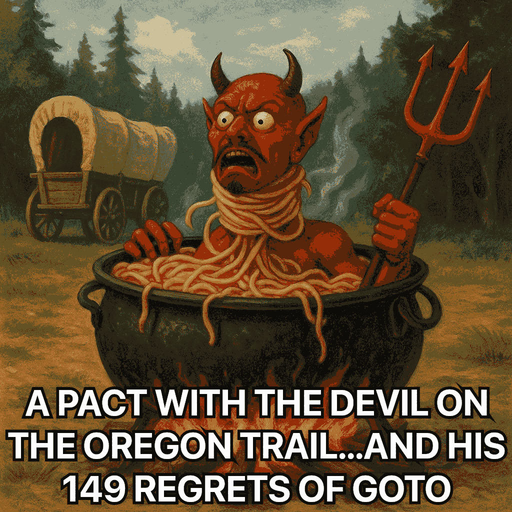
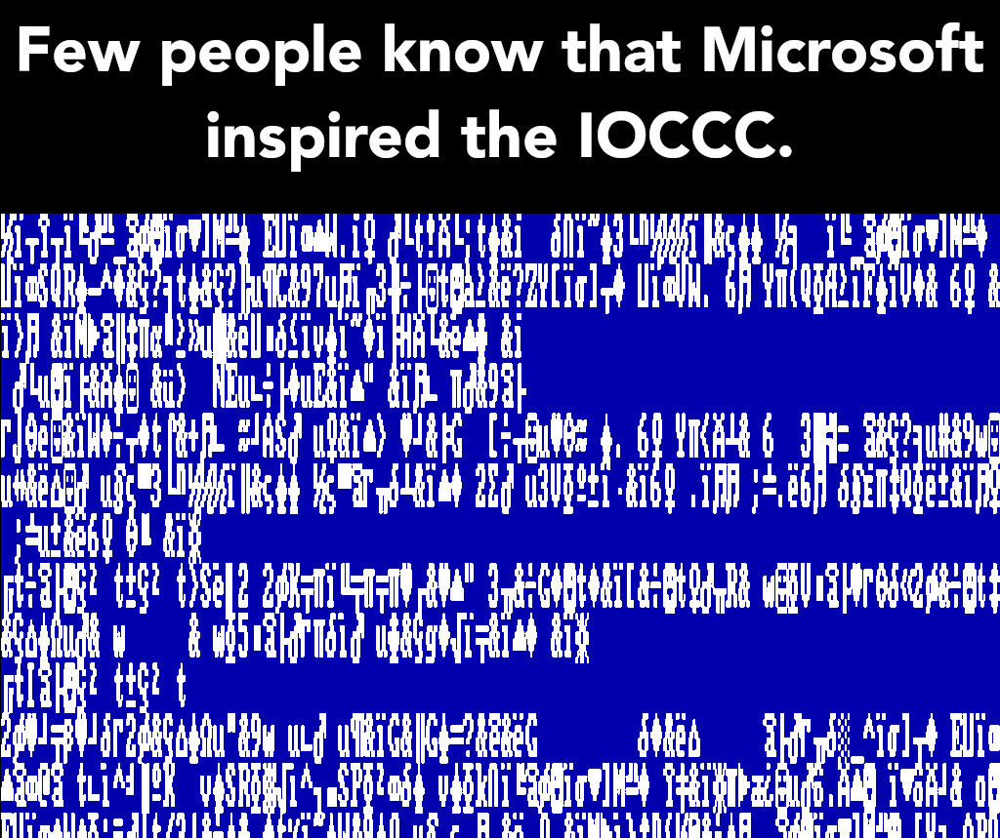

<div id="obfuscation">
### Obfuscation
</div>

**WARNING**: if you have a heart condition please be careful when you look at
the code. Maybe have a medic nearby just in case. I don't want something bad to
happen to you. It's bad enough something happened to the author...clearly
something did. He might have been possessed by a demon. Or the Devil himself.
Clearly the program has a vendetta against BASIC:

> BASIC taught us bad habits. This program perfected them. Now it needs an
exorcism because it is possessed by the Devil and is going straight to Hell.
Tread with caution dear pioneer, tread with caution...lest you become the next
victim.

The complexity of a program is directly proportional to the number of `goto`s
it contains.

One of the main goals of this was to take the `goto` count to absurdity and I
did this in surprising ways. Nothing can be trusted any more in this program.
Not if/else, not switch/case, not loops, nothing, not even `main()` itself, all
because of where code is, even in ways that might seem like it would cause a
data race or UB. But it does not. It looks illegal. It probably should be
illegal. But it is not and it is so much worse as you'll soon find out...

Let's go back in IOCCC history though: in 1987, with
[1987/hines](https://www.ioccc.org/1987/hines/index.html), which I believe held
the previous record for most `goto`s in an IOCCC entry, the judges wrote:

> This program was designed to maximize the bother function for structured
programmers.  This program takes `goto` statements to their **logical conclusion**.
The layout and choice of names are classic.
>
> We consider this to be a beautiful counter-example for Frank Rubin's letter to
ACM form titled: _["'GOTO Considered Harmful' Considered
Harmful"](https://web.archive.org/web/20090320002214/http://www.ecn.purdue.edu/ParaMount/papers/rubin87goto.pdf)_.
See the Communications of the ACM, March 1987, Page 195-196.

(I refute some things in my program that directly contradicts Frank's
letter in amusing or at least instructional ways in my [remarks above](#devil).

I added bold to logical conclusion because I wanted to stress this. I'm afraid
they were wrong, oh so very VERY **VERY** WRONG. 24 `goto`s, according to
`hines` itself, is not the `goto` logical conclusion. I agree it's a beautiful
counter-example for that letter but oh is everyone in for a HUGE SHOCK!

24 is peanuts compared to what I did. And let's be honest - 24 is ALREADY WAY
too many, even in a large program, let alone a small one. Even one `goto` is too
many. Unless I am very much mistaken, I have broken the record by a huge margin.

Here's the horrifying and hilarious truth: I beat it out by 92 MORE, **BEFORE** the
cpp at 116 and after the cpp is through I beat it by **110** MORE (!!), **AT
134!** Yes, you read that right. 134 `goto`s!

Even removing what I think are the only dead `goto`s, two of them, including one
that is in the `w()` macro that would be translated into more, I beat it by 90
more, at 114 before the cpp, and 99 more after the cpp, at 123!

Did I forget to mention the original Oregon Trail in **BASIC** from 1978 HAS A
MEASLY 109? THIS SHOULD NOT HAPPEN. Well it did happen and this HAS to be a
joke, right? I'm sorry but it is NOT a joke. I am for real. There REALLY are
that many and that is ridiculous.

Okay so it's a joke in another way but nonetheless YES I **REALLY DID** put in
116/134 `goto`s, depending on if you pre-process it or not! YES I might be mad.
YES I think it's HILARIOUS. But if it was not for the IOCCC... Well, as I
mention in my [remarks above](#devil), EVEN ONE IS TOO MANY
in real code.

I dare you to run the program in a debugger from start to finish to see how many
line jumps there truly are. After I won I did it once: in a program with just 85
lines (14 blank, some with just a brace, `#include`s, `#define`s included) there
were a total of 985 line changes (a tiny tiny fraction had the same line number
repeated once). I rarely went to the fort and I only hunted once (I might not
have hunted at all). This is obscene.

The best (or worst, depending on how you look at it :-) ) part is this works. As
I note in those concluding remarks, a company actually introduced a security
hole from ONE `goto`. Yet I have 116/134 and it actually works? That is surely
obscene. And beautiful.

Oh and BTW: it appears that `hines` is a bit confused about my submission,
though I'm not really sure why. In any case, I not only have dethroned `hines`
(sorry ...but also not sorry!) but I have, as noted already, beaten the original
BASIC game by **7** more `goto`s at 116 before the cpp and **25 MORE** after the
cpp, at 134!

It's almost impossible to add more `goto`s. You'll see why soon. But even if
that was not the case I wanted room for the other things I did, some of which
are quite cool and I believe unique as well.

And yes, I agree: the idea of `goto`s considered harmful considered harmful is
ludicrous, and as you just found out (probably in horror), I have taken it far
further.

In fact, as you'll find out, every part of this program breaks the rules you
know about C when it comes to things like: loops, if/else, switch/case, blocks
in general, where code can be, where labels can be, really everything: the code
is in all the wrong places.

This is not counting other cool things like a single `char *` holding near
200 `char *`s. No. I do not mean an array of `char *`s! I mean a single flat
`char *`! Yet in the code I index it AS IF it's a `char *[]`, just to add to
the confusion (as if the 134 `goto`s are not bad enough). But it's not a `char
*[]`. It's a single `char *`, which is the contents of the data file.

There are other things I have done, of course.

This program took two months, to the day, to develop and it was totally worth
it. But I was almost strangled by the spaghetti, kind of like the Devil, which
you'll see in a bit. I am thoroughly exhausted as well.

Now as far as the labels go: is it legal to put them where I have? Yes it is.
Labels have function scope and it is not UB **AS LONG AS** it does not skip
initialisation. My code does not. Not only are all variables in file scope but
when I need something set to a specific value I MAKE SURE to do that BEFORE A
JUMP.

That EVEN includes when two for loops actually incrementing EACH OTHER'S variable
(which actually happens to be the same variable). They also act on the same array doing
different things. In fact, the body of each is inside the other loop.

YES REALLY. I went that far. And I did it safely. There is no data race
whatever. It is diabolical as you'll find out later.

And additionally, as far as UB goes: using `-fsanitize=undefined` yields no
crash and valgrind is clean on my systems too. Looking at the grammar of labels
and `goto` and it's all good. Furthermore, labels are **function** scope. In
particular in 6.2.1:

> A label name is the only kind of identifier that has _function scope_. It can
be used (in a **goto** statement) anywhere in the function in which it appears,
and is declared implicitly by its syntactic appearance (followed by a :and a
statement).

And as for the `_` label that is also allowed per the standard. So yes it's
allowed: but even if it wasn't it works on multiple systems (macOS and linux in
my tests) with multiple compilers (at least with linux) and all is good.

But as I noted, I took the joke **MUCH** further than even I anticipated. This
was possible by repeatedly finding ways to save bytes including reallocation of
strings and removing some dead code (does that make it undead?) though as you'll
find if you look at the code there is some code that is dead, some code that
appears dead (but is it?) and some code that might be dead but can still be
reached (how is that possible? Obviously `goto` ...).

Frankly if I did not have a twisted sense of humour I would think it went beyond
the point of funny LONG BEFORE I was done. As it is I would not be amused if
this was in production code. For the IOCCC though I think it's hilarious. And
awful.

Even so this program is **VERY WRONG** in **SO VERY MANY** ways, most of all the
`goto`s (but not in just that way - the single `char *` is probably very wrong
as well, but there's more). Unless the program I wrote to calculate the `goto`s
is in error, then the numbers I gave earlier are indeed correct. And I believe
there is no error at all.

HONESTLY, HOW DID I BEAT **BASIC** in `goto` count? THAT IS WRONG. But I did. I
beat it. It is defeated. I WIN.

Or maybe I lost. My mind. Obviously. BUT I STILL WIN and whether or not I
have lost my mind this program sure as hell lost its mind! And it's my fault.
Hilarious.

Counting whitespace this program is only 4666 bytes according to `wc -c` (macOS
at the least, maybe others): quite intentionally to be on theme. That's a
relatively short program to have 116 `goto`s or more when filtered through `cc
-E` (134!), wouldn't you say? If that's NOT too many, then I ask you WHAT IS?

As said in numerous places, IT IS MUCH SMALLER than the BASIC file I included
even after stripping it of much of it. My program also has more events. I think
the BASIC one has 16 not counting the mountains code and mine is 23 not counting
the mountains code, which obviously I also include.

I discuss this some in my concluding [remarks above](#devil),
as well as mentioning that there are other events
besides those 23. I certainly will not reveal all though. The humour and jokes
sections of that file says more but the concluding remarks are for a summary and
why I think that this code is worthy of the contest AND also pointing out the
folly of `goto`.

In this file I will discuss how some events actually are polymorphic, in a
sense, having at least two different events.

THIS IS ALL OBSCENE.

This amount of `goto`s I have **never** seen especially in a relatively small file
but frankly ever in a single program. I don't know for sure but I'd guess that
no program with multiple files has this many. I don't think anyone has ever been
mad enough to do this before and I SURE AS HELL HOPE that I am right and that
NOBODY EVER DOES IT AGAIN, ESPECIALLY IN PRODUCTION CODE!

Hell, I wish people would stop using `goto` full stop. Except in the IOCCC. Or
maybe not after this? Perhaps this ruins it? Perhaps the judges will burn it
into oblivion like I did? Or maybe they'll drown it in tears (of laughter and
otherwise)?

They THOUGHT they had already seen the logical conclusion of `goto`s in 1987,
with [1987/hines](https://www.ioccc.org/1987/hines/index.html), and THEY
PROBABLY NEVER EXPECTED THIS. Actually, neither did I. But they were wrong.
VERY VERY WRONG. I might be wrong too. But I still did it. And I'm proud of it.
If the judges never want to see `goto` again it's totally worth it, even if
others curse me. I wouldn't blame them. I might curse myself.

If the judges renounce `goto`s I will make no apology (though I'll be a tiny bit
sad as it's a great technique). There are plenty of other ways to obfuscate
code, as this program also shows. It's just that the amount of `goto`s here is
the worst of it as you never know where the program will be next, and that's
putting it in a simpler way. Much, much, MUCH simpler way, in fact, as you'll
see.

Either way this program, and I mention this in my [remarks above](#devil) in an
admittedly long editorial plea (although it does it by going over what I have
done in simpler terms than this file), serves as a public service, warning about
`goto`. The article about goto considered harmful has nothing against this, or
so I personally see it that way. That's because I don't think anyone has ever
been mad enough to do what I have done.

Here are some fun statistics from a somewhat rudimentary program on both the
prog.c and after filtered through `cc -E`. First prog.c. Prepare to be
horrified, if you're not already:

```
    116  goto
    50   if
    11   else
    4    while
    4    for
    1    do
    6    switch
    32   case
    2    sizeof
    8    break
    0    continue
    2    default
    8    long
    3    unsigned
    4    return
    1    void
    1    int
    1    char
    1    size_t
    1    FILE

    Ratio: 0.83 gotos per keyword
```

And the pre-processed one:

```
    134  goto
    50   if
    11   else
    8    while
    4    for
    1    do
    6    switch
    32   case
    2    sizeof
    8    break
    0    continue
    2    default
    8    long
    3    unsigned
    4    return
    1    void
    1    int
    1    char
    1    size_t
    1    FILE

    Ratio: 0.93 gotos per keyword
```

LOOK AT THAT RATIO! And we could even suggest that `FILE` might not be a
keyword, but rather a struct.

Whether data types are keywords for this is also something to consider but we'll
include them as keywords anyway. I don't believe I use any others in any case.

This program is as cursed as the PC (player character) if not much more cursed.
It is totally bonkers and it was really hard to find places for labels even
after I put them in bizarre and unusual places. But I get into that in more
detail later. There are even some cases that are in a sense polymorphic,
although I am not sure if I bring that up (it's cases 8, 11 and the label V that
is part of case 8: case 11 jumps to V and then depending on the value being
checked (`q`) it does different things, maybe even nothing depending on the
pRNG).

This program is obscene. It should be illegal except in the IOCCC. I believe
that the Devil wishes they were too:



I have shown JUST HOW LUDICROUS `goto`s really are and JUST HOW MUCH STRUCTURE
AND MAINTAINABILITY is lost with `goto`s: a goal of the contest met simply by
one thing taken to absurd levels. But if this is not the worst or best abuse of
`goto` I would **HATE** to see worse/better abuse.

**BASIC is BUILT on goto**; **C is NOT** but I have almost **turned C into
BASIC**, even surpassing the number of `goto`s in a BASIC program in a
**SHORTER** C program that **DOES MORE**! That is both appalling but
delightful for the contest. This program is cursed and obscenely and sinfully
delightful. The `goto`s alone (but there is much more) **DEFINITELY** already
meet the goals of the contest:

* To write the most Obscure/Obfuscated C program within the rules.

I have followed the rules but I have abused `goto` like I have never seen
before. It is **FAR WORSE** than flex/bison generated code from what I have seen
and that is saying a lot as it's notorious for `goto` abuse. It does not come
even remotely close from what I have seen at least. THAT IS APPALLING.

I have never seen anything remotely close either. BASIC does not count as this
is the International Obfuscated **C** Code Contest, not the International BASIC
Code Contest (IO-BASIC-CC) (and thank <del>god</del> the Devil for that!) and I
beat it out anyway.

* To show the importance of programming style, in an ironic way.

I definitely have done this. The absurdity of this many `goto`s is ironic itself
but when you throw in the jokes (in the code too) it's far more ironic. By using
`goto` to absurdity the entire structure is lost. There is no following this
program. As soon as you think you have the next step it jumps somewhere
else...and that jump might jump to several other locations to land on its final
destination: or is it the final destination? I think Hell (probably travelling
by handcart) might be the real final destination, just like the player character
(PC) who 'goes straight to Hell'. Actually the sequences of jumps is worse but
I'll get to that later.

Some of the chains are JUST WRONG. There is a chain that just drops DOWN from a
label that is at the end of a block only to do a goto which is inside that SAME
block (the bastardised Duff's device in fact, see way further down), which then
exits the program.

There are `for` loops that are in different parts of main()! That is ridiculous.

As I noted two loops are intertwined in ways that you would expect to be a data
race. It's much worse than that. Here is what I mean:

Each of the two loops jump to the other one. One of them jumps more than the
other but they both start out in what amounts to:

``` <!---c-->
    for(X=1; X < 6; )
```

but in one it is actually:

``` <!---c-->
    for(X=1; X<--(unsigned){ 7 } ; )
```

...which is equivalent.

But it's more diabolical. As you saw, it does not increment the `X` so how does
it work and what does the body of the loops look like? Well...

``` <
    for(X=1; X<--(unsigned){ 7 } ; ){ goto kk; BB:*o[X]+=(X==2?t[X]*5:t[X]); goto HA; TA:++X; goto at; ZZ:; }

    for(X=1; X < 6; ){ goto BB; kk:if (*o[X]<0) goto LL; goto uu; QQ:V(B=38); goto JJ; at:; }
```

Now what about the `++X` in the first one? Isn't that the increment of the first
loop? Nope. That is for the second one. It goes like this...

``` <!---c-->
    if(T<0){ V(46); O=R=E=G=N=0; goto v; LL: *o[X]=0; uu:++X; goto ZZ; }
    /* ... */
    } else{ goto y; HA:T-=X[t]; goto TA; A:for(X=1; X < 6; ){ goto BB; kk:if (*o[X]<0) goto LL; goto uu; QQ:V(B=38); goto JJ; at:; } goto B;

```

Notice how the labels end up swapping the location. The first loop goes to `kk:`
and that is in the other loop. That will end up going to another place, either
`LL` or `uu`, the latter of which is a fall through from the former. That is
where the `++X` is.

As for the second loop: first it jumps to `BB` which is inside the first loop.
It does its thing and then jumps back to `HA` (isn't that funny?) which does
something else and then it jumps back to `TA` (do you truly feel welcome?) which
is in the first loop. That does a `++X;` and then jumps to the end of the second
loop.

Realise this too: these tasks are for each iteration. That means each iteration
these jumps are happening, kind of like everywhere else.

There are so many other things too...all with `goto`...plus other things, as
you'll see.

None of this code should be legal. But it is. This code SHOULD NOT WORK. But it
does. `goto`s are harmful. Anyone who says otherwise needs to seriously think
about what they do to maintenance.

`goto` TOTALLY DESTROYS maintenance. It causes bugs. And yet everything works as
I intend it, down to the dead code, code that looks dead but is not, code that
is dead but can be reached at times via `goto`... THAT IS JUST WRONG. It also
destroys brains.

This is not good style. It is actually **TERRIBLE** style and HORRIFICALLY
OBSCENE. I hope I have demonstrated this very well. Actually I KNOW I have. I
have never seen a worse piece of spaghetti code in C and that is saying
**SOMETHING**, as I have seen most if not all of the IOCCC submissions. That is,
as will bring up later, no criticism. Of course I could have missed something I
suppose (very possible) but on the subject of spaghetti code I think I outdid
it.

There are a lot of ways to obscure code and I don't believe anyone has taken
`goto` to this obscenity in C. I believe the one with the most `goto`s is
1987/hines and, as noted earlier, it reports on itself as having only 24
`goto`s. Yet I have 116 before the cpp and 134 (!!) after the cpp.

And unfortunately for you dear reader I have done other things that also are
quite different and totally unrelated to `goto`s. Even so the `goto` madness by
itself is worth something or some things - including curses.

What kind of curses? That depends on the viewer. I would say it's worth all
kinds of cursing and I most certainly would be swearing at the author if I had
to maintain this mess! It is a joke. I personally find it hilarious but that's
because it's satire, just like the contest asks for.

* To stress C compilers with unusual code.

My guess is that if the compilers were human beings they would be asking what
the hell is wrong with the author. I guess this because I'M ASKING THE SAME
thing about myself. The structure of this program went to hell in a handcart and
I would question anyone and anything not questioning my sanity. Because I sure
as hell am! Frankly I'm not sure if there is any sanity remaining and it might
be hard to sympathise with me because I (quite deliberately) caused it myself.
Still...I'm not suffering: I am enjoying every minute of it, as the joke goes
(even though that's totally bogus in...uh..reality). I think it's HILARIOUS.

* To illustrate some of the subtleties of the C language.

I have definitely done this. Some of the places I have put labels is very unique
(or I have never seen them there). Also some of the other obfuscation seems
downright illegal but is not (and that goes for at least one or two things with
`goto`s too). I put almost 200 `char *`s in a **SINGLE** `char *` (NO, NOT an
array of `char *`!). There are other things.

Anyway I'll get to these later.

* To provide a safe forum for poor C code. :-)

If this is not poor code I would hate to see poor code! I'm reminded of the
joke:

> Always code as if the guy who ends up maintaining your code will be a violent
psychopath who knows where you live.

...which I believe was said by John F Woods. I don't know about anyone else but
**I** would hate to have to maintain this code - to say nothing of the fact I might
want to rip <del>my</del> the author's head off for causing this mare's nest **from
Hell** that I had to <del>maintain</del> ...write?

If I was handed this code and told to update it to change it to not have the
`goto`s but still function exactly as I intended it, I would be cursing the
horrible monster who wrote it.  I would also tell them to go straight to line
22!

Okay I might also laugh at the absurdity but I would want to tell the person
telling me to update it to go straight to hell. Frankly I would be making FULL
use of lalochezia (catharsis from swearing - no I did not make that up)!

And frankly, if you expect me to explain how some of this works I will also tell
you to go straight to line 22!! THIS SHOULD NOT WORK. But it does. It works and
it should not. This is NOT OKAY. This is a crime against C. It is a crime
against computer science and could give computer scientists a stroke.

And I won't be paying the bill because there's no point when they're in the
vegetable garden[^1] from massive brain trauma. Besides, I might be in the pot next
to them. Just don't ask. I might go insane. If I'm not already.

Go to line 22 instead. It'll make perfect sense if you do this. And frankly, if
it doesn't, I guess you must have grown up with BASIC. My most sincere
sympathies my dear friend, my **VERY DEEPEST SYMPATHIES**! Take care of
yourself. You only have one life.

* To have fun with C!

Well I did admittedly have a lot of fun including with taking the `goto`s to
peak absurdity - and the jokes of course and the other bizarre things.

This is the worst code I have ever seen flow control wise, and perhaps in some
other ways too. And I wrote it. I have seen most, if not all, of the IOCCC
winning entries. That is no criticism. I am in **UTTER AWE** of many of them and
I feel that many are beyond my abilities; most if not all are after all utterly
brilliant and I can't know everything. But when it comes to flow control
madness, this outshines (presumably with fire) them all, I think. If that's not
true I want to know which one and I want to meet the psychopathic, misanthropic
author.  They might be able to teach me something nice about humanity!

There are just so many `goto`s that a single miscalculation (in labels or other
things) would cause the program to fail spectacularly. And it would be bad
enough with just the `goto` nest. Unfortunately (or fortunately) there's a lot
more obfuscation.

Frankly **if** Hell actually existed **and** it had a programming language, I am
**certain** it would look like this! In fact the abuse is so extensive that you
might think that there **HAS** to be a flow control problem. But everything is
as planned even if you think otherwise; but **if** you **DO THINK** there is a
flow control issue I would say: I don't blame you! I also thought the same at
times but there is not. I was so certain of it that I many times directly set
certain variables to what I wanted to test and it worked out. I was so certain
there was an unintentional flow problem I had to test it. I'll mention an
example later on.

But either way unfortunately for you it's **NOT** broken and if you think it is
you're wrong and will have to try again! Okay: the code is wrong in some senses
of the word but it's correct code nonetheless. It **should** be a sin but it's
meant to be this way. It's no wonder the narrator is so twisted and I would
actually ask what the hell is wrong with him except the narrator is **also** the
author.

Actually now I think on it... I take that back. I DO want to know what the hell
is wrong with the narrator too (okay, sure it's actually the voice in the player
character's head but even so...I authored the narrator)!

I hope you know why but I do not ask for any pity. It's been a true delight in
writing this totally deranged code and I hope you enjoy it. Although...the devil
might wish you to cry after looking at it. Certainly he's blubbing too and his
lachrymal vase is bigger than all the oceans on the planet. I know because he
told me so!

And yes I am guilty of a crime against C. But I had no choice. The devil made me
do it. With that said...

**IMPORTANT NOTE FOR THE JUDGES**: this program took about two months to develop
and I frequently found ways to shave off more bytes which meant more obfuscation
(and earlier on more events until it got to a point that I felt it was fine,
even though the alt code has a few more).

It is thus entirely possible that some of the discussion in this or other
sections to do with obfuscation is wrong in some way or another. I trust you
understand how that could happen when you look at the code. I had to save my
sanity and the contest was very close to ending anyway.

The events were so plentiful that I had to go for just more obfuscation although
I was sorely tempted to add more events. I decided to leave that for the alt
code instead, as noted elsewhere.

For some hints, which is definitely incomplete and might or might not have some
inaccuracies, see [deobfuscation.html](deobfuscation.html).

Also I have included a commented version (of the submission, not the alt code -
sorry, I don't want to fry my brain any more than I have to) in
[commented.c](commented.c). I did not test compile it after the beautifier did
its thing. It seems like it should be good if you use the proper command line
(the define needed for portability and the define to be able to spell out OREGON
TRAIL TRAIL OREGON without having the ugly `#define TRAIL o` in the code simply
for `TRAIL` variable which is used exactly once as that name).

HOWEVER: it does not have the latest obfuscation and I'm pretty sure it is
missing an event or two. As I added more I stopped caring about updating it. It
was too much for me to cope with and I was running out of time - due to the fact
this took so long to develop and refine (the jokes in particular but also
additional events and then much more obfuscation, as I kept saving more precious
bytes).

Anyway it's ([commented.c](commented.c)) not the game itself (well okay it is
but it's not the code to compile); it's just so you can get a better idea what's
going on - within reason: I did not try elaborating again on the gotos. I said
enough below in this document and I added to it/changed things after the below.
And even that is unfortunately probably only a small sample of what I did. I
already wrote an obscene amount so I'll try and limit it somewhat, and by this I
hope to save your sanity and mine.

I might add to the judges: you might want to take a look at that (commented) code
too so you have a better idea in design choices (though some of them are listed
below). Although I'm not really sure how much that's going to help anyone out -
especially as it was created earlier on and I added way more obfuscation. It is
also entirely possible that there are bugs in there that are not fixed but that
are in prog.c. I suspect this is the case, perhaps bullets not being subtracted
when they're supposed to in some events (like with Blackbeard).

And yes there is some of the same deliberate dead code there but prog.c has more
(I think, and if so, it might have more than prog.alt.c too). Anything you think
is wrong (probably due to the spaghetti code from Hell) is very intentional and
thus features. As noted in various locations some of the 'things that seem
"wrong"' are actually part of a joke. Other places it's for confusion to make
one question their sanity even more. Yes I'm probably a sociopath.

As I commented in the commented.c:

``` <!---c-->
    * Finally this code is from an earlier version so some of it might be missing,
    * not just the events, and not just the gotos, but potentially other things
    * too, possibly bugs that were fixed in prog.c but are not here (and no more
    * bugs remain in prog.c). But I believe this is more than enough to give you an
    * idea though if that is the case. If that's not clear...
    *
    * WARNING: this code and its comments are not up to date. I wrote 116 before
    * filtered through the cpp and 134 after the cpp and I didn't wish to
    * repeatedly revisit this file trying to explain everything.
```

I hope you understand but I do believe it's a gain not a loss. It is good enough
especially as it's only for educational value - or to examine my head (though
prog.c might be better for that?). As noted the code (and jokes) took a couple
months to develop and I could not manage adding everything in the end even though
I tried to keep the structure relatively the same (it's better though - although
I did fix some actual flow control issues that were not intentional, but it is
possible I did not update those in commented.c). Frankly it might help give you
some ideas but it might actually confuse you even more. I'm not sure. Even so
although you might find it of interest it's not explicitly for you (the judges)
either. What's more important is obviously prog.c itself along with how it uses
the data.

The main reason it's (the commented code) out of date is I decided to take the
`goto`s joke even further - again and again and again - but like I said I also
made fixes and I also added more events.

Now then...  Although the joke is intended (like all the others) I must say that
BASIC is unique in that it is exactly what I want it to do: it is goto hell and
that's precisely where I want it to go! I do not want C to go to hell though and
I somehow made it goto hell too, and as I said surpassing the 1979 BASIC in
`goto` count (okay in that case `GOTO`): and as you'll see in the code there's a
literal `goto hell;` (actually more than once) as a joke.

A fun thing is that BASIC is so awful that a part of why this this game is very
different is when trying to be faithful to the original (i.e. before I decided
to make a mostly new game) I had to back out of it as it was so large even after
the data file was in place.

Happily this made me rethink some things and I came up with even nastier tricks
plus the new and much better theme, turning it into a parody and then mostly
going my own way with it all, keeping only the route and a few minor game
mechanics in place. Plus more `goto`s and obfuscation...always.

Some of the abuse of `goto` in my code seems wrong if not downright illegal (but
hey, isn't that right on theme too? :-) ).

Anyway: can you honestly determine what this program does without running it
or looking at the data file (with absolute certainty)? I didn't think so :-) At
best you can take some guesses based on the control flow (IF you can even follow
it) but nobody can determine for certain, or so I hope. And if they can I wonder
if they're okay. I wonder this because I wonder the same thing about myself.

The first reason the strings are in a data file (which other entries have done,
so it's not abuse of rule 2) is because the original strings **BY THEMSELVES GO
WELL BEYOND BOTH size rules**: I might've said this numerous times. Call me
paranoid on that rule if you wish. Probably it is especially since many other
entries also read from files.

Unless you look at the source data files you can only at best guess what this
program does. Well okay there's that spelling out of `OREGON TRAIL` but that's a
long tradition in the IOCCC and could be misleading anyway. Indeed it kind of is
as the strings will show; it's hardly Oregon Trail now - it just takes place on
the trail. It all had to be carefully designed which also is a good thing for
the contest. My procedure outlined later in this file will show you just how
much creativity it took and just how messed up it truly is.

Anyway there's no way to know for certain what this is, or so I can't fathom how
one could know. And that's assuming you can follow the spaghetti code. Frankly
to call it spaghetti code is a huge understatement. It seems to me it's a new
category on its own: perhaps Cthulhu with heavily mutated tentacles?

As I mention later, the data file rather reminds me of the Windows registry (I
will return to this later in the [Data file](#data) section), which is a great
thing for the contest and a terrible thing for a non-obfuscated program (thanks
Microsoft for having a comparison in poor design!  :-) ). The best part is
unlike the registry, my data file simply works, as long as you don't screw with
it whereas the registry is broken by design.

**IMPORTANT NOTE**: I originally showed some of these in detail but it got so
absurd and long to show and so hard to maintain as I updated it that I was
totally overwhelmed by the sheer madness. I am not sure how much I really do
have here but when you look at the code you'll definitely understand why and
probably sympathise with me too.

Check `case 11` in the events switch. It does `goto V;`. Now `V:` is **part of**
`case 8`. But do you see how long the inner switch that is part off that code
is? In some ways it is actually polymorphic, doing drastically different things,
depending on the pRNG and which event it is.

At one point I was **DEAD CERTAIN** that part of this that should not be dead
was dead. But every part of it that is meant to be live is. There was a part
that was broken but that was fixed. As I noted in my [remarks above](#devil),
this event (11 in particular, under `V`), will not necessarily do anything, as
it depends on another call to the pRNG. This is good because otherwise every
time it triggered it would cause severe illness.

There are many places where a label is inside a block. There are some fun abuses
of this. For instance did you notice that many times what should be in the `if`
is actually in the `else`? Sometimes the reverse is true and sometimes the code
is swapped. The code then jumps back to where it would end up, at least if
necessary (in some cases it might not be necessary at all).

Here's a funny one which involves dead code but code that can be reached in one
condition: it just can't be reached by `goto`. It is the `goto heaven;` which
means it's unobtainable (okay, so the above statement that there are only two
dead jumps means that there are three, and maybe I missed some, but this hardly
matters and it's important not only to not trigger a warning - interestingly
enough despite the fact the compiler should know it's dead - but for the joke).
But here's how the code actually looks:

``` <!---c-->
    while(i)heaven:{ w(i) } if(!B&&(f||a))
    {
        /* ... */
    }
```

First of all what is with the label BETWEEN the while (with the condition) and
the code of the loop (which in this case is actually an `if` because `w()` does
its thing and then does a `goto hell;`)? It looks even worse with the `{}`s for
the 'loop':

``` <!---c-->
    heaven:{ w(i) }
```

And then of course it appears that it would go on to the `if`. But it doesn't
\- if `i` is non-zero of course.

And that `if` is ugly. Here's what it looks like:

``` <!---c-->
    if (!B&&(f||a)){
        if(d&&a) V(91);
        if(T<666)
        {
            goto QQ; KK: Q=a?1:Q; h=f?1:h; f=a=0; V(93); T-=666; } else{ goto KK; } JJ:;
        }
```


Notice how if `T<666` (that's a check if the PC has enough money for the doctor)
it does a `goto QQ;`. Where is `QQ`? It's inside a `for` loop that has its code
in another place (yes it's horrible). It looks like (sorry if this changed last
minute):

``` <!---c-->
    else{
        goto y;
        BB:*o[X]+=(X==2?t[X]*5:t[X]);
        goto HA;
        TA:goto at;
        HA:T-=X[t];
        goto TA;
        A:for(X=1; X < 6; ++X) {
            goto BB;
            kk:if (*o[X]<0) goto LL;
            goto ZZ;
            QQ:V(B=38);
            goto JJ;
            at:;
        }
        goto B;
        }
```


Notice how `QQ:` does its thing and then jumps to `JJ:`. That label is at the
end of the if/else inside the if that contains the check for `T<666`. After that
for loop is amusing: `goto B;` which is where? Close to the beginning of
`main()`. I will return to that for loop itself shortly as it's hilarious.

Oh but it's far more diabolical than this! If you observe the initialisation,
condition and increment of that loop you'll see it iterates through `o` via `X`.
So what you might say. Well this is what. The label `kk`? That comes from
another loop that does the same thing! Higher up in main() that loop looks like:

``` <!---c-->
    for(X=1; X<6; ++X){ goto kk; ZZ:; }
```

and so the body would actually translate to something like:

``` <!---c-->
    if (*o[X]<0) goto LL;
```

But where is LL and what does that do? Well:

``` <!---c-->
    if(T<0){ V(46); O=R=E=G=N=0; goto v; LL: *o[X]=0; goto ZZ; }
```

So it checks if it's < 0 and then sets it back to 0 if it is. And of course that
check is in another if block that is totally unrelated. The `goto ZZ;` is there
as in both cases the end of the for loop has to be returned to. But this means
the for() loop is split in several places and it's worse than that...

It looks like there would be a data race here. There isn't. Isn't that
beautiful? I thought so too. As far as what those two for loops do. One is
adding to what you have after purchasing (at the fort, I think) and another is
making sure that it's not < 0, setting any back to 0 if necessary.

Another hilarious thing about it. The containing loop is the one that (and I say
this somewhere I think) it would appear is acting on the array prior to
initialising the variables. The question you might then have to ask is: in that
case, which initialisation is being used - or is there any?

As for the beginning of `main()`. Did you notice that the `return 666;` is close
to the beginning of `main()`?

Going back to that for loop with `BB:`. Did you notice how `BB` comes before the
loop? And then it jumps forward and backwards and so on. Here's what it's like
in fewer lines so you get a better idea:

``` <!---c-->
    BB:*o[X]+=(X==2?t[X]*5:t[X]); goto HA; TA:goto at; HA:T-=X[t]; goto TA;
    A:for(X=1; X < 6; ++X){ goto BB; kk:if (*o[X]<0) goto LL; goto ZZ; QQ:V(B=38); goto JJ; at:;
```

So the body of the loop is actually outside of the loop. That body jumps several
times only to land back at the end of the loop - which so happens to be after
`QQ:` which I brought up earlier - and which starts from another place entirely.
This for loop is the one that would look (to the uninitiated) as using the
variables before they're initialised. Maybe I have not shown this yet. Apologies
in that case.

But if you look at the code more carefully you will see that the else block that
contains it all does an immediate `goto y;` which means the loop can only be
accessed by a different `goto`. That is the `goto A;` which also close to the
beginning of `main()` (if at the fort).

Of course as previously noted the `kk` label is another for() loop that actually
increments `X` as well as acting on `o` (`o[X]`). But of course in the other
one it's further apart from the loop, exactly so it looks like it is
uninitialised but isn't. I would move it further away but I wanted to mislead
further. The fact that the `kk:` label (part of the other loop that is acting on
`o[X]`) is right there and you can see in the containing loop that it's also
incrementing `X` could easily be mistaken for being part of the containing loop
rather than the loop inside of it (which doesn't look like a loop at all). All
you have to do is miss the `goto BB;` OR, after all the `goto`s, start to
question your judgement: is it really jumping somewhere?

Additionally for all you know the `goto BB;` might land at `kk:` indeed some
code like that actually exists (or so I think). Sure you can see to the left of
the loop that it doesn't, again assuming you're not overwhelmed with the sheer
amount of `goto`s, but it is far more confusing to make one wonder if it's a
data race. But like I said it's definitely not a data race due to manipulation
of the flow control.

As for the loop itself: because of the `at:` at the end and the several jumps,
the body of the loop is in several places, jumping **behind** it only to go a
bit forwards (by skipping a label and `goto`) which does something else and then
goes back to that label that was just jumped over which then jumps to the end of
the loop (the `at:` label) - for its next iteration.

And as for `QQ` that simply prints a message, setting the variable that the PC
can't afford the doctor (saving bytes in the process by doing `B=38` in the call
to `V()`). Then it jumps back to where it started - or actually the end of that
if/else chain which then carries on to the next part of the code.

That will end up doing `goto z;` which is at the end of the do..while loop in
the bastardised Duff's device.

I do like that the code spells out `HAT` and if you use your imagination a bit
`T-=X[t]` could look like text (or more like `TEXt`.

There are other for loops that have similar and, as I said, if/else that have
this too, with labels and jumps to lead to confusion and making it almost
impossible to go through in a debugger one instruction at a time - at least
without going partially (or completely) insane.

A couple more devious `goto` ones. At the very end of main, long after the
`return 666;` and right after the do..while loop, you'll see `goto _;`. Now
where is that `_:`? It's somewhere in the obscenely long switch at `V:` which
has a lot of code (including another switch) that does not belong there. It is
so long that it is hard to know if the case statements are part of the `case
8`/`V:` or not.

In any case the `_:` in turn does `goto rr;`. And where is that? This is
hilarious. Although you'll see part of the bastardised Duff's device I will
return to that more later on. Anyway:

``` <!---c-->
    int main()
    {
        switch(1)
        {
            j:if(z)goto A; E*=5; B:
            printf(&y[Z(12)],T); if(z) { goto f; } goto PP; default: srand(time(0));
            K=fopen(DATA,"r"); if(!K||getdelim(&y,&J,EOF,K)<0)
            goto hell; goto M; OO: if(b<1) { if(a){ w(40) PP: goto G; } if(f)w(41) w(45) g:goto S; } w(M>2169?47:45)
            hell:
            return
            666; rr:;

            goto OO;

            /* ... */
        }
    }
```

(Yes all of main is in the switch - will get to this later on.)

Observe how the `rr:` is in that switch block (along with other things that
shouldn't be there but obviously are) and it simply falls through to the `goto
OO;`. Where is that? Well look carefully: it is in that same switch, right
before the `rr:` itself! It checks hp/stamina and then depending on that and
other conditions it ends the game with different messages. Isn't that just
brilliant?

Oh but there is some extremely devious things here. I'll return to that when I
get to Duff's device (or the bastardised form).

There is more nastiness with `goto` but like I said, if you expect me to explain
everything I refer you to line 22. That being said I will get into some that are
indirect - like how I get into the loop of the bastardised Duff's device, and
when asking: how the hell does the switch at `V:` even work? The same question
for the `if (q>9)` block and in that case the `switch(x(1,2))` inside it. This
should not work. But it does. It is wrong in the worst (i.e. best) possible
ways.

Anyway I leave the rest of the `goto` madness to you, again except indirectly in
a few cases, and maybe one or two that come to mind that might be worth special
mention.

There is just too much to go through and I think you have more than enough
ideas. If not do check the code out - unless you have a heart condition, at risk
of stroke (especially if you're a computer science teacher). If these apply,
please look at it with care, as I mentioned above. One soul (or two if you count
the PC) lost is too many. Don't make it a second (or third). One person, the
author, is enough.

What in the hell is this?

``` <!---c-->
    x:V(X+--(unsigned){ 6 } );
```

You might have seen the compound literal in a similar way before but have you
ever seen it do `+--` as part of it? Isn't that illegal? Ah. Well to be blunt:
no it is not. All this does is prints out the string that is at `X+5`. But
doesn't the `+` followed by the `--` looks so wrong or indeed as suggested,
illegal? Shouldn't you get an expression is not assignable like the following
code?

``` <!---c-->
    i+--5;
```

**HOW IN THE ABSOLUTE HELL** is it not? Wouldn't the `+--` be the `+` operator
and then the decrement operator (you'd expect a variable that can be incremented
to the left or right!)? That's not how it works. It looks wrong and FEELS wrong
but it is not. Nonetheless it functions correctly. Here's the trick.

The `+` is attached to the `X` and the `--` is attached to the compound literal
array with the value 6, thus making it as noted `X+5`! Isn't that lovely?

Amusing thing to ponder for you. You noticed, no doubt, earlier where with a
compound literal like above I had an expression in a for loop what amounts to `X
< 6`, i.e.:

``` <!---c-->
    X<--(unsigned){ 7 }
```

The reason I used `unsigned` is because X is an unsigned int. Without that that
would trigger a sign compare warning. So how come I would not get it if I had
above as:

``` <!---c-->
    x:V(X+--(int){ 6 } );
```

...when the loop that calls that actually is comparing? I just gave the answer
in the very question if you need a hint.

Do you remember Duff's device? I have a twist on it. Or perhaps several.
Actually it doesn't really look like Duff's device, except that there is a loop
inside a switch. But that's not really the confusing part, even if it's not
right.

`main()` in its **ENTIRETY** is inside a single switch. This includes seeding
the pRNG, opening the data file, reading it, every last part. Read that again if
you need.

The default case sets things up but it looks like it should not work. But you're
wrong if you think that. This is the beginning of main():
It looks like this:

``` <!---c-->
    int main(){
        switch(1)
        {
            j:if(z)goto A; E*=5; B:
            printf(&y[Z(12)],T); if(z) { goto f; } goto PP; default: srand(time(0));
            K=fopen(DATA,"r"); if(!K||getdelim(&y,&J,EOF,K)<0)
            goto hell; goto M; OO: if(b<1) { if(a){ w(40) PP: goto G; } if(f)w(41) w(45) g:goto S; } w(M>2169?47:45)
            hell:
            return
            666; rr:;

            goto OO; yy:

            /* ... */
        }
    }
```

Now one might wonder: obviously the `goto A;` is not executed first because it's
not part of a case/default. Well maybe some would think otherwise but it's not.

But then...how can the `goto M;` in the default allow ever getting to the other
labels? It's all due to the `goto`s. The label `yy:` as you're about to find out
is the do..while loop.

Obviously, since main()'s entirety is in the switch, the game loop is entirely
in the switch too. There are other switch() blocks, with some nested, as
previously shown.

Of course the loop can be exited and re-entered as you already probably noticed.
Getting to the beginning of the loop, i.e. the `do`, is confusing as well.
First, after seeding the pRNG and opening and reading the data file, assuming no
errors occur (in wrong directory or missing file for some other reason, file not
readable, getdelim() returns an error etc.), it does a `goto M;`. Of course it
might look like it does a `goto PP;` but that's not right.

`M:` happens to be inside a switch that is totally unrelated, in fact either
purchasing at the fort or maybe all purchasing, though that's after another jump
(`v:` is important to clear out the `t` array). So it jumps to `N:`. Now this is
actually inside the do..while loop. Yet the loop has not really started just
yet. `N:` is inside a switch, I think a three level nested one, depending on how
you count levels, though I might be wrong. Anyway that does a `goto Q;`.

`Q:` in turn is inside an if block but safely as the first statement of the if
is to jump somewhere else. Instead `Q` starts a loop. This is sneaky. It
iterates through `X` (until 6) but each iteration goes to `x:` which allows for
purchasing, either at the fort or initial, and then it eventually jumps back to
the end of the loop. Of course `x:` is used in other cases too.

Once the loop is done it jumps to `j` which is the first part of the switch
containing main()'s entire body. If at fort it does `goto A`; otherwise it sets
up the amount of bullets you have based on how much you spent (using the same
variable of course - because why would I want to use another variable, even if I
have to scale in both directions?) and finally prints stats!

At that point, and this is hilarious, if at the fort (didn't I just check that?)
it jumps to `f:`. Otherwise (and again isn't this similar - both if and else but
without the else) it jumps to `PP:`. Are we done yet? Afraid not...

It jumps a short distance (that appears to be part of the default except there's
a goto - or several, including the `goto M;` which started it all) inside an if
(`PP:` is). After a call to the `w()` macro.

That might suggest it always runs off, even when a is non zero and
b < 1 (neither of which are relevant at this point) when the do..while loop
(which at this point of main() has not even been reached) is over.

But of course it doesn't because `w()` does `goto hell;`. So `PP` because `w()`
does a `goto hell;` which is also short distance away. But instead it does a
`goto G;` - and if you guessed that that is inside the loop you're absolutely
right: also to the right of a w() (I will return to this). This jumps to the do!
Finally there.

What this means is that even before the loop is started, and also after the loop
is started, both during the game and at the end, it leaves the loop, which of
course is inside the switch which has the entirety of main(). But this does not
destroy the state. And like I said, it does not skip any initialisation as the
variables are file scope so no UB invoked.

Basically there is no guarantee what might happen next. You never know because
it's constantly jumping inside and out of blocks, blocks that are totally
unrelated, often in what seems totally illegal and what should not work, even
that seeming data race I brought up. But it all works exactly as I mean (again,
including code that is either dead deliberately or seems dead but might or might
not be). So again if you believe you have found an execution problem you're
simply wrong.

But when it does get to b < 1 if a is non-zero obviously it'll go back to the
loop, right? Well again no because `w()` terminates the program.
`goto G;`. More fun!

So on that label: it goes into the do..while loop (in a few nested blocks full
of code that should not be there) in what seems like a reachable place in other
times - only to jump outside of it to...enter it..to exit..to enter...? That
can't be right.

Well it is right. So is this one:

``` <!---c-->
    if(!x(0,3)){ w(x(0,4)?84:x(0,4)?33:34) e:if(O>39){ V(e=x(0,1)?18:19); O -= 40;
    goto q; d:{ if(!v)goto TT; goto P; } } goto U; }
```

Yes there is even a block inside a block there: the `d:` is inside the `e:`
label block (or its `if` anyway). After that is another unrelated if. In the
case that the d/e block is/are entered it will go elsewhere in main() though,
even though the code would never be executed if the containing `if` were
entered.

Did you notice this block?

``` <!---c-->
    D:{ if (k()) /* ... */ } goto s;
```

It is obscenely long, wrong and has code that should not be there. But of course
that's why it has to be there and why it works.

What this all shows is that not only can you no longer anticipate where the code
is about to be but you also can't rely on blocks at all any more. Blocks are no
longer blocks as you knew them. They might as well be a red herring since blocks
can be used for opposite (at best) code. In fact in this program you basically
cannot expect the rules of C to apply - because they don't.

You have if/else that have been swapped, starting with a `goto` to where the
code really is, and, depending on how it's constructed, the code might just fall
through to the end of the if/else chain, or it might need another goto.
Sometimes if and/or else code is/are in other unrelated places entirely. These
if/else blocks might also hold code that do not belong to them, even what would
otherwise be dead code. Loops are even worse with this.

There are for() loops that jump out of the loop with a label at the end of the
loop for the next iteration. It might also have code from another place that
really doesn't belong there.

One for() loop actually takes that even further by jumping back to before the
loop, then a bit forward (jumping over a label), then that jumps back a bit to
do another part, then it jumps to the end of the loop for the next iteration.
But the body of the loop actually has other code for something else, maybe
another loop or maybe an if/else or something else. Obviously in the loop it
jumps back.

There is even code that is split into several parts of main(), like at least one
or two for() loops, sometimes even with code that belongs to other blocks
entirely, just to make you question reality: even when the code is in a loop it
might not be physically in the loop, just like with if/else and other things.
Some of that might have been shown already. But this is sheer manipulation in
the worst (i.e. the best) possible ways.

There is even code that falls into code that jumps to right before the code that fell
through to that jump (yet it somehow does not go in an infinite loop), just to
make you question reality even further.

Everything (or most everything), is inverted, backwards (sometimes going
physically backwards in main(), only to then go forwards again, or somewhere
else entirely) and just wrong. This should not work. The fact it does work makes
it even worse.

Nothing is necessarily what it seems to be. Do you understand how wrong this is
yet? Unfortunately (or fortunately :-) ) sometimes things in this world that are
wrong are actually right at the same time. It is unclear at this time if this
still applies to the author's sanity.

Oh and yes. There was another set of goto labels I should have mentioned as it
involves what would otherwise be dead code. This:

``` <!---c-->
    R:if(R<14)V(37); if(z) { z=0; l: {
```

code, and in particular, the `if(z)`, is actually dead. But of course the labels
inside it are not. That `l:` block belongs elsewhere.

As for the `z=0` it is there to mislead you into thinking that code resets `z`
back to 0 - but it's totally irrelevant. In fact even if it did enter, for
instance if the author did something stupid, it wouldn't matter (well other than
the other code being executed) because the else block also sets `z` to 0. Well:
not quite. But it is set back to 0. Here's the hilarious part. Inside that if is
a switch (that is reached via goto) that depending on the case actually sets `z`
to 1 which seems so counter-intuitive.

One more thing with `goto` that is hilarious that I just remembered. Check this
code out:

``` <!---c-->
    if(x(0,1))goto I; R:if(R<14)V(37);
```

What is that label `I:` about? This is brilliant. Next to what would otherwise
be dead code, again due to `w()` (which btw is NOT for obfuscation - it's to
save bytes and to be able to do `goto hell;` from anywhere in `main()` with two
messages, the one passed to it and the final message) it does `goto a;`. Now
`a:` is in some switch between a break and a case (looks like it must be the
events switch). This `a:` does a `goto H;`. Now `H:` (and again this is
throughout `main()`) does a - and this is horrible - `goto R;`.

Yes. This means that it sends you all over the function only to end up right
where it left off, doing absolutely nothing. In other words it totally misled
you into thinking something important might happen. Isn't that hilarious? I
thought so too! :-)

If I may, I'll repurpose the word spaghettification (yes it's a real word) by
saying that that is what I did to this program in the worst (i.e. best) possible
ways:

> Spaghettification: the art of making code almost impossible if not impossible
to trace; compare to `goto`, an invention in some computer programming languages
where the programmer wants you to have so much stress that you swear yourself to
death and go to hell for using the lord's name in vain.

(to stay on theme - I don't really know anything about whether that's true or
not.)

Anyway: have fun following all the `goto`s! I have never seen anything so abusive
of `goto`s and I hope to never again. It's appalling especially in a relatively
short program.

I believe I have used every single single letter label, as well as `_`, which
makes it so that every single character label is used. What's more is that, as
can be seen, many two character labels have also been used. That's expected with
the amount of `goto`s but it's worth pointing out. I might have missed a single
character one but I don't think I did.

A number of nested ternary operators.

The data (with amusing output of `file data`, see below) bears special mention
as it was cleverly designed to both hide and make it exactly as I need it (in
multiple ways actually). See [Data files](#data).

Did you know that it's legal in C to declare a variable more than once? It's
only legal IFF (if and ONLY if) it's the same type but this is how I managed to
spell out `OREGON TRAIL` even though it's using `O` and `R` twice. I don't know
how well this little bit is known but I don't think it's that well known; I
certainly have never seen it documented anywhere and only discovered it on my
own years ago.

Also as you might have noticed in the `TRAIL` array I use `O` twice (in the
definition) but I only use it once in the code, namely the second one; the
second one so I can just iterate through it and the strings in one pass (this is
also why the `t` array is of size 6, not 5, or actually 7, since I also have `I`
to shorten code). But this way I can spell out `OREGON TRAIL` and then `TRAIL
OREGON` (and something else which also kind of describes the game, see below)!

Here's what it ended up as:

``` <!---c-->
    unsigned m,D,Q,v,l,Y,f,X,z,B,i,h,
            r,u,d,e; long
    O,R,E,G,O,N, T,R,A,I,L,
    *TRAIL[]={ &O,&R,&E,&G,&O,&N} ,a,t[7],q,M, b=666,c,W;
    char *y,*p; FILE*K; size_t J;
```

So there you have it: the code suggests a rude OREGON TRAIL but it's definitely
not that! :-) Okay it might be in some ways but it's a parody meant to be funny,
and much of any rudeness if not all has to do with the imagination of the
player, since the jokes can be interpreted in numerous ways, and deliberately by
design. Anyway, the idea is it helpfully tells you what this: pretty important
given how screwy the logic is.

Oh and if I may: it might also spell out 'rude long OREGON TRAIL TRAIL OREGON'
which of course it was long.

The `TRAIL` variable is actually `o`: it's defined in the Makefile because it
would be ugly in the code but having it allows for the tradition of IOCCC
programs spelling things out (it's only used in that one place - I use `o` in
all the other places as it would take way too many bytes; the only reason I even
have it is for that tradition). Okay it actually allows for swapping the order
as it's already spelt out. But still. I could of course just have `o` but to
save a measly four bytes (which is why I'm not concerned about using it) but
that might not be enough for anything meaningful so this is much better.

After I talk about the [Data files](#data) I will discuss how this is definitely
well-rounded in obfuscation.

<div id="data">
#### Data file: more obfuscation and portability and ensuring it can be used properly
</div>

**IMPORTANT NOTE TO THE JUDGES**: if any problems in the data file exist,
remember to regenerate it as described in the Judges section and/or the
Troubleshooting section in the [remarks above](#devil). It is greatly
appreciated that if by some chance you do run into a problem that you do this
quick procedure (the addpadding `-d` option can also be used to reveal what the
program is doing for those who wish to see more, although trying to play the
game after this will print out rubbish - see below).

Remember that if by some odd chance the program segfaults that you **MUST**
create the data file anew. I don't think it'll happen but just in case. Of
course if the data file is missing (which would suggest a user error) or
`getdelim(3)` returns an error (not my doing) then the game will simply exit. So
just make sure the data file is recreated. Thanks!

As I note elsewhere (I think I did) there's a very good argument to have the
compilation rule always run the addpadding program, and that's what the Makefile
does (unless I missed it in a rule) **BUT EVEN IF** that's all good, if there
are **ANY** issues **PLEASE** run the `addpadding` tool manually (or better yet
`make makedata`).

The data file key is part of the obfuscation both in code and in data; it also
stays on theme. As noted in my [remarks above](#devil), I have bypassed the
concern of SUS portability by including my own tools, much like previous winning
entries did with POSIX compatibility.

I finally added the test rule to the Makefile to be sure things are sane too,
although this cannot detect that the messages are correct entirely. Still
everything is as meant.

Anyway the obfuscation.

Before I can explain what I did do I need to explain how the file is used.
Briefly for the moment: I'll explain how this all works in more detail, later
on. The file is loaded with `getdelim(3)` with the delimiter being `EOF`. That
loads the entire file in. But the file has NUL bytes (I added these manually).
The NUL bytes are key and I'll return to that soon.

I was not sure if `getdelim(3)` would actually stop at the NUL byte. A test
program showed it does not: exactly as I needed for what I had in mind! This is
where it starts to get really clever.

Rather than having to have so many strings in the code (therefore taking it
**WAY** past the rule 2 limits) I have it in the data file. But to obscure how
it's done (and to help not have to have it line based or have to keep
referencing the `line[]` or whatever it might end up being) each line ends with
a NUL byte.

As I'll make clearer soon this is not a `char *y[]`! It is a single `char
*y`. No arrays here. The hilarious part is it looks like I'm using it as an
array of `char *`. I'll return to that later on too.

There are seemingly bogus strings in the data file too but the first one
actually does matter, even though it shouldn't (as in doesn't need) a NUL byte.
The last one might or might not have a NUL byte either but that's just nonsense
anyway and it does not matter one bit, even if it's many bits and actually quite
a few bytes, longer than the blocksize I'm sure.

These NUL terminated strings inside the single `char *y` only have a newline
when necessary. This way I do not have to worry about printing a newline or not.

The NUL byte with the padding serves numerous purposes. And actually as long as
the string is short enough to fit into the blocksize (with the NUL byte too) it
could realistically work without padding, but I don't think any string is that
long. The first string (that is not part of the game but does matter indirectly)
actually has no NUL byte.

Obviously the NUL byte is critical as it allows me to just stop without worrying
about it. Why bother with trying to figure out the length when the format (the
padding/blocksize and NUL bytes) do it for me? When `*p == '\0'` the loop ends
and everything is done.

The procedure was obvious multi-step. I had to create the source file and then I
had to create the data files. I needed a tool to do that.

Now if I wanted to print out every string in a sequence, there are multiple
ways. Some of the tools I describe and include do it differently, some even using
a hack (those were created very early on and simply to verify things - they are
only included so you can see just how much care I put into this all). But in the
prog.c I just do a `printf()` at the right index while there is no NUL byte. It
looks like a `char *y[]` but it's not. I'll get to that later.

I hope you're starting to see the brilliance here but to put this a more
interesting way, as hinted earlier: this is like CLOSE TO 200 (!!) `char *`s
**inside a SINGLE** `char *`: one `char *` is all it takes (!!) but there are
174 (currently, it's changed so many times, if we count the bogus ones, one of
which is actually needed in that if it did not exist the indices would be wrong
in prog.c, printing the wrong strings, and that could also lead to a security
issue, potentially, given the format specifiers in some).

Some of the unused strings are just jokes for people to discover (or for the
judges to enjoy). In other words I suggest you go through them. Some of the
strings are remnants of the original game and are totally irrelevant. That was
when I first started and was going to try and make Oregon Trail rather than what
it is now, A Pact With the Devil On the Oregon Trail.

If you look at the files you'll notice they also have something else.
In particular, it has the following C, though it can be cut off depending on
blocksize and length of the string in question. It is also a reference to the
joke I mentioned about BASIC (and what I obscenely did to C too: a blatant crime
against C):

``` <!---c-->
    ha_ha(){hell:goto hell;}main(){goto hell;hell:goto hell;ha_ha();main();goto hell;}
```

That padding is also critical, as it's how I get the right location in the `char
*y`.

As for `file data`:

``` <!---sh-->
    $ file data
    data: data
```

:-)

As for printing, these routines are key:

``` <!---c-->
    long Z(long x){ return x * 1663; }
    void V(long x){ printf("%s",&y[Z(x)]); }
```

Do you now see how it LOOKS like a `char *y[]` but isn't? It's a flat `char *y`,
as noted earlier: the arg to `printf()` implies `y` is an array of pointers but
it's actually just a pointer. The indexing works because I treat it AS IF it's
`char *y[]`, and the compiler doesn't care one bit. The reader, however, might
start to question their sanity, upon learning this fact, possibly even calling
me a horrible monster. Because obviously I am. Or perhaps I'm the devil? You
decide.

Obviously the NUL byte is required to make sure everything works right. The
padding ensures that we can easily calculate where to start.

The comment at the top of the data file:

``` <!---c-->
    /*useless code below, goto end of file*/
```

is a misdirection especially as at the end of the file (which actually has the
contents of `prog.c` itself) has:

``` <!---c-->
    /*useless code above, goto start of file*/
```
To get everything set up and tested required a few programs and pipelines but
they work well and it's perfectly safe manipulation (even if devious) as long as
the data file is correct. And as I include the tool that is not a problem.

These tools are vital, or at least some of them are.

I wrote these programs (amongst others not included and not needed). As you'll
notice (if you look at the description and/or the code) some of them are
similar. Some might do almost or exactly the same thing as another but might be
done differently. I'm not sure: it does not happen on my systems but if a string
prints in the wrong way it would likely be your system.

NOTE: the other tools that have the `V()` code or similar have it in a macro; it
was not worth updating in them when I changed it to a function in the
prog.c/prog.alt.c.

Hopefully I have described these tools okay. If not apologies. I only include
them so you can see how much I put into designing the system.

- [bytetest.c](bytetest.c) prints every string extracted from the `data` file
(at least those that are used by the `V` function i.e. it doesn't print the
bogus two strings) with a location so I can know what chunk to use in the code.
This became unimportant with `bytecount.c` described below.
- [byteread.c](byteread.c) prints out the strings without the location printed and
without caring about the NUL bytes. (Can you write something similar without
looking at it?)
- [bytecount.c](bytecount.c) prints out each string with each location but it
reads the source data file so it's cheating.
- [bytecheck.c](bytecheck.c) reads in (by default) data.src and prints out
single-byte characters (so non emojis); and with the `-i` option I can read in
the `data.asc.src` file and in this way, with `less(1)`, I can make sure that
the strings are the same (well as noted somewhere some of the strings ARE
different in the different files). For those who have a fully capable emoji
system this is not important. See also further down for a tool that writes the
string number that has a multibyte character.
- [printer.c](printer.c) prints the strings as if the game was doing
it. It should however also print out the `%` conversion format specifiers intact
which the game does not have to worry about doing it that way.
- [addpadding.c](addpadding.c) this adds the proper padding from the data source
files, writing to the respective data files. THIS IS CRITICAL! Without this
everything breaks!
- [lencount.c](lencount.c) counts strings and reports longest one (can you
figure out why this was needed? If you guessed the blocksize you're absolutely
right). The `-t` option is useful to verify (without showing the longest string
which can make it hard to miss) that no string is (in length) >= the blocksize.
- [mbcheck.c](mbcheck.c) shows where multibyte (2, 3, 4 bytes) characters are in
a file, by default the ASCII only file so that I can make sure everything is
okay. This tool kind of obsoletes bytecheck.c and almost makes that tool
useless, except in helping to identify if the strings are the same number (which
they should be). Note that the counting here is interesting so that it might
look like the wrong number of multibyte characters but this was not worth
worrying about as I just wanted to make sure no multibyte characters slipped in
(as noted somewhere I once copied the emojis file to the ASCII only file when
doing a rewrite of the jokes). It might also not be: it might just seem that way
to me.
- and some others mentioned below (and possibly some not mentioned).

If any mentioned above or below are missing (some intentionally so, possibly):
apologies (and also not sorry) but they're not important for the game.
Everything that is important for creation of the data files, the test rule etc.,
IS included, and that's what matters.

The [strings.loc.txt](strings.loc.txt) (which if there was the concept of a
spoiler this would be A **HUGE ONE**!) has the location of each string based on
the blocksize.  The [strings.asc.loc.txt](strings.asc.loc.txt) is the ASCII only
counterpart: the one that is for `data.asc`. The
[strings.scrnshot.loc.txt](strings.scrnshot.loc.txt) is for the screenshot
friendly one.

Of course even with these files it does not make it easy to parse the code
(prog.c) as you have to go back and forth and the order of the strings is not
sequential, some strings are not used (by design) and some have multiple
versions (sometimes more than one is used and sometimes only one or even none
are used).

One of the reasons I added the (unused for prog.c/prog.alt.c) macro `BLOCKSIZE`
is so I didn't have to repeatedly update the other tools when things changed
(which did happen several times as previously noted) (see below for more
reasons why).

The file `bytes.txt`, which is created by [makedata.sh](makedata.sh) (and not
included for this reason), has a list of `<n>` (one per line) where `n` is the
location (based on the blocksize) of each string. These files are used to create
the `V.c` file (which some of the tools use - which is why it's included) and
all of this can be created by:

``` <!---sh-->
    ./makedata.sh # or make makedata
```

The script also creates the [strings.loc.txt](strings.loc.txt),
[strings.asc.loc.txt](strings.asc.loc.txt) and the
[strings.scrnshot.loc.txt](strings.scrnshot.loc.txt) but these I included as
they seemed very useful to see how I developed things; at one point I included
the others (the bytes.txt, bytes.asc.txt) but as more tools were necessary I ran
into the file limit and these were the ones that weren't strictly necessary.

There are a number of reasons I did not use the blocksize macro in the prog.c:
first it's not needed and would use more bytes; and second because I feel like
most people are more intimidated by numbers than words even if it translates to
the same thing (the [V.c](V.c) is built from `bytes.txt` btw). As noted the
reason for the macros are not for obfuscation but simply to save bytes. In some
cases a function would have been ideal but when tested did not work as I had
hoped (it can save bytes depending on the macro and its use).

The original test was in `nultest.c` (not included) which tested if `getdelim()`
with `EOF` would stop at the NUL bytes.

I originally had to test by skipping (when a `%` is encountered) one byte past
it. Then I added other specifiers that were more than one byte. The solution is
that (and this allows for easy printf calls) it also ends in a NUL byte! So
every string ends in a NUL byte (and if space allows a padding, or a padding
repeated as is often the case). That is why I had to carefully select and verify
that the blocksize was okay. The `nultest.c` file was just a quick test and
only was a test to see if my concept would work. Once I confirmed it seemed good
I had more to do.

But like I said, as this has changed too many times I am not going to get into
the initial procedure beyond that (the code can speak for itself - and perhaps
part of the Makefile) other than to say that the important programs are
`addpadding.c` and for personal reference `printer.c`, `byteread.c` and
`mbcheck.c` - perhaps a few others but many are not necessary in the end. Okay
actually mbcheck.c is important for the submission too as it's part of `make
test` - as is `lencount`. If I did not include one it's not important and not
instructional either. I have included everything that is needed, however.

The files `data`, `data.src`, `data.asc`, `data.asc.src`, `data.scrnshot` and
`data.scrnshot.src` are created/used by `addpadding` and are vital to the game
(for the .asc data files it is for the non-emoji version, `prog.asc`, but used
by the same code, hence the `DATA` macro and the same applies to the screenshot
friendly one, as I discussed in the data files versions in my [remarks above](#devil)).

The `data*.src` files are included for the purpose of allowing the files to be
created prior to running the game as they are vital, just like previous entries
with their data files.

The lovely thing about the data file is it's also on theme with the padding.
Plus the jokes being on theme.

Fun fact: the block size is necessary in another way: it also saves bytes.
How can it possibly save bytes you might wonder? Well without it I have to use
much larger numbers (plus what I already mentioned about how if a single string
changed it would break everything after it).

The data file reminds me of the Windows registry but it actually works
if one does not mess with it, rather than if it's messed with OR by itself. It's
also efficient on a modern system (unsure on older machines but I'd guess it's
speedier than Windows registry - or Windows for that matter): I have seen no
slow reaction at all.

But the point here is that the Windows registry is poorly designed, inefficient,
error prone and not cleverly devised but my data file is, although not a design
you'd want in real life programs: cleverly built, cleverly used, efficient and
it just works if someone doesn't screw with it in the wrong way (in some ways it
might very well still work, though that depends on your definition of 'work' and
'some ways'). These are useful to keep in mind when it comes to evaluating
obfuscation. And madness of course.

Consider: the Windows registry is a blob of data that if a key (I think that's
the right term?) is corrupted it can break the entire system; and there are
**many things** that could go wrong with the data files I supplied that will
totally break the program; but whereas some problems in the Windows registry
might not (supposedly) break Windows entirely (I will argue that if we consider
the design it's always broken but never mind that) even minor changes can have
catastrophic effects.

That's **why** all the extra tools and why I had to write them, all to make sure
things are okay, and even then I remind that you should always recreate the data
files so that something horrible like a crash does not happen although I don't
think this will happen to you; in fact towards the end I looked at every string
index for each file and verified it was valid. With the tests in place and the
Makefile building the data files it should be good.

Anyway: even though the design choices are deliberately bad (for the contest,
although they work well): I did have to carefully design it, figure out the
padding and so on.

And yet I'm not sure: it's a very elegant and creative design. Why indeed should
I have to read in multiple strings when I can just use one `char *`? Why worry
about having to know when to print newlines when the file can have them
literally? It is simple, clever and quite unique. It is subtle and maybe
brilliant. It is what the IOCCC loves.

I believe I already explained how a single `char *` can have so many but a TL;DR
is that the data file is read in in its entirety with `EOF` as the delimiter to
`getdelim()` and the data file has NUL bytes that delimit the strings. After the
strings, if there is more space left, the block is filled up, so that the string
can be addressed by index rather than exact location, which would not work if a
single string changed: all the strings after it would no longer be correct. If
the string is >= the blocksize in length it will break everything. That's part
of why lencount.c.

Actually depending on what is needed one would not even need the index. In my
case I did need the index but it's possible to iterate through the strings by
blocksize and print out the necessary strings. But that's obviously wasteful.

That extra data is **KEY**: without it the calculation of the location (`V()`
and `Z()` functions along with the `S()` macro) WOULD NOT WORK!

And although it's (probably) a **horrible** idea outside of the contest, having
near 200 `char *`s in a single `char *` (NOT a `char *y[]`!) is still quite
interesting and it's one of the reasons I'm quite proud of it.

Interesting thing to ponder: what happens if a string is too long for the
padding?


### Conclusions

A question: is this well-rounded in obfuscation as the judges like? Definitely.

The fact that close to 200 NUL terminated strings are in a single `char *` (!!),
the odd looking compound literal, the maze of `goto`s (116 or 1134 depending on
if you pre-process the code), the bastardised Duff's device, the strange labels
inside `switch()`s, the jumping into and out of `switch()`s only to jump back in
(or out), the for loops split across several parts of the code (one making it
look like variables are uninitialised), if/else code being swapped in location
(or moved to other parts of the code, even in what would otherwise be dead code,
including possibly this for for loops), the fall through of a label to a goto
that jumps back to right before that fall through just to exit the game (isn't
that so cute?), the fact I had to write all those tools to verify things are
okay (showing how messed up it is), different blocks that have code that simply
should not be there, the nested ternary operators...

As for the `goto`s: yes I technically have more space. But it became almost
impossible to add more spaghetti to the pot without it overflowing, and I do not
want to waste perfectly good spaghetti. There comes a point when there's just so
much spaghetti that it's wasted, if it can even be cooked. I believe I have
reached the latter.

Do you REALLY expect me to add more spaghetti? There isn't anything that could
be done, even if it was possible to maintain this huge platter of delicious
spaghetti without gaining fifty kilograms. Besides, I don't want to see
spaghetti EVER AGAIN!! I've had enough of it for a lifetime! Okay, that's not
really true...it DOES sound good but I won't likely be having it for a while.
Can you actually blame me though? This spaghetti almost strangled me to death,
like it did the Devil (I provided photographic proof of this earlier if you
missed that).

I have already demonstrated several other subtle and unique things but the
`goto`s are what really makes it hard to parse; the other things are REALLY cool
(unlike the spaghetti, at least hopefully) and interesting, and unique (or so I
think), but those would be much less tasty without the HUGE pot of spaghetti
(okay, once some of it is put on a plate).

If I added more `goto`s it would be meaningless. A large family might not even
be able to eat it all without some of it going to waste. The `goto`s and how
they're used make it hard to follow this code, in fact making it very
unpredictable. It is constantly jumping to unusual places and doing things that
seem downright illegal. It should not work.

But it **DOES** work. Exactly as I meant. As noted in my concluding remarks in
my [remarks above](#devil), I started introducing bugs. It was extremely hard to
find ways to make the spaghetti even more twisted. How is that even POSSIBLE? I
don't think you could manage that with ACTUAL spaghetti!

On top of all this: I kept it thematic, in code **and** data, and the code even
spells out `rude long OREGON TRAIL TRAIL OREGON`, plus including other lovely
numbers that were carefully calculated, to say nothing of all the other things
you have to look at the code to (try and) discover!

And the only necessary `-D`s: the `#define TRAIL o` and that is simply to be
more thematic; and `DATA` for portability. None of the macros defined in the
code are for obfuscation; one is to get past an annoying mis-feature of
`scanf()` (that would be `S`) and others to save bytes. Using a cpp to translate
the macros only makes it worse to parse anyway but they're not used for
obfuscation.

As for the `goto hell`: I will point out that there are so many of them that it
started to get **really** hard to even find a place to put another one without
breaking code (which actually happened several times), there
were that many jumps.

That is **not** why I put them in unusual places like the `switch()` between
cases; that was done earlier on as it was more obscure and also I do not know
it's very common knowledge that it is even allowed by the compiler.

That's another issue with `goto hell` in C: there becomes a point where there
are so many labels it's hard to find a place to put another one, not to mention
running out of single letter labels: which I did, I am pretty sure, and if I did
not get it it is because of a last minute change. That's why I had to use two
character labels, of which there are many.

I guess this might have horrified dmr but I don't know. Either way I took `goto`
to absurd levels.

Oh and yes: I could have done more with pointers but there was no need and a lot
of it would just be rehashing old tricks that various authors have used over the
years. The only pointers necessary are the `FILE *` and the two `char *`s, one
of which is the `char *` with 172+ NUL terminated `char *`s (a pretty
unique and creative thing I think - I certainly have never seen such madness).

There would also be no purpose in even having an array of function pointers as
none share the same prototype and it's an old thing anyway. Besides it uses a
lot of bytes for little if not no gain.

So there would be no gain in using pointers even more; they're simply not needed
exactly because of how I designed it (okay, to be technical, the `TRAIL`/`o`
array is a pointer in a sense and is used like one, to reduce bytes and to
simplify purchasing, and the `t` array is done the same only at the forts, but
these don't really count in the same way.

The blocksize trick is also fun because it allows me to print out (and use as
`scanf()` and also `printf()` the strings just by index, due to extra data. That
extra data looks like bogus C code.  Or is it bogus?

One might call the blocksize pointer-ish but is it? It's only part of one and
that's the `char *y` with the strings.

The fact it has `goto hell;` which the game also has might mean something,
although that might just be a thematic touch.

And of course there are historical references too, as well as historical fixes
from the original Oregon Trail (though that hardly matters now as it's almost an
entirely different game) but also thematic historical references and the nod to
Duff's device too (which quite arguably is abuse of C itself too).  These are
nice bonuses and then there are all the jokes as well.

The spelling out of things only adds to the mystique and about the only thing
that might give it away (besides the data source files, which looking at is
cheating as it's only for allowing more portability, such as when the system
does not support printing all emojis.

Obviously I had to spell out the name as it's a long standing tradition in the
IOCCC. The fact that also uses the (possibly) less known fact that you can
declare a variable more than once as long as it is the same type, even (iirc) if
you have it as another statement (i.e. `unsigned long i = 5; unsigned long i
...`).

Oh and isn't it hilarious how deceptive looks can be? :-) Many people like
WYSIWYG but this program breaks that tradition in so many ways. It looks wrong,
you can no longer rely on blocks, you can no longer rely on code being where it
belongs, you start to question everything you learnt about C. And the best part?
It all works, just to torment you even more. Yes it's **definitely**
well-rounded, whether or not you can distinguish what is real or not real any
more.

I would not blame you if you are starting to question everything. How could I
blame you when: if blocks are in else blocks (or other places entirely); a for
loop's body is in the body of **another** for loop **with the SAME initialisation,
condition check and increment** steps, even **acting on the SAME array** but
doing **different things** and yet somehow working with no data race; everything
is in a single switch(); code jumps all over main() constantly; other switch
blocks and other types of blocks are obscenely long with code that shouldn't be
there and so much more; some cases in a switch is polymorphic (in a way); a
single flat `char *y` acts like a `char *y[]` with almost 200 `char *`, and even
looks like it is an array; lots of illegal or UB looking code, including code
that in some cases would be a syntax error but somehow isn't (e.g. `+--`); and
much more? This should not work. But it does. I myself started to lose it and I
wrote it. I know it intimately and I started to lose my mind.

BTW: did you know that in truth that early Microsoft inspired the IOCCC, even if
Landon did not acknowledge it? The reason it's not stated in the FAQ/README is
the fear of frivolous lawsuits :-):




[^1]: For those who do not know, vegetable garden is medical slang for the
comatose ward. Yes medical slang is horrible and yes I'm horrible for using it. But
this is a minor one. Ask me if you want to know much worse ones. Or don't. You
might find them too much and end up with an acute gravity attack, hitting your
head and reaching room temperature.
