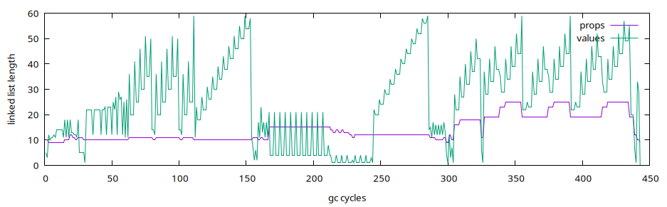

## Award presentation:

Watch the [Our Favorite Universe](https://www.youtube.com/@OurFavoriteUniverse)
YouTube show for this entry:

> [IOCCC28 - 2024/maffiodo - Prize in creative interpretation](https://www.youtube.com/watch?v=JEWxbOD-1UY)


## To build:

``` <!---sh-->
    make all
```

## To use:

``` <!---sh-->
    ./prog < script.js
```


## Try:

``` <!---sh-->
    ./try.sh
```


## Judges' remarks:

This is the latest entry into the IOCCC compendium of programming language tools.

One example is regrettably missing: a quine.
Can you write one in the implemented subset of the language?


## Author's remarks:


### Jav\*script !!


#### What's this?

Jav\*script interpreter with Object, Array, String, Number, Functions and
Garbage Collector. Batteries are not included.


#### Run Forrest, run

If you want to execute some tests run one of these shell commands (these are
also included inside try.sh script):

``` <!---sh-->
    cat test.js string.js | ./prog
    cat test.js array.js | ./prog
    cat test.js math.js | ./prog
    cat test.js utils.js | ./prog
    cat utils.js verify.js | ./prog
```


### Remarks

This interpreter has been tested on

- Ubuntu 24.10 64bit x86
- MacOS Sequoia M3 CPU

Disabled warnings via Makefile:

- **Wno-implicit-int** to reduce the number of tokens, lower than 2503
- **Wno-incompatible-pointer-types** for sprintf and strlen alias function
  pointers
- **Wno-return-type** for functions that does not return a value (99% of times
  are the same functions that uses implicit int as return type but do not use
  any return statement)
- **Wno-deprecated-non-prototype** because on clang some function pointers like
  `strdup(char*)` is aliased as `(*)()` without any explicit parameter. On gcc this
  is not a problem but on MacOS clang this is needed to suppress a warning
- **Wno-deprecated-declarations** (probably not needed) on clang sprintf is
  deprecated because is always better to use snprintf. This warning need to be
  disabled because snprintf requires more tokens
- **Wno-parentheses** for "if (j = 0)" cases where assignment is made inside
  conditional expressions, to reduce the total number of tokens used
- **Wno-unused-variable** because some of the variables are not used but assigned
- **Wno-misleading-indentation** because compiler can sometimes doubt the correct
  indentation; wrong indentation can sometimes be an indicator of possible
  errors, not in this case!
- **Wno-strict-prototypes** for clang, related to implicit-int for functions
  declared without a full prototype

Included files via Makefile (to reduce number of tokens, lower than 5006/2):

- include stdio.h
- include string.h
- include stdlib.h
- include ctype.h


### Features

Supported and unsupported features (everything else that is not listed is
probably unsupported, but who knows...):

- supported binary operators (in execution priority order from lower to higher);
    <pre>, = == != & &= && | |= || > >= >> < <= << - -= + += * \*= / /= % %= [ ( .</pre>
  this is not standard so keep in mind that the standard one can be found
  [here](https://developer.mozilla.org/en-US/docs/Web/JavaScript/Reference/Operators/Operator_precedence)
  and the order of execution in this interpreter is slightly different.
- binary operator x() call functions. Ah, yes, the interpreter support both
  native and interpreted functions; inside this (light) obfuscated version of
  the program, only 1 native function has been included (print), to demonstrate
  this feature; The interpreter support infinite native functions, as global
  functions or (in theory) as Object property.
- operator x[y] can be used to access Object properties dynamically using String
  or Numbers as y index.
- operator x.y works like x[y] but requires that y is an identifier
- supported unary operators: ~ ! - +
- support infinite nested Objects and Arrays
- +String does not convert the given String to a Number
- multiple unary operators cannot be chained without parenthesis
- Object properties lookup is implemented with O(N) complexity, using a linked
  list instead of a dictionary or map
- UNICODE strings are not supported. Use ASCII like if we were in 1963
- Function can be used as anonymous callback inside function calls (for example
  in Array.filter, see **Useful things** chapter)
- literal String can include a limited set of escape codes: \\n \\" \\'
  or escape code with hexadecimal notation \\x00..\\xFF. Please note that only
  ASCII characters are supported so escape codes cannot exceed two hexadecimal
  characters. For example this string:

``` <!---js-->
    "abc\\xffabc"
```

  need to be break into two substrings to prevent "ffabc" to be parsed as a
  as a single character escape code:

``` <!---js-->
    "abc\\xff" + "abc"
```

- postfix and prefix ++ -- are not supported. Use

``` <!---js-->
    x += 1; x -= 1;
```

- only **if else while return** and **break** statement control operations are
  supported. Use **while** instead of **for**
- Number are implemented using **double** as internal data type. To save some
  RAM, is possible to change this to use **float** instead but the code need
  to be changed manually (there is no define or typedef for this data type).
- operators with 3 or more characters length (like === or !== or >>=) are not
  implemented
- support infinite nested *small* statements (without {}) and *'fat'* statements
  (with {})
- String concatenation with + and += is supported. Concatenated string does not
  has a maximum length limit but literal strings are limited to 99 characters
  (you can change this limit inside the code)
- comparison of Object Number and String is implemented similar to the ECMA 1
  specification but not fully implemented. See **Equality** chapter
- does not support full Object or Array literal declaration, only the shortest
  one with {} for Object and [] for Array
- does not support Object Prototype. Object Array Number Function and String
  does not have any default methods. Only "length" property is supported and is
  reserved for internal use
- **var** is supported but **let** is not
- **var** works well only with one variable at a time. If you declare multiple
  variables on the same *var* line (using comma) only the first one will be
  declared correctly in local scope, overriding any existing previous variable
  with the same ID. If multiple variables are declared on the same *var* line,
  the next variables (after the first one) will be linked with existing
  variables that has the same ID.
- **var** is also optional but, when is not used, all undeclared variables will
  be declared automatically in local scope (and collected after current
  statement ends)
- **only** single line comments are supported
- multi line comments are not supported. Use only single line comments
- any unary operator on String value will convert String to Number
- NaN is not implemented so invalid number conversion will generate a 0 Number
- division by zero is not handled
- there is no error handling, so if something goes wrong, interpreter will
  crash. If some of the unsupported language features are used, parser will
  continue to parse what it can understand (wrongly)
- expressions must *always* terminate with a semicolon; otherwise, unexpected
  behavior will definitely happen inside the parser
- **length** property is a reserved property name so cannot be declared in any
  Object
- identifier does not include $ character, only alphanumeric characters and
  the underscore character. Identifier maximum length is 99 character but you
  can increment that by changing one constant in the beginning of the file
- **delete** is not implemented. You can add any property to an Object but you
  cannot remove them! This can be managed by creating new Object or Array
  without the property to be removed
- **true** and **false** does not exists but can be declared as variables, like
  this:

``` <!---js-->
  var true = 1;
  var false = 0;
```

- **length** will return the number of properties inside an Object. This is
  also true for Array (see **Strange(r) Things** chapter)
- **length** on String variables (or literal) return the number of characters
  in the string
- there is no slice or splice in String and Array (but these feature can be
  partially implemented in plain JavaScript -- see **Useful things** chapter)
- there is no Date RegEx or Math (but some of Math methods can be implemented
  in plain JavaScript)
- subscript operation like

``` <!---js-->
    x[1]
```

  return the property 1 of the object x or returns the character at position 1
  if x is a String
- subscript operation like

``` <!---js-->
    x["abc"]
```

  always declare a new property "abc" also when the Object x does not contains
  "abc". Normally in ECMA, if a property does not exists, undefined is returned
  and, if the property is assigned, a new property is created to hold a new
  value. This is not true in this mini nano tiny puppy ugly interpreter
- null and undefined are not implemented but can be declared like this:

``` <!---js-->
    var null = {};
    var undefined = {};
```

  but something different will happen when you perform some comparisons:

    * null == 0 will be equal to 1
    * undefined == 0 will be equal to 1
    * undefined == null will be equal to 0
    * null == {} will be false (correctly)
    * ... some other edge cases, can you spot them?

- there is no `typeof` nor `instanceof`. You need to know the types of your
  variables or track its type inside other data structures.

- `this` is missing. Inside Function you need to remember `this`.

- Function declaration is supported ONLY inside expression and not as a
  standalone declarator, so instead of this:

``` <!---js-->
    function x() {}
```

  write this:

``` <!---js-->
    var x = function () {};
```

  and please look at the final semicolon! It is very important because every
  expression need to terminate with that and without that strange parsing
  things will happen (also probably some segmentation fault).
  Functions need to be unnamed by itself.
  Functions can be used as callback inside other function calls but read the
  following limitation...
- there is no closure mechanism so, if your function work on some variables
  outside of the function scope, be warned, something strange will happen. If
  possible use a *pure functional* approach.
- **function** named parameters are not supported, for example:

``` <!---js-->
    function (a, b, c) { return a+b; }
```

  need to be rewritten as:

``` <!---js-->
    function () { return arguments[0] + arguments[1]; }
```

  using **arguments** array. Another solution is to map arguments to new local
  variables using **var**, for example:

``` <!---js-->
    function () {
      var a = arguments[0];
      var b = arguments[1];
      return a+b;
    }
```

- **arguments** array cannot be used directly for nested function calls, so
  instead of this:

``` <!---js-->
    var foo = function () {
      print(arguments[0] + ' ' + arguments[1]);
    };
```

  you need to write that:

``` <!---js-->
    var foo = function () {
    var string = arguments[0] + ' ' + arguments[1];
    print(string); //<-- here, inside parenthesis, arguments cannot be used and
                   // will cause a missmatch between the current arguments and
                   // the new one allocated for print Function
    };
```

  because internally **arguments** array will be re-declared locally, with a
  stack based approach, for the next function call and can cause some variable
  resolving mismatch. This is a little annoying but is also better to always
  remap each arguments value to a dedicated local variable.
- early exit inside logical expression is not implemented so this code will not
  be interrupted before the execution of the `foo2` function:

``` <!---js-->
    if (0 && foo2(123)) { print("hello\n"); }
```

  and this is clearly not standard (in ECMA, Yes you can)
- accessing properties on literal String or Number is not supported; For
  example this code will not work

``` <!---js-->
    'abc'.x = 1;
```

  and this can cause a crash, like in many other unsupported features
- when statement execution is off (for example inside an else {} statement to be
  NOT executed) the code is partially interpreted to obtain intermediate results
  that will be not used and will be freed by the next GC call. Some memory is
  wasted in the process.
- recursive object structure like this:

``` <!---js-->
    var obj = {};
    obj.x = 32;
    obj["yy"] = 'hello';
    obj.recursive = obj;
```

  is not supported and will cause an infinite loop inside GC. Recursive
  structures need to be handled with some kind of data *sentinel values*.
- maximum size of input source code is 65536 bytes but you can change the buffer
  size inside main function (change 1<<16 constant)

Parsing errors are not handled so "garbage in garbage out" (but garbage is also
collected if no errors are found, ah ah).


#### Equality

Loose equality is implemented similarly as described in
[this docs](https://developer.mozilla.org/en-US/docs/Web/JavaScript/Guide/Equality_comparisons_and_sameness#:~:text=is%20logged%0A%7D-,Loose%20equality%20using%20%3D%3D,-Loose%20equality%20is)
From that doc, the following paragraph is slightly different (point 2 is
missing becouse some of the required features are not present in the
interpreter):

Loose equality is symmetric: A == B always has identical semantics to B == A
for any values of A and B (except for the order of applied conversions). The
behavior for performing loose equality using == is as follows:

1. If the operands have the same type, they are compared as follows:
  * Object: return 1 only if both operands reference the same object.
  * String: return 1 only if both operands have the same characters in the same
    order.
  * Number: return 1 only if both operands have the same value. +0 and -0 are
    treated as the same value. NaN is not supported
3. If one of the operands is an object and the other is a primitive, convert
the object to a primitive.
4. At this step, both operands are converted to primitives (one of String and
Number. The rest of the conversion is done case-by-case.
  * If they are of the same type, compare them using step 1.
  * Number to String: convert the string to a number. Conversion failure
    results in 0 (not NaN), which will NOT guarantee the equality to be false.

This logic has been implemented in this (light) obfuscated code:

``` <!---c-->
    if (_ == y->m) {
        if (_ & 4) U = x != y;
        else if (_ & 1) goto O;
        else goto Q;
    } else if ((_ | y->m) == 2) {
        Q: U = A(Q(x)->f, Q(y)->f);
    } else {
        O: U = V - X;
    }
    // U == 0 mean true loose equality
```

*NOTE: the (light) obfuscated code can be slightly different from the final
one, due to final refinements on the obfuscation process.*


#### Garbage Collection

Garbage Collection is implemented with these two functions (in pseudocode):

``` <!---js-->
    // x=item z=terminal  y=mark_value
    mark(x, z, y, next)
      if x and x != z
        if value(x) not already marked
          mark(value(x), 0, y, 0)
        mark(props(value(x)), 0, y, 1)
        mark(props(x), 0, y, 1)
        mark x = y
        if next
          mark(next(x), z, y, 1)

    // z=terminal, stop when z is reached
    gc(z)
       // all values from head to z are marked to 1
      mark(all, z, 1, 1)
      // all values connected to props are marked to 0
      mark(props, 0, 0, 1)
      foreach x in all
        if x marked and x not retained
          if type(x) == String
            freeString(x)
          free(x)
        else
          mark x = 0
```

It is *clear and quite obvious* that this is a classical **mark & sweep**
process that marks all the local values (from a given heap starting point) and
release all values that are not referenced from any heap variable (recursively,
also for any values referenced from infinite nested objects properties).

Unfortunately, this implementation does not support recursive Object structures
where the properties tree includes the root node itself or any other parent node.
I was not able to include this in the compressed program, without exceed the
tokens limitation.

The following chart show the length of the two global linked lists (for
variables and values) while executing the internal tests in C (see **Internal
tests** chapter):




#### Values and variables

The interpreter uses the same struct to hold values and variables. The same
struct (c) is also used to store a linked list for global variables and a linked
list for all properties contained inside a variable.

Using the same struct has been useful to strip down the code for a lesser number
of tokens.

This is a semi obfuscated struct that holds variables or values (NOTE: obfuscated
symbols can be slightly different from the final obfuscated ones):

``` <!---c-->
    typedef struct c*d;
    struct c{
      union{
        char*e;
        double n;
      } ;
      char *f, //{id} set if var is a property
            g, // used in gc (mark)
            h, // used in gc (retain)
            l; // type (1 = number, 2 = string, 4 = object)
      d d, // when this is a value, is one of the variables that use this value
        x, // when this is an variable this point to the variable value
        b, // next value or variable in the list (linked list)
        m, // object properties head (linked list of props)
        (*q)(); // native function, used then type is 2 and this is a function
      int r; // array length / properties length
    } ;
```

This struct is huge! It uses 72 bytes on 64bit X86 architecture. This struct is
big to fit all the useful data inside it and also something else that is
needed to compress the code. In theory can be much smaller but the final code
will uses more tokens (I have tried multiple times to implement this interpreter
but this is the only solution that I've found to match the 2503 limitation.. with
the previous limit of 2053 was really hard to stay under the limits -- for me!).
Keep in mind also that on 64bit X86 architecture each pointer cost 8 bytes...

The interpreter uses a large amount of RAM, creating many temporary values
objects that are not really necessary but are needed to compress the code.

Global variables linked list is stored inside a global pointer, and all
temporary values are stored inside another pointer. Garbage Collector work to
free a subset of unused values not pointed from current global variables list.


#### Native functions

The only native function included inside the obfuscated program is **print**,
that prints out the first parameter that receive, as a String (by converting it
to a String if is not a String type); its native code is inside the bb function:

``` <!---c-->
    e bb(e u) {
      printf("%s", Q(u->x->q->x));
      return E(0);
    }
```

This native function is declared in global scope using this code, inside main
function:

``` <!---c-->
    c(g, "print");
    e x = G(&q);
    x->m = 2;
    x->x->r = bb;
```

And the same sequence of calls over c() and G() can be iterated to declare
additional native functions inside the global context of the interpreter.

If you want you can declare other native functions. Each native function receive
a parameter of type *e* (pointer to struct c) that is the value of the temporary
**arguments** array. Each native function MUST return a new value using *E()*
function otherwise the interpreter will crash.

I'm sure that will be a little hard to add new native functions writing directly
them in this (light) obfuscated format, but in theory this is not impossible...

For example, this is a new *keys* native function that can returns an array of
all properties contained inside an object, given the target Object as first
parameter (like the Object.keys standard method):

``` <!---c-->
    e be(e u) {
      int y = 0; // index for properties declared in output Array
      e h = u->x->q->x->q, // get first argument only
        x = E(4), // declare a new value with type 4 = Object (Array!)
        l;
      // loop for each properties inside arg
      while (h) {
        c(g, "%d", y++); // format N=y for output Array index property
        l = G(&x->q); // declare a new property N=y inside x
        x->u++; // increment number of properties in x
        l->x->m = 2; // type of new property value is 2 = String
        l->x->f = D(h->g); // duplicate ID of the arg Object property
        h = h->b; // jump on the next property of arg Object
      }
      return x;
    }
```

These (light) obfuscated functions and variables are used in the previous
examples:

``` <!---c-->
    c // sprintf alias
    g // char[] array used for F and G functions
    D // strdup
    E(T) // allocate a new value of type T
    F(props) // find property f[] inside props linked list
    G(&props) // declare property f[] inside props linked list
```

Also, just for fun, the following **exec** native function can be used to
expose **popen** inside the interpreter, to exec any arbitrary shell subprocess
commands:

``` <!---c-->
    e bc(e u) {
      FILE *bd = popen(Q(u->x->q->x)->f, "r");
      e x = E(2);
      x->f = D("");
      while (fgets(g, 99, bd) != 0) {
        char *d = malloc(w(x->f) + w(g) + 1);
        c(d, "%s%s", x->f, g);
        free(x->f);
        x->f = d;
      }
      pclose(bd);
      return x;
    }
```

Unfortunately **keys** and **exec** functions were not included in the obfuscated
*prog.c* program, due to tokens limitations.


### Strange(r) Things

The following things comes from the *Upside Down*...
Strange things can happen or can be found when using this interpreter:

- Array are implemented as Object and **length** property of Array values are
  implemented assuming that Array values have a list of properties that are
  numerical indexes and there are not *holes* inside the list of all indexes.
  For example this array is ok:

``` <!---js-->
    var x = [];
    x[0] = 1;
    x[1] = 'hello';
    x[2] = "From\tUpside\tDown";
```

  and its length is 3. The following one is instead a NOT-OK Array that contains
  *holes* inside its own indexes:

``` <!---js-->
    var y = [];
    y[0] = 'I have';
    y[2] = "one hole";
```

  and its length is computed as 2 instead of 3
- Object has **length** property and the object length is equal to the number
  of properties declared inside the Object (not standard)
- functions are implemented as String, so you can do strange(r) things like this:

``` <!---js-->
  var x = "{ print('x'); }";
  x();
```

  this also mean that you can implement an eval function that can evaluate
  dynamic generated code using this trick:

``` <!---js-->
  var eval = function() {
    arguments[0]();
  }
```

  this technique can also work if you create a dynamic string (like normally is
  done while using eval). Please note that the given string need to include an
  outer statement ({}) otherwise the execution will be interrupted after the
  first expression or short statement. See **utils.js** or **verify.js** for
  some real examples.
- 0.1 + 0.2 does compute 0.3 correctly. Node.js returns 0.30000000000000004
  instead
- **var** can be used multiple times like this:

``` <!---js-->
    var var var var a = 1;
```

  and this will work like var has been typed one time. Can you find out where
  this has been allowed inside the source code? (hint: goto)
- many other unknown strange things can happen in Hawkins, Indiana...


### Useful Things

Console prototype is not implemented but console.log can be implemented using
only native **print** function. The following is an example of Console
implementation (found also inside console.js file):

``` <!---js-->
    var console = {};
    console.log = function () {
      var i = 0;
      while (i < arguments.length) {
        var arg = "" + arguments[i];
        print(arg);
        i += 1;
        if (i == arguments.length) {
          break;
        }
        print(' ');
      }
      print('\n');
    };
```

You can use this with cat when testing the interpreter:

``` <!---sh-->
    cat console.js fibo.js | ./prog
```

Other standard functions can be implement slightly different from the ECMA
standard library original ones  but still something useful can be achieved:

``` <!---js-->
    var String = {};

    // slice(string, from, to)
    String.slice = function () {
      if (arguments.length < 2) {
        return "";
      }
      var s = arguments[0];
      var from = arguments[1];
      var to = -1;
      if (arguments.length > 2) {
        to = arguments[2];
      } else {
        to = s.length;
      }
      var o = "";
      var i = from;
      while (i < to) {
        o += s[i];
        i += 1;
      }
      return o;
    }
```

    see *string.js* for additional String methods implemented using only the few
    features present in this little mini voodoo interpreter.

    If you need both **Console** and **String** utils, use cat:

``` <!---sh-->
    cat console.js string.js YOUR_SCRIPT.js | ./prog
```

    Where YOUR\_SCRIPT.js is some script that you can create, not included in this
    package. If you want to try out some other scripts bundled with this package,
    see **Run Forrest, run** chapter.

    The following list includes a summary of all of my examples for standard JS
    features implemented using this interpreter. These methods are not fully
    implemented and each method work slightly differently from the one that exists
    inside the ECMA standard:

``` <!---js-->
    // string.js
    String.slice(s, start, end);
    String.split(s, singleCharSeparator);
    String.charAt(s, index);
    String.charCodeAt(s, index);
    String.startsWith(s, prefix);
    String.fromCharCode(asciiCode);
    String.trimStart(s);
    String.trimEnd(s);
    String.trim(s);

    // array.js
    Array.at(array, index);
    Array.join(array, separator);
    Array.push(array, item1 ... itemN);
    Array.pop(array); // return { new: NEW_ARRAY, removed: REMOVED_ITEM }
    Array.concat(array1, array2);
    Array.slice(array, start, end);
    Array.toString(array);
    Array.filter(array, callback);

    // math.js
    Math.E;
    Math.e;
    Math.LN2;
    Math.LN10;
    Math.LOG2E;
    Math.LOG10E;
    Math.phi;
    Math.PI;
    Math.pi;
    Math.SQRT1_2;
    Math.SQRT2;
    Math.tau;
    Math.sign(x);
    Math.abs(x);

    // console.js
    console.log(...);

    // utils.js
    eval(string);
```

*NOTE: each file includes some unit tests that can be enabled manually inside
each file by setting a test variable equal to 1 or by prepending the test.js
script before the source file (see **Run Forrest, run** chapter)*

*NOTE(2): take a look at Array.filter! The interpreter support function callbacks*


### Internal tests

The following tests has been made in the original not-obfuscated code development.
Without these tests, the implementation of the interpreter would have been
impossible or at least exhausting.

*NOTE: some tests uses additional native functions like exec and keys that has
been stripped down in the final (light) obfuscated version of the code*


#### Tests functions

``` <!---c-->
    /**
     * Test a single JS Expression evaluation.
     * return value MUST be equal to type
     * return value, if type=1 (Number) MUST be equal to res
     * return value, if type=2 (String) MUST be equal to sres
     */
    void etest_base(char *src, char type, double res, char *sres);

    // same as etest_base but assume that return type MUST be 1 (Number)
    void etest(char *src, double res);
    /**
     * Test a JS Statement
     * return value MUST be equal to type
     * return value, if type=1 (Number) MUST be equal to res
     * return value, if type=2 (String) MUST be equal to sres
     */
    void stest_base(char *src, char type, double res, char *sres);

    // same as stest_base but assume that return type MUST be 1 (Number)
    void stest(char *src, double res);
```


#### Verify single Expressions correctness

``` <!---c-->
    spf(id, "x"); decl(&props); // declare x variable
    etest_base(";", 0, 0, 0);
    etest_base("; 2; 3", 0, 0, 0);
    etest("2*(2+3)-1", 9);
    etest_base("'' + 32", 2, 0, "32");
    etest_base("\"\" + 32", 2, 0, "32");
    etest("x + 32", 32);
    etest("x = 3", 3);
    etest("x", 3);
    etest("var y = 11", 11);
    etest("var y = 11, z = 22", 22);
    etest_base("var foo = function () { 2; }", 2, 0, "{ 2; }");
    etest_base("' 1 2 \\n 23 \\' '", 2, 0, " 1 2 \n 23 \' ");
    etest(" 'hello' == 'hello'; ", 1);
    etest(" 'hello' == 'hello2'; ", 0);
    etest(" 'hello' != 'hello2'; ", 1);
    etest(" '32' == 32; ", 1);
    etest(" '32' == 33; ", 0);
    etest(" '32' <= 33; ", 1);
    etest(" '32' <= 2; ", 0);
    etest(" '2' >= 32; ", 0);
    etest(" '32' >= 2; ", 1);
    etest(" 32 == 32; ", 1);
    etest(" 32 >= 0; ", 1);
    etest(" 0 <= 32; ", 1);
    etest(" 1+4 && 3-3; ", 0);
    etest(" 1+4 || 3-3; ", 1);
    etest(" 1<<3; ", 8);
    etest(" 8>>3; ", 1);
    etest(" -6; ", -6);
    etest(" +'6'; ", 6);
    etest(" ~'6'; ", -7);
    etest(" !'6'; ", 0);
    etest(" !'0'; ", 1);
    etest(" !(1 && 2); ", 0);
    etest(" 0.1 + 0.2 == 0.3; ", 1); // OMG
    etest(" 'hello'.length; ", 5);
    etest(" [].length; ", 0);
    etest(" {}.length; ", 0); // Stranger Things in Hawkins, Indiana
    etest_base("obj = {}", 4, 0, 0);
    etest("obj.abc = 32", 32);
    etest("obj[0] = 2; ",  2);
    etest("obj[0]; ", 2);
    etest_base("obj[1] = {}; ", 4, 0, 0);
    etest("obj[1].temp = 123; ", 123);
    etest("obj[1].temp; ", 123);
    etest_base("print(1); ", 0, 0, 0);
    etest_base("print(3*9); ", 0, 0, 0);
    etest_base("print('22'); ", 0, 0, 0);
    etest_base("'abc'[0];", 2, 0, "a");
    etest_base("'1+2'();", 1, 3, 0);
    etest("0 || 'hello'", 0);
    etest("0 || '1hello'", 1);
    etest_base("print(123);", 0, 0, 0);
```


#### Verify Statement correctness

``` <!---c-->
    stest("; 2; 3", 3);
    stest("{ { 1; }; }; 2; {{3;}}", 3);
    stest("{ { return 1; } } 2; 3", 1);
    stest_base("var strt = '' + 32", 2, 0, "32");
    stest_base("var strt = \"\" + 32", 2, 0, "32");
    stest("var foo = function () { var w = 2 * 3; }; foo(1, 2, 3)", 6);
    stest("var foo = function () {                  \
        arguments[1] * arguments[2] * arguments[0]; \
      }; foo(10, 2, 3)", 60);
    stest("var x = 2 + 3, y;  \
       if (x == 5) {          \
         7;                   \
       } else {               \
         2;                   \
       }", 7);
    stest("var x = 2 + 3, y; \
       if (x == 3) {         \
         7;                  \
       } else {              \
         2;                  \
       }", 2);
    stest("var x = 2 + 3, y; \
       if (x == 5)           \
         7;                  \
       else                  \
         2;                  \
       ", 7);
    stest("var x = 2 + 3, y; \
       if (x == 3)           \
         7;                  \
       else                  \
         2;                  \
       ", 2);
    stest("var x = 2 + 3, y; \
       if (x == 5)           \
         y = 7;              \
       else                  \
         y = 3;              \
       y;", 7);
    stest("var x = 2 + 3, y; \
       if (x == 3)           \
         y = 7;              \
       else                  \
         y = 3;              \
       y;", 3);
    stest("var cnt = 0;                           \
      while (cnt < 10) { cnt = cnt + 1; break; }  \
      cnt", 1);
    stest("var cnt = 0;                                     \
      while (cnt < 10) { if (1) { break; } cnt = cnt + 1; } \
      cnt", 0);
    stest("var cnt = 0, x = 0;      \
      while (x < 4) {               \
        var y = 0;                  \
        while (y < 4) {             \
          if ((y == 2) && (x == 2)) \
            break;                  \
          cnt = cnt + 1;            \
          y += 1;                   \
        }                           \
        if ((y == 2) && (x == 2))   \
          break;                    \
        x += 1;                     \
      }\
      cnt", 10);
    stest("var cnt = 0; while (cnt < 10) { cnt = cnt + 1; } cnt", 10);
    stest("var o2 = {}, l2 = 1; o2.l2 = 33; o2.l2", 33);
    stest("var o2 = {}, l2 = 1; o2.l2 = 31; l2", 1);
    stest("var w2 = 1; w2 += 3", 4);
    stest("var true = 1, false = 0; 1 == true && !1 == false", 1);
    stest("var s = 1; ~s; s", 1);
    stest_base("var s = '1'; ~s; s", 2, 0, "1");
    stest("                             \n\
      var number = 10,                  \n\
          n1 = 0,                       \n\
          n2 = 1,                       \n\
          i = 0,                        \n\
          nextTerm;                     \n\
      var console = {};                 \n\
      console.log = print;              \n\
      console.log('fibonacci series:'); \n\
      while (i <= number) {             \n\
          console.log(n1);              \n\
          nextTerm = n1 + n2;           \n\
          n1 = n2;                      \n\
          n2 = nextTerm;                \n\
          i += 1;                       \n\
      }                                 \n\
      n1;                               \n\
      ", 89);
    stest("                                 \n\
      var x = 32, y = 10;                   \n\
      var console = {};                     \n\
      console.log = function () {           \n\
        var i = 0;                          \n\
        while (i < arguments.length) {      \n\
          var arg = \"\" + arguments[i];    \n\
          print(arg);                       \n\
          i += 1;                           \n\
          if (i == arguments.length) {      \n\
            break;                          \n\
          }                                 \n\
          print(' ');                       \n\
        }                                   \n\
        print('\\n');                       \n\
      };                                    \n\
      console.log('test 123', {}, x+y, []); \n\
      0;                                    \n\
      ", 0);
    stest("               \n\
      var x = {};         \n\
      x.a = 32;           \n\
      x.b = 1;            \n\
      x.prova = \"abc\";  \n\
      var y = keys(x);    \n\
      var z = y.length;   \n\
      while (z) {         \n\
        z -= 1;           \n\
        print(y[z]);      \n\
      }                   \n\
      0;", 0);
    stest("var null = {}; var nullx = null; null == nullx;", 1);
    stest("var null = {}; null == {};", 0);
    stest("var null = {}; null == 0;", 1);
    stest("var undefined = {}; undefined == 0;", 1);
    stest("var undefined = {}, null = {}; undefined == null;", 0);
    stest_base("exec('echo -n 123');", 2, 0, "123");
    stest("               \n\
        var recobj = {};  \n\
        {                 \n\
          var o1 = {};    \n\
          var o2 = {};    \n\
          recobj.x = o1;  \n\
          recobj.y = o2;  \n\
          o1.x = 3;       \n\
          o2.o1 = o1;     \n\
          o1 = 0;         \n\
          o2 = 0;         \n\
        }                 \n\
        recobj.y.o1.x;", 3);
    stest_base("                                \n\
        var String = {};                        \n\
        // slice(string, from, to)              \n\
        String.slice = function () {            \n\
          if (arguments.length < 2) {           \n\
            return '';                          \n\
          }                                     \n\
          var s = arguments[0];                 \n\
          var from = arguments[1];              \n\
          var to;                               \n\
          if (arguments.length > 2) {           \n\
            to = arguments[2];                  \n\
          } else {                              \n\
            to = s.length;                      \n\
          }                                     \n\
          var o = '';                           \n\
          var i = from;                         \n\
          while (i < to) {                      \n\
            o += s[i];                          \n\
            i += 1;                             \n\
          }                                     \n\
          return o;                             \n\
        };                                      \n\
        var test = 'hello world!';              \n\
        //print(String.slice(test, 1) + '\\n'); \n\
        print(String.slice(test, 1, 5) + '\\n');\n\
        String.slice(test, 1, 5);", 2, 0, "ello");
    stest_base("                                      \n\
        // split(string, singleCharSeparator)         \n\
        var String = {};                              \n\
        String.split = function () {                  \n\
          var o = [];                                 \n\
          var s = arguments[0];                       \n\
          var delimiter = arguments[1];               \n\
          var start = 0;                              \n\
          var i = 0;                                  \n\
          var oindex = 0;                             \n\
          while (i < s.length) {                      \n\
            if (s[i] == delimiter) {                  \n\
              o[oindex] = String.slice(s, start, i);  \n\
              start = i + 1;                          \n\
              oindex += 1;                            \n\
            }                                         \n\
            i += 1;                                   \n\
          }                                           \n\
          if (start < s.length) {                     \n\
            o[oindex] = String.slice(s, start);       \n\
          }                                           \n\
          return o;                                   \n\
        };                                            \n\
        // slice(string, from, to)                    \n\
        String.slice = function () {                  \n\
          if (arguments.length < 2) {                 \n\
            return '';                                \n\
          }                                           \n\
          var s = arguments[0];                       \n\
          var from = arguments[1];                    \n\
          var to;                                     \n\
          if (arguments.length > 2) {                 \n\
            to = arguments[2];                        \n\
          } else {                                    \n\
            to = s.length;                            \n\
          }                                           \n\
          var o = '';                                 \n\
          var i = from;                               \n\
          while (i < to) {                            \n\
            o += s[i];                                \n\
            i += 1;                                   \n\
          }                                           \n\
          return o;                                   \n\
        };                                            \n\
        var test2 = 'abc,  d, e f';                   \n\
        var splitted = String.split(test2, ',');      \n\
        print(splitted.length + '\n');                \n\
        print(splitted[0] + '\n');                    \n\
        print(splitted[1] + '\n');                    \n\
        print(splitted[2] + '\n');                    \n\
        splitted[0];", 2, 0, "abc");
    stest("                                                              \n\
        var _cm = {}; // map from character to ASCII code                \n\
        _cm['\\x0'] = 0;       _cm['\\x1'] = 1;       _cm['\\x2'] = 2;   \n\
        _cm['\\x3'] = 3;       _cm['\\x4'] = 4;       _cm['\\x5'] = 5;   \n\
        _cm['\\x6'] = 6;       _cm['\\x7'] = 7;       _cm['\\x8'] = 8;   \n\
        _cm['\\x9'] = 9;       _cm['\\xa'] = 10;      _cm['\\xb'] = 11;  \n\
        _cm['\\xc'] = 12;      _cm['\\xd'] = 13;      _cm['\\xe'] = 14;  \n\
        _cm['\\xf'] = 15;      _cm['\\x10'] = 16;     _cm['\\x11'] = 17; \n\
        _cm['\\x12'] = 18;     _cm['\\x13'] = 19;     _cm['\\x14'] = 20; \n\
        _cm['\\x15'] = 21;     _cm['\\x16'] = 22;     _cm['\\x17'] = 23; \n\
        _cm['\\x18'] = 24;     _cm['\\x19'] = 25;     _cm['\\x1a'] = 26; \n\
        _cm.length", 27);
    stest_base("                                                  \n\
        var stest = function () { return arguments[0] + '_1'; };  \n\
        var s = 'abc';                                            \n\
        s = stest(s);                                             \n\
        s = stest(s);                                             \n\
        s;", 2, 0, "abc_1_1");
    stest("                       \
        var test = function () {  \
          var x = arguments[0];   \
          if (x < 0)              \
            return 2;             \
          return 3;               \
        };                        \
        var t1 = test(-32);       \
        t1;", 2);
    stest_base("                      \n\
        var stest = function () {     \n\
          var o = arguments[0] + '_'; \n\
          var i = 0;                  \n\
          while (i < 2) {             \n\
            o += i;                   \n\
            i += 1;                   \n\
          }                           \n\
          return o;                   \n\
        };                            \n\
        var s = 'abc';                \n\
        s = stest(s);                 \n\
        s = stest(s);                 \n\
        s;", 2, 0, "abc_01_01");
    stest_base("                  \
        var test = function () {  \
          var x = arguments[0];   \
          var o = 'x';            \
          if (x > 0) {            \
            o += 2;               \
          } else {                \
            o += 3;               \
          }                       \
          return o;               \
        };                        \
        var t1 = test(-32);       \
        t1;", 2, 0, "x3");
    stest("             \
        var atmp = [];  \
        atmp[0] = 10;   \
        atmp[1] = 20;   \
        atmp[0 + 1];", 20);
```

Some of these tests has also been ported in plain JavaScript; take a look inside
the **verify.js** script. These tests uses **eval()** function to execute a test
source code string and verify its execution results. These other tests can be
executed with this command:

``` <!---sh-->
    cat utils.js verify.js | ./prog
```


### F.A.Q

These are frequently asked questions that can be asked when trying to use this
little mambo jumbo interpreter:

- why? because why not
- if program crash, check if you are calling some function that is not declared
  or has been misspelled. There are no safety check about this
- if program loop indefinitely, check if your function assignments includes a
  final ; after }. This is required
- what is the meaning of life and everything? 42 or sometimes 2503
- if program do not do what you want, check the supported features because the
  parser can easily misunderstand what you are giving as input text; for example
  you can type **let** instead of **var** and, without any errors raised,
  everything will go terribly wrong
- can this interpreter be used on real production environment? of course not
- what is the memory limit of this interpreter? there is no limits
- what happen if an object contains a reference to itself (object with a
  recursive structure)? An infinite loop is triggered because the Garbage
  Collector cannot recognize this kind of structure


### Final Thoughts

I've tried multiple time to rewrite this interpreter and compress the final
obfuscated source code to match the previous IOCCC limit but without success.

The increased limitation of tokens from 2053 to 2503 has made possible to use
this iteration of the interpreter without continue to retry to rewrite that to
compress the final source code. Probably with more iterations the 2053 limit
should be reached, who knows.

The most tricky part in the development process has been to find out a minimal
bare bones subset of JavaScript features, small enough to allow to build some
other standard features on top of the bare bones interpreter.

In many tests I've tried to include the Object.keys features (to obtain the
list of property keys inside a given Object) but, in all of my attempts, the
limitation on tokens count was exceeded. With Object.keys would have been
possible to build up also Object.values and other Object methods. Also the lack
of prefix/postfix ++ and -- it's a pity... Damn it!
May be without the Garbage Collector some other features should be packed into
the program but it's too late to change that.

Have fun!


<!--

    Copyright © 1984-2025 by Landon Curt Noll and Leonid A. Broukhis.  All Rights Reserved.

    You are free to share and adapt this file under the terms of this license:

        Creative Commons Attribution-ShareAlike 4.0 International (CC BY-SA 4.0)

    For more information, see:

        https://creativecommons.org/licenses/by-sa/4.0/

-->
