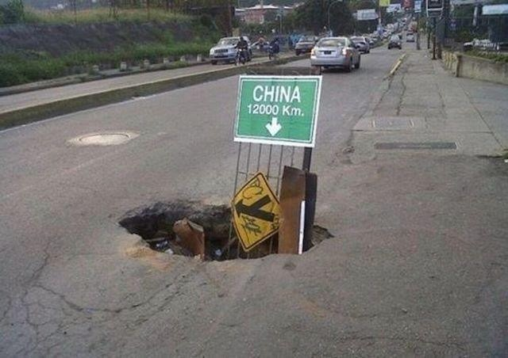
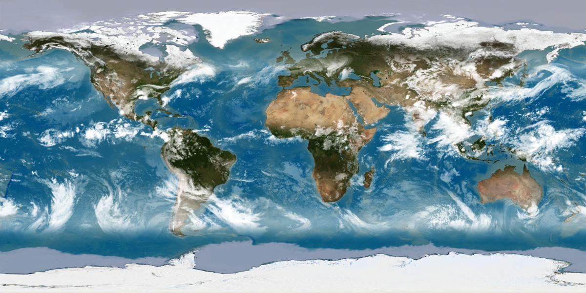
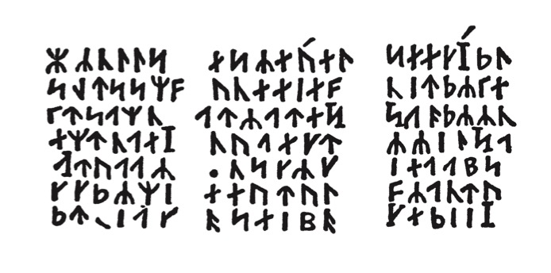
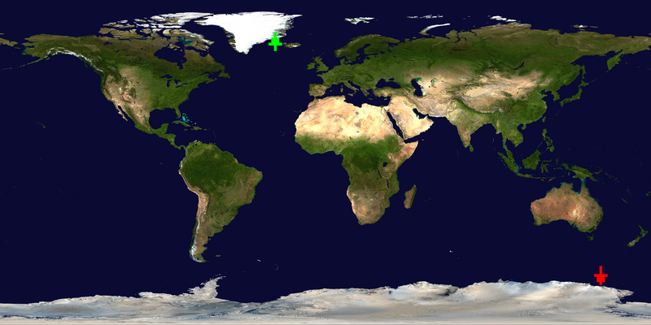
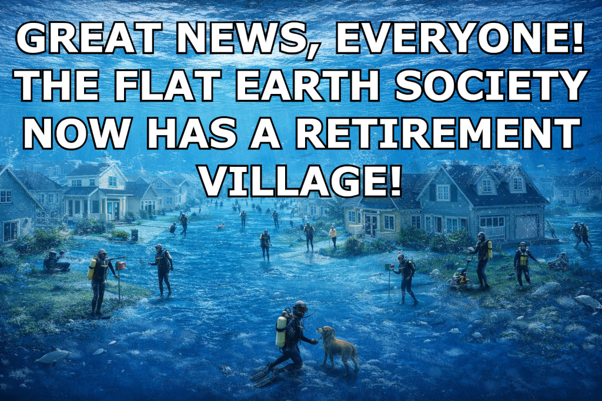
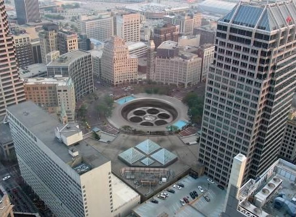
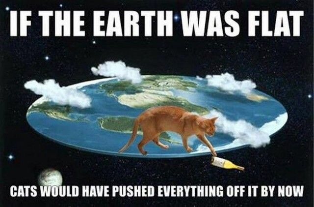
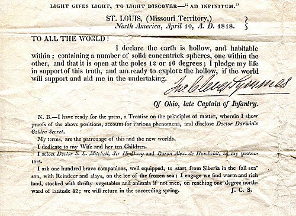

## Award presentation:

Watch the [Our Favorite Universe](https://www.youtube.com/@OurFavoriteUniverse)
YouTube show for this entry:

> [IOCCC29 - 2025/ferguson - Opposite award](https://www.youtube.com/watch?v=wFdUnUqF0s0)


## To build:

``` <!---sh-->
    make all
```

### Bugs and (Mis)features:

The current status of this entry is:

> **STATUS: INABIAF - please DO NOT fix**

For more detailed information see [2025/ferguson in bugs.html](../../bugs.html#2025_ferguson).


## To use:

``` <!---sh-->
    ./prog lat lon [in.ppm out.ppm]
```


## Try:

``` <!---sh-->
    ./try.sh
```


## Alternate code:


### Alternate build:

``` <!---sh-->
    make alt
```


### Alternate use:

``` <!---sh-->
    ./try.alt.sh
```


## Judges' remarks:

Digging the proverbial hole through the Earth can land up in some
different places.  In this projection of a globe of Earth (because Flat
Earth is an archaic and scientifically disproved concept) onto the screen,
it can start in one place and find its antipode.

We think you will have fun to see what is on the other side.


### A fun challenge

Please checkout the [fun challenge&lpar;s&rpar;](../challenge.html#ferguson) for this winning entry.


## Author's remarks:


### Antipodal map plotter (on PPM [equirectangular](https://en.wikipedia.org/wiki/Equirectangular_projection) images)


<div id="remarks">
### Antipodal plotter remarks
</div>

This is a FUN one!

I'm sure many people have heard the claim that if you dig straight down you'll
eventually end up in China or some other place. This has a basis in reality but
it's not that simple. Each place on Earth has what is known as an antipodal
coordinate (I'll explain this soon).

Here is a fun image which demonstrates this. I'm pretty sure I saw this before
the advent of LLM images. I should guess it is a photo but someone just put the
sign there to be funny and clever. Here:



Actually the statement that you'll eventually end up in China is only true in
South America (but see next point) and in particular Argentina: but not just
Argentina because China is approximately 3.5 larger than Argentina so there will
be antipodal points outside of Argentina that go into China; however it is the
usual example for the antipode of China and that's what I use in my included
maps and [try.sh](try.sh).

In no case, however, will you end up north of the equator if you dig (okay
obviously you wouldn't get that far but you know what I mean!) through the Earth
north of the equator and in no case will you end up in the eastern hemisphere if
you dig from the western hemisphere because the fact is the hemisphere is
flipped and so is the pole.

Below I talk about the type of map I have provided and calculations but how well
I can do that I guess we'll have to wait and see.

Anyway: yes this is a real thing. Most antipodal points end up in an ocean
(though many of those have their antipode on land). I've heard the Earth is
mostly water and most of that an ocean and I guess that's why (Landon will
inform me if I'm wrong :-), as [he's an astronomer](http://www.isthe.com/chongo/tech/astro/index.html),
and if this is true it causes a lot of problems for Flat Earth: just like magma chambers, lava
tubes [aka pyroducts and lava tunnels], volcanoes, sinkholes and many other
natural formations on and in (ah, maybe it is Hollow Earth! :-) ) our beautiful
Tetrahedral :-) Earth do.

On the other hand since we live on Flat Earth I'm not even sure how we're
not all submerged. I'll get back to that later in a more fun section.

If you look at this file and couldn't already tell, there are a lot of jokes
(and some images, one of which I had fun making) in here and there are some in
the code too, particularly to do (in code) with Hollow and Flat Earth (and the
code is in a triangular shape because our Earth is also triangular, though the
comment in the code explains the map is of our Flat Rectangular Earth). The
reason for all this is because antipodes are fun so why not have fun in other
ways too?

I should guess that some of the shapes I have joked about I made up although I
wouldn't put it past others to have done so and I could imagine I could convince
people of their 'truth' (maybe I ought to start some new societies for them just
for laughs :-) ).


### Antipodal points

So what **really** are antipodal points? Well antipodal points [of a sphere]
are diametrically opposite each other. That is why the example I already gave
but another example is that if someone were to dig a hole anywhere in Iowa and
continued through they would eventually reach a point in the Indian Ocean (see
above). And in China it's a number of places but the usual example is Argentina
as you probably guessed (else open [china.ppm](china.ppm) which shows it on the
map from my program in fact).

I have included the **famous** and **gorgeous** Blue Marble Next Generation NASA
map as a PPM image as an image to draw on, though it's advisable to use a
different output filename so you can compare; as you'll see later I do allow you
to write on the source image: unlike many other tools with input and output
files being the same silently truncating the file.

In any case the program reads in the RAW data (WITHOUT a library!) into an
`unsigned char *`, modifies it and then writes it to a newly opened file (PLEASE
run this from the directory and don't specify a file that already exists! It was
too costly to check if the file already existed and to then report yet another
error).

No I do NOT use the `"b"` modifier. This is only for compatibility with ISO/IEC
9899:1990 ('ISO C90') and is ignored on POSIX systems (including macOS and
Linux). I do not support Windows and the contest is SUS/POSIX biased. I'm not
wasting a byte for Windows.

Note this map, seen below, is an **equirectangular** map and this is
**required** (in particular the width must be precisely `2*height`). It's
required because the NASA Blue Marble Next Generation map is and it uses
equirectangular projection maths, this program.

I do not support comments which I will get to later. However I do check for them
and exit with an error, assuming they're actually in the header (nothing I can
do otherwise).



If the image is NOT an equirectangular image then you will get an error message
(perhaps _Flat Earth_" although I originally had _"Pluto found"_ in a solemn
eulogy to [Pluto](https://en.wikipedia.org/wiki/Pluto) and maybe a<del>n
inverted</del> peace sign to the [IAU](https://www.iau.org); this changed
because it was slightly less obvious and it was less consistent with other
jokes). Interestingly if I checked for a specific width, say < 360, it caused an
`fread()` error (in some conditions, even what should have worked)!

If the header had a wraparound (unsigned) size then maybe it would be a problem
but as it also checks for data read in theory it should be fine. I think it does
fairly well with bogus headers anyway.

Now what this program does is it draws the original point in a red down arrow
and the antipodal point in a green up arrow based on the source coordinates.

Now you might ask why red down and green up? Well because if you were truly to
go through the Earth you would die. So it's a kind of joke - as in don't do this
but instead go up (even though you could not without being under ground, and
probably in a magma chamber or drown in the ocean or some other tragedy).

In other words except where green means stop and red means go it's the reverse
of go and stop, kind of like traffic in most places.

But of course you'd die because of [magma](https://en.wikipedia.org/wiki/Magma), [magma
chambers](https://en.wikipedia.org/wiki/Magma_chamber),
lack of [oxygen](https://en.wikipedia.org/wiki/Oxygen),
various [gases](https://en.wikipedia.org/wiki/Hydrogen_sulfide) (etc.), [extreme
heat](https://en.wikipedia.org/wiki/Heat) and worse than that, seriously
dangerous [advanced creatures](https://en.wikipedia.org/wiki/Agartha) that might kill you (see
below for more commentary here as well!) and even worse, [ichthyosaurs and
plesiosaurs](https://en.wikipedia.org/wiki/Journey_to_the_Center_of_the_Earth)
along with [countless other hazards](https://en.wikipedia.org/wiki/Ignorance).
And even if you didn't you'd probably die of
[DHMO](https://www.dhmo.org/facts.html) (let's face it: you've almost certainly
been exposed to it and everyone who is exposed to it eventually dies, so much so
that a [New Zealand MP tried to ban
it](https://www.nzherald.co.nz/nz/mp-tries-to-ban-water/XM4GJ7XG3WC4ANBIFP2IVFNANE/).
If you've done any chemistry you probably are already laughing (and probably
know of it already).

Anyway the point is you'd die. That's why this program exists! To show you where
you'd end up, on the beautiful Blue Marble Next Generation Map, or at least
where your body would if it floated up to the top of our Hollow Earth.

So don't do this even if you think you can go deeper than scientists who tried
to see how far they can go (I believe the value is over 12 kilometres but under
13, [which is probably a good
thing](https://en.wikipedia.org/wiki/Triskaidekaphobia) :-) )

Again this map MUST be equirectangular (and I do check this in code)! The Blue
Marble map is exactly that and it's one of the most beautiful maps I have ever
seen of our gorgeous Flat Earth.

YES the map is flat because it's a map of our [Flat Earth](https://en.wikipedia.org/wiki/Flat_Earth)!
NASA even admits it's flat (okay so they admit the map is flat). But this seems
rather odd because we also know we live <del>in</del> on [Hollow Earth](
(https://en.wikipedia.org/wiki/Hollow_Earth). We **know** this is true because
the ever so admiral (it's a myth that Admiral Byrd claimed the Earth is hollow,
btw) and totally credible [Edmond
Halley](https://en.wikipedia.org/wiki/Edmond_Halley) told us so (!), although
how this is possible when the Earth is absolutely flat beats me.

On the other hand, at least he seemed to have been right about Halley's Comet,
so maybe he _is_ credible and the Earth IS hollow! Now I want to know how the
Flat Earthers can possibly reconcile this.

And sorry but no, the Earth is NOT [square and
stationary](https://en.wikipedia.org/wiki/Flat_Earth#/media/File:Orlando-Ferguson-flat-earth-map_edit.jpg)!
It is absolutely Flat and Rectangular and it orbits the Moon. The Sun orbits the
Earth between the Earth and the Moon and the Moon orbits Mars.

Hopefully you get the point[^1]. The image must be flat and equirectangular (and
I check this), just like <del>Earth</del> many maps are. Well okay I don't check
for 'flat' maps; if you try feeding this an image from
[ppmrelief](https://netpbm.sourceforge.net/doc/ppmrelief.html) I would guess
there would be a problem but I don't know as I don't have such a map to test. I
guess the header is different which would mean the program would report an
error.

Anyway I provide the usual map and that's the map the program was primarily
designed for.

But I check for a very specific header anyway so it might be fine - or not. I
don't know the format of the 'ppmrelief' (in other words it would likely just
report an error, unless the format is the same, but if it is the same I guess
the results would be bad, but said maps are probably also way bigger so I
couldn't include it even if I wanted to).

Anyway I check for equirectangular projection in a very simplistic way so unless
the header is lying or there is a read error it should be detected (and if there
is a read error it's obviously not going to proceed).

Anyway there are two syntaxes of the program:

``` <!---sh-->
    ./prog lat lon in.ppm out.ppm

    ./prog lat lon
```

See [the alt code explanation](#alt) as well: a fun one.

What this means is it can be used as simply a converter/translator of
coordinates to antipodal coordinates or also translate it and show arrows on the
map (later I show a tool I wrote to convert the so-called DMS format into
the more sane format I use and which you probably use too).

Now speaking of maps...


### Maps

I have included several maps, some based on [earth.ppm](earth.ppm) which is the
equirectangular map that I designed the program for but if you have another
**equirectangular** PPM image, map or otherwise (for instance the [flat map of
our Flat Earth](flat-earth.ppm) - see below), it should in theory work when
using my program (but 'work' might mean something else on an image that is not a
map and if it has text it could overwrite it with an arrow and so on).

There is a second Blue Marble Next Generation map, listed below.

As for that 'Flat Earth' map: it has continents submerged under water. I play
with this in [try.sh](%%REPO_URL%%/2025/ferguson/try.sh)! Expect odd results because the continents are not
where they belong, just like any map of 'Flat Earth'. After all, our Earth is
Hollow (even if that were so and there was the supposed Agartha it would no
longer be hollow now would it? Not strictly hollow anyway).

I tried to find a scientific equirectangular map of Pangaea but I did not have
any luck so I do not include one sadly. I doubt I could find any other
supercontinent such as Gondwana and Laurasia so I did not even bother. Besides
it wouldn't fit; I'm almost at the limit because PPM images are big. If the
judges have one I think it'd be brilliant to include <del>if</del> when :-) this
wins.

I also tried with Pluto to give my respect to it and perhaps a two fingered
salute to the IAU for their daftness but I failed there too: though I did not
look very hard. Even so the size limit would be a problem as well.

The maps with antipodal / original arrows are from [earth.ppm](earth.ppm) or
rather they are drawn on it and saved in the respective file (there are other
sources too; the [try.sh](%%REPO_URL%%/2025/ferguson/try.sh) does in fact use the one without clouds at
least once and the one with multiple antipodes was based on the earlier non-Next
Generation map that I no longer include as it's not as impressive obviously).

However some of them are from the one without clouds because I did it before I
found and used the cloudy one (see below for list).

Anyway the other maps, some of which are used in the [try.sh](%%REPO_URL%%/2025/ferguson/try.sh) script
(comments below as well) and one of which is a fun one of all the seven main
continents:

- [Blue Marble Next Generation map with clouds](earth.ppm) - the updated famous
Blue Marble map **with clouds**. At the time of writing this program I used the
original Blue Marble map that I believe was taken in 1972 (again I hope Landon
will correct me if I'm wrong) but when I found out about the Next Generation I
knew I just **had** to use it and as clouds are usually present and are thus
more natural I used the one with clouds. The one without clouds is the next map
listed. The [try.sh](%%REPO_URL%%/2025/ferguson/try.sh) uses this image (it also uses the next one) but
images like [continents.png](continents.png) (which was converted to PNG to save
bytes as PPM files are large) use another Blue Marble map, probably the original
one from 1972. Finding coordinates was difficult as different sources gave
different coordinates; some were easy to verify (or close enough) but not all.
Yes this means that [try.sh](try.sh) images had to be modified.
    * [Credit from NASA is requested](https://svs.gsfc.nasa.gov/3615/) (and with
    **much gratitude** on my behalf): NASA/Goddard Space Flight Center
    Scientific Visualization Studio The Blue Marble Next Generation data is
    courtesy of Reto Stockli (NASA/GSFC) and NASA's Earth Observatory. If (or
    when :-) ) this wins I'd be happy to recreate the images that use this
    version that used the no clouds version as I would not have to worry about
    file size then.
- [Blue Marble Next Generation without clouds](noclouds.ppm) this is the Blue
Marble Next Generation without clouds which can also be found at
<https://svs.gsfc.nasa.gov/3615/> with the same credit request which I respect
and appreciate just as much and with just as much gratitude: NASA/Goddard Space
Flight Center Scientific Visualization Studio The Blue Marble Next Generation
data is courtesy of Reto Stockli (NASA/GSFC) and NASA's Earth Observatory.
- [Flat Earth - Earth submerged under water](flat-earth.ppm) - let's be honest:
if the Earth was truly flat it would be totally submerged and we'd all drown.
That's how we KNOW it's really hollow!!! Actually it's neither but try telling
that to the conspiracy theorists :-) I use this in [try.sh](%%REPO_URL%%/2025/ferguson/try.sh) for more
fun. Notice how the continents have shifted? Well that's because the Earth is so
deeply submerged that they were shifted towards the southern hemisphere (at
least on the image) and in fact also the continents are not as large. This shows
how even if they believed in our continents (and I don't think they do?) their
view is so distorted that even the map is wrong (which of course their map is)
but in an ironic way; the topology is totally messed up. The more detached from
reality the more it is messed up. So yes the coordinates will seem wrong. I
include in [try.sh](%%REPO_URL%%/2025/ferguson/try.sh) Iowa but you'll see it's significantly off (I also
do Iowa in [earth.ppm](earth.ppm) in the try.sh script too). But honestly do you
expect an accurate map here? This is for fun only (I had to remove some images
for this and instead link to where I found them as I ran into the size
restriction, but those external images probably are better there anyway).
- [Argentina to China](china.ppm) - Argentina to China antipodal map of
[earth.ppm](earth.ppm).
- [China to Argentina](argentina.ppm) - China to Argentina antipodal map of
[earth.ppm](earth.ppm).
- [Antipodes of the seven main continents](continents.png) - all the main
continents' antipode with up and down arrow the same colour (of each continent
<-> antipode) so you can distinguish (hopefully, depending on how you see
colours). Apologies but I can't think of what to do
in case someone cannot see all the colours well enough, as there necessarily are
more than one up and down arrow.
- [Snæfellsjökull, Iceland](snaefellsjokull.png) - the famous Snæfellsjökull from a
famous book by Jules Verne. Well the antipodal points to it from the earlier map
I used. I'll explain later but it might be better without clouds anyway as they
go below the ground so there won't be any clouds above them anyway :-) (though
there was a lot in the Earth there).

Two others I wanted to include were the Line Islands and Baker Island but to
save bytes so I could include the second Earth map (and the other fun ones) I
have those in the [try.sh](%%REPO_URL%%/2025/ferguson/try.sh) script. I note in the script a fun fact about
each.

A comment on the Line Islands and Baker Island, in case one wonders given the
fun facts: even though they're many kilometres apart they are relatively close
on the map (especially an equirectangular map but maybe any map that's not a
globe?).

If the coordinates are off that's not because of an error in my program but
because I found a number of different coordinates, especially for Line Islands
but others as well, although there WERE errors (especially if someone used out
of range coordinates) but I think I got them all (lots of testing show it's
fine, although as I give examples elsewhere, due to scaling and coordinates that
are very close to each other, it might look like they're on the same spot even
if they're not: in that other location I show you how I confirmed it was fine -
but hopefully this is the only 'issue', which of course that is not actually an
issue).

There was another error before as well but I think I have corrected it.

I was forgetting. There are some other images too but these are not maps and
will be brought up later for fun.

One other thing on the Blue Marble Next Generation map (any of them included and
the images that use them): it (they) does (do) not have all islands so when you
see the images sourced from islands that is why it might seem like it's going
straight into or out of the ocean.

Another map with islands (I guess this map I include is not showing all islands
because our Flat Earth's water drowned them like Eru Ilúvatar did to Númenor, or
more likely because they're too small to see in the image) could be used for
that IFF it's equirectangular. I don't have any reason to believe but I suspect
that such a map with islands would be even bigger (in file size). In any case I
did not find one and certainly not nearly as beautiful as NASA's map.

Nonetheless the calculations should be correct and given those I can verify (not
a cartographer but I have sufficient enough geography knowledge here - and it's
not like I can't look it up anyway - to verify, though the necessary
approximation should be kept in mind, as should blindness on my part)[^2]. Of
course even if I have sufficient enough geography knowledge that does not mean I
tried every last coordinate. I was too busy tormenting you with my remarks!

And on that latter note, related, remember that because of our Flat Earth,
sometimes it might appear to be in the wrong place but the calculations should
be correct anyway in the equirectangular map! [^1][^3] On the other hand, since
the Earth is also hollow I'm not sure how it can possibly be flat, I just know
that it absolutely is![^4].

One other thing that comes to mind. Finding precise coordinates is not always
easy because different sources say different numbers and I am not Landon :-)

If this wins he's welcome to correct any coordinates that are wrong in maps or
the [try.sh](%%REPO_URL%%/2025/ferguson/try.sh) script or in documentation, with much gratitude from this
author!


<div id="alt">
### Alt code
</div>

The alt code, incidentally, randomises the lat lon and if you specify two args
(input and output file) it'll write the arrows to the output file! Thus the
syntax is, after `make alt`:

``` <!---sh-->
    ./prog.alt [in.ppm out.ppm]
```

I make no guarantees it's perfect any more than the other one, and again the
scaling is an unfortunate necessity: although it appears just fine. It uses
`drand48()` and scales it depending on whether or not it's lat or lon; and
another random chance will negate it (a different check for each so that they're
not always both negative or positive). I did this with very few days left in the
contest and it's possible I made an error! However I think not and I even
formatted it like prog.c.


#### Other NASA resources on the Blue Marble Next Generation map

This one is interesting, especially as it has it by month:
<https://science.nasa.gov/earth/earth-observatory/blue-marble-next-generation/base-map/>.

This one is the main page (I think main) on it:
<https://science.nasa.gov/earth/earth-observatory/blue-marble-next-generation/>.
That page has a note on 'limitations' of the map incidentally:

> Those who intend to use the Blue Marble: Next Generation in their own
publications or projects should be aware of areas that still require
improvement. Areas of open water still show some “noise.” In tropical lowlands,
cloud cover during the rainy season can be so extensive that obtaining a
cloud-free view of every pixel of the area for a given month may not be
possible. Deep oceans are not included in the source data; the creator of the
Blue Marble uses a uniform blue color for deep ocean regions, and this value has
not been completely blended with observations of shallow water in coastal areas.
The lack of blending may, in some cases, make the transition between shallow
coastal water and deep ocean appear unnatural. Finally, the data do not
completely distinguish between snow and cloud cover in areas with short-term
snow cover (less than three or four months). This problem may be resolved in the
future through the use of a more sophisticated snow mask.

I don't think this matters much; on the other hand it's unfortunate it doesn't
have islands in the way we might like. The fact it cannot easily distinguish
snow and cloud cover is another reason to not worry about trying to remove cloud
cover but as I include the no clouds version that does not matter anyway.


#### The construction of the antipodal maps I included

Just as an aside on how I made the maps, particularly the one of China and
Argentina. How did I do it?

Well using the coordinates I used my program and created the images from
[earth.ppm](earth.ppm). There is nothing special about it; see [try.sh](%%REPO_URL%%/2025/ferguson/try.sh)
for the actual coordinates I used.

There were some that I had to resize to a smaller size (still equirectangular)
to fit the [noclouds.ppm](noclouds.ppm) image in the tarball (that image is used
in [try.sh](%%REPO_URL%%/2025/ferguson/try.sh) in what I believe to be the perfect place, though you might
not entirely understand it unless you have read a certain book, a book I guess
that at least one of the judges has read, Landon in particular, but maybe Leo
has too).

Well: actually the [earth.ppm](earth.ppm) is now what was `clouds.ppm` (i.e.
earth.ppm had no clouds and it was the earlier Blue Marble map but I had to
change both to be Blue Marble Next Generation and using clouds was a better
choice as it makes the map more realistic: if we're going to use a 'live' map of
the world we should have clouds) so that is the perfect place if you understand
the book; however the [noclouds.ppm](noclouds.ppm) also is perfect during
certain conditions (maybe :-) ).


### Example uses

If you want several uses see [try.sh](%%REPO_URL%%/2025/ferguson/try.sh) but here are some example commands
that you might wish to try (many more you might wish to try but this should give
you an example of both modes including how you can do negative 0, even though
that mathematically makes **zero** sense :-) ).

``` <!---sh-->
    ./prog -0.000 180.111

    ./prog 0.101 180.111 noclouds.ppm out.ppm

    ./prog 365 180 earth.ppm out2.ppm
```

In order the program should print the following:

```
    -0.000000 0.111000

    -0.101000 0.111000

    -5.000000 -0.000000
```

and the last two will also write to a file each, `out.ppm` and `out2.ppm`
respectively, assuming the process has permission to do so (in case you're in a
directory with the wrong permissions or the files exist already and are
immutable or read-only etc. and you're wisely not root [unlike this Wikipedian](https://web.archive.org/web/20230314213743/https://en.wikipedia.org/wiki/International_Obfuscated_C_Code_Contest)).

Notice how the last has the input sanitised (i.e., wrapped) first. At first it
was clamped but I found out this is incorrect behaviour so I changed it to wrap
and **as far as I can tell** it is correct (elsewhere in this file I give a more
extreme example).


### Important travel brochure

Just as a reminder, if you do so decide to follow the map you'll want to make
sure to take this with you:



You know, just in case you forget what you're doing :-)

If you know you know and if you don't: look at the alt text of the image. Or
better yet use your crypto knowledge and translate this:

> m̄.rnlls esreuel seecJde
> sgtssmf unteief niedrke
> kt,samn atrateS Saodrrn
> emtnaeI nuaect rrilSa
> Atvaar .nscrc ieaabs
> ccdrmi eeutul frantu
> dt,iac oseibo KediiY

That is from one copy. I don't have the book in front of me to verify it and
unfortunately there are many bad translations. Oxford University Press is a good
one though.

But one copy of the book I have actually added text not in the original book AND
the main character was called different names at different times! In fact it
would appear that Gutenberg even has the name wrong; the character's name is
actually Axel and they have Harry. They have other things wrong as well, things
that are easy to verify as wrong. Let that be a warning to you all who rely on
Project Gutenberg to be always accurate: it's not.

Anyway after translating the above to Latin:

> In Sneffels Yokulis craterem kem delibat umbra Scartaris Julii intra calendas
descende, audas viator, et terrestre centrum attinges. Kod feci. Arne
Saknussemm.

...it will translates to English (I believe - there are some translations out
there that read 'Sneffels' in the English version but that is in the Rocky
Mountains; in fact they actually go to Snæfellsjökull in Iceland! - but this
seems more correct):

> Go down into the crater of Snæfellsjökull, which Scartaris's shadow
caresses just before the calends of July, O daring traveller, and you'll make it
to the centre of the earth. I've done so. Arne Saknussemm.

...although where I obtained the above it had Snæfellsjökull as two words: which
I don't remember and does not make sense to me. I don't know. Again the book is
not in front of me.

Anyway if you do go into the bowels of the Earth you might wish to start at the
[volcano at Snæfellsjökull](https://perlan.is/articles/snaefellsjokull-volcano).

Here is how you can get there from its antipodal point on Earth (yes I had to
make this smaller to fit - sorry):



...assuming you can survive the frigid waters, lack of oxygen, all the gases,
the lava, the heat and the volcano itself, not to mention the dinosaurs and
other things they encountered.

Because you see you're not Axel or his uncle or their guide, although obviously
(!) it's a real story (some actually have asked if it's real: I saw on google in
'questions people ask' this very same thing!).

...but on the other hand on 18 June 2016 [there actually was a concert inside a
volcano in Iceland](https://www.bbc.co.uk/news/av/entertainment-arts-36571925)
(video)! Apparently through a lift system used for window cleaners (for
skyscrapers) they went down an astonishing 120 metres (400 feet) [into a magma
chamber](https://icelandmag.is/article/secret-solstice-organises-a-unique-concert-inside-a-volcano)
(!). That volcano was Þríhnúkagígar and apparently there have been many
performances since then and before, although that was the first concert.

Ah, so maybe our Earth really is hollow! :-) No no no. You see, it's flat. I
keep telling you this. Or maybe it's an upside down ball? It's all so very
confusing!


### Bonus feature

Unlike the **SERIOUSLY LIMITED (!)** shell, this program actually lets you use the
same input and output file WITHOUT making it empty!

I didn't want to limit your creativity (it can be fun to see a map with various
antipodal points plotted). It might be wise if you do this to do the first
plotting on a different image so you don't damage the original map but
nonetheless you can certainly do it without truncating the file. It was not that
hard. Honestly the shell has some explaining to do.

It is an exercise to the reader to make them in different colours but it's
actually pretty easy to do.

It might make a pretty little map. Actually I implemented a simple way to do
this in the Makefile (which took more bytes I might add) so that if a colour or
some colours don't work for one person they may use a different colour (or
colours) - one RGB value (R,G,B separate) for the source/origin (down arrow) and
one for the antipodal point (up arrow). Hopefully I didn't mix up the arrow
names (in the Makefile). I did that once at stupid o'clock but almost certain I
fixed it (\*HINT\* to the judges!). See also [Compiling](#compiling).

<div id="root"></div>
Another reason I allow you to write on the same file is because
[NOBODY IN THEIR RIGHT MIND would even THINK about running an IOCCC entry as
root](https://web.archive.org/web/20230314213743/https://en.wikipedia.org/wiki/International_Obfuscated_C_Code_Contest),
except for [2001/akari](https://www.ioccc.org/2011/akari/index.html)
(!!) and obviously [every other entry](https://www.ioccc.org/years.html)! Okay you get the
point. Be careful as always!


### [try.sh](%%REPO_URL%%/2025/ferguson/try.sh)

The try.sh script is quite extensive in what it shows you. I suggest you try
running it to see what I mean. Here are a few fun things though to give you an
idea of some.


#### Easter eggs


##### Chicxulub impact crater from 66Mya

Did you know that in 2013 February the number of years since the Chicxulub
impactor hit in the Yucatán peninsula (i.e., the catalyst to the
Cretaceous-Paleogene extinction i.e., the one that wiped out the dinosaurs aka
the worst crime in the history of the universe) was updated to 66Mya (66 million
years ago)?

If you were taught it was 65Mya then you can, assuming that you were alive
before February 2013, be happy to know that you're unique in a way that most
people (and let's be honest - nobody else in the future will experience this)
never will be: you lived during the transition of a million years from when the
dinosaurs were wiped out! And if you're still taught it: then the teacher (or
person) is behind times. Or maybe a time traveller?

And if you were alive before February 2013 you're probably freezing in an Ice
Age. And you're ancient. Obviously. Like me.

Anyway one of the things the [try.sh](%%REPO_URL%%/2025/ferguson/try.sh) script does has to do with the
Chicxulub impactor in the Yucatán peninsula (which for some reason the accent is
not appearing right in the script, possibly because of the terminal emulator but
probably this does not matter): it has you 'come out of' the crater, suggesting
you weep for the dinosaurs. Then it has you be the asteroid yourself (you
horrible, **horrible** person, you!!), asking you to look at what you did.

This is fun because it created a massive hole (obviously due to it being a
crater) which would be required to travel to the antipodal point (if you go
through the Earth - and see below).

This seemed a fun addition (added late) because if it was not pulverised you
could imagine that it could go deep into the Earth. Of course that's not how it
works but the point is it created a crater and the way one would get to an
antipodal point (again unless they have a plane or helicopter or some flying
machine that can take them to the precise coordinates) is by digging through the
Earth far enough (which they would never do).

**FUN FACT**: YES this does mean that if you do:

``` <!---sh-->
    ./prog 21.400000 -89.516700 earth.ppm asteroid.ppm
```

you will get the coordinates of where, if the asteroid did not blow up on
impact, and if it went all the way through the crust and up the ocean, where it
would end up! It will also show the arrows on asteroid.ppm. Fun little trivia to
be sure!


##### A mysterious thing :-)

Some of you might have noticed one of the runs of prog in try.sh:


``` <!---sh-->
    ./prog 34.95000 29.50000 earth.ppm mysterious.ppm
```

Why `mysterious.ppm`? Well I recommend you look at the image first. If you know
you'll know and appreciate it; otherwise look at what follows the command:

``` <!---sh-->
    echo "Now open mysterious.ppm in a graphics viewer and please say hello to" 1>&2
    echo "Captain Nemo for me!"

    # and later on
    echo "Now open mysterious_noclouds.ppm in a graphics viewer and say farewell to" 1>&2
    echo "Captain Nemo for me." 1>&2
```

If you still don't know you very possibly never read The Mysterious Island by
Jules Verne (if you do wish to, which I recommend highly - as long as you get a
proper translation or the original French if you know French - I recommend you
read Twenty Thousand Leagues Under the Sea first, with the same caveat of a good
translation or in French).

Otherwise if you know you'll appreciate it when you open `mysterious.ppm` :-)

There is another fun message (actually a number of fun messages) in the try.sh
script as well and at least one or two should be obvious to most everyone if not
everyone; but the Mysterious Island nod is to those who have read the book (and
hopefully Twenty Thousand Leagues Under the Sea before that, unlike how it
happened with me: I did not know it came first until I got to the end of The
Mysterious Island).


##### Other Easter eggs in the try.sh script

Actually there is another Easter egg. Did you notice it? Well it so happens
there is an island called Null Island (okay so it's not real). If you guessed
its coordinates are 0,0 you're absolutely right :-) There are others in the code
if not also in try.sh (not sure).

The last script that try.sh asks you about is interesting. It is
[coords.sh](%%REPO_URL%%/2025/ferguson/coords.sh) and it spawns A LOT of processes. It is not run by
default. It will eat up resources and maybe inodes too. If you do run it I
suggest you open the target image (fun.ppm) in a graphics viewer early on,
either one which reloads it as it changes OR reopening it at different times. In
macOS you could do something like this from another shell: `open fun.ppm`. The
original idea was to test every coordinate but after it covered most of the
image I decided it was enough. Possibly it would not even need to have the full
range as each invocation will have more than one arrow, obviously.

There's another reference to a different book (in the code) as well but if
that's not seen by the judges I'd be shocked. Let's just say it's a little known
and short :-) book by a famous philologist.

I wasn't going to do this. I was going to have misleading variable names but
since those variable names are not actually used where you would expect them to
be there is no obfuscatory gains. Besides I already mentioned another character
(or somewhere in this file I did) in that world (well kind of inside that world;
the judges will know what I mean by that at least) so it fits better: plus that
world - well if you know you know. Finally on that it seems fitting to have a
story that takes place in a vast world to be referenced in the code of a program
that maps antipodal points.


#### Related Easter egg

Related to the Chicxulub impact crater Easter egg in my [try.sh](%%REPO_URL%%/2025/ferguson/try.sh) I
suggest you check google for 'Chicxulub'. Then wait a second or so once it
loads. It'll show an asteroid come down from the top left down to the bottom
right and then the screen will shake.

No clue if this is regional but I rediscovered it (I saw it years ago) by
accident some hours after I added it to the try.sh script. Hopefully it works
out for you.

See also this interesting article on the [Natural History Museum
website](https://www.nhm.ac.uk/discover/news/2024/august/dinosaur-killing-chicxulub-asteroid-came-from-edge-solar-system.html)
with more recent thoughts on the Chicxulub impactor and where it might have come
from and what it was made of. It's quite interesting!

BTW: why doesn't the British Museum have the Great Pyramids? Obviously because
they're too big to take (okay so that's mean but since we're talking about
museums :-) ... and it's also almost certainly true).

There are other interesting articles on that website such as
[Fossilised leg buried by dinosaur-killing asteroid uncovered in North America](https://www.nhm.ac.uk/discover/news/2022/april/fossilised-leg-buried-dinosaur-killing-asteroid-uncovered-north-america.html)
and various others; and [here is a fun
paper](https://www.nature.com/articles/s41467-020-15269-x) where they talk about
how the Chicxulub impactor was so powerful (or hit so powerfully) that ejecta
went back out into space, some never to return again!

I'm sure the IOCCC's resident astronomer (i.e., Landon :-) ) already knew these
and very possibly Leo knew them too but these are more new to me, though I have
been fascinated with dinosaurs since I was very young (just not enough to keep
up with everything, as other things such as [this](https://www.ioccc.org) and
[this](https://www.ioccc.org) and [this](https://www.ioccc.org) and
[this](https://www.ioccc.org) and [this all the way down](https://www.ioccc.org)
:-) are of higher priority).


### Even more humour

Besides elsewhere in this document and [try.sh](try.sh) here are some fun
images about the debunked and obviously totally bogus theory that the Earth is
flat (it's not - sorry to the Flat Earthers but you're utterly wrong; it's a
[Sierpiński triangle](https://en.wikipedia.org/wiki/Sierpiński_triangle)!) or
for those who wish to live in a non-flat Earth: a
[tetrahedron](https://en.wikipedia.org/wiki/Tetrahedron).

This is only to satirise (for a philosophical - in some senses of the word -
laugh, and also as it plays on my frequent back and forth with the Earth being
flat, hollow and other shapes and in reality neither) the Flat Earthers: if the
Earth is flat obviously there would be water on land and we might then question
if there is even land at all:



Or perhaps this would help the Flat Earthers, assuming that the crust was thick
enough and it could pour out into space (which of course it isn't and doesn't,
which makes perfect sense since gravity also does not exist according to some
people, including I believe Flat Earthers)?



Well we'll never know because the Earth is not flat! You see if it was we would
have nothing on the Earth still, as this old meme that everyone and their cat
has seen shows:



Like I was saying it's a <del>[Sierpiński
triangle](https://en.wikipedia.org/wiki/Sierpiński_triangle)</del>
[tetrahedron](https://en.wikipedia.org/wiki/Tetrahedron).

And now back to more serious things. ...for a bit :-)


### How the antipodal calculation works (\*HINT!\*)

A great article on the topic is <https://www.omnicalculator.com/other/antipode>
and another article that it links to is
<https://www.bbc.co.uk/news/world-asia-51171834> which is quite fun.

There's a [wiki article](https://en.wikipedia.org/wiki/Antipodes) that is useful
too.

The dictionary will tell us, BTW, that 'Antipodean'
is a term in the northern hemisphere that relates to Australia and New Zealand
or their inhabitants.

As far as the calculation itself, in case you wish to not look at the articles
it's very simple.

First of all for my program something has to be done FIRST, something that is
not explained in documents and was the source of a bug that almost slipped
through the cracks.

If someone inputs a coordinate out of range I have to normalise it. What this
amounts to is a wraparound. I believe I have this correct; it would appear to be
correct but if not at least in range coordinates should be fine.

Anyway once the normalisation is done the antipode calculation is very simple.

The latitude is negated so that if it's 50 it's now -50 (i.e., it changes the
pole); the longitude is a bit more complicated but still easy to understand.

If it's < 0 add 180 to it. Otherwise set it to `-(180-lon)`. Or else however I
have my code as that is correct (or should be) :-)

To put this very simply (and maybe more accurately?): if the source point is
north of the equator and in the western hemisphere then the antipodal point will
be on the eastern hemisphere south of the equator, if it's south of the equator
and on the eastern hemisphere then the antipodal point is north of the equator
on the western hemisphere and so on. That is what the program is dong although
I say more on this later.


<div id="rendering">
#### How the arrows are rendered (for educational value \*HINT!\* :-) )
</div>

This section explains a great way to render arrows on an image in an obscure
way, though the obfuscation will make it rather hard to see. Still the little
program (see next paragraph) should show the general idea before it was
obfuscated to the bowels of our Hollow Earth.

For a simple piece of code that demonstrates the idea of how the
arrows are rendered, without worrying about the complexities
of the array (Flat Earth map, obviously - that's what it says
even and [obviously I would NEVER lie](obfuscation.md#lie)!) in
[prog.c](%%REPO_URL%%/2025/ferguson/prog.c), I have
included the [arrows.c](%%REPO_URL%%/2025/ferguson/arrows.c)
file. Simply run `make arrows && ./arrows` (and look at the code).

It's simple to understand: unlike (I hope) prog.c and its `m()` function (and
the set up and calling of it and worse of all the `S[][7]` map it uses for
multiple purposes, but primarily a map to say where a pixel should be drawn and
where nothing should be).

The [arrows.c](%%REPO_URL%%/2025/ferguson/arrows.c) file
has the array `S[][7]` that prog.c has, only smaller (fewer
rows) and much simpler: just zeros and ones and not interleaved. If you look at
the table you can see the shape of the arrows! Obviously this is wrong for
prog.c: very wrong and that's why it does not do this. Yet a map is obviously
the right choice, just numbers but some that are polymorphic in
[prog.c](%%REPO_URL%%/2025/ferguson/prog.c).

The [arrows.c](%%REPO_URL%%/2025/ferguson/arrows.c)
program will render in ASCII two arrows, up and down,
corresponding with the antipodal coordinate and the source coordinate,
respectively (that does not mean it calculates coordinates or does anything on a
map - it means the down arrow drawn is the source and the up arrow drawn is the
destination, except that it's ASCII only and not the same size, no colour etc.).

Although understanding prog.c will likely be far harder you can at least see how
arrows can be drawn from a simple table (or as the case is a much more complex
and cleverer table).

This is one of the educational values of the remarks and the submission in full
(\*HINT\* to judges).

BTW: yes the arrows in that file seem off in shape: two rows in each arrow have
the same width. But whether or not prog.c has that I personally cannot tell. It
does not look like it to me and it could be the characters used, even, in the
arrows file: not sure. Anyway you can at least get an idea there with how the
table was originally constructed. In fact that was the original table if I'm
thinking right!

More details are in [Obfuscation](#obfuscation) which has some general notes on
the [obfuscation.md](obfuscation.md) file which is full of lots of fun (or maybe
horrors). The section and file also bring up another program that shows lots of
debug output to show just how twisted the code is, if for no other reason but to
help the judges see why this might want to win (but maybe there are other
reasons - hard to know for sure because it's a lot of output; I certainly would
not want to try and parse what I have done or to rip apart the map).


#### Asides on the equator and the hemispheres

There's a fun fact from the first article (below) about Greenwich but I'll let
you find that out for yourself as the article uses maths like symbols and my
vision is too poor to really see those well (the context helps but I'd rather
just refer you to it instead).

However that may be there is a place on Earth that is at both sides of the
equator (the fact above is to do with being on both hemispheres). It is in South
America also (remember that continent? If you're in Argentina and you dig
through the Earth far enough, which no scientists have been able to do, and
that's for the best, you would end up in China), which is funny to think about
as you might think it as 'south of the equator' (even though that's not what it
means).

Of course how scientists were able to dig only as far as they did when the Earth
is hollow is beyond me; and since it's also flat I can't understand how you can
possibly go from one equator to the other if you dig far enough through it. Of
course the fact it's flat and hollow would suggest [it's not even
real](https://en.wikipedia.org/wiki/Hallucination) (see also
[this](https://en.wikipedia.org/wiki/Simulation_hypothesis))!

Anyway these are in Ecuador. The first one is actually incorrect (it's an
article that includes the image and others too so that I have more bytes for
more fun maps) and can be found
[here](https://www.telegraph.co.uk/travel/lists/geographic-monuments-inaccurate-gps/)
(image is
[here](https://www.telegraph.co.uk/content/dam/Travel/2017/August/ecuador-GettyImages-5282439.jpg?imwidth=1920).

Now that one is according to GPS incorrect and the real location is about 243.84
metres (800 feet) away which can be found
[here](https://www.roadunraveled.com/wp-content/uploads/2018/06/equator-featured.jpg)
which is from [this
article](https://www.roadunraveled.com/blog/equator-tour-ecuador/) that claims
that that GPS (from officials) is wrong and instead the real location was
located by their GPS (funny wording if you know what GPS truly stands for).

That last article claims that it's at Quitsato Sundial; and we all know how
accurate the GPS always is! Clearly if more than one GPS states that the equator
is precisely at different spots we know at least one of them is lying. Maybe all
are even. I rather believe that an institute did better but given that the
monument is wrong and given the below fact who knows.

But of course...those who wish for this must contend with the unfortunate (to
them) fact that regardless of where it is our Flat Earth's continents shift,
land disappears, land forms etc., so even if you're at the equator right now in
the future it might not be. We might even say that the Earth...moves. Well
technically it does! You know it, I know it and everyone else knows it, except
for Flat Earthers and maybe a few other minorities.

Besides, people blindly following their GPS have ended up dead so it can't be
trusted completely anyway.

Anyway the monument and the other real location (the one with the sign located
at the last link) I first heard and saw on the TV programme Expedition Unknown
with archaeologist Josh Gates; the articles I found specifically for this
submission although I already knew about antipodes.

I originally included the images but I wanted to shrink the size of the
submission tarball so I could include something else more fun: regrettable but
worth it.

Oh BTW: Ecuador is apparently the Spanish word for 'equator'.

Now back to calculations.


#### Equirectangular calculations

Unfortunately I had made some errors at stupid o'clock and this section became
an unmanageable mess. Thus it might not be up to what I want. I'll hopefully be
able to explain a little bit though and clarify some things. This does not
explain how I sanitised out of range values.

This is about the arrows too so you need to keep that in mind too, especially
about the edges of the map. I'll get to that in a while though.

Here are details on lat/lon, to start out:

-    Left edge  = −180° longitude
-    Right edge = +180° longitude
-    Top edge   = +90° latitude
-    Bottom     = −90° latitude

Here is old code when I used decimals, and I hope it gives you an idea for the
below discussion (in fact some of the discussion I had to remove as I no longer
knew what I was doing code wise and I was rushing; I am not a coordinates expert
and just knew enough but barely):

``` <!---c-->
    int lon_to_x(long lon, int width)
    {
        return (int)(((lon + 180000000L) * width) / 360000000L);
    }
    int lat_to_y(long lat, int height)
    {
        return (int)(((90000000L - lat) * height) / 180000000L);
    }
    void antipode(long lat, long lon, long *a_lat, long *a_lon)
    {
        *a_lat = -lat;
        *a_lon = lon + 180000000L;
        if (*a_lon > 180000000L)
            *a_lon -= 360000000L;
    }
```

But now it's floating point for reasons I make clear elsewhere (in
[obfuscation.html](obfuscation.html) because I wanted to stress how I went for
precision instead of supposed obfuscations with `long`s that would silently
truncate fractions).

Oh and yes I know that floating points have those other kinds of precision
issues. That is not what I am getting at; I am getting at the fact that in ints
these will all be 0:

```
    0.0
    0.111
    0.755
    etc.
```

As for micro degrees what I had originally:

```
    1°   = 1000000 micro degrees (that's 1m)
    180° = 180000000
    360° = 360000000
```

Notice also how 180 is half of 360 and the scale of the image is 2:1 (and
earth.ppm is 1200 x 600 width x height).

And yes latitude spans half a circle, antipodes cross the equator (and then go
on the other side as well) and this is why 180° is so important.

Where do 180 and 360 really come from? It is geography.

- Longitude runs from −180 to +180 for a total range of 360.
- Latitude runs from +90 to -90 for a total range of 180.

Hence 360 and 180 which is why antipodes rely on it. With antipodes you must
have 180 and 360. The fact our Earth is a Flat Globe is why I had to do
wraparound in out of range coordinates (as I said this step is missing from
at least some calculations by which I guess I mean in this section of the
remarks) but the globe part is why the 180 and 360.

So why does latitude use 90 in our mapping? Because latitude range is +90 to -90
and images start at the top left corner. Image coordinates are flipped so we
must shift latitude like thus:

```
    +90 is the top of the image.
    −90 is the bottom of the image.
```

The formula I am using is equirectangular projection maths.

- Longitude maps linearly from left to right (since our Earth is flat there is
no wraparound, you see. At least...once the dinosaurs were murdered by a stupid
asteroid it became flat :-) ).
- Latitude maps linearly from the top to the bottom (and just like longitude,
because our Earth is flat, there was no wraparound, not until I decided to be
what I believe is more faithful to our
[Cuboctahedron Earth](https://en.wikipedia.org/wiki/Cuboctahedron) :-) ).

The general formulas (if I'm thinking right right now):

```
    x = `(longitude + 180) / 360 * image_width-1`.
    y = `(90 − latitude) / 180 * image_height-1`.
```

...except that as you'll see on the edges I have to do something special, so the
arrows will fit (otherwise they'd be partly off the map, kind of like what
happens if our Earth was truly flat and we went to the edge: we'd just tip off
it and fall 'into' space, assuming we didn't drown first, which of course we
would have since the planet would be drowned). In other words at the edges it's
shifted by more than one for the arrows.

You saw the antipode calculations earlier. That's it.

As for the arrows fitting on the map: I do have to push them further on the map
so the `- 1` is only true in a sense (it'd be hardly an arrow if it was at the
edge); again this is an example of how it MUST be an approximation. It also
applies on all sides: north, south, east and west. I detail that elsewhere in
more detail.


##### Determining coordinates (and a tool to convert DMS coordinates to regular coordinates)

First of all as far as the decimal coordinates (which is the form prog.c deals
with, for reasons that should be obvious in a moment, though that does not mean
the program does not use floating point: I mean the type of coordinate format),
remember that for latitude:

- if north of the equator: coordinate is positive;
- else if south of the equator: coordinate is negative;
- else coordinate is 0 (which brings up the philosophical question of which side
of the equator is it really).

...and for the longitude:

- if in the western hemisphere: coordinate is negative;
- else if in the eastern hemisphere: coordinate is positive;
- else longitude is 0 (which brings up a rather philosophical question of which
hemisphere it REALLY is in).

That is an important point because some sources forget the sign and that caused
me issues.

However there is at least one other system, the so called DMS: degree minute
second coordinates. For this I offer a tool to convert them to decimal
coordinates. To use:

``` <!---sh-->
    make dms
    ./dms deg min sec [S|N] deg min sec [W|E]
    ./dms deg min sec [S|N|W|E]
```

where the first invocation has two sets: the lat and lon of the coordinates. The
second invocation allows you to have a single lat or lon coordinate.

An example use in [dms.c](%%REPO_URL%%/2025/ferguson/dms.c):

``` <!---sh-->
    # after make dms
    $ ./dms 24 29 10 S 46 40 30 W
    -24.48611 -46.67500
```

How do you know when you have that format? It should look something like:

> 24°29′10″S, 46°40′30″W

Obviously remove the comma and the degree (`°`), minute (`'` or else `′`) and
second (`"` or `″`) symbols.

Although it appears okay, I do not make any promises that it is 100% accurate as
I am not an expert with coordinates: I just know enough geography and enough of
equirectangular projection (with some research of course) to write
[prog.c](%%REPO_URL%%/2025/ferguson/prog.c) that draws the arrows (antipodal up and source down) on a PPM
equirectangular map of our gorgeous Flat Earth. And as it is I had some
troubles with integrating wraparound, hence [test.sh](%%REPO_URL%%/2025/ferguson/test.sh) and more so
[antipode.c](%%REPO_URL%%/2025/ferguson/antipode.c)!

Those coordinates, incidentally, the 24°29′10″S 46°40′30″W (-24.48611 -46.67500)
are in the [try.sh](try.sh) script and I used the tool to do the conversion.
Previously the tool (`dms.c`) only supported one hemisphere and equator and it
worked for the original test but when I needed to find those other coordinates,
which were sourced wrong (they were missing the sign), I decided to update the
tool which is both an enhancement and a bug fix. That was not enough: I added
the second invocation as well.

Oh and yes. I'm sure there is some reason behind it, maybe earlier navigation
before the Earth was roundish, but it still feels to me like the person who
created that system had quite lost it, maybe from being on the Sea too long. The
question is whether I lost the plot with them, and did it wrong.


<div id="westley">
### A homage to Brian Westley's 1992/westley mapper
</div>

Incidentally here's an example with 1992/westley on China and Argentina, taken
from my [westley.sh](%%REPO_URL%%/2025/ferguson/westley.sh) script which uses my program to show antipodes
(using the simpler invocation of my program) along with his (some changes were
made, apologies if it does not exactly match it - which might also depend on
your screen width):

```
    Press any key to show coords 40 117 (China) on the map (from 1992/westley):

                  !!!!!!!!!!! !!!            !!!   !!!!!!!
    ! !!!!!!!!!!!!!!!!!  !!!!! !    !      !!!!!!!!!!!!!!!!!!!!!!!!!!!!!!!!!
     !!!!!!!!!!!!!!!!!!! !!!!          !  !! !!!!!!!!!!!!!!!!!!!!!!!!!!!!!!
              !!!!!!!!!!!!!!            !!!!!!! !!!!!!!!!!!!!!!"! !!    !
                 !!!!!!!!!             !! !   !!!!!!!!!!!!!!!!!!!!  !
         !        !!!!  !              !!!!!!!!!!!!!!!!!!!!!!!!!!
                    !!!!!             !!!!!!!!!!!!!   !!!   !!! !
                         !!!!!         !!!!!!!!!!      !     ! !  !
                         !!!!!!!!          !!!!!                    !!
                          !!!!!!            !!!! !              !!!!!
                           !!!!              !!                !!!!!!!!
                           !!                                   !!  !!     !
                           !

    Press any key to run: ./prog 40 117:
    -40.000000 -63.000000
    Press any key to run: ./westley -40.000000 -63.000000 (show Argentina):

                  !!!!!!!!!!! !!!            !!!   !!!!!!!
    ! !!!!!!!!!!!!!!!!!  !!!!! !    !      !!!!!!!!!!!!!!!!!!!!!!!!!!!!!!!!!
     !!!!!!!!!!!!!!!!!!! !!!!          !  !! !!!!!!!!!!!!!!!!!!!!!!!!!!!!!!
              !!!!!!!!!!!!!!            !!!!!!! !!!!!!!!!!!!!!!!! !!    !
                 !!!!!!!!!             !! !   !!!!!!!!!!!!!!!!!!!!  !
         !        !!!!  !              !!!!!!!!!!!!!!!!!!!!!!!!!!
                    !!!!!             !!!!!!!!!!!!!   !!!   !!! !
                         !!!!!         !!!!!!!!!!      !     ! !  !
                         !!!!!!!!          !!!!!                    !!
                          !!!!!!            !!!! !              !!!!!
                           !!!!              !!                !!!!!!!!
                           !"                                   !!  !!     !
                           !


    Press any key to show coords -40 -63 (Argentina) on the map (from 1992/westley):

                  !!!!!!!!!!! !!!            !!!   !!!!!!!
    ! !!!!!!!!!!!!!!!!!  !!!!! !    !      !!!!!!!!!!!!!!!!!!!!!!!!!!!!!!!!!
     !!!!!!!!!!!!!!!!!!! !!!!          !  !! !!!!!!!!!!!!!!!!!!!!!!!!!!!!!!
              !!!!!!!!!!!!!!            !!!!!!! !!!!!!!!!!!!!!!!! !!    !
                 !!!!!!!!!             !! !   !!!!!!!!!!!!!!!!!!!!  !
         !        !!!!  !              !!!!!!!!!!!!!!!!!!!!!!!!!!
                    !!!!!             !!!!!!!!!!!!!   !!!   !!! !
                         !!!!!         !!!!!!!!!!      !     ! !  !
                         !!!!!!!!          !!!!!                    !!
                          !!!!!!            !!!! !              !!!!!
                           !!!!              !!                !!!!!!!!
                           !"                                   !!  !!     !
                           !

    Press any key to run: ./prog -40 -63:
    40.000000 117.000000
    Press any key to run: ./westley 40.000000 117.000000 (show China):

                  !!!!!!!!!!! !!!            !!!   !!!!!!!
    ! !!!!!!!!!!!!!!!!!  !!!!! !    !      !!!!!!!!!!!!!!!!!!!!!!!!!!!!!!!!!
     !!!!!!!!!!!!!!!!!!! !!!!          !  !! !!!!!!!!!!!!!!!!!!!!!!!!!!!!!!
              !!!!!!!!!!!!!!            !!!!!!! !!!!!!!!!!!!!!!"! !!    !
                 !!!!!!!!!             !! !   !!!!!!!!!!!!!!!!!!!!  !
         !        !!!!  !              !!!!!!!!!!!!!!!!!!!!!!!!!!
                    !!!!!             !!!!!!!!!!!!!   !!!   !!! !
                         !!!!!         !!!!!!!!!!      !     ! !  !
                         !!!!!!!!          !!!!!                    !!
                          !!!!!!            !!!! !              !!!!!
                           !!!!              !!                !!!!!!!!
                           !!                                   !!  !!     !
                           !
```

The [try.sh](%%REPO_URL%%/2025/ferguson/try.sh) asks if you wish to run the script and if there is any
pasting error or inconsistency the script should be right anyway.

As I said somewhere his entry does not support floating points (though it's
still brilliant!) so if fractions were given it would be truncated, causing some
problems when a lat/lon are truncated e.g. (and I did not test how much of a
problem this is - this is just an example) 0.9 0.8), which is another reason I
chose floating points.

I think this is a great tribute to that brilliant entry (and all of his entries
were brilliant) and I hope the judges enjoy it too! As you probably noticed: I
use those coordinates in my [try.sh](%%REPO_URL%%/2025/ferguson/try.sh) as they're a common example given
with antipodes (maybe because of the myth that if you dig down far enough you'll
eventually end up in China, despite the fact this only is true in a certain part
of the world).


### Obfuscation

See the [obfuscation.html](obfuscation.html) file for some fun obfuscation nodes.


#### On the markdown file

Regarding [obfuscation.md](obfuscation.md)"

There is table abuse but it's rather unique in a lot of ways. The primary
purpose of it is to tell the program HOW to draw arrows (interestingly by arrows
themselves!) and I believe also partly WHEN to draw arrows (I'm less clear on
this part now). But it does a lot more than that. It has real life coordinates
(because how could it not?) and this means I had to carefully construct it so it
does not break. There are three or four rows that are not full of coordinates
but are still used in different ways.

Actually the first 14 rows also have some cells that are used in multiple ways:
which means the coordinates, which are NOT random coordinates (I'll talk about
this in the other file), had to be worked into the code.

The remaining rows might or might not have coordinates.

There are a few levels of indirection in a few places but that's a lesser
matter. Actually what makes that (and other access) rather formidable is the
cells are accessed dynamically based on other values, including a value that is
rather amusing with some misleading comments and some very funny code.

I have even used the Makefile as part of obfuscation but in a unique way: the
code challenges you to try changing something but because depending on what you
change it to (and at this point you'll already see a comment was telling the
truth to start out) it can trigger a warning that is too revealing I put in the
Makefile a `-Wno-`! That way you have to compile it manually in order to figure
out what is going on.

I'd rather not tell you that but I also don't want you to miss it. I don't think
this has ever been done in the IOCCC but it's certainly rarer.

I use NO library to manipulate the images. I read it into an `unsigned char *`
that is allocated through `calloc()` based on the image header. This makes it
more portable and also offers lots of opportunities for fun obfuscations and
other things.

There is code that might seem useless and it might in theory be but it's there
to mislead and for the side-effects.

As for the table in the first 14 rows: non-zero cells are to be drawn and cells
with zero are not to be drawn but that does not mean 0 is meaningless in every
cell. I included a program that prints out LOTS of debug information to show you
how well things are concealed and in fact with the `-d` option with
[earth.ppm](earth.ppm) it created a log file over 2MB. This is because it prints
the table frequently with that option.

It also is a gatekeeper to the fscanf() call in rather amusing ways. OTHER
variables that are indirectly passed into the function (not as parameters but
still 'passed' in via comma operator, and per call some variables change) which
also help in selecting cells along with the table cell controls code: whether to
run or not. Then because of that the fscanf() might or might not run. It is not
easy to follow the way the table is used as I think you'll both see and rather
enjoy!

The table works in many ways all together and the best part is it's simply
`long`s. It's simply what was once two arrays flattened into a `long S[][7]`.

I actually offer you [unformatted.c](%%REPO_URL%%/2025/ferguson/unformatted.c) so you can see what the
table use is really like and how it's quite a variety of things even though it's
just an array of `long`s.

Actually the table/map is a nightmare but it's not in the usual ways that you
might expect and combined it's really nasty. The fact the main purpose is the
pixel/coordinate arrow drawing and yet the other uses (and including cells)
control some of that (and it controls fscanf()) is rather amusing.

As I note in the [obfuscation.md](obfuscation.md) file I **HIGHLY RECOMMEND**
you look at the [debug.c](%%REPO_URL%%/2025/ferguson/debug.c) file's output; it is like prog.c but with A
LOT of debug output (originally called something else; use `-d` for even more
output) so you can truly appreciate just how twisted this code is
and how many expressions there are, how many 'mutations' (not really the right
word but I can't think of anything better) there are, all the while
without breaking the coordinates (and thus the code), though as you'll learn
this might not be all that it seems. Nonetheless they do work together and cells
do change but it's hard to be sure which ones. All carefully given values that
work but based on real non-random coordinates. Not all change and I'm honestly
not even sure which ones change.

The debug.c output shows just how much there is to keep track of. The data is
interleaved in two ways. And yes I could have just done `1` and `0` but where is
the fun in that? This is an antipode mapper so it MUST have coordinates in the
table!

It is diabolically designed where cells might change at times and yet magically
they're never an invalid value even if changed. That might (not sure) be where
they go from non-zero to zero and vice versa or not. I think not but that does
not matter. What matters is it probably is not easy to tell.

Obviously not using a library is a gain - libnetpbm would be far too revealing
and far less
[arcane](https://magicsystems.fandom.com/wiki/Arcane_Magic_&lpar;Dungeons_%26_Dragons&rpar;).

Also as I noted in the [how the arrows are rendered section](#rendering) if you
wish to see in a MUCH simpler way the general CONCEPT of how the arrows are
drawn, as well as how the code knows whether to draw a pixel or not, see
[arrows.c](%%REPO_URL%%/2025/ferguson/arrows.c) though obviously that code will not show you the
equirectangular projections. As I noted [here](#floating) this program requires
floating points/negative 0 but I first wrote [small.c](%%REPO_URL%%/2025/ferguson/small.c) which is buggy
(due to `long`s) but which also has much smaller arrows (args order is swapped).
This file does let you see the plotting algorithm better with the caveat that
it's buggy and probably clamps the values rather than do wraparound.

You can compile arrows.c with `make arrows`. It is a simple piece of code that
simply draws an ASCII arrow (or arrows) based on the much simpler table (ones
and zeros only, no real life coordinates etc.). Compared to arrows.c the map in
prog.c is FAR MORE interesting.

Obviously as the table is a map for images that are maps (presumably) of the
Earth without a library the fact is indirection had to happen and obviously real
coordinates had to be put in the table even though I could have just put 0s and
1s. The map makes or breaks everything yet the map is changing, kind of like the
Earth, only this map changes more rapidly, maybe.

I think you'll enjoy the misleading comments and what I have done with `d` where
I help you prove to YOURSELF that I'm not lying but of course I am. This helps
you learn what the value is even though I need it to be something else. Yes this
is related to the Makefile trickery!

It's rather well-rounded in obfuscation.

The fact that the table is a map that says how to draw a pixel on the image (and
maybe when to draw) is why the joke comment is there, or at least one of the
reasons.

That is the chief purpose of the array but since I had to have numbers why not
take advantage of it (and include real coordinates)? Only numbers and a map: of
course it had to be coordinates, regardless of how many functions they have
(though again the last three or four cells might not have selected coordinates -
I don't know now).

It's interesting, maybe (or maybe not?), that despite the fact the table is
relatively small, and that especially goes with only 7 columns, it deals with
larger images fine. If you can figure out why this is: great but can you figure
out the ordering of the numbers and how I had to carefully create the numbers
(as real life coordinates in most cases) without breaking code even when it's
mutated (the other questions are which cells are mutated and which are not? And
how are they abused? Etc.)?

That's ONE OF the REAL sneaky things about the table: it's interleaved to make
it hard to find the arrow shapes and it's used in multiple ways and constructed
carefully so code does not break even after mutation (however as you'll learn I
am not sure if the first 14 rows are mutated or not: I don't know what to trust
now due to the madness).

In any case without the constraints put in place the code would break. It would
also try `fscanf()` on a write-only file which is undefined; [debug.c](%%REPO_URL%%/2025/ferguson/debug.c)
can help show that it should be correct but I'll talk more about that in
[obfuscation.md](obfuscation.md). All because of the coordinates in the table!

It might or might not be that cells that control the drawing are mutated but
what is certain is that those non-zero values are used (or some are) in multiple
ways beyond just how (and maybe when) to draw. I believe some of the cells with
0 in the first 14 rows might also be used, at least some of them.

The table is interesting in a lot of ways which you'll see.

If you do not see this (the interleaving and other things complicating it all)
then observe [debug.c](%%REPO_URL%%/2025/ferguson/debug.c) output. As you can see it heavily mutates and
takes different addresses at different times and still functions; it's not just
constant addresses but rather it varies from call to call even though in some
cases I could have got away with keeping them the same (not in all though as in
the case of `fscanf()` protection, which again I hope and believe is still
correct: you'll see).

As you can see from that file also the expressions are also a key: not just
indirection of the map but many hard expressions that dynamically use the map
that can only be mutated in some places (and is) but yet still function
properly.

As for the table mutation: that is one of the nice things. This is not
traditional table abuse; it's more than that. One of the nasty things is that
you can't rely on the values other than to know that they are the correct value
at all times, even if only right before it's needed. And yet...you might not
trust even that because of what I have done with comments.

Mutation might not even be the most precise word. Nonetheless dynamically
selected cells do change values. This means 0 becomes non-zero and probably vice
versa. I can't say which ones are modified: not truly, not even with debug.c, as
it's quite possible something was missed.

On the other hand there are cells that do not matter at all (in some or all
ways?), which also might mean something! There is that Easter egg in there too.

To make a joke on this: I am not competing for something silly like 'best abuse
of tables'. MAYBE (but not really) 'best abuse of our Flat Tetrahedral Earth'
:-) or more meanly and more aptly 'Best Abuse of the Flat Earth Society' :-)
which I kind of am doing (and it's a reward I'd love but I leave that to you,
assuming there's no other submission that takes the piss out of the Flat Earth
Society in another way: and if there is I'll go for something else :-) ).

I believe this is a beautiful program that shows the perhaps lesser known
antipodal concept on the famous GORGEOUS Blue Marble Next Generation map
(\*HINT to Landon! :-)\*) - or any other map that one chooses to use if
equirectangular - by directly manipulating the pixels based on coordinates in
the map (not sure if this means the table or the image now, since both have
coordinates: sorry) WITHOUT A LIBRARY: and what else could be more on theme than
using a 'map' for that?

But the things above in this section and in the obfuscation file all add up of
course.


### On layout and naming

First of all: there is [unformatted.c](%%REPO_URL%%/2025/ferguson/unformatted.c) which is what it looked
like before I turned it into our Triangular Earth in shape. Hopefully the last
bug fix was carried over (same goes for debug.c) - it was the out of range
coordinates being clamped instead of wrapping. A quick look suggests that it was
at least attempted in these files but I think I got it in both.

There also are two other formats that are fun. The upside down triangle was a
joke too but unfortunately I can't have it be 'perfect' as the `fscanf()` format
is too long and if I added `"` it would be even more bytes. In truth as a
different file, [prog.upside.down.c](%%REPO_URL%%/2025/ferguson/prog.upside.down.c), I could do it properly
but I was tired of fighting it and it's good enough as it's not my submission
anyway. No this one does NOT have the bug fix. It is not my submission.

The other one is [prog.right.c](%%REPO_URL%%/2025/ferguson/prog.right.c) which reminds
me more of a right-angled triangle. Maybe not quite right but it's what it
reminded me of. And as for why I don't want it even though it looks nice it's
because the top comment, the dare comment, it looks badly aligned. So I went
with the format in prog.c. This one also does not have the bug fix. It is not my
submission and I didn't have time to do this here with the formatting: just like
the upside down one.

This new shape in prog.c, the triangle (really the only one that works even),
ruined some of the things like spelling MAP vertically but I leave that
discussion here because it's in the unformatted code and because you can still
find the variables there if you look and imagine it well enough (see also the
spelling out of GPS, amongst other things perhaps).

It is not clear if the final obfuscations made it to the unformatted code (I
think it did and I think the final bug fix did too) and I did not test run it
either the last time (well I might have - not sure). Nonetheless it should be
enough to give you an idea. Actually I would recommend you use a beautifier
personally: that would be easier but I'll not include one because this way you
can use your beautifier of choice.

I'm not sure it's going to help all that much with everything but it might at
least make it a bit easier to see everything. Who knows?

Now with that note out of the way.

I hope you saw that I spelt out things related to maps and coordinates. I
mentioned GPS already. Earlier on the `S` variable was a double floating point
'for coordinates' but since I don't use the fraction there and since I wanted to
use it for other mischief it's now a `long` as well (IIRC, I use it as pointers
too but maybe not - and obviously that would not be legal if it's what I am
thinking I do).

But obviously it still has coordinates but to save bytes I don't always use the
full number (backwards of course, usually) - that and to make it less obvious.
Instead since there are enough non-zeros needed I just continue the digits in
the next non-zero cell (as noted elsewhere I also repurpose cells that could not
be used, just for an Easter egg).

It's fun that it has coordinates (including that mandatory Easter egg that I
hinted at plus the Antipodes Island coordinates in an array that draws arrows on
a map including antipodal coordinates) because this table actually is what is
used to draw arrows based on [antipodal] coordinates! These coordinates do
matter in their way but strictly in the sense that the specific cells are not 0.

Another example is the `m()` function; the three three args: `a`, `p` and
`s` to spell out maps. Which BTW: maps spelt backwards is spam so when you look
at my program I highly recommend you watch Monty Python Spam. Probably should
not eat spam though: it's extremely unhealthy. But if you're feeling like being
in theme you might want to eat it anyway.

In that same function `m()` it also spells out `MAP` vertically (again not in
the formatted code but you can still see it if you read it carefully). Obviously
this is a double reference to the representation of our Flat Earth.

Okay but you have to admit that most maps are flat so the question is if the
Earth is not flat how accurate are the maps? (That is not an argument I have
heard from Flat Earthers but I would not be surprised if some have pointed it
out anyway. I kind of hope it is one they use though because it would be funny.)

Did you see the joke comments? There are three parts to this. It looks like
this:

``` <!---c-->
    // Map of our Flat Earth
```

At one point it said 'Map our Flat Earth' and after that it said 'Our Flat Earth
Map' but since this is a 'map' (with coordinates and used for arrows and other
things) I changed it. The latter two sentences are anagrams anyway but I felt
like having the 'of' helped it out more: not only the joke but in general.

That's great enough: talking about the map of our Flat Earth only to have the
code shaped like a triangle. But then there also are two error messages that are
not 'normal': 'Flat Earth' and 'Hollow Earth'. Why Hollow Earth? Because if
there is a write error it's likely that the file is shorter so 'empty' or
'hollow'.

And Flat Earth? Because if the source file (okay obviously I don't mean prog.c
but you know what I mean!) has an error in reading then it must be a 'flat'
file.

Which is meant to suggest that the Earth is both Flat and Hollow. But of course
as you just saw it's triangular and as I said earlier it's a <del>[Sierpiński
triangle](https://en.wikipedia.org/wiki/Sierpiński_triangle)</del>
[tetrahedron](https://en.wikipedia.org/wiki/Tetrahedron), the latter of which is
triangular: some say the closest shape to a 3D triangle.

There is a medical joke (or at least reference), and quite intentionally so, in
the code too. The calculation that does translation for longitude (though this
is in old format and not the full expression - I don't want to try and get all
code snippets to match what I have now as it's too exhausting and I think it's
okay mostly if not entirely):

``` <!---c-->
    x=-(tr+R)**Q/T
    Y=(lo+R)**Q/T
```

This is a reference to [long QT
syndrome](https://www.nhs.uk/conditions/long-qt-syndrome/). Hence the longitude
code (LONG QT).

Speaking of long: what do you think `long` signifies in maps? This is an
accidental one it is true but it's a happy coincidence.

Yes the macros:

``` <!---c-->
    #define T 360
    #define R 180
    #define E(X) return C"open %s failed\n",X)
    #define X return l"Flat Earth")
```

spelling out `TREX` (and notice how the parameter to the macro `E` is `X`) were
indeed chosen to call back to the age of the Tyrannosaurus rex before Earth was
flat. They were not flat either but they TOTALLY were after that [bloody
asteroid ten kilometres wide so RUDELY slammed into them
66Mya](https://en.wikipedia.org/wiki/Chicxulub_crater)!

Yes yes...I KNOW they lived many kilometres away!

But flatten also means destroy utterly and in the WORST CRIME IN HISTORY, that
BLOODY STUPID (!!) asteroid flattened them, flattening the planet in the
process. How ELSE did you think our planet got flat? A diet?


<div id="limitations">
<div id="bugs">
### 'Bugs' / 'Limitations'
</div>
</div>

I did read there are some places in the world share an antipodal point. This
makes no sense to me because of the maths but certainly if you use coordinates
that are very close to each other it might look like the arrows are on top of
each other. But that's expected and would only be an issue if you reuse the
output file as input to the next one. This is not unlike real maps where there
comes a point where you're not going to see a difference in location.
Nonetheless this program does quite well.

<div id="scaling"></div>
For instance, on close proximity, if you look at [try.sh](%%REPO_URL%%/2025/ferguson/try.sh) for Baker
Island and Null Island, and more so if you run the script and look at both
images, the arrows look VERY close to each other, although the down/up arrows
are in the opposite locations. Although I knew this should not be possible I did
some extra testing: namely zooming WAY in on both images to see where the up
arrow is pointing.

I observe that in the Baker Island one the shaft of the down arrow is closer to
a lighter patch whereas the Null Island up arrow has the arrowhead (okay so it
kind looks entirely like an arrowhead but you know what I mean!) is a bit
further to the left and headed towards a darker patch of land.  Of course it's
entirely possible I got the coordinates wrong :-) as that unfortunately did
happen numerous times; as I wrote elsewhere multiple places claim the equator is
at different locations, experts and people who just travelled there probably to
claim they were there.

It is not clear to me how much scaling affects this but I think not much since
the positioning should in theory (although small.c was written quite some time
back) be at the same place except that it takes more space and 'off the map'
locations would not be shifted as far over as they don't need to. But small.c is
not a good program for antipodes; indeed it is horrible.

Regardless scaling is a requirement. I did some interesting experiments to
figure out how close is too close (coordinates on the map I mean). Before any of
that this confirms that they are drawn in different locations it's just they are
so close that it can't be determined:

``` <!---sh-->
    ./prog 51.0 51.0 earth.ppm foo.ppm ; ./prog 51.00001 51.00001 earth.ppm foo2.ppm ; diff -s foo.ppm foo2.ppm
    -51.000000 -129.000000
    -51.000010 -128.999990
    Binary files foo.ppm and foo2.ppm differ
```

However if I do:

``` <!---sh-->
    ./prog 51.0 51.0 earth.ppm foo.ppm ; ./prog 51.0 51.0 earth.ppm foo2.ppm ; diff -s foo.ppm foo2.ppm
    -51.000000 -129.000000
    -51.000000 -129.000000
    Files foo.ppm and foo2.ppm are identical
```

You can see it does work IF the coordinates are the same. The former case they
were not.

Now as for what I could tell, with this:

``` <!---sh-->
    ./prog 0 0 earth.ppm foo.ppm
    -0.000000 -180.000000

    ./prog 0.01 0 foo.ppm  foo.ppm
    -0.010000 -180.000000
```

I only saw one arrow for each direction. But clearly the arrows ARE drawn at
different locations it's just not discernible. This is just like real maps.

If I did additionally:

``` <!---sh-->
    ./prog 180 180 foo.ppm foo.ppm
    -0.000000 0.000000
```

...then I saw the arrows on top of the other. This is because they're the
opposite direction due to the coordinates. That suggests indeed that they are
there just too close to discern.

But as you can see the antipodal coordinates themselves are printed right and
even a much smaller difference than what is also not discernible on the map IS
done differently as the above test shows (the ones with diff).

That means I have done everything right. Even so if I do:

``` <!---sh-->
    ./prog 51 51 earth.ppm foo.ppm ; ./prog 51.60 51.60 foo.ppm foo.ppm
    -51.000000 -129.000000
    -51.600000 -128.400000
```

I can see the arrows a bit over. Just like the code, the output might be
deceiving at times! I probably couldn't see them if the arrows were smaller but
that's yet another reason for scaling.

Regardless it's EXTREMELY close where you can still see the arrows overlapping.
If I did not use floating point there would be a much worse problem but I do.

FRACTIONALLY close coordinates might be hard to see but this goes for real life
maps too.

The simple fact is this is just like real maps. If I just draw a dot maybe you
could see it but that would be VERY HARD to see (I certainly would NOT see it),
it would break the theme and it would also not be as accessible for those who
might have a problem with the colours (though of course depending on the problem
they might just change the colours which I do support).

Unfortunately there is nothing I can do about this one other than to show that
the images are different. Just like real physical maps (for those of you who
remember them, which I guess is not nearly as many people as I would want to
believe :-) ).

I BELIEVE I have the wraparound right. It seems correct. From my understanding
it is correct. In range values (should?) certainly work. You shouldn't be
putting in out of range values anyway but I do the best I can given what I know
and in as few bytes as possible (okay so there are variables with more than one
letter but you know what I mean).

I'll return to scaling soon but as for the wraparound I used my
[antipode.c](%%REPO_URL%%/2025/ferguson/antipode.c) tool (which invokes prog.c MILLIONS of times) and no
errors were reported.

On a MacBook Pro M4 Max it took a LONG time so I decided to do it on my server
and it took very little time, about 13-14 minutes for a sane range and a bit
under half an hour for -1000..1000. I then went totally bonkers and did
-3333..3333 and no errors either:

> PASS: tested a total of 44448889 coordinates with no errors

As [antipode.c](%%REPO_URL%%/2025/ferguson/antipode.c) (where the above comes from) comments say I use the
algorithm that is in [prog.c](%%REPO_URL%%/2025/ferguson/prog.c) but more simply. Also I was able to verify
out of range coordinates wrapping fine so it should be fine. Because my server
did it so quickly I extended the test to the range [-3333..3333] lat and lon.
All good as shown above so I can say that the maths are correct!

But if there a rounding error or something (since after all it does the same
calculation) that should be minor (and if it's the arrows remember it's scaling)
and presumably only if out of range. I did disable `-ffast-math`
(`-fno-fast-math`) as I do not trust the optimiser one bit but I admittedly do
not know what that feature actually does, other than making it faster so
presumably doing things that are harmful to complete precision (what else is new
about the optimiser screwing things up?).

As for [try.sh](%%REPO_URL%%/2025/ferguson/try.sh) and the images: besides what I already said about
possible invalid coordinates (and so if anything is invalid it's because of an
INPUT ERROR and NOT a bug!, which mostly means an invalid coordinate I 'found')
there is something else to be aware of.

In some cases I make it so the destination IS the antipode and in other cases
make it so the destination is FROM the antipode. This was done for various
reasons depending on which ones. In some cases I did both (like China <->
Argentina as the most obvious example) but in some this did not seem worthwhile.
This is not a bug but worth noting. This is also one of the reasons I include
the coordinates in the try.sh script!

Now there are some other things that should also be brought up too to dispel the
myth there are any bugs or limitations, starting with the scaling in more detail.

Due to having to scale the arrows (and a single pixel is not even visible,
certainly not to many people, myself included) the location of the arrow in
proximity to the coordinate is an **approximation**. Now I could have a diamond or
square and I even played with the idea but I really wanted the arrow again and
it served as another important purpose (besides if I did have a diamond or
square it would still have the problem that if it's at the very edge it would
have to be shifted and thus off by a bit; this is what happens with a Flat
<del>Earth</del> map): for people who might not be able to distinguish colours
as much, it serves as a visual cue of which direction is to be 'taken'.

Thus this is not a bug but a feature and one that is more accessible as well
(though see [the problem with colours](#colours) because I can think of a case
where it won't help AS MUCH, but that's why I let you change colours too)!

Plus it looks better as an arrow - if the program shows digging through the
Earth (where you would land I mean) then shouldn't it have an up and down arrow?

It IS curious to observe about the scaling that arrows at the top of the map
APPEAR to be closer to the edge but of course it could also be the coordinates
at play. Nonetheless I did actually play with the 31 and although I could get it
a little bit smaller I did not want to risk compromising the integrity even if
it's only at the edge. Remember I do not have the best vision and I wanted to
make sure it was completely on the map (and I did not want to make a mistake so
a bit inward is what was called for)! 31 is a nice number and it works well
anyway.

The only way to test every (kind of!) location is to run a loop on the same map
of a range of coordinates such as the range I selected in
[coords.sh](coords.sh). That'll eat up inodes and take a long time and was only
for fun to see what would happen (comments in the script explain what I had in
mind). Obviously it's not perfect and I do not make any guarantees 'all' of it
would be filled exactly because of the scaling. Nonetheless with how far I let
it go it was quite full. At first it looked more fun than later on and I killed
it in the middle so it never ran to completion. But it does not need to and I
don't think many people would do it. I wouldn't really either, certainly not to
completion. As it is the try.sh script has many commands: fun yes but I guess a
lot of people might not want to open images that many times. Still it felt
necessary to highlight various things.

Still the above might (or might not!) show you what is meant by scaling and how
it will not necessarily fill every spot. Of course usually this should not even
matter since it's not meant to be on the same image.

In some graphics viewers I have noticed that sometimes when looking at the
output it appears smaller (the entire image itself - it's as if it is scaled
down to a smaller VIEWPORT). This is the viewer though - if you look at the
details on the image you'll see it's the same size. Indeed I make sure it reads
and writes the right amount of bytes (based on the header) or else exit with an
error (though usually an error involving a joke about our Flat, Hollow Earth).
However there is one case that might mess this up and it has to do with
[comments](%%REPO_URL%%/2025/ferguson/comments.html), though I detect them in ALLOWED locations (and
gracefully report an error and exit).

I discuss comments much more in that file and why I only handle but do not
support them. And in one case (and this seems to be one of the ambiguous things
about the standard with comments) I don't even know how it can possibly work.

But an example where I observed the size issue was macOS 26.0.0 Preview. Still
not a bug though, just an observation worth noting in case you notice it too.

I also noticed another issue in Preview when I had more than one image open at
the same time, making me think there was a bug: I had to scroll to the right to
get the rest of the image in view. When I maximised the window it worked fine as
well.

When I did for example `./prog 181 0 earth.ppm foo2.ppm ; open foo2.ppm` in
macOS it looked like the red arrow was smaller than the green
arrow. I had to open it in GIMP and zoom way in, yet again, and it is in fact
what I want and need it to be: both arrows. I have been awake too long anyway
and this was during testing inf/NaN values after using even more bytes in case
the judges want to try and cause a trap with `fmod()` or something else (I use
`isnormal()`).

This program checks for NULL pointers although it might not be obvious how.

It checks for write errors.

It checks that `fscanf()` succeeds (in a kind of horrible way).

It checks the return value of `fread()`. If it does not return the number of
bytes expected it is a read error. Thus if the header lies or some other issue
occurs then the program will not continue. There is no need to check for
`ferror()` or `feof()` because that's costly and it's not too likely to happen
anyway (though I don't doubt the judges might try and do this but I have done
extensive error checking to try and prevent all kinds of problems).

The point is if `fread()` does not return the exact number of bytes (or number
of items) read then it failed and is thus an error OR the file header lied or
something like that which meant premature EOF or some other unexpected
condition. Telling the user EOF or error on the stream would do nothing useful.

I also check `fwrite()` return value and report an error if I'm not very much
mistaken.

Still this should not happen in normal circumstances unless someone gives
invalid input or some kind of problem in the system prevents it from succeeding
(maybe an interrupt - in which case try again).

The same applies to `fscanf()` of course: it expects to read in three values and if
it does not it's an error.

Of course if the header lies and there is MORE in the file than the header
suggests then obviously some data will be unread.


<div id="p6"></div>
<div id="nocomments"></div>
<div id="no-comments"></div>
<div id="maxval-support"></div>

YES this next segment is partly PARANOIA. YES I'm sorry. But I wanted to also
show just how much effort I put into the program (see also above on that).

This program only supports PPM images of the P6 format with a maxval <= 255. It
does not support comments either but it detects invalid header format (including
with comments, but see comments on the comments) and reports an error in that
case (it also reports an error in `fread()` error and `fwrite()` error as I
said).

But these 'limitations' ARE precedented in IOCCC though, and that one supports
ONLY 255 maxval and ONLY multi-line format and it does NOT support comments
either (see [here](#akari)).

It does not report errors (for any header error) whereas my program does (for
all). Not that I think that entry is unreasonable there. We are talking about
the IOCCC! These are not normal programs.

In fact as I get to the standard seems even ambiguous about what is allowed with
comments but the idea that images need comments is dubious.

My understanding is that after the end of header marker no comment shall appear.
In fact I believe it may only have comments after the magic marker and before
the dimensions. In any case it's not supposed to have any after the maxval!

Some viewers like GIMP and Preview just remove that data but if it is as I think
that is strictly non-conforming. In which case my program completely handles
valid comments it just does not support them. But even if not the fact is after
the header the exact size remaining is, if a comment appears, a complete
mismatch and thus totally bogus.

In any case there are VERY GOOD reasons I do not support comments; see
[comments.html](comments.html) if you're the judges and want to but since my
program is far less limited [than the other one] I guess this is not necessary.

Yes this is probably TOTALLY unnecessary due to the other entry but just in
case. Again see a bit further down.

Now as far as maxval > 255 those are twice as big. Consider what it would be.
Here are the sizes of the PPM images I include, BEFORE I shrunk the
[flat-earth.ppm](flat-earth.ppm) image (I'm going to try increasing the size
again but if not it's because of the limit being reached):

``` <!---sh-->
    wc -c topdir/*.ppm
    2160016 topdir/argentina.ppm
    2160016 topdir/china.ppm
    2160016 topdir/earth.ppm
     960016 topdir/flat-earth.ppm
    2160016 topdir/noclouds.ppm
    9600080 total
```

Actually `du -h` in my system says on the larger ones 2.1MB but look at this:

``` <!---sh-->
    exiftool *.ppm|grep -E 'File (Name|Size)'
    File Name                       : argentina.ppm
    File Size                       : 2.2 MB
    File Name                       : china.ppm
    File Size                       : 2.2 MB
    File Name                       : earth.ppm
    File Size                       : 2.2 MB
    File Name                       : flat-earth.ppm
    File Size                       : 540 kB
    File Name                       : noclouds.ppm
    File Size                       : 2.2 MB
```

Imagine if I had to double that! I think that alone might be above the limit.
And yes these images ARE important, though the flat-earth one is mostly for
try.sh and for fun. But what about the total file size of my topdir according to
`du -hc`? 11MB. As for `-B1`: 10997760. That's EVERYTHING else included.

Now P3 images are ASCII (why don't you just go to ASCII art?) and are also MUCH
bigger so that won't work even if it would work for the colours etc. (not sure
how it even works but obviously it'd be the WRONG choice for the chosen map).

As for P1 images which are B&W they do not have a maxval and you have to read
one character at a time which would not work for the obfuscation, would be huge
and possibly would not even work for the arrows: not sure on the last part. In
any case it would be CRIMINAL ABUSE of the Blue Marble Next Generation maps to
be in B&W!

<div id="akari"></div>
Now as for precedence, this [previous brilliant entry
2011/akari](https://www.ioccc.org/2011/akari/index.html) only accepts multi-line
headers, does not support a maxval != 255 and does not support comments. That
program is BRILLIANT (yes I mean that sincerely: I LOVE that one).

When it encounters an image with a header != 255 it corrupts it. When it
encounters an image that has a comment it corrupts it. When it encounters a
program that has a single line header it corrupts it. I have no way to test it
but I believe that if it's not P6 it'll also corrupt it.

MORE THAN reasonable for the IOCCC especially as IT INCLUDES a PPM image to use
(JUST LIKE I do with mine). Comments are ridiculous as I already brought up
anyway, or at least in [comments.html](comments.html), so for that issue it
shouldn't even matter (I might even call it a nice feature to corrupt commented
images but I can't do that as I have to read in the correct header!).

Nonetheless my program does not have ANY of these problems:

- when it encounters a comment (again minus AFTER the header which is
ridiculous and not technically allowed, see [comments.html](comments.html) as it
reports an error and will not proceed, thus not corrupting it.
- when it encounters a maxval > 255 it'll not proceed, reporting an error, thus
not trying to process it and corrupt it.
- it handles single line and multi line headers.
- when the magic number is not P6 it is an error.
- when `fread()` fails to read the correct number of bytes (based on the width x
height and R,G,B each being a byte) it is an error as well.
- when `fwrite()` fails to write the correct number of bytes it reports an error
also.

...although I suppose if one is trying to create a messed up file they might
succeed in messing it up. Nonetheless the code is quite solid from my tests.

Obviously if extra data is in the file the image header is not only a lie but
`fread()` will not read in all of the data. If one concatenates a PPM image to
another PPM image it would appear my program handles it (depending on how it's
done of course) because it still reads in the same number of bytes.

However the output file will not be as big as it only writes the amount of bytes
it was told to read. Due to the header lying.

So if the header is manipulated there is nothing I can do but otherwise if it is
invalid I report errors and as far as I can tell this holds for all invalid
conditions, counting the fact that I do not support (but do handle gracefully
with an error) comments.

YES the error messages (except for failing to open the file) are silly jokes.
But this should not USUALLY be an issue anyway and it does play with the whole
theme.

But because the previous entry does not do any of this and I do I probably
needn't worry at all. Nonetheless I did want to stress it. Call it paranoia
again if you wish. It probably is.

Oh and yes I'm aware that that other entry processes more than one kind of image
but the map I provide is a **P6 PPM** image, the included maps would take
everything WELL OVER limit of the tarball size (I could BARELY fit it all in as
it is!) and it does not need to support more than one file type. Also that
program is COMPLETELY different.

Also that entry's PPM image is WAY smaller because it's a VERY different image
and I think rather smaller too. That would NOT do for this program.

But just like it did, I provide the usual image to be used but one can certainly
specify another P6 PPM image without comments as long as it is equirectangular
which my program will also check for this and report an error if it's not the
case: because it MUST because it uses equirectangular projection maths.

Like my program it did not use a library although it did it a bit different.

It appears to use a static sized array of `char` and I allocate dynamically with
an `unsigned char *` so that any size (that is equirectangular) is supported,
with enough memory of course. My calculations are obviously different and so is
the algorithm in general so obviously it's very different in how it parses and
writes the PPM images. But mine is more robust as well, though again I think
that entry is fabulous!

Not using a library is great because it means you don't have to install a
library in order to use it. It also allows for far more
[arcane](https://magicsystems.fandom.com/wiki/Arcane_Magic_&lpar;Dungeons_%26_Dragons&rpar;)
tricks and if I used the far too revealing library it would remove a lot of the
[obfuscation](obfuscation.md).

Anyway P3 is out of the question because of the size, maxval > 255 is out of the
question due to the size, P1 is B&W (and can vary in size) and so out of the
question. Comments are out of the question.

There are no limitations. The idea that comments are not supported being a
limitation (not that I think the judges would call it one, even if they hadn't
already declared another entry that doesn't support what I do and also does not
support comment either, but still) is [silly at best](comments.html). The standard
is unclear about some things as well, which I talk about in that file as well.

In that file I link to a fun image at what happens with a lying header.
Obviously the whole file was not read in in that case because there was too
much after the header. But it's kind of pretty anyway.

I do hope the judges appreciate this as the error checking and error messages
eat up bytes but that is the only right approach, and it allows for some jokes
as well. Later on I did more error checking that was neglected by accident and
it turned out really well.

And to the judges, please take a look at [comments.html](comments.html) IF for some
reason you think the lack of support of comments is a problem, despite the fact
I check for them so as to not corrupt images when previous entries (or an
entry?) have (did?) not (that file does talk about how if you put one after the
maxval followed by the whitespace which is AFTER the header which is not
technically correct, it can corrupt it but it might still open).

Now if the file lies and the program tries to read in too much data there's
nothing I can do about that (though that should just cause `fread()` to set EOF
on the file).

I am **directly manipulating binary data** in C without a bloated library and
that itself is much more
[arcane](https://magicsystems.fandom.com/wiki/Arcane_Magic_&lpar;Dungeons_%26_Dragons&rpar;)
and thus good for the contest. Allowing you to specify a file, even a non-PPM
file, with the caveat that it should not be bogus or be illogical (and a non-PPM
file IS bogus), is a nice bonus, not a con.

Actually on the subject of bugs. If the judges think they found any I would
strongly recommend they test their RAM (thus delaying the contest judging time
and upsetting people so maybe they should just let it be :-) :-).

Indeed everything works well and if there is a problem they find it's not here
on my systems (macOS 26.0.0, rocky Linux 9), visual inspection and testing (back
and forth as well as validating that code changes do not change the images, both
with `diff` like in my try.sh script) show the arrows at the right place etc.

Actually I included a test script and a 'test' rule in the Makefile; just run
`make test` and assuming everything is well on your system (no corrupted image
file for example and no faulty RAM or some other read or write error occurs,
which is not my code anyway) it will exit 0 (assuming it compiles fine and you
have `diff` anyway, and the judges have systems that do exactly that as previous
entries also use this and the script is based on the [try.sh](try.sh) script as
well).

Again it (the location of the ARROWS) MUST be approximation due to having the
arrows which is used not only for accessibility but even people who can see all
colours fine with no contrast problems might not see small dots or arrows (I
certainly do not although I'm not sure if I see all colours right either) which
then makes it almost impossible (if not impossible) to validate (but it'd also
make the program utterly useless).

Obviously with the larger arrows I had to shift more pixels when the arrow would
be partly off the map but at the edge should now be fine.

Of course the arrows, if the colours cannot be seen due to the background (the
Earth :-) ) itself might be a problem but hopefully other colours can help out
there. See [Compiling](#compiling).

In any case except maybe (don't know for sure) when at the edge of the map it
would seem likely that part of the arrow will be where the point is (but how
could you see it if it wasn't bigger and thus not only there?), if not also when
it has to shift it (though of course the arrow shape could I guess in theory
cause it to be slightly off but the arrows are for accessibility, though again
see [the problem with colours](#colours), and because it shows how antipodes
work).

How also could it not be an approximation when it's at the edge of the map? I
don't have a globe and having one would mean I couldn't plot it on the image to
view as it would have to be a 3D viewer. It'd also not be the gorgeous Blue
Marble Next Generation maps!

And you have to (likely?) admit that the arrows have a nice feeling - it is
hinting at how antipodal travelling would work (if you actually could get that
far anyway). That itself is reason enough to do it but since it necessarily is
an approximation (I gave lots of reasons above for why this is necessary) then
why not take advantage of it? If this is a limitation it is a limitation of a
flat map of our Hollow Earth (honestly who makes a flat map of a Hollow Earth?)
that can't wrap, though as it happens I **BELIEVE** that if coordinates are
beyond the range the COORDINATES do wrap (obviously they do in general but I
mean with antipodes: earlier versions did not do this because it's totally left
out of the calculation or they clamp it which just seems so wrong): meaning the
antipodal point is fixed to be at the right location. In range values should be
fine if the other is not.  IF there is an error in calculation (or anything
else) that's what you get for sillily putting a large value out of range when
you know that it's invalid. Still I think it's okay.

It SHOULD be noted that due to the size of the arrows that if one has a
tiny map it might be a problem. In particular I push the arrows that are at the
edge to 31 away from the edge. Thus the range is 31-64 (I guess I could do 32).
I actually at one point checked the dimensions (values) but this caused problems
(errors) and this seemed worse to me. Not a bug and really not a limitation. If
you want to have such a small image then there is no point making it a map
anyway!

I do have sizes unsigned, BTW. Shouldn't be a problem but might be worth noting.
Others must be signed but given that those `long`s are controlled via the map,
that should not matter at all. Obviously coordinates are floating point.

Possibly some of the other `long`s can be converted to unsigned but they're not
needed and some cannot be (unless I remember wrong). Actually it's certain that
changing some of them, including probably the `S[][7]` array, CANNOT be
unsigned. I just tested it out (it could in theory as it wraps so non-zero but
the code was carefully designed to work on the values as they were given, and
that includes the negative numbers of the coordinates: the coordinates
THEMSELVES are what control things and I had to design code in such a way that
it works with these real life coordinates, even when they move (i.e., change), such
as how GPS works - or does not work). I'll bring this up again.

And as for those that can't (see above): that means that if some input was
corrupt in some way then in theory the code could overflow or underflow and that
is undefined.

I am no longer sure if the address in the data is signed or not. Probably
unsigned. Nonetheless there is a limit so if you have an extremely large image
not only are you being silly but you probably get what you deserve (undefined).
Again I provide [earth.ppm](earth.ppm) for you anyway and I kindly do not hard
code it.

In the array 178 is the largest value and it should be fine, considering it fits
in 8 bits.

The other values should also be fine and in some systems `long` is 64-bit
nowadays anyway (`sizeof(long)==8`). Actually I was going to use `long long` but
when working on [debug.c](%%REPO_URL%%/2025/ferguson/debug.c) (which you'll learn more about elsewhere)
when changing the map to `long long` I got warned that this is actually a
`size_t`.

``` <!---c-->

    e[i=((G*b+P+-*(*(S+5)+3))-5)**S[*(*(S+15))+**(S+F)+*(*(S+13)+6)]*-*S[*S[15]]-*S[F]+*(*(S+6)-*S[9])]=s?W:r; /*RGBA*/
```

particularly with:

``` <!---c-->
    fprintf(stderr,"i=((G*b+P+-*(*(S+5)+3))-5)**S[*(*(S+15))+**(S+F)+*(*(S+13)+6)]*-*S[*S[15]]-*S[F]+*(*(S+6)-*S[9])]: %zu\n", ((G*b+P+-*(*(S+5)+3))-5)**S[*(*(S+15))+**(S+F)+*(*(S+13)+6)]*-*S[*S[15]]-*S[F]+*(*(S+6)-*S[9]));
```

I guess because `b` is a `size_t` and I did not want to mess
with it, as that is the value that gets really big so changing it to signed
would be a mistake. I might get away with it but I didn't want to make an error,
and since some of the `long`s must be signed and since that is array access
(albeit completely insane array access) and since in most systems nowadays
`long` is actually 64-bits (so not really any difference in `long long` in
principle) I decided to not risk anything.

Actually later it dawned on me a bit more what is going on. This array is
actually the `unsigned char *` and it's this that has big values, though that is
the index into the array, not the value it's being set to: that's in the range
of 0.255 (or whatever you put it as but again I want to allow customisation and
if you put a value in > 255 it will be truncated and if you put a negative value
in well it's unsigned so enjoy).

As for the address in the cell I suppose with a VERY BIG image it might be a
problem: assuming you had enough RAM (given that systems now support hundreds of
gigabytes of RAM I suppose that's possible). Nonetheless it seems safe in most
cases if not all (and as the debug output will show a lot of the values are
small).

And yes the standard does have a limit on this but there is nothing I can do
about that one. Be reasonable please.

Anyway it should be controlled otherwise and I have not seen anything that
suggests otherwise at least not in normal circumstances (and extreme cases I
have no way to test).

Input is floating point and `strtod()` does the right thing. Values out of the
valid coordinate range are wrapped into the range (or so I believe I did it
right - it appears to be correct though) and unless some insanely large
input causes a problem it should be fine. If an insane value is input that's on
the user.

As far as I know I have done it the right way: using `fmod()` and then doing
final adjustments. It's certainly better than clamping it. Tests seem to show
it's fine too as far as I understand. Regardless out of bounds input is the user
at fault and I have done what I believe is correct behaviour.

I also, due to the standard, and this wasted precious bytes, taking me over 2053
(but only to 2080 at least), decided to use `isnormal()` prior to `fmod()` to
prevent any potential for traps, especially if your system has an issue with say
`./prog nan inf` (or any combination of it). In any case I had to at least check
for it because not doing so will end up with the program drawing nothing at all!
I decided to change it to 0/180 lat/lon if `!isnormal()`. This makes it a
number. I think it was cheaper than returning an error message anyway and it's a
clean approach.

This was in fact part of the wraparound bug: this did not at first work right,
hence [antipode.c](%%REPO_URL%%/2025/ferguson/antipode.c).

I did try ASan/UBSan in my system at various points and it was fine except for
the nonsense claim that there was unsigned overflow, which everyone but clang
devs and those who blindly follow it (i.e., those who haven't read the standard
or who think that it's unsafe to wrap: for examples Google's so-called '"AI"
Overview' and experts on Stack Overflow) knows this is utterly impossible
because unsigned ints are reduced modulo the number that is one greater than the
maximum representable value (see 6.2.5 'Types' in the standard).

In fact this might or might not still be triggered; the only unsigned values are
the `size_t` (width, height, maxval) and the `unsigned char *` which is another
matter entirely (and completely irrelevant - well not entirely but you know what
I mean). The key is that depending on the image the address can be large but I
think it should be fine for most images (I certainly do not have any image to
test that would cause it a problem). Everything else should in theory be
controlled and sanitisers seem to confirm this in my tests.

Again, unless a HUGE image. But I have no way to test this out to see if it's
even true, and if such an image exists I don't want to even see it as it would
take A LOT of scrolling to appreciate it and it would take more disk space than
is necessary (and WAY more than the IOCCC even allows!).


<div id="floating">
### Floating point
</div>

This program requires floating point. This is because it needs negative 0.
Without this antipodes will be broken. See [small.c](%%REPO_URL%%/2025/ferguson/small.c). Try it like:

``` <!---sh-->
    make small
    ./small earth.ppm foo.ppm 0 0
```

The arrows will be on the wrong side of the map! The antipode lat of 0 is -0 but
with `long` this is not possible. That program small.c also has really small
arrows (hence the name :-) ) and it's one of the reasons I made the arrows in
prog.c much larger.

Additionally without floating point the coordinates 0 0 will be the same as
0.999 0.999 due to truncation. With coordinates this is NOT a good thing.

The entry I paid homage to is great but it is by int so numbers were truncated
and unless if by some trick (which honestly would not surprise me with Brian
Westley) it would not work in every case (the fact it did go left, right, up and
down makes me think he did manage something sneaky but it still had no choice
but to truncate numbers).

So floating points are required and negative 0 is obviously required too because
of how antipodes work.


<div id="colours">
### The problem with colours
</div>

I put a workaround in via the Makefile (see [Compiling](#compiling)) but I want
to explain the issue here.

I already said the green and red analogy but there is actually another issue
depending on the person. Finding the right colour is impossible to satisfy
everyone even if I diverge from the green/red analogy. Some people probably
don't like the shade of red even though it probably can be seen everywhere on
the map. Unless they can't see red of course, or some other issue makes red not
work for them (and then whatever they see or do not see also does not work).

The green value I have (0,255,0) works in most places but this will depend on
the person probably more than red.

Contrast however is also an issue that I cannot solve. That ALMOST makes the
arrows less useful but not quite. They're not ONLY visual cues as I said but
that is nice when the contrast is good [enough]. Besides that, if you can at
least see the tip that is helpful, and making it bigger helps. A diamond or some
other shape would be useless with that!

Here are some examples of contrast being an issue, to give you an idea, though
some I'm sure you already thought of.

If I chose white it would show up in some places but it would be impossible or
almost impossible to see on ice and in clouds so that's a pass.

If I chose magenta it MIGHT be easier to see in some places (but not necessarily
in every place, though MAYBE better than green) but that would also be a bit too
close to red (same with purple although that MIGHT be better). It might also be
too bright for some people (maybe almost as bad as yellow but again that will
depend on the person).

Blue obviously would be a bad idea for the ocean. Well dark blue CAN work but
it's hard to see (for me) and it would also be difficult in some other parts.

Darker green is harder to see (for me if nobody else and I have to not assume
that others won't have the problem even if my vision is absolute rubbish,
because many do).

The point is there is no perfect colour and this is why I allow one to
reconfigure it (except in the try.sh and test.sh scripts because doing so would
mean the comparison of images could break). Contrast and personal perception and
vision in general, that will make a difference and this always holds, here and
everywhere else, except perhaps when you're far away from any light, or maybe in
an black hole, if you somehow actually surprised.

Even black might not work in every part of the world, though I haven't tested
this.

This is unfortunate but I think what I did is a nice compromise, especially as
green works in most places and red works in probably every place on the map I
chose (the Blue Marble Next Generation with clouds; without clouds 0,255,0 is a
bit better but not all that different except in some places), again except for
people who have a problem with red.

It's not perfect but no matter what colours are chosen, it will likely not work
for some people so it's almost pointless to even try.

Nonetheless I gave it my best go to find a reasonable value that contrasts well
in much of the map. But even that will depend on the person so there is no
winning here. But I'll return to [how to reconfigure colours a bit
later](#compiling).


### Humour / FAQ

First of all, before I get to nonsense like how our Earth is globular (and again
to those who want to take me serious please do not do so - I am not at all
serious: it is tetrahedron as I keep telling you) I want to point out the jokes
in the code.

If there is a write error on the file then it shows '[Hollow
Earth'](https://en.wikipedia.org/wiki/Hollow_Earth) (okay so it does not show the
link). This is because the file will not be full so it's 'hollow'.

If however there is a read error, say due to an invalid header (including a
comment in the header in a bad place - see earlier in this file for what I mean,
or maybe [comments.md](comments.md)) or some other reason, it will show 'Flat
Earth': indicating there is an error in the file. What better way could it be
than to say Flat Earth, an error in logic?

On the other hand if a file cannot be opened I do a more useful error message,
namely `open %s failed` where obviously `%s` is the path to the file. But now
for some nonsense.

BTW, fun fact: even though our Earth is hollow, even NASA claims that it's flat!
Don't believe me? I quote from the Blue Marble Next Generation page, first for
the one with clouds (which is [earth.ppm](earth.ppm), though they do not offer
it in PPM format):

> Flat Earth still

...and for the one without clouds:

> Flat Earth still (no clouds)

...so maybe the Flat Earthers are right after all? I think not. We obviously
live on a Hollow Tetrahedral Earth! :-)

Did you know that a paper released out of HARVARD University posits that aliens
might be living amongst us or in a secret base on the Moon? Search google for
something like: 'A new paper suggests extraterrestrials could also be living
underground or in a base inside the Moon.'. Where these imaginary creatures come
from, whether intelligent dinosaurs, the future, or whether or not they're
faeries, these were looked at too it would appear.

I wish I was making this up. No. Actually I am glad I am not making this up. I
have seen other crazy things as well like scientists being concerned we might
infect alien 'computers' with viruses (it would appear to me they saw
Independence Day more than is good for them, even though Hollywood did not get
things right, shocking as it is, using multiple terms).

'Virus' is not at all the word I would use when describing infecting of
extraterrestrials, assuming that they actually existed, though. And computers
are a human thing so that issue is also nonsense.

This one is also funny:
<https://www.express.co.uk/news/weird/1313515/NASA-photos-alien-temple-Moon-UFO-sighting-Scott-Waring>.

Funny question to ponder: if the Earth is really flat (we already established
it's hollow though, although I'm about to attempt to change your mind on what it
really is, since obviously it's not hollow) how come so many 'Flat Earth' maps
are spherical? Really, why are Flat Earth maps spherical? In fact the [Flat Earth
Society logo is
ROUND](https://commons.wikimedia.org/wiki/File:Flat_Earth_Society_Logo.png) last
I saw! Okay it's true that their 'Earth' is 'flat' but that would technically
hold for any two dimensional images like the Blue Marble map (whether we call
relief maps flat or not is another matter entirely) and their 'Earth' is within
a roundish shape.

Here's another one, one that has always amused me, the [Rowbotham
Map](https://wiki.tfes.org/File:Rowbotham_Map.jpg) at the [Flat Earth Society
Wiki](https://wiki.tfes.org/The_Flat_Earth_Wiki). Yes they have a wiki. They
also have [a
forum](https://forum.tfes.org/index.php?PHPSESSID=kipp06m6shh8vn05knlpm9pnon&#c2)
and even have a forum on 'science'.

Hilarious story: I once typed in iOS 'the Earth is' and it suggested - what was
it that the encyclopaedias say? - 'flat'. I then took a screenshot (have it
still) and started to caption it and as I was doing so it suggested 'flat' -
again. In fact I JUST did it again (22 January 2026, centuries after it was
established the Earth is actually a triangle; see my code if you don't believe
me on that); I typed 'the Earth is' and the words it suggested: 'a', 'the' and
'flat'. It does not suggest 'round', 'globular', 'spherical', nothing like that.
YMMV of course (esp if you go through the Earth's core or not) but I have
repeatedly seen this in iOS in more than one version!

Perhaps Apple is confusing the Earth with its head? That or they believe that
most people think the Earth is flat, which honestly might be the case: if it was
not would I really have to keep telling you it's a tetrahedron? Okay so it's a
Flat Tetrahedron but still! Yes, yes...I KNOW a tetrahedron is a 3D shape but I
can't help that the Earth is bipolar (North Pole, South Pole, bipolar)!

So the question is: do we really live on a Flat Earth? Or...is it perhaps
HOLLOW?

Obviously it's neither. Even some Flat Earthers know it's bonkers: I read an
article (not linking to it because they already punish themselves enough, quite
understandably if not tragically) with a Flat Earther saying he wakes up every
day feeling like rubbish because he knows everyone thinks he's an idiot. I
should guess not as many people as he thinks though and probably many people are
neutral as well, even if they can't understand it, so perhaps he's beating
himself up too much. :-)

But he's still wrong of course. As I already said it's a
<del>[Sierpiński
triangle](https://en.wikipedia.org/wiki/Sierpiński_triangle)</del>
[tetrahedron](https://en.wikipedia.org/wiki/Tetrahedron).

PLEASE stop spreading LIES. It's not flat, it's not hollow, it's not globular,
it's not a square, it's NOT stationary (okay [actually it
IS
stationary](https://www.skyatnightmagazine.com/space-science/what-happen-earth-stopped-rotating)!)!

No. None of that is the case. I don't know how many times I have to tell you
this (look how many times above I have already said it!) but it is a
[cuboctahedron](https://en.wikipedia.org/wiki/Cuboctahedron)!

My submission PROVES this even if you don't see it on the map. But on the other hand
the format of the map in the code is a flat triangular shape because, as my
comments in this file alone should show, the Earth is really a <del>[Sierpiński
triangle](https://en.wikipedia.org/wiki/Sierpiński_triangle)</del>
[Flat Tetrahedron](https://en.wikipedia.org/wiki/Tetrahedron) (again even though
they **claim** a tetrahedron is 3D!)!

Even the globe would not be perfect if the Earth was globular because it's not
an exact representation. And since islands sink into the ocean and come out of
the ocean too it's hard to keep it correct). Which brings up the problem: how in
the world can it possibly be flat? Well technically if it's 'in the world' it
MUST BE HOLLOW (IN is the keyword you see)!

But this does bring up a question of how can they be accurate if they're not the
same shape as the Earth? In other words unless the map is a <del>Sierpiński
triangle</del> <del>cuboctahedron</del> tetrahedron how is it accurate? It must
be ... Pluto!

Anyway I'm just glad I could finally clear that up. Hopefully the rest of the
world will figure this out (though how they will when even I am so very
confused[^5] as to what shape the Earth is[^6]) because I'm tired of everyone
thinking I am a lunatic.

I am NOT a lunatic; I do NOT live on the Moon! If I did I'd be dead and thus not
living on the Moon. You see contrary to what some people claim, the Moon has NO
atmosphere, NO vegetation but even if it did it would be very lonely, even for a
misanthrope (or someone who is partly a misanthrope i.e., me).

NOTHING lives on the Moon. Not even ticks: thus there is no such thing as a
lunatic. Sometimes people will visit it for a short while but they do not LIVE
ON it.

And if you think this is serious I hope you don't think it's flat or hollow. Or
maybe I do hope you do.

But there is more fun, and not satire now, something more serious. I read this
on Reddit (quite by accident). I haven't tried to verify any of this but it's
fun:

> My favourite antipodes fact: Formosa province, Argentina, is nearly antipodal
to Taiwan, formerly called Formosa! And the best part? The naming was completely
coincidental!

Two replies to that comment:

> Another fact: Out of the only 15 countries in the world that officially
recognize Republic of China (Taiwan), Paraguay is the largest by land area.


and:

> According to Wiki, Formosa the province comes from Spanish Fermosa, while
Taiwan was originally named by Portuguese sailors as Formosa. Both means
beautiful.

Again I haven't tried to verify any of that but it's fun anyway.

Oh and about our beautiful Hollow Earth: did you know that there are thrifty
vegetables inside it? Here:



That comes from John Cleves Symmes Jr. Circular No. 1. Although it sounds
ridiculous and it almost seems that he 'predicted' Journey to the Centre of the
Earth (published 1864), I am not saying this to mock: even though it's probably
ridiculous even then it is not fair to judge a past era from what we know now.
It is the thrifty vegetables that I enjoy most about this one. That of course is
an archaic word but it's still fun to think about vegetables as being 'thrifty'
(strong and healthy) deep in the bowels of our Earth where magma and other
things along with the lack of other things that would prevent plants from
growing. It would be kind of fun in a way if there was another world inside
Earth (there is in a sense a 'world' but not what Hollow Earthers think of as a
world); there is a reason Journey to the Centre of the Earth sells after all.


<div id="compiling">
### Compiling / warnings (and educational value \*HINT to judges\* :-) )
</div>

First the more useful things: compiling. And yes there is a warning that can't
be disabled in some compilers, a warning that is dubious at best, namely it
thinks that I don't know what I am doing: 'use of unary operator that may be
intended as compound assignment (-=)' when in fact it itself is ironically
utterly clueless.

Now that educational value (\*HINT\*!), at least one (of maybe others).

For those who don't know: that warning stems from the fact that in early
versions of C the compound assignment characters were reversed (e.g. instead of
`-=` it was `=-`). I'm pretty sure that at least Landon will smile at that
because he was there in the early days. Anyway see Dennis Ritchie's (yes that
one, dmr, the creator of C - did you expect another one in an IOCCC submission?
:-) ) **fabulous** [C history
document](https://www.nokia.com/bell-labs/about/dennis-m-ritchie/chist.html)[^7].

This older format of the compound assignment (the `=-`, `=+` etc. - and it's
easy to see why it would be a problem this way) is also in Lion's brilliant
commentary on the Sixth Edition of UNIX called [A Commentary On The Sixth
Edition UNIX Operating System](https://cs3210.cc.gatech.edu/r/unix6.pdf)
(incidentally there also are some errors in some of the C code that I noticed
almost immediately but it's still a fabulous book and I recommend people read at
least part of it). If I'm not very much mistaken that book was written just a
few years after our Landon started saying hello to the world (if you take my
meaning :-) ).

Anyway normally one can just do `make`. But as I noted elsewhere to help out
with colours (and this used MORE BYTES BTW, NOT fewer! - maybe a rare case where
using macros in the Makefile uses more bytes) I allow one to specify different
RGB values for the antipodal arrow (up - because that's the antipodal
coordinates) and the normal arrow (down - because that's the starting
coordinate).

This is done via the Makefile variables (at one point I accidentally flipped the
names - I believe I fixed them based on tests but if not I would say to the
judges that it's just a matter of quickly swapping the names ... I was tired
when I first did it ... I just did a quick test and it seems fine though):

``` <!---makefile-->
    RED=255
    GREEN=0
    BLUE=0
    ANTIPODE_RED=0
    ANTIPODE_GREEN=255
    ANTIPODE_BLUE=0
```

Those are the defaults but if you want to change the normal coordinate green to
255 you could do something like:

``` <!---sh-->
    make clobber GREEN=255 all
```

Remember that the default for normal green is 0 though so that would make
yellow if you don't do `RED=0`. You'd have to do this instead if you want truly
green:

``` <!---sh-->
    make clobber RED=0 GREEN=255 all
```

...although that would make it the same colour (green) as the antipodal (up)
arrow.

Note that this is another reason the [try.sh](%%REPO_URL%%/2025/ferguson/try.sh) runs `make clobber` first:
lest it reports an error because <del>you</del> the judges have configured the
colours differently than what I have on the source maps since they last compiled
it (since they'll certainly change it even though there is no perfect
combination for everyone).

Please keep the range within 0..255! If you don't it's going to trigger a
warning and the colour will look wrong because it will be truncated as it won't
be able to fit otherwise. Might not cause any other problem but still.

This was a design choice as typically colours are in the range 0..255 and I also
had no choice because images with a maxval > 255 are twice as large (I talked
about this earlier why this not a limitation). Plus I read the pixels into an
`unsigned char *` (why use a bloated complicated library when I can have it all
in an `unsigned char *`? This is the IOCCC).

Also the Blue Marble Next Generation map has a maxval of 255.

But as it is I **barely** fit the files into the tarball without the max size
being broken.

I explicitly disabled `-ffast-math` because although it worked with my tests I
do not trust the compiler to not mess something up on your system. If however
there is an issue with say `fmod()` (which I believe is affected by by
`-ffast-math`) you can then disable it. This is just a safety thing on my part.

Now some comments on some of the warnings in particular. I know I don't need to
justify any but some are worth commenting on anyway.


This was amusing:


```
    prog.c:72:30: warning: using the result of an assignment as a condition without parentheses [-Wparentheses]
       72 |         d=-d,x=-x,x=-x; if (d=(c!=e==!d)==d)
          |                             ~^~~~~~~~~~~~~~
    prog.c:72:30: note: place parentheses around the assignment to silence this warning
       72 |         d=-d,x=-x,x=-x; if (d=(c!=e==!d)==d)
          |                              ^
          |                             (              )
    prog.c:72:30: note: use '==' to turn this assignment into an equality comparison
       72 |         d=-d,x=-x,x=-x; if (d=(c!=e==!d)==d)
          |                              ^
          |                              ==
    1 warning generated.

```

...although you'll notice it's sneakier now (but you can see how that horrible
lying `if` progressed). Anyway it should be very obvious that if I turned it
into an equality check it would break the code! Just because `=` is used in an
`if` does not mean it's an error or a bug. Sometimes the opposite is true.  Like
here. Also it would be this:

``` <!---c-->
    if (d==(c!=e==!d)==d)

```

...which although looks funny it would still be broken code and also rather daft
code. `d` MUST be SET to a specific value (seemingly 1 but that's actually only
if `calloc()` fails and returns NULL; the comments lie about this and so does
the `!=1` part). The way I do it is besides the point.

No clue if all the warnings I disabled are still triggered. Some are obviously
brain dead ideas.

Here's another funny one:

```
    prog.c: In function 'main':
    prog.c:67:48: warning: logical not is only applied to the left hand side of comparison [-Wlogical-not-parentheses]
       67 |         /R,x=-x,Z=(-a_lon+90.)**G/R,d=!-!(c!=e)!=d-1!=d+1,x=
          |                                                ^~
    prog.c:67:39: note: add parentheses around left hand side expression to silence this warning
       67 |         /R,x=-x,Z=(-a_lon+90.)**G/R,d=!-!(c!=e)!=d-1!=d+1,x=
          |                                       ^~~~~~~~~
          |                                       (        )

```

No. GCC is wrong. This is exactly correct (but again the code might have changed
some - better if so, worse).

But isn't that good? If nothing else I have succeeded in one goal of the contest
here:

> To stress C compilers with unusual code.

Poor compilers (and their writers too it would seem ...). They have such a hard
life, always having screwy code defenestrated at them.


<div id="conclusions">
### Conclusions
</div>

Why IN our Hollow Triangular Earth should this win? Obviously the author is
unhinged and believes the Earth is flat, hollow, a tetrahedron, a globe and who
knows what else! Why would or should the IOCCC acknowledge such rubbish?

Well because those are just jokes in the remarks and code. Obviously I don't
really think the Earth is flat, hollow, a tetrahedron or even a globe (what kind
of absolute rubbish is THAT?!). No no no.

You see, it's a rectangle: specifically equirectangular. If you don't believe me
look at [earth.ppm](earth.ppm). Ah, maybe that rectangular map is on to
something, especially as NASA's famous Blue Marble (and its Next Generation
which I include, though some images might be based on the original)? And maybe
there should be a Rectangular Earth Society with Rectangular Earthers? I
certainly hope not!

No. Obviously it is
[spherical](https://www.nasa.gov/earth/how-do-we-know-the-earth-isnt-flat-we-asked-a-nasa-expert-episode-53/).
I'm just having fun. A question is how could I not have such kind of fun with
what this program does?

I think this is worth winning for many reasons. The `S` array is really clever
how it has coordinates in our world and yet it still works in a lot of ways, all
together. It controls what to do including `fscanf()` (protecting it against
write-only files and even before that) and it uses the arrows (not visibly so
because why would I make it visible?) to know how to draw arrows (which is
funny) and possibly it controls whether to draw arrows too (in part that is, and
I am pretty sure it does). It does so much more too!

Yet some of these values change. The fact it works with REAL coordinates
is a lot of fun but also took care in designing it (though I do not know for
sure now if the last few rows have coordinates but it's quite possible: I just
don't know what to).

The [obfuscation.md](obfuscation.md) file shows many things the table does
though probably not all.

Considering it only has numbers it sure has a lot of uses! The
[debug.c](%%REPO_URL%%/2025/ferguson/debug.c) output shows it a lot more. Please use the files syntax so
that all of it can be seen. If you really want to see some madness use `./debug
-d` but you'll want to (in both cases) redirect it to a file as it's long!

Actually on the subject of the table and coordinates, in
[obfuscation.md](obfuscation.md) I talk about how this is anything but regular
table abuse (such as indirection of multiple levels or other things like that);
it's MUCH MORE than that and far more clever than that. In particular see [this
section](obfuscation.md#table) for general remarks about the table - but there
is much more in that file both on the table and other things. That last section
is a rather nice summary of the table uses but it surely is not complete and it
also has information that is kind of related to the table but not strictly the
table itself.

I have never seen anything like this program before and certainly not in the
IOCCC. [1992/westley](https://www.ioccc.org/1992/westley/index.html) was ASCII
of regular coordinates and it used ints. It's a brilliant entry that I paid
homage to but my program is antipodes, it uses floating point for higher
precision (and it MUST because antipodes NEED negative 0 and also so that tiny
differences in coordinates will register though on images depending on how small
a difference it might not be visible: but `diff` can show, as I showed earlier,
that they do differ), it has wraparound (and implicitly checks for overflow)
(and as far as I know I have done it right: but if not in range at least works
and [1992/westley](https://www.ioccc.org/1992/westley/index.html)
did not, which is fair in the IOCCC) and it's on an actual
image that you can even specify, for instance if you want to have fun you could
try the [flat-earth.ppm](flat-earth.ppm) image. Or you might try one of the
monthly Blue Marble Next Generation maps.

If you wanted a really small image it in theory could work but due to scaling
(so that more people can see it) a super small image might end up with arrows on
top of each other, and if it's too small it might not show up at all but this is
not the rabbit hole Alice fell into and maps are not meant to be tiny!

The up/down arrows are not only thematic but they serve as a kind of
accessibility. The fact you can customise colours via the Makefile improve this
accessibility, though obviously you still have to see somewhat (I've been told
I'm blind, and only partly joking because my vision is REALLY bad and the fact I
can see the arrows, at least with the much larger ones as I did, means that a
great deal of people should probably be able to see it).

Error checking is pretty solid. It checks for header errors (including what is
not only not supported but cannot be supported due to PPM images being already
on the threshold of the submission size limit and other things), read errors and
write errors plus if it can't open a file and NULL pointer check (in a pretty
wild way).

The table is VERY interesting. Obviously coordinates. Obviously it works in many
ways that make it hard to trace. I suggest you look at my [general table remarks
in obfuscation.md](obfuscation.md#table) for much more plus throughout the file;
but the link has a nice overview of a lot of the things the table does in a
conclusion-like way, even if not complete. So when reviewing this please do look
at the section again, when judging, just as a reminder of some of the many
things that the table does: a great many things in ways that are very cleverly
done but yet it's perilous to touch. As I noted in a way all table abuse is
unique but that does not mean there is not a lot going on in my table. There is
very much going on and I am not even sure what to trust any more because it is
so much!

The misleading and yet COMPLETELY true comments about `d` are amusing and rather
affect the reading of the code in ways that really can cause confusion: and the
table is already hard to follow. The comments are telling the truth and help you
determine that what is being said is true. The only one that is NOT strictly
true is the statement that you now know `d` is 1. But what you might believe it,
especially as the comment right before it encourages you to try changing the
`!=1` which if you remove it or change the number the code will break. As I talk
about elsewhere I also abuse the Makefile to hide something with this depending
on what you change it to: a clever way to abuse the Makefile and not one that
uses up bytes; it just hides a warning when you do what I suggest you do!

As for the manipulation of the image. I believe this is the first time in years
that a mapper has won but I don't recall seeing anything about antipodes. I also
don't recall any graphical map though maybe I'm forgetting one.

But even IF there is a program that won that does this this is certainly quite
different. The map is gorgeous, the arrows are a nice touch, the
customisability and the fact it allows you to provide other (equirectangular)
images and you can even write on the same image (if you want) are nice touches:
many entries in the past just hard code files.

I do not rely on a library to manipulate images and it does something very fun
with said images. I know of one entry in the past that manipulates PPM images
but it is more limited in that it supports (for P6, but even so I can't do more
due to size nor do I need to anyway) ONLY maxval of 255 (not <= 255) and only
multi-line header and no comments (which I don't EITHER for [very good
reasons](comments.html) but none of that matters as it has precedence) but I
support single-line headers, maxval <= 255 (can't > 255 as the images are double
in size) and when there is a header error in the file I do not corrupt the image
(if a `#` comes right after the header that's technically against the standard
as far as I know, whatever some image VIEWERS do, but for the IOCCC this does
not matter, especially with precedence).

As I said that entry is not wrong for corrupting the files and as for images
with comments I would argue that they're already corrupt in concept anyway so
it's poetic it does that. The author provided a PPM image to use anyway that
works just like I have (okay I provided a few). The images I provide work but I
allow you to use other files. It's not necessary. The program was not meant for
other images either but as long as it's equirectangular and the right type it
supports it (the width/height not being checked besides it being equirectangular
resolved a bug and it's not an error anyway if it's partly off the map: and it's
silly to have such a small map anyway, even IF you could see it all).

That entry does other PPM images but I don't need to and I CAN'T due to the PPM
images I provide being so large. The fact I support < 255 maxval is pretty nice.

I don't know of any other that manipulates PPM images. I'm not saying none exist
but few do. There are however numerous entries that DO USE image LIBRARIES which
although might be portable they are not AS portable as they require users to
have the libraries installed. The entry I mentioned [here](#akari) and my
submission do not require a library however, which is far better.

Not relying on image libraries is far more
[arcane](https://magicsystems.fandom.com/wiki/Arcane_Magic_&lpar;Dungeons_%26_Dragons&rpar;)
and far less revealing and on top of that it is more obfuscatory and takes more
careful code (and think of how I draw the arrows from the map! - see
[small.c](%%REPO_URL%%/2025/ferguson/small.c) to see just how much the table changed and just how easy it
was, to say nothing of the fact the arrows were tiny and the colours were hard
coded, and the fact that it was in error because it did not use floating point
which was obviously buggy).

As far as I know there has never been an entry that won that deals with
coordinates with floating points but certainly no antipodal one. And even if
there was there is no drawing arrows on a map of antipodal points, and if this
by some crazy chance happens twice this year I hope the judges prefer my
submission due to the clever careful design, the not using a library and
showcasing a beautiful NASA map which ought to really delight Landon if not also
Leo :-). But there are other things to enjoy in my program as well, obfuscation
and otherwise.

BTW: the syntax of small.c: it only has one form and the file/coords args are
swapped. Try: `make small && ./small earth.ppm small.ppm 0 0` for example.
Originally there was magenta in here but to make it easier to appreciate I
changed the up arrow to green. The arrows are TINY! Also there is no wraparound:
just clamping. And again it's buggy but it should give you an idea of how this
program progressed into much more than something simple.

Anyway not using a library is also far less bloated and far less obvious it's
messing with PPM images. I mean the `P6` is there but that's a requirement and
as for the usage message that's entirely irrelevant as even if it SUGGESTS PPM
images it does not explain HOW the manipulation is done.

This really seems like a nice addition to the IOCCC: it has a tradition of
planetary entries but this is a unique one I am almost positive. Even if it was
done before it was not done like this. I don't think it was though.

As above: this submission showcases the gorgeous Blue Marble Next Generation map in a very
fun way and obviously I allow you to specify an input file as long as it is
valid. But what I did not say just above is that if the header is lying there is
nothing I can do and it would be a problem for other image viewers too. There
would be nothing I (or they) could do. Except what I do: report errors where
they can be detected (there is a lot of error checking in this code for a
variety of types of errors, some of it in wrong looking ways).

My [try.sh](try.sh) makes use of other images in a fun way and the entire script
does some fun things. The very first version hard coded the map file as I recall
though I don't include that as I'd have to extract it from git.

I also know Landon is an Astronomer and Volcanologist (according to various
sources including his website, wiki etc.) and this submission shows a wonderful
thing about Earth and also has some volcanoes in the code (well - coordinates,
if you find that specific Easter egg - and it's real too, although what the book
has the characters do, that is not real, not unless you've somehow visited
Agartha and it's where Jules Verne got his ideas :-) ). The try.sh script also
has a real volcano (coords), so I hope he especially enjoys this, though again I
also hope Leo does as well.

Of course none of what it **shows** (i.e., the output alone) would win by itself,
regardless of what it is doing with the Earth, but when you combine it with the
obfuscation I have done and how gorgeous and fun and also educational it is (how
many people actually know what antipodal points are? And how many play with
images like PPM images without libraries and how many manipulate equirectangular
projection - and the remarks explain this some? Not many: and why would they
when they have the library? But that's too simple), I think it's worth winning.

I think what it does is rather beautiful and I hope the judges agree even more
(the fact it's on the Blue Marble Next Generation map itself shows it's
beautiful though!).

As noted, the [debug.c](%%REPO_URL%%/2025/ferguson/debug.c) output should also show you just how twisted
this code is and how it is constructed in a really obscure but extremely clever
way (but again make sure you use the in.ppm out.ppm format so you see the calls
to `m()`), and still works, despite the way it changes at times (and also does
not change), yet still working with real life coordinates which means code had
to be designed FOR those numbers rather than the other way round, even to
control whether or not to call `fscanf()` and SO MUCH MORE.

As you know the coordinates are vital in many ways and one of the most important
ways (and originally the only way) was HOW to draw a pixel (and perhaps also
whether TO draw a pixel, though maybe not as directly), and yet somehow I
managed to make them real coordinates, even though they serve so many different
purposes! You cannot really trust the table and if you play with `d` (see above)
you might learn to not trust it even more, which is exactly what I want. It
certainly does look like I'm telling the truth on `d` though which is precisely
why I furthered the lie by disabling that annoying warning in the Makefile,
which is I believe rather unique in the contest: usually when a winner abuses
the Makefile it is for macros or other things like that but I am abusing it to
disable a warning that would reveal something if you follow through with my
challenge in changing code (to further help convince yourself I'm telling the
truth). My abuse also does not save bytes which is nice (the macros I added to
customise colours for users on the other hands added bytes which is also an
unusual use of the Makefile: the adding bytes I mean).

But even if you are not tricked by `d` the table is STILL formidable and
cleverly constructed. The [table remarks](obfuscation.md#table) talk much more
about this and how sneaky it is, including the Makefile (a `-Wno-`) trick to
help further convince you of something (that is actually true: my comments are
not lying, especially the first one, but the second one is true also; the third
is also true if you fall for the first two but it's also not a lie: even if you
figure it out it's only an assumption about YOU which obviously might or might
not be true).

One of the funniest things about that is the `d` check: the `!=1` is only true
if `d` is 0! How often do you get THAT? That is the complete opposite.

If the output of [debug.c](%%REPO_URL%%/2025/ferguson/debug.c) should show you anything it is how hard it
is to know what is happening. It should also show the many uses of the table,
and how it's used in a lot of rather different ways, not just one or two ways.

These coordinates also do other things yet they still work as real coordinates.
You'd expect the changing them to invalid values, if this does indeed happen as
I think (but am not sure any more), would break the code, and there are a lot of
ways the code could be broken simply with changed values. Non-zero values must
be non-zero at the right time, at least those in the places that control how
to/whether or not to draw pixels. Meanwhile in the places that participate in
knowing how/whether or not to draw pixels that are zero, they must remain zero.
I believe at the least there is one place where the value becomes 'incorrect'
and yet it still functions but perhaps that's not true any more.

Nonetheless both parts of the table are used for multiple purposes. Whether or
not the arrows part change they certainly are used in more than just how to (and
maybe when to) draw the arrows. And that itself is pretty creative, the way the
arrows are drawn, and the fact I go backwards in memory is amusing I think.

It appears from a quick glance at the [debug.c](%%REPO_URL%%/2025/ferguson/debug.c) output that they might
indeed (or some might indeed) be changed at times but are properly reset (or
else controlled in some careful way: for instance I believe the table values
also control whether or not to even enter the loops let alone the other things)
but maybe not. It might be that they do the latter but not the former: not sure.

Arguably even the usual suspects with table abuse are done in unique ways and in
fact multiple ways. I do rather enjoy the fact the cells are selected
dynamically and that THAT controls what to run and when, and that includes when
to (I think when) draw pixels (plus HOW). As you saw in
[obfuscation.md](obfuscation.md) the way the cells are selected are quite
diabolical.

Again see my [my general remarks on the table](obfuscation.md#table) in
[obfuscation.md](obfuscation.md) (that section I think talks about much more
than the table but also talks about table use and construction, to supplement
the rest of the details).

Looking at [debug.c](%%REPO_URL%%/2025/ferguson/debug.c), [unformatted.c](%%REPO_URL%%/2025/ferguson/unformatted.c) and
[small.c](%%REPO_URL%%/2025/ferguson/small.c) along with [prog.c](%%REPO_URL%%/2025/ferguson/prog.c) (and the output of
[debug.c](%%REPO_URL%%/2025/ferguson/debug.c) of course!) might be useful to show you how things went from
normal and easy to read to rather abnormal and quite hard to read. Or if it's
easy to read it's still not as easy to keep track of things!

Oh BTW: As for the many commas. Yes I could have saved bytes if I used `;`
instead. However I made the code 2080, only just over the old limit, and this
was only because I added use of `isnormal()` and adding `fmod()` as it was
unfortunately necessary - so I don't think that matters, especially as I did try
with `;` instead and it makes it MUCH easier to read and some of the things I
did would not even work, including some obfuscations.

Besides that it would not save with rule 2a: if I didn't have spaces after the
`;` then it would not save in rule 2b anyway. But if I went and added spaces it
would increase rule 2a so it balances out nicely.

Of course if I did not have the comments it'd be under the old limit I think:
but that would obviously be a mistake, even the joke one ('Map of our Flat
Square Earth' which is the final version; there might be other versions in the
files that I forgot to update).

Basically I have created a program that shows a fun thing that I guess is less
known and I do it on a beautiful map or at least I provide a beautiful map that
it was designed for first (in a new image if specified as a different
file but not overwriting the source file if it's the same file - write on but
not truncating - and this allows for some fun), allow other input files (if
equirectangular and of the right type) and do it all without using an image
library.

The additional C files, debug.c (which I'm almost certain misses some things) and
otherwise, they should show you how hard the code is to follow and how the code
developed over time to become easy to understand to rather formidable. The alt
code is a nice bonus, randomised coordinates on the map.

But isn't it time the IOCCC has another planetary entry that takes a PPM image
and **without a library** renders arrows on it, up and down (in obscure and an
old-school looking way), indicating source and antipode coordinates? I believe
antipodes are not known nearly as much as they should be and this could help out
a bit there in a beautiful way.

The IOCCC has a **rich** history of entries that relate to planets or astronomy
but this is a new one and it's gorgeous output too (assuming you use the Blue
Marble [Next Generation] map or some other gorgeous map but I allow you to
specify other images for fun anyway, even the source file as the destination
file, though obviously I don't mean prog.c but rather the same source image as
the destination image!). I'm sure Landon agrees and I hope Leo also does.

PS: to those who wondered and do not see (so not the judges): the book
referenced in variable names is The Lord of the Rings, by the most common (but
not the only) abbreviation, particularly in the variables `lo` and `tr`. Not
that anyone else will get this far as I almost wrote as much as The Lord of the
Rings[^8] ... :-)

PPS: the [Earth is spherical](https://theflatearthsociety.org/home/), regardless of topography.

PPPS: even so the [Earth is actually
flat](https://www.nasa.gov/earth/how-do-we-know-the-earth-isnt-flat-we-asked-a-nasa-expert-episode-53/)!

And to those afraid of the truth, the second link is the truth. No. Really it
is! Because it's a video from NASA about how the Earth is NOT flat. This is
because, you see, it's not flat at all. It's a trigonal square Earth and it's
flat. Didn't you see prog.c? No. NASA is right[^9] I'm just messing with the
link names. Because shouldn't I?


#### References

[^1]: But if you do think I'm serious then you must either prescribe to Flat
Earth and/or Hollow Earth or you're even more literal than I am. I really hope
it's the latter, and yet on the other hand I kind of hope it's the former as it
would be far funnier. In either case I'm not serious. Well I'm serious about
what I hope but I do not think the Earth is flat or hollow because it is a
triangular square!!

[^2]: I also happen to know roughly where Line Islands, for example, though I
don't know if they're actually shaped in a line (I hope they are!). In
particular they are a group of eleven atolls in the central Pacific Ocean near
the equator. Please note too that on an equirectangular map the Baker Island
will seem very close to these too even though they're far apart. However I found
different coordinates perhaps because different sources refer to different
atolls. Thus if it seems wrong this is why (and any error in an image is an
input error on my part, not a bug in the code - and sometimes it was not having
the right coordinates).

[^3]: Isn't it so amusing how what is east of me can be west of you? And what is
north of me can be south of you and all the other combinations? This is all the
more reason that we KNOW the Earth is flat![^1]. Even so I have tested with
arrows close by, that is the antipode arrow is close to the source arrow, and it
seems fine.

[^4]: On the third hand (assuming you have polymelia, and no judgement if you do
because I have it too! :-) - no, no judgement if you do because it doesn't
matter to me as it's not my business), globes do have the same sort of problem
with east being west and north being south and northwest being southeast etc.
Honestly what was the Earth thinking when it gained all that weight and became
an obese blob instead of hollow and flat?

[^5]: Probably partly because of how twisted my code is. \*HINT\!*

[^6]: It's not flat. It's not square. It's not a Sierpiński triangle. It's not a
tetrahedron. It's not hollow. It's not even a
[[cuboctahedron](https://en.wikipedia.org/wiki/Cuboctahedron)! It is globular
(or if you prefer, spherical). That's why globes are the closest resemblance to
our Flat Earth. No. Not our Flat Earth. Globular. Stop trying to confuse me!
Even the emojis have it right (or close enough): 🌍🌎🌏. Don't you see? They are
both an upside down and left facing triangle ▼◀︎ and thus they're absolutely
right. But maybe not a right angle; **correct** angle certainly but it's
debatable if they're a right angle (or a right-angled triangle, even though it's
not). Left angle sure: you see, triangles have angles and the right-angled
triangle that's technically not a right-angled triangle shown above is facing
left and thus it's a left-angled triangle that is not actually a left-angled
triangle because there is no such thing, at least according to geometrician (or
if you prefer a geometer which rather sounds more like a tool to measure
geometrical shapes, and hopefully one of the metrics is called a geometre)!
Still: arguably not a right angle (unless you manipulate it in some funny way,
in which case it's an incorrect angle :-) ). Hopefully you get the point. We
live on a Flat Tetrahedron planet and that's incontrovertible!

[^7]: Decades ago this document was on the Bell Labs website but Nokia took over
Bell Labs. More of his site can be found
[here](https://www.nokia.com/bell-labs/about/dennis-m-ritchie/) and he even has
a page with some old [Unix
ads](https://www.nokia.com/bell-labs/about/dennis-m-ritchie/unixad.html)! The
famous oddities including `values of β will give rise to dom!` and
the comment `/* You are not expected to understand this */` can be found
[here](https://www.nokia.com/bell-labs/about/dennis-m-ritchie/odd.html).

[^8]: Okay that's not strictly true: The Lord of the Rings is 1031 pages if we
don't count the hundreds of pages of the appendices (and then the thousands of
pages in History of Middle-earth on top of the others edited or graced by
Christopher). But maybe it's almost as much? :-) And no, I did not have to look
up the numbers; I know it **EXTREMELY** well (though some say their edition has
other pages I have multiple editions from multiple publishers and they're all
consistent). The hilarious thing is checking google says some other funny
numbers. I'm looking at one of my copies right this moment.

[^9]: Meaning it's not flat and not hollow and not rectangular and not
triangular.


<!--

    Copyright © %%DATE_RANGE%% by Landon Curt Noll and Leonid A. Broukhis.  All Rights Reserved.

    You are free to share and adapt this file under the terms of this license:

        Creative Commons Attribution-ShareAlike 4.0 International (CC BY-SA 4.0)

    For more information, see:

        https://creativecommons.org/licenses/by-sa/4.0/

-->
