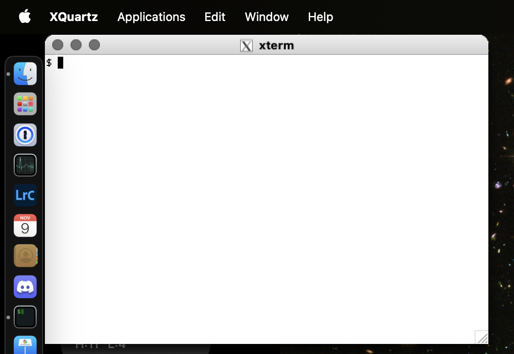
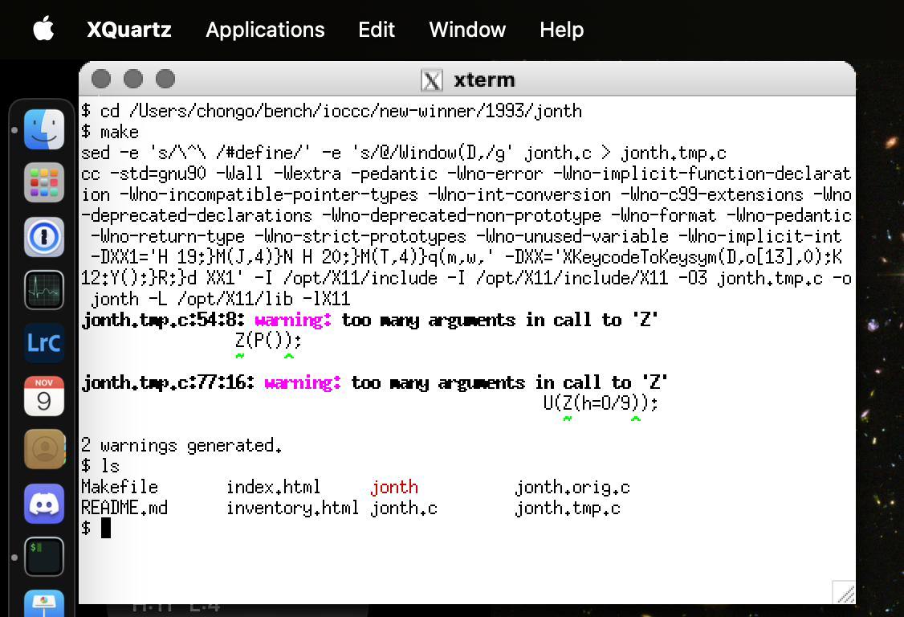
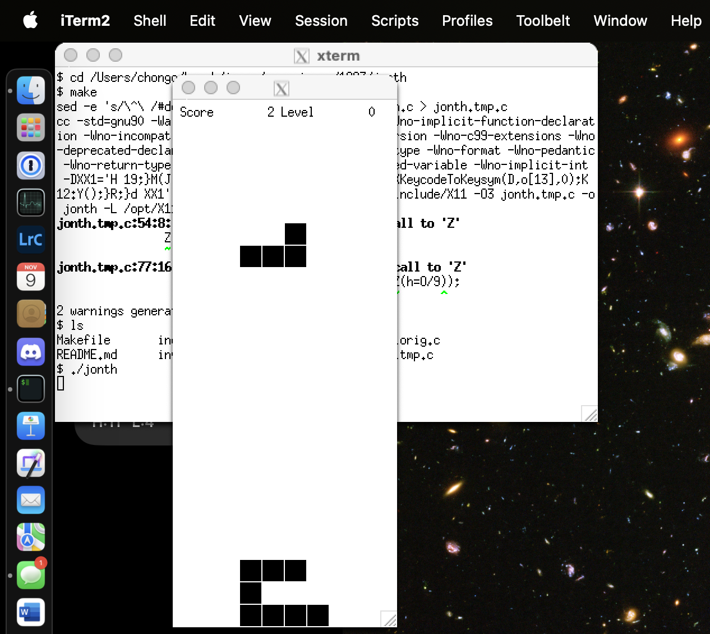
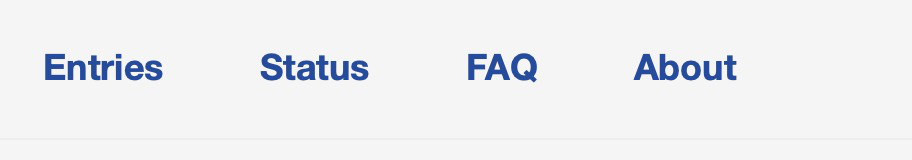
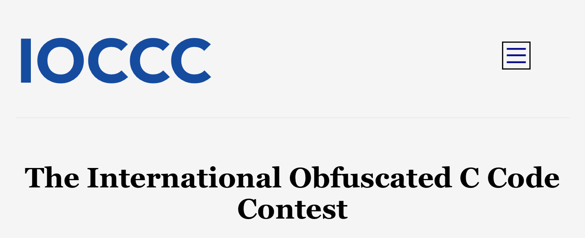
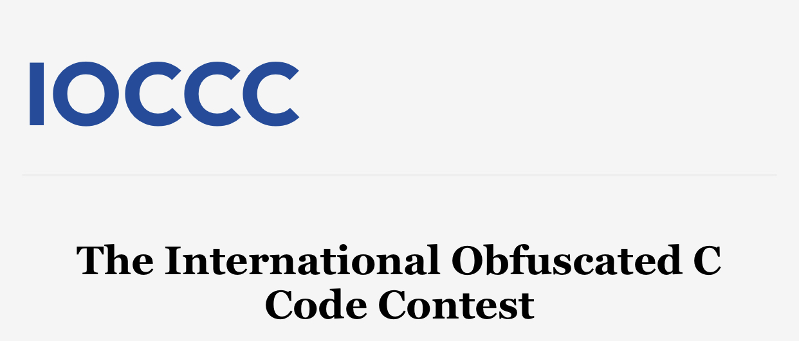

# IOCCC FAQ Table of Contents

This is FAQ version **28.2.16 2025-03-12**.


## 0. [Entering the IOCCC: the bare minimum you need to know](#enter_questions)
- **Q 0.0**: <a class="normal" href="#enter">How can I enter the IOCCC?</a>
- **Q 0.1**: <a class="normal" href="#mkiocccentry">What is the `mkiocccentry` tool, how do I obtain it and how do I use it?</a>
    - **Q 0.1.1**: <a class="normal" href="#about_mkiocccentry">What is `mkiocccentry(1)` in simple terms?</a>
    - **Q 0.1.2**: <a class="normal" href="#obtaining_mkiocccentry">How do I obtain the latest mkiocccentry toolkit?</a>
    - **Q 0.1.3**: <a class="normal" href="#compiling_mkiocccentry">How do I compile the mkiocccentry toolkit?</a>
    - **Q 0.1.4**: <a class="normal" href="#install">How do I install mkiocccentry(1) and related tools?</a>
    - **Q 0.1.5**: <a class="normal" href="#using_mkiocccentry">How do I use mkiocccentry?</a>
    - **Q 0.1.6**: <a class="normal" href="#minimum_versions">What are the minimum versions required for this contest?</a>
- **Q 0.2**: <a class="normal" href="#platform">What platform should I assume for my submission?</a>
- **Q 0.3**: <a class="normal" href="#makefile">What should I put in my submission Makefile?</a>
- **Q 0.4**: <a class="normal" href="#remarks">What should I put in the remarks.md file of my submission?</a>
- **Q 0.5**: <a class="normal" href="#try_scripts">What should I do with the `try.sh` and `try.alt.sh` scripts?</a>
- **Q 0.6**: <a class="normal" href="#file_perms">What permissions may my files be and what if I need different permissions?</a>


## 1. [Entering the IOCCC: more help and details](#submitting_help)
- **Q 1.0**: <a class="normal" href="#answers_file">How can I avoid re-entering the information to mkiocccentry?</a>
- **Q 1.1**: <a class="normal" href="#prog_c">May I use a different source or compiled filename than prog.c or prog?</a>
- **Q 1.2**: <a class="normal" href="#markdown">What is markdown and how does the IOCCC use it?</a>
- **Q 1.3**: <a class="normal" href="#mkiocccentry_bugs">How do I report bugs in an `mkiocccentry` tool?</a>
- **Q 1.4**: <a class="normal" href="#subdirectories">How may I use subdirectories in my submission if Rule 17 disallows them?</a>
- **Q 1.5**: <a class="normal" href="#mkiocccentry_test">How can I check if my submission passes tests without having to answer questions?</a>
- **Q 1.6**: <a class="normal" href="#extra-files">What are extra files and how may I include additional files beyond the max allowed?</a>
- **Q 1.7**: <a class="normal" href="#ai">May I use AI, Virtual coding assistants, or similar tools to write my submission?</a>
- **Q 1.8**: <a class="normal" href="#rule17">What are the details behind Rule 17?</a>
- **Q 1.9**: <a class="normal" href="#uuid">How can I avoid re-entering my UUID to mkiocccentry?</a>
- **Q 1.10**: <a class="normal" href="#submission_dir">How can I avoid having to move or delete my submission directory for the same workdir?</a>


## 2. [IOCCC Judging process](#judging_process)
- **Q 2.0**: <a class="normal" href="#questions">What is the best way to ask a question about the IOCCC rules, guideline and tools?</a>
- **Q 2.1**: <a class="normal" href="#feedback">How can I comment or make a suggestion on IOCCC rules, guidelines and tools?</a>
- **Q 2.2**: <a class="normal" href="#warnings">Are there any compiler warnings that I should not worry about in my submissions?</a>
- **Q 2.3**: <a class="normal" href="#frequent-themes">What types of entries have been frequently submitted to the IOCCC?</a>
- **Q 2.4**: <a class="normal" href="#rule_2_broken">How did an entry that breaks the size rule 2 win the IOCCC?</a>
- **Q 2.5**: <a class="normal" href="#submissions">How many submissions do the judges receive for a given IOCCC?</a>
- **Q 2.6**: <a class="normal" href="#judging_time">How much time does it take to judge the contest?</a>
- **Q 2.7**: <a class="normal" href="#judging_rounds">How many judging rounds do you have?</a>
- **Q 2.8**: <a class="normal" href="#grand_prize">Why do some IOCCC entries receive the Grand Prize or Best of Show award?</a>
- **Q 2.9**: <a class="normal" href="#winners">How are winning IOCCC entries announced?</a>
- **Q 2.10**: <a class="normal" href="#lost">Why don't you publish submissions that do not win?</a>


## 3. [The mkiocccentry toolkit: finer details](#mkiocccentry_details)
- **Q 3.0**: <a class="normal" href="#mkiocccentry_process">What is the `mkiocccentry(1)` process and what sort of checks does it perform?</a>
- **Q 3.1**: <a class="normal" href="#txzchk">How can I validate my submission tarball?</a>
- **Q 3.2**: <a class="normal" href="#fnamchk">What is the `fnamchk` tool?</a>
- **Q 3.3**: <a class="normal" href="#chkentry">How can I validate my submission directory?</a>
- **Q 3.4**: <a class="normal" href="#auth_json">What is a `.auth.json` file?</a>
- **Q 3.5**: <a class="normal" href="#info_json">What is a `.info.json` file?</a>
- **Q 3.6**: <a class="normal" href="#author_handle_faq">What is an `author handle`?</a>
- **Q 3.7**: <a class="normal" href="#author_handle_json">What is an `author_handle.json` file and how are they used?</a>
- **Q 3.8**: <a class="normal" href="#find_author_handle">How can I find my author handle?</a>
- **Q 3.9**: <a class="normal" href="#entry_id_faq">What is an `entry_id`?</a>
- **Q 3.10**: <a class="normal" href="#entry_json">What is a `.entry.json` file and how is it used?</a>
- **Q 3.11**: <a class="normal" href="#jparse">How can I validate any JSON document?</a>


## 4. [Compiling IOCCC entries](#compiling)
- **Q 4.0**: <a class="normal" href="#makefile_rules">What Makefile rules are available to build or clean up IOCCC entries?</a>
- **Q 4.1**: <a class="normal" href="#gmake">What form of make&lpar;1&rpar; is supported by IOCCC?</a>


## 5. [Dependencies for some IOCCC entries](#dependencies)
- **Q 5.0**: <a class="normal" href="#X11">How do I compile and run an IOCCC entry that requires X11?</a>
- **Q 5.1**: <a class="normal" href="#SDL">How do I compile and install SDL1 or SDL2 for entries that require it?</a>
- **Q 5.2**: <a class="normal" href="#curses">How do I compile and install &lpar;n&rpar;curses for entries that require it?</a>
- **Q 5.3**: <a class="normal" href="#sound">How do I compile and run an IOCCC entry that requires sound?</a>
- **Q 5.4**: <a class="normal" href="#tcpserver">How do I compile and install tcpserver for entries that require it?</a>
- **Q 5.5**: <a class="normal" href="#netpbm">How do I compile and install netpbm for entries that require it?</a>
- **Q 5.6**: <a class="normal" href="#libjpeg">How do I compile and install libjpeg-turbo for entries that require it?</a>
- **Q 5.7**: <a class="normal" href="#imagemagick">How do I compile and install ImageMagick for entries that require it?</a>
- **Q 5.8**: <a class="normal" href="#OpenGL">How do I compile and install OpenGL for entries that require it?</a>
- **Q 5.9**: <a class="normal" href="#zlib">How do I compile and install zlib for IOCCC entries that require it?</a>
- **Q 5.10**: <a class="normal" href="#ruby">How do I install Ruby for entries that require it?</a>
- **Q 5.11**: <a class="normal" href="#rake">How do I install rake for entries that require it?</a>


## 6. [Problems compiling IOCCC entries](#compile_problems)
- **Q 6.0**: <a class="normal" href="#compile_errors">Why don't certain IOCCC entries compile and/or run?</a>
    - **Q 6.1.1**: <a class="normal" href="#macos">Why do some IOCCC entries fail to compile and/or run under macOS?</a>
- **Q 6.2**: <a class="normal" href="#weverything">Why do Makefiles use -Weverything with clang?</a>


## 7. [Running IOCCC entries](#running_entries)
- **Q 7.0**: <a class="normal" href="#try">What are `try.sh` and `try.alt.sh` scripts and why should I use them?</a>
- **Q 7.1**: <a class="normal" href="#sanity">An IOCCC entry messed up my terminal application, how do I fix this?</a>
- **Q 7.2**: <a class="normal" href="#unsupported">Why does an IOCCC entry fail to compile and/or run?</a>
    - **Q 7.2.1**: <a class="normal" href="#64bit">Why does an IOCCC entry fail to compile and/or run on my 64-bit system?</a>
- **Q 7.3**: <a class="normal" href="#eof">How do I find out how to send interrupt/EOF etc. for entries that require it?</a>
- **Q 7.4**: <a class="normal" href="#download">How do I download individual winning entries or all winning entries of a given year?</a>


## 8. [Changes made to IOCCC entries](#changes)
- **Q 8.0**: <a class="normal" href="#diff">What was changed in some IOCCC entries?</a>
- **Q 8.0.1**: <a class="normal" href="#detailed-diff">How can I see the extended details of what was changed?</a>
- **Q 8.1**: <a class="normal" href="#fgets">Why were some calls to the libc function gets&lpar;3&rpar; changed to use fgets&lpar;3&rpar;?</a>
- **Q 8.2**: <a class="normal" href="#consistency">Why do some remarks seem inconsistent with the entry?</a>
- **Q 8.3**: <a class="normal" href="#orig_c">What is the meaning of the file ending in .orig.c in IOCCC entries?</a>
- **Q 8.4**: <a class="normal" href="#alt_code">What are alternate versions and why were they added to some entries?</a>
- **Q 8.5**: <a class="normal" href="#main_args">Why was arg count and/or type changed in main&lpar;&rpar; in some older entries?</a>
- **Q 8.6**: <a class="normal" href="#files">Why were files added to, removed from or changed in some entries?</a>
- **Q 8.7**: <a class="normal" href="#prog_orig_c">What is the original source file?</a>
- **Q 8.8**: <a class="normal" href="#renaming_files">Why were some filenames changed?</a>


## 9. [Helping the IOCCC](#help)
- **Q 9.0**: <a class="normal" href="#how_to_help">How can I help the IOCCC?</a>
- **Q 9.1**: <a class="normal" href="#bugs">Is there a list of known bugs and &lpar;mis&rpar;features of IOCCC entries?</a>
- **Q 9.2**: <a class="normal" href="#fix_an_entry">How can I submit a fix to an IOCCC entry?</a>
- **Q 9.3**: <a class="normal" href="#pull_request">How do I make a pull request to the GitHub repo?</a>
- **Q 9.4**: <a class="normal" href="#report_website_problem">How can I report an IOCCC website problem?</a>
- **Q 9.5**: <a class="normal" href="#fix_website">How can I submit a fix to the IOCCC website?</a>
- **Q 9.6**: <a class="normal" href="#fix_author">How can I correct or update an IOCCC author's information?</a>
- **Q 9.7**: <a class="normal" href="#fix_link">What should I do if I find a broken or wrong web link?</a>
- **Q 9.8**: <a class="normal" href="#supporting_ioccc">How can I support the IOCCC?</a>
- **Q 9.9**: <a class="normal" href="#deobfuscated">I deobfuscated some entry code, may I contribute the source?</a>
- **Q 9.10**: <a class="normal" href="#reporting_bugs">How do I report a bug in an IOCCC entry?</a>


## 10. [Miscellaneous IOCCC](#misc)
- **Q 10.0**: <a class="normal" href="#mirrors">May I mirror the IOCCC website?</a>
- **Q 10.1**: <a class="normal" href="#ioccc_copyright">May I use IOCCC content in an article, book, newsletter, or instructional material?</a>
- **Q 10.2**: <a class="normal" href="#first_person">Why do you sometimes use the first person plural?</a>
- **Q 10.3**: <a class="normal" href="#dot_files"> What is the purpose of the `.top`, `.allyear`, `.year` and `.path` files?</a>
- **Q 10.4**: <a class="normal" href="#terms"> What is the current meaning of the IOCCC terms Author, Entry, and Submission?</a>
- **Q 10.5**: <a class="normal" href="#licence">Am I allowed to use IOCCC content?</a>
- **Q 10.6**: <a class="normal" href="#try_mastodon">What is Mastodon and why does the IOCCC use it?</a>
- **Q 10.7**: <a class="normal" href="#tabstops">How do I set certain tabstops for viewing source code in vi&lpar;m&rpar;?</a>
- **Q 10.8**: <a class="normal" href="#menus">How do the menus on the website work and what can I do if they don't work?</a>
- **Q 10.9**: <a class="normal" href="#author-information">How do I find more information about a winning author of an entry?</a>
- **Q 10.10**: <a class="normal" href="#cb">What is this cb tool that is mentioned in the IOCCC?</a>
- **Q 10.11**: <a class="normal" href="status_json">What do the status.json JSON file indicate?</a>

## 11. [History of the IOCCC](#ioccc_history)
- **Q 11.0**: <a class="normal" href="#ioccc_start">How did the IOCCC get started?</a>
- **Q 11.1**: <a class="normal" href="#missing_years">Why are some years missing IOCCC entries?</a>
- **Q 11.2**: <a class="normal" href="#website_history">What is the history of the IOCCC website?</a>
- **Q 11.3**: <a class="normal" href="#size_rule_history">How has the IOCCC size limit rule changed over the years?</a>
- **Q 11.4**: <a class="normal" href="#great_fork_merge">What is the **Great Fork Merge**?</a>
- **Q 11.5**: <a class="normal" href="#bof">What is an IOCCC BOF?</a>
- **Q 11.6**: <a class="normal" href="#explain_IOCCC">I do not understand the IOCCC, can you explain it to me?</a>


Jump to: [top](#)


# The IOCCC FAQ


<hr style="width:50%;text-align:left;margin-left:0">
<hr style="width:50%;text-align:left;margin-left:0">


<div id="enter_questions">
## Section 0: Entering the IOCCC: the bare minimum you need to know
</div>


Jump to: [top](#)


<div id="enter">
<div id="step_0">
<div id="step_1">
<div id="step_2">
<div id="register">
<div id="step_3">
<div id="step_4">
<div id="step_5">
<div id="step_6">
<div id="step_7">
<div id="submit">
### Q 0.0: How can I enter the IOCCC?
</div>
</div>
</div>
</div>
</div>
</div>
</div>
</div>
</div>
</div>
</div>

To submit your code to the IOCCC, **follow the** [IOCCC Quick Start Guide](quick-start.html).


Jump to: [top](#)


<div id="what_mkiocccentry">
<div id="mkiocccentry">
<div id="mkiocccentry_compile">
<div id="compile_mkiocccentry">
### Q 0.1: What is the `mkiocccentry` tool, how do I obtain it and how do I use it?
</div>
</div>
</div>
</div>

<div id="mkiocccentry_repo">
#### mkiocccentry repo
</div>

This toolkit is from the [mkiocccentry
repo](https://github.com/ioccc-src/mkiocccentry) and it is **required** that you
use it to package your submission. Not doing so puts you at a great risk of
violating the [Rules](next/rules.html) and in particular [Rule
17](next/rules.html#rule17).


Jump to: [top](#)


<div id="about_mkiocccentry">
#### Q 0.1.1: What is `mkiocccentry` in simple terms?
</div>

The `mkiocccentry` tool first gathers your source
code, your Makefile, your remarks, any other data files you wish to provide (up
to a maximum, including the mandatory files, defined in
[limit_ioccc.h](https://github.com/ioccc-src/mkiocccentry/blob/master/soup/limit_ioccc.h)
as `MAX_FILE_COUNT`) and other information about your submission,
information about the author (or authors), and then it will give you a list of
subdirectories, if any, that will be made, and files that will be copied to the
submission directory. It will list files and directories that it will (for
various reasons) not create as well, asking you to confirm these things are all
okay. Some things are strictly forbidden (such as a directory tree too deep) and
it will tell you about these as well, so you can fix it.

Assuming you agree to the list of directories and files, it will make the
directories (if necessary) and copy the files. It will then switch to the
submission directory, run `make clobber` and then scan the directory again,
looking for mismatches. If no errors are detected it will list everything to you
again, asking you to confirm it is good.

If everything is OK, it will write the required `.auth.json` and `.info.json`
and then run `chkentry(1)` on the directory. If all is OK it will create the
tarball. After the tarball is formed, it will run `txzchk(1)` on it, which runs
`fnamchk(1)`. If all is OK, your submission tarball should be good to go.

Please see
FAQ on "[txzchk](#txzchk)",
the
FAQ on "[fnamchk](#fnamchk)"
and the
FAQ on "[chkentry](#chkentry)"
for more information on these important tools, if you want more information.

See the
FAQ on "[how to upload you submission](#submit)"
for details on how to register for the IOCCC, the
FAQ on "[obtaining the latest mkiocccentry toolkit](#obtaining_mkiocccentry)"
for details on obtaining the latest release, the
FAQ on "[compiling the mkiocccentry toolkit](#compiling_mkiocccentry)"
for details on compiling and the
FAQ on "[using mkiocccentry](#using_mkiocccentry)"
for more details.


Jump to: [top](#)


<div id="obtaining_mkiocccentry">
#### Q 0.1.2: How do I obtain the latest mkiocccentry toolkit?
</div>

Before you use it, make **SURE** you have the most recent version. If you do not
have an mkiocccentry tool directory:

``` <!---sh-->
    cd some_directory
    git clone git@github.com:ioccc-src/mkiocccentry.git
    cd mkiocccentry
```

If you already have an mkiocccentry tool directory:

``` <!---sh-->
    cd mkiocccentry
    git fetch --all --tags
    git rebase
```


Jump to: [top](#)


<div id="compiling_mkiocccentry">
#### Q 0.1.3: How do I compile the mkiocccentry toolkit?
</div>

Once you've obtained the **LATEST** version (see the
FAQ on "[obtaining the latest mkiocccentry toolkit](#obtaining_mkiocccentry)"
to make sure of this), change to the `mkiocccentry` directory and then run:

``` <!---sh-->
    make clobber all test
```

to compile all the tools and run the test-suite.

You do not have to run the test-suite but if you wish to make sure all is in
order you may. If you wish to skip that:

``` <!---sh-->
    make clobber all
```


Jump to: [top](#)


<div id="install">
### Q 0.1.4: How do I install mkiocccentry(1) and related tools?
</div>

After obtaining the toolkit (see the
FAQ on "[obtaining the latest mkiocccentry toolkit](#obtaining_mkiocccentry)")
and compiling the tools (see the
FAQ on "[compiling mkiocccentry](#compiling_mkiocccentry)"
above) run as either `sudo(8)` or root `make install`:

``` <!---sh-->
    # if you use sudo(8):
    sudo make install

    # as root:
    make install
```

If everything goes well you should be able to run `mkiocccentry(1)`,
`txzchk(1)`, `chkentry(1)` and all the other installed tools from any directory,
and the tools that rely on other tools will be able to find those required tools
from any directory too.

Some tools like `bug_report.sh` and `hostchk.sh` are not meant to be installed
and will not work from any directory, however.


Jump to: [top](#)


<div id="using_mkiocccentry">
#### Q 0.1.5: How do I use mkiocccentry?
</div>

Once you have registered, you will need to package your submission with the
`mkiocccentry` tool. If you have not already obtained the toolkit, see the
FAQ on "[obtaining the most recent mkiocccentry
toolkit](#obtaining_mkiocccentry)",
the
FAQ on "[compiling mkiocccentry](#compiling_mkiocccentry)"
and the
FAQ on "[installing the mkiocccentry tools](#installing)"
if you have not already done so.

The below details discuss this very important tool. As it is complicated we will
explain how to use this tool. If you want to know what it is in simpler terms,
see the
FAQ on "[what mkiocccentry is](#about_mkiocccentry)".

As the [Guidelines](next/guidelines.html) state, the synopsis is:

``` <!---sh-->
    mkiocccentry [options] workdir topdir
```

... where `workdir` is a directory that will be used to build the submission
tarball and `topdir` is the directory which has your files, including the
mandatory `prog.c`, `Makefile` and `remarks.md`.

The `workdir` **MUST** already exist, as a directory, and it is an error if it
is not a directory that can be written to. In **this** directory your **submission
directory** will be created, with the name based on your IOCCC registration
username, which is **in the form of a UUID**, and submission number along with
the timestamp; see the [rules](next/rules.html) for more details on this, and in
particular [Rule 17](next/rules.html#rule17).

**IMPORTANT NOTE**: the tools that require other tools, `mkiocccentry(1)` and
`txzchk(1)`, will, as of version `2.0.2 2025-03-11`, search under `$PATH`. If
you have an earlier version and you have not installed the tools and run the
tools from outside the repo directory, you will have to use the options to the
tools to set the path to the required tools.

If the **_subdirectory_ in the _work directory_** (based on your submit ID and
slot number) already exists, you will have to move it, remove it or otherwise
specify a different work directory (**NOT** the subdirectory), as it needs to be
empty.

This _subdirectory is where your directories will be made and where your files
will be **copied** to_. Your _submission tarball_ (which you will upload to the
submit server) that `txzchk(1)` will validate _will be placed in the **work
directory**_, and **its _contents_ will be the _subdirectory_ with your
submission's files**.  The `mkiocccentry(1)` tool will also ask you for
information about your submission _as well as author details_ (that will only be
looked at if the submission wins), run some tests and run a number of other
tools, as mentioned above, and as described in the "[finer
details](#mkiocccentry_details)" section.

See also the
FAQ on "[what the minimum required versions are for this
contest](#minimum_versions)"
for more details on how to verify you have the correct versions for this
contest.


Jump to: [top](#)


<div id="minimum_versions">
#### Q 0.1.6: What are the minimum versions required for this contest?
</div>

At minimum, the tools **MUST** be version:

- `iocccsize(1)`: `"28.15 2024-06-27"`.
- `mkiocccentry(1)`: `"2.0.1 2025-03-02"`.
- `fnamchk(1)`: `"2.0.0 2025-02-28"`.
- `txzchk(1)`: `"2.0.1 2025-03-02"`.
- `chkentry(1)`: `"2.0.1 2025-03-02"`.

See also the
FAQ on "[obtaining the latest release of the toolkit](#obtaining_mkiocccentry)".


Jump to: [top](#)


<div id="SUS">
<div id="platform">
<div id="portability">
### Q 0.2: What platform should I assume for my submission?
</div>
</div>
</div>

Your entry must compile with **clang** or **gcc** and run under at least one flavor of a UNIX
system that conforms to the [SUS](https://en.wikipedia.org/wiki/Single_UNIX_Specification),
otherwise known as the [The Single UNIX Specification Version 4](https://unix.org/version4/)
or [later SUS](https://unix.org/online.html).


Jump to: [top](#)


<div id="makefile">
<div id="submission_makefile">
### Q 0.3: What should I put in my submission Makefile?
</div>
</div>

We recommend starting with the sample
(renamed as `Makefile` of course) as a starting point for your
entry's `Makefile`:

- [view example Makefile](%%REPO_URL%%/next/Makefile.example)
- [Makefile.example](next/Makefile.example)

The `Makefile` is a file used by the `make(1)` command that contains
rules and UNIX shell-style commands.

The first and default rule should be the `all` rule and should build your
entry's executable file. There are other rules that should be present in your
Makefile, and which mkiocccentry attempts to find; see below.

If your entry depends on a particular source file name during compilation or execution,
your `Makefile` should copy `prog.c` into the desired filename. See the
FAQ on "[source and compiled filenames](#prog_c)"
for an example.

If you are not familiar `Makefile`s, you might consider the following tutorials:

- [GNU make](https://www.gnu.org/software/make/manual/make.html#Introduction)
- [What is a Makefile and how does it work?](https://opensource.com/article/18/8/what-how-makefile)
- [Learn Makefiles](https://makefiletutorial.com)

For the `make(1)` _connoisseur_: As of 2023, IOCCC judges use [GNU
make compatible](https://www.gnu.org/software/make/) `make(1)`
command that is compatible with GNU Make version 3.81. Your Makefile should be
compatible with this; see the
FAQ on "[Makefile compatibility](#gmake)"
for more details and help.


#### Expected `make` rules:

The following rules should exist in your Makefile:

- `all`
    * This rule should be the first rule and it should compile your submission.

- `clean`
    * This rule should remove any intermediate build files, for example `.o`
    files or other intermediate build files. It should **NOT** remove compiled
    programs (see `clobber` below).

- `clobber`
    * This rule should restore the original state of the submission's directory.
    It should depend on the `clean` rule and it should remove the compiled
    program(s), clean up any files made by the program etc.

- `try`
    * run the program in a way you suggest. If you use the `try.sh` script
    system, which we do like, you can have this rule invoke the script
    (`./try.sh`). See the
    FAQ on the "[try.sh scripts system](#try_scripts)"
    for more details.

Although the `mkiocccentry(1)` tool only checks for those rules, the most up to
date
`Makefile.example`
does have other rules like `everything` and `alt`, and we encourage you to use
the one linked to above.


Jump to: [top](#)


<div id="remarks_md">
<div id="remarks">
<div id="readme">
### Q 0.4: What should I put in the remarks.md file of my submission?
</div>
</div>
</div>

**PLEASE** look at the template remarks.md to give you a better idea of how
it should be formed, as it has some instructions you should follow:

- [view template remarks.md](%%REPO_URL%%/next/remarks.md)
- [remarks.md template](next/remarks.md)

**PLEASE** pay especial attention to the instructions, including the [IOCCC
markdown guidelines](markdown.html). You will observe that it links back to this
FAQ as to what you should or should not say.

Next, while you may put in as much or as little as you wish into your entry's
`remarks.md` file, we do have few important suggestions:

We recommend that you explain how to use your submission.  Explain the
command line (if any command line options and arguments are used)
and any input or actions if applicable.

We highly recommend that you explain why you think your submission is
well obfuscated.

For those submissions that win the IOCCC, we often use much of text from the
`remarks.md` file in the _Author's remarks_ section of the `index.html` file.
For this reason, a well written `remarks.md` file is considered a plus.

While not required, consider adding bit of humor to your `remarks.md`
as most people who are not humor impaired, as well as the IOCCC judges (who
might or might not be humour impaired :-) ), appreciate the opportunity for a
fun read as well as a chuckle or two.


#### What helps:

- explaining what your entry does.
- how to entice it to do what it is supposed to do.
- what obfuscations are used.
- what are the limitations of your entry in respect of portability and/or input data.
- how it works (if you are really condescending).


#### What does not help:

- admitting that your entry is not very obfuscated (you see, the contest is
called the **IOCCC**, not the **INVOCCC** :-) ); but even if you do not admit
it, not very obfuscated entries have a minuscule chance to win (although
[2000/tomx](2000/tomx/index.html) is a notable counterexample).
- mentioning your name or any identifying information in the remark section (or
in the C code for that matter) - we like to be unbiased during the judging
rounds; we look at the author name only if an entry wins. See the
[guidelines](next/guidelines.html) **AND** [rules](next/rules.html) if this is not clear!
- leaving the remark section empty (which would also indicate that you did not
use `mkiocccentry(1)`, as it requires it to not be of size 0, though if you only
include whitespace you would still be violating [Rule 17](next/rules.html#rule17)).


Jump to: [top](#)


<div id="try_scripts">
### Q 0.5: What should I do with the `try.sh` and `try.alt.sh` scripts?
</div>

If your submission has more than one use, or if you have interesting ways to
invoke your program, perhaps using other commonly installed tools (or tools
included in your submission), it can be helpful to include a `try.sh` script:

- [view example try.sh](%%REPO_URL%%/next/try.sh)
- [download example try.sh](next/try.sh)
- [view example try.alt.sh](%%REPO_URL%%/next/try.alt.sh)
- [download example try.alt.sh](next/try.alt.sh)


The template `try.sh` script can be used as a starting point, or you can look at
some of the others in past winning entries, to get some ideas.

It is not detrimental to your chances of winning if you do not include one as
not all submissions can make use of them. Nevertheless, it is helpful to include
ways to use your program and as submitted Makefiles should have a `try` rule, if
you have creative ways this can be a bonus. It does not mean that a program that
cannot be used with other programs is less interesting or less likely to win,
but we do enjoy interesting and creative uses of submissions.

If you have alternate code that you are including, then you can use the
`try.alt.sh` template as well.

We recommend that you include the use of these scripts in the `try` rule in the
example Makefile that you modify for your submission. See the
FAQ on "[submission Makefiles](#makefile)".


Jump to: [top](#)


<div id="file_perms">
### Q 0.6: What permissions may my files be and what if I need different permissions?
</div>

Files in your submission tarball **MUST** be
specific permissions. In particular: directories **MUST** be `drwxr-xr-x` (i.e.
`0755`), the optional files, `try.sh` or `try.alt.sh`, if provided, **MUST** be
`-r-xr-xr-x` (i.e. `0555`) and all other files **MUST** be `-r--r--r--` (i.e.
`0444`).

If you need a file to be executable, say a script, then make sure you do so in
the appropriate place in your Makefile. See the
FAQ on "[submission Makefile](#makefile)"
for more details.

See the
FAQ on "[Rule 17](#rule17)"
and [Rule 17](next/rules.html#rule17) itself.

Do remember that if your submission requires different filenames, then you
**MUST** make a **COPY** of them in your `Makefile`. See also [Rule
11](next/rules.html#rule11).


Jump to: [top](#)


<hr style="width:50%;text-align:left;margin-left:0">
<hr style="width:50%;text-align:left;margin-left:0">


<div id="submitting_help">
## Section 1: Entering the IOCCC: more help and details
</div>


Jump to: [top](#)


<div id="answers_file">
### Q 1.0: How can I avoid re-entering the information to mkiocccentry?
</div>

`mkiocccentry(1)` has some options to help write _OR_ read from an
answers file so you do not have to input the author(s) or the submission
details (like the abstract, summary etc.), just to change a file.

To write to `answers.txt` try:

``` <!---sh-->
    mkiocccentry -a answers.txt ...
```

Alternatively, if you wish to overwrite a file, you can use the `-A`
flag with the same option argument. Be **very careful** that you do not accidentally
overwrite your `prog.c` or some other important file!

To make use of the answers file, use the `-i answers` option like:

``` <!---sh-->
    mkiocccentry -i answers.txt ...
```


Jump to: [top](#)


<div id="prog_c">
### Q 1.1: May I use a different source or compiled filename than prog.c or prog?
</div>

While your submission's source filename, as submitted, must be `prog.c`, your entry's `Makefile`
may copy `prog.c` to a different filename as part of the compiling/building process.  For example:

``` <!---make-->
    # Makefile continues above ...

    all: desired_name

    desired_name: desired_name.c
            rm -f $@
            cc desired_name.c -o $@

    desired_name.c: prog.c
            rm -f $@
            cp -f prog.c $@

    clean:
            rm -f desired_name.o

    clobber: clean
            rm -f desired_name.c desired_name

    # Makefile continues below ...
```

We recommend that the `make clobber` rule remove files that your entry
creates as part of the compiling/building process.

You may also copy the compiled `prog` into a different file as part of compiling process.
For example:

``` <!---make-->
    # Makefile continues above ...

    all: desired_name

    different_name: prog
            rm -f $@
            cp -f prog $@

    clean:
            rm -f prog.o

    clobber: clean
            rm -f desired_name

    # Makefile continues below ...
```


Jump to: [top](#)


<div id="markdown">
<div id="md">
### Q 1.2: What is markdown and how does the IOCCC use it?
</div>
</div>

The IOCCC makes extensive use of [markdown](https://daringfireball.net/projects/markdown/).
For example, when [submitting to the IOCCC](next/submit.html), we have people
submit remarks about their submission(s) in markdown format.  Every
[winning IOCCC entry](years.html) uses a `README.md` markdown file
as the basis for forming the `index.html` web page for that entry.
All generated HTML pages on the [Official IOCCC website](https://www.ioccc.org/index.html)
start with some markdown content.

**IMPORTANT**: Please read the [IOCCC markdown guidelines](markdown.html)
as it lists things you **should NOT use** in markdown files and things you
**should do** as well.

See the [markdown syntax](https://www.markdownguide.org/basic-syntax) guide.
See also [CommonMark Spec](https://spec.commonmark.org/current/).


Jump to: [top](#)


<div id="mkiocccentry_bugs">
### Q 1.3: How do I report bugs in an `mkiocccentry` tool?
</div>

As the [mkiocccentry toolkit](https://github.com/ioccc-src/mkiocccentry) is
crucial in the contest, both for submitters and the judges, if you find a bug
(or you think you find a bug) we would be grateful if you were to report it at
the [mkiocccentry issues
page](https://github.com/ioccc-src/mkiocccentry/issues).

Please see the
FAQ on "[reporting bugs and other issues in the mkiocccentry repo](https://github.com/ioccc-src/mkiocccentry/blob/master/FAQ.md#bugs)"
in the [mkiocccentry repo](https://github.com/ioccc-src/mkiocccentry)
for more thorough details on bug reporting.


Jump to: [top](#)


<div id="subdirectories">
#### Q 1.4: How may I use subdirectories in my submission if Rule 17 disallows them?
</div>

In order to submit a subdirectory, you may simply include a tarball. As long as
the maximum depth of all files does not exceed the maximum, defined as
`MAX_PATH_DEPTH`, the maximum filename length (a single component not counting
the `/`) of all files does not exceed `MAX_FILENAME_LEN` and
the maximum path length (all components) of all files does not exceed
`MAX_PATH_LEN`. These macros are defined in
[limit_ioccc.h](https://github.com/ioccc-src/mkiocccentry/blob/master/soup/limit_ioccc.h).


See also the
FAQ on "[Rule 17](#rule17)",
the [guidelines](next/guidelines.html) and [Rule 17](next/rules.html#rule17)
itself.


<div id="mkiocccentry_test">
#### Q 1.5: How can I check if my submission passes tests without having to answer questions?
</div>

In case you do not have a UUID or you simply want to test if `mkiocccentry(1)`
does not detect any issues with your submission, without having to answer all
the questions, you can use the `-d` option (which is an alias for `-s 21701`
where `21701` is the seed) to have the tool make up pseudo-randomly selected
answers.

Please note that the tool will **NOT** delete the directory it makes so if you
do have to try again you'll have to remove it (you can have it delete it if you
use the `-x` option though).

An example use of this option is:

``` <!---sh-->
    mkiocccentry -d workdir topdir
```

This will run the tests that `mkiocccentry(1)`, write the JSON files, use
`chkentry(1)`, package the tarball and run `txzchk(1)` on it.

If you don't want to deal with the having to move or delete the submission
directory, you could instead do:

``` <!---sh-->
    mkiocccentry -x -d workdir topdir
```

See also the
FAQ on "[mkiocccentry](#mkiocccentry)",
the
FAQ on "[using mkiocccentry](#using_mkiocccentry)",
the
FAQ on "[.info.json](#info_json)",
the
FAQ on "[.auth.json](#auth_json)",
the
FAQ on "[chkentry](#chkentry),
the
FAQ on "[txzchk](#txzchk)"
and the
FAQ on "[fnamchk](#fnamchk)"
for more details.


<div id="extra-files">
# What are extra files and how may I include additional files beyond the max allowed?
</div>

<p class="leftbar">
Extra files are defined as files that are not the required files (`prog.c`,
`Makefile`, `remarks.md` and the two generated by `mkiocccentry(1)` `.info.json`
and `.auth.json`) and files that are also not the optional files (`try.sh`,
`prog.alt.c` and `try.alt.sh`).
</p>

<p class="leftbar">
**NOTE**: optional filenames are only optional if they are in the submission top
level directory.
</p>

<p class="leftbar">
If you need to include more files than this, you may include a tarball that
itself is an extra file, meaning it counts **AS** an extra file.
This file does **NOT** need to pass the `txzchk(1)` tests; only your submission
tarball needs to pass these tests.
</p>

Please pay careful attention to [Rule 17](next/rules.html#rule17) and in
particular the part about the [maximum number of files per
submission](#max-files), which not only discusses the maximum
number of files (including extra files) but also specific rules you must follow
if you do include a tarball. Not following these points puts you at great risk
of violating [Rule 17](next/rules.html#rule17)!

Also, remember what the [guidelines](next/guidelines.html) say:

> **IMPORTANT REMINDER**: make **SURE** your tarball does **NOT** reveal who you are!
The `mkiocccentry(1)` tool creates a v7 format tarball to prevent this.

You can do this by creating the tarball like:


``` <!---sh-->
    tar --format=v7 -cJf foo.txz directory
```


Jump to: [top](#)


<div id="ai">
<div id="llm">
### Q 1.7: May I use AI, LLM, Virtual coding assistants, or similar tools to write my submission?
</div>
</div>

You are free to use whatever tools you wish to write your code.
This includes tools that are AI based, LLM (large language model), Virtual
coding assistants, code generators, or similar tools, as well as your own tools.
The [IOCCC judges](https://www.ioccc.org/judges.html) do not discriminate on the
basis of the tools used to write obfuscated C code so long as you are the
ultimate author of the code you submit.

If you do use such tools, **PLEASE mention** in your `remarks.md` which tools
you used as well as how you used them to help write your submission.


Jump to: [top](#)


<div id="rule17">
### Q 1.8: What are details behind Rule 17?
</div>


### TL;DR Rule 17 - Use `mkiocccentry(1)`

<p class="leftbar">
This is a **COMPLEX** rule.  **Violating this rule will cause your submission to
be REJECTED!** To help you avoid such a rejection, you are **HIGHLY ENCOURAGED**
to use the `mkiocccentry(1)` tool, based on the latest release of the
[mkiocccentry repo](https://github.com/ioccc-src/mkiocccentry), to form your
submission's xz compressed tarball.
</p>

<p class="leftbar">
The [mkiocccentry repo](https://github.com/ioccc-src/mkiocccentry)
contains **IMPORTANT** tools and libraries such as:
</p>

* <p class="leftbar">`mkiocccentry(1)`</p>
* <p class="leftbar">`iocccsize(1)`</p>
* <p class="leftbar">`txzchk(1)`</p>
* <p class="leftbar">`fnamchk(1)`</p>
* <p class="leftbar">`jparse(3)`</p>
* <p class="leftbar">`chkentry(1)` (which uses `jparse(3)`)</p>

<p class="leftbar">
The above mentioned tools will help you verify that your submission
conforms to [Rule 17](next/rules.html#rule17).  Each of these tool has a `-h`
option that provides command line help. For additional details of each tool, see
its man page, and in some cases, the [IOCCC guidelines](next/guidelines.html).
</p>

<p class="leftbar">
The maximum number of **extra files** is 31. See the [maximum number of extra
files section](#max-files) below for finer details and the
FAQ on "[what extra files are and how to include additional files](#extra-files)",
should you need to include more files than this maximum.
</p>


Jump to: [top](#)


### Rule 17 - The COMPLEX details

<p class="leftbar">
Each submission **MUST** be in the form of an xz compressed tarball.
The xz compressed tarball filename **MUST** be of the form:
`^submit.username-slot_num.[1-9][0-9]{9,}.txz$`.

<p class="leftbar">
... where _`username`_ is your IOCCC registration username **in the form of a
[UUID](https://en.wikipedia.org/wiki/Universally_unique_identifier)** (see
[RFC 9562](https://datatracker.ietf.org/doc/html/rfc9562) for
details), and where _`slot_num`_ is a single decimal digit integer
(i.e., >= `0` and <= `9`).
</p>

<p class="leftbar">
In particular, `username` is in the form of:
`xxxxxxxx-xxxx-4xxx-Nxxx-xxxxxxxxxxxx` where `'x'` is a hex digit in the range
of `[0-9a-f]`, 4 is the UUID version, and `N` is one of `8`, `9`, `a`, or `b`.
</p>

<p class="leftbar">
Your xz compressed tarball **MUST** contain, **at a minimum**, the following
files, in the **TOP LEVEL** directory:
</p>

* <p class="leftbar">`prog.c`</p>
* <p class="leftbar">`Makefile`</p>
* <p class="leftbar">`remarks.md`</p>
* <p class="leftbar">`.auth.json`</p>
* <p class="leftbar">`.info.json`</p>

<p class="leftbar">
`prog.c` is of course your submission program.
</p>

<p class="leftbar">
The `Makefile` **MUST** be a **non**-empty file in **[GNU
Makefile](https://www.gnu.org/software/make/manual/make.html)** format. See the
[Makefile section in the guidelines](next/guidelines.html#makefile),
the
FAQ on "[submission Makefiles](#submission_makefile)"
and the
FAQ on "[IOCCC make&lpar;1&rpar; compatibility](#make_compatibility)"
for help.
</p>

<p class="leftbar">
The `remarks.md` **MUST** be a **non**-empty file in markdown format
(`mkiocccentry(1)` only checks the file size but if you do not have any text in
it you still risk violating this rule).  See also
[Rule 18](next/rules.html#rule18) and our
FAQ on "[remarks.md](#remarks_md)",
our
FAQ on "[markdown](#markdown)"
and our [markdown guidelines](markdown.html).
</p>

<p class="leftbar">
See also the [markdown syntax](https://www.markdownguide.org/basic-syntax) guide
and the [CommonMark Spec](https://spec.commonmark.org/current/).
</p>

<p class="leftbar">
The `.auth.json` file is created by `mkiocccentry(1)` and it holds information
about the author(s) of the submission. It will **ONLY** be looked at if your
submission wins but it **MUST** still be valid according to `jparse(3)` **AND**
`chkentry(1)`.
</p>

<p class="leftbar">
The `.info.json` file is created by `mkiocccentry(1)` and it holds information
about the submission itself. It also **MUST** be valid according to **BOTH**
`jparse(3)` **AND** `chkentry(1)`.
</p>

<p class="leftbar">
For the complete `mkiocccentry(1)` process, see the
FAQ on the "[mkiocccentry process](#mkiocccentry_process)".
</p>

<p class="leftbar">
The tool performs a lot of checks, both directly and indirectly, and if it or
any other tool detects **ANY** problem, you are **HIGHLY** encouraged to fix it
and try again.
</p>

<p class="leftbar">
On the other hand, some issues are errors and you **MUST** fix those.
</p>

<p class="leftbar">
If you do use `mkiocccentry(1)` and you run into a problem, you might see the
FAQ on "[how to ask a question about the IOCCC rules, guidelines and
tools](#questions)".
If you believe you have encountered a bug, feel free to open a bug report at the
[mkiocccentry repo issues
page](https://github.com/ioccc-src/mkiocccentry/issues/new?assignees=&labels=bug&projects=&template=bug_report.yml&title=%5BBug%5D+%3Ctitle%3E).
</p>

<p class="leftbar">
The xz compressed tarball file **MUST** be <= **3999971** octets in size.
</p>

<p class="leftbar">
When your submission's xz compressed tarball is uncompressed, the total size of
your submission (the sum of the size of the program source code,
remarks/comments, Makefile and all other files) **MUST** be <= **28314624**
octets (**27651K**) in size.
</p>

<p class="leftbar">
One of the many checks `txzchk(1)` performs is summing up the total size. Of
course if you manipulate the tarball to get past this you risk violating this
rule.
</p>

<p class="leftbar">
Your submission's xz compressed tarball **MUST** pass the `txzchk(1)` tests. See
the [guidelines on txzchk&lpar;1&rpar;](next/guidelines.html#txzchk) for more details on this tool.
</p>

<p class="leftbar">
**IMPORTANT**: Make **SURE** you have the most recent version of the
`mkiocccentry` toolkit! Not doing so will put you at a great risk of violating
this rule! See the
FAQs on "[obtaining, compiling, installing and using the mkiocccentry toolkit](#mkiocccentry)"
for more details.
</p>

<p class="leftbar">
You are **HIGHLY ENCOURAGED** to use the `mkiocccentry(1)` tool to form your
submission's xz compressed tarball. See the [guidelines on
mkiocccentry&lpar;1&rpar;](next/guidelines.html#mkiocccentry) for
more details on this tool and see the [mkiocccentry
repo](https://github.com/ioccc-src/mkiocccentry) for the toolkit itself.
</p>

<p class="leftbar">
Your entry **MAY** have subdirectories, depending on the depth and total length of
the filenames. Certain directories like `.git`, `RCCS`, `CVS` and `.svn`
(amongst others) are skipped. For more information, see the
FAQ on "[subdirectories](#subdirectories)".
</p>

<p class="leftbar">
With the exception of those generated by the `mkiocccentry(1)` tool or the tools
it or any other tool invokes, files in your submission **MUST**:
</p>

* <p class="leftbar">Be <= **38** characters in length.</p>
* <p class="leftbar">**NOT** have a leading **`/`**.</p>
* <p class="leftbar">**NOT** contain a path component of: **`.`** (that is, with
the exception of files generated by `mkiocccentry(1)` itself, it must have
**NO** dot file including `.` itself).</p>
* <p class="leftbar">**NOT** contain a path component of: **`..`** (that is,
**NO** path component that matches the regular expression **`^..$`**).</p>
* <p class="leftbar">Match the regular expression
`^[0-9A-Za-z]+[0-9A-Za-z_+.-]*$` (again, excluding files generated by
`mkiocccentry(1)`).</p>
* <p class="leftbar">**NOT** have a directory/file depth > 4.</p>
* <p class="leftbar">**NOT** have a total **path** length > 99 characters.</p>

<p class="leftbar">
The submission tarball created by `mkiocccentry(1)` **MUST** have
the additional files that are generated by the `mkiocccentry(1)` tool:
</p>

* <p class="leftbar">`.auth.json` which contains information about the author or
authors (that will only be looked at if the submission wins).</p>
* <p class="leftbar">`.info.json` which contains information about the
submission.</p>

<p class="leftbar">
The `chkentry(1)` tool will validate these two JSON files, and do other checks
on your submission directory as well, _prior to_ `mkiocccentry(1)` forming the
tarball.
</p>

<p class="leftbar">
Files and directories in your submission tarball **MUST** be specific
permissions and `mkiocccentry(1)` does this for you. In particular: directories
**MUST** be `drwxr-xr-x` (i.e. `0755`); the optional files, not counting
`prog.alt.c` (i.e. `try.sh` and `try.alt.sh`), if provided, **MUST** be
`-r-xr-xr-x` (i.e. `0555`); and all other files **MUST** be `-r--r--r--` (i.e.
`0444`).  If any file or directory does not have the correct permissions, your submission **WILL**
be rejected for violating [Rule 17](next/rules.html#rule17)!
</p>

<p class="leftbar">
After `mkiocccentry(1)` creates the directories and copies the files with these
modes, it also verifies them after the fact and if they are not correct it is an
**error**.
</p>

<p class="leftbar">
If you do need different permissions, then see the
FAQ on "[file permissions](#file_perms)". Also keep in mind
[Rule 4](next/rules.html#rule4), [Rule 5](next/rules.html#rule5) and [Rule 21](next/rules.html#rule21).
</p>

<p class="leftbar">
The `txzchk(1)` tool will also verify file/directory permissions (and many other
things) for you, and so will `chkentry(1)` (along with other checks on files and
directories in your submission directory, including the two required JSON files,
`.auth.json` and `.info.json`). If these checks fail it is an **error**
and `mkiocccentry(1)` will abort. In this case (it fails and you used
`mkiocccentry(1)`) it is very **possibly** a bug; please [report it as a bug at
the mkiocccentry issues
page](https://github.com/ioccc-src/mkiocccentry/issues/new?assignees=&labels=bug&projects=&template=bug_report.yml&title=%5BBug%5D+%3Ctitle%3E).
</p>

<p class="leftbar">
The tarball filename **MUST** pass `fnamchk(1)`; the tool `txzchk(1)`
will run `fnamchk(1)` as part of its algorithm. If you use `mkiocccentry(1)`
there should be no problem but if you were to package things manually it is
possible there could be a problem and this poses a big risk of violating [Rule
17](next/rules.html#rule17).
</p>

<p class="leftbar">
The `fnamchk(1)`, which `txzchk(1)` executes, will verify that the
filename is correct. But if you do package your tarball manually, and you have a
mismatch in what is in the tarball and the name, `txzchk(1)` will flag the
discrepancy as an error and exit with non-zero.
</p>

<p class="leftbar">
These checks **MUST PASS**. If they do not you stand a significant chance of
having your submission rejected for violating [Rule 17](next/rules.html#rule17)!
</p>


<div id="max-files">
#### Maximum number of files per submission
</div>

<p class="leftbar">
The maximum number of files your submission tarball may contain, not counting
the optional files (`prog.alt.c`, `try.sh`, `try.alt.sh`) and the mandatory
files (`prog.c`, `Makefile`, `remarks.md` plus the `mkiocccentry(1)` generated
files `.auth.json` and `.info.json`), is 31. This is defined in the macro
`MAX_EXTRA_FILE_COUNT` in
[soup/limit_ioccc.h](https://github.com/ioccc-src/mkiocccentry/blob/master/soup/limit_ioccc.h)
in the [mkiocccentry repo](https://github.com/ioccc-src/mkiocccentry). See the
FAQ on "[what extra files are and how to include more](#extra-files)"
if you need to include more files.
</p>

<p class="leftbar">
If you do include a tarball that takes your extra files count over the maximum,
you **MUST** explain this in your `remarks.md` file! **PLEASE** do not include a
tarball with extra files for a test-suite; instead mention in your remarks that
you have extra files for a test-suite that can be included should your
submission win. Of course if you don't need that many files for a test-suite you
are more than welcome to include those files in your submission.
</p>

<p class="leftbar">
If you need to extract a tarball by some Makefile, or perhaps the program
itself, then `make clobber` **MUST** remove everything that the extraction
created!
</p>

<p class="leftbar">
Tarballs **MUST** only create files and directories _under_ the submission
directory. They may **NOT** contain absolute paths (paths that start with `/`)!
`txzchk` does **NOT** check other tarballs so **YOU MUST** verify these details
yourself.
</p>

<p class="leftbar">
**IMPORTANT REMINDER**: **MAKE SURE** your tarball does not reveal who you are!
The `mkiocccentry(1)` tool uses the v7 format. For instance you might try:
</p>

``` <!---sh-->
    tar --format=v7 -cJf foo.txz directory
```

<hr style="width:50%;text-align:left;margin-left:0">


<p class="leftbar">
**IMPORTANT**: where [Rule 17](next/rules.html#rule17) and the tools from the latest
release of the [mkiocccentry repo](https://github.com/ioccc-src/mkiocccentry)
conflict, the [IOCCC judges](judges.html) will use their best judgment which
is likely to favor [mkiocccentry repo](https://github.com/ioccc-src/mkiocccentry) code.
</p>

<p class="leftbar">
This means you should **MAKE SURE** that you use `mkiocccentry(1)` to
package your submission; `mkiocccentry(1)` will run the above mentioned tools
(that do not act on the tarball) **before** creating the tarball and after the
tarball is created it will then verify that the tarball is okay by running
`txzchk(1)` on it. If any step fails it is an error and submitting the
submission will result in violating this rule.
</p>

<p class="leftbar">
**MAKE SURE** you use the correct release of the repository; you should do this
**AFTER** the contest opens (pull any changes or if you prefer download the
repository via the download option at GitHub). See the
FAQ on "[obtaining the latest release of mkiocccentry](#obtaining_mkiocccentry)"
for more help on ensuring you do have the most up to date release.
</p>

<p class="leftbar">
We recommend that you run `make` and then install the tools (and man pages) via
`make install` (as root or using `sudo(8)`) to help you run these tools from
your submission's directory (or any other directory). The `make install` will
install in `/usr/local`.  However, **you do not have** to install them, but in
that case you'll have to run it from the toolkit's directory or use the correct
options to specify the path to the necessary tools, and also specify the path to
your files, which can be problematic.
</p>

<p class="leftbar">
These tools will link in the `jparse(3)` library, the `dbg` library and the
`dyn_array` library; `chkentry(1)` uses the JSON parser (`jparse(3)`) to
validate and parse the [JSON](https://www.json.org/json-en.html) files but the
other tools use parts of the `jparse` utility functions as well.
</p>

<p class="leftbar">
If you run into a problem with one or more of these tools, **PLEASE** [report it
as a bug at the mkiocccentry issues
page](https://github.com/ioccc-src/mkiocccentry/issues/new?assignees=&labels=bug&projects=&template=bug_report.yml&title=%5BBug%5D+%3Ctitle%3E),
**making sure to run `bug_report.sh`**. See the [guidelines](next/guidelines.html)
for help here and also read our
FAQ on "[mkiocccentry repo bugs](#mkiocccentry_bugs)".
</p>

<p class="leftbar">At the risk of stating the obvious: submissions that violate [Rule
17](next/rules.html#rule17) **WILL BE REJECTED**, so **BE SURE** to use the latest release of the
[mkiocccentry repo](https://github.com/ioccc-src/mkiocccentry), to form and test
your submission's xz compressed tarball. Do **NOT** assume you have the most
recent release without pulling or downloading via GitHub and do **MAKE SURE** you
do this **AFTER** the [contest status](status.html) has changed to
[open](#open).
</p>


Jump to: [top](#)


<div id="uuid">
<div id="uuid_file">
### Q 1.9: How can I avoid re-entering my UUID to mkiocccentry?
</div>
</div>

Because some people might want to submit more than one submission, an option to
read the UUID from a file exists, so that you don't have to repeatedly copy and
paste the UUID in. If the file is not a regular readable file or it does not
have a valid UUID, you will be prompted as if you had not used the option. If
you use the `-i answers` feature this will not be used as the UUID is included
in the answers file.

There are two ways to do this - it is purely a matter of preference. The first
way is to put your UUID in a text file (the UUID by itself on a single line)
with no spaces before or after it, and then run:

``` <!---sh-->
    mkiocccentry -u uuid workdir topdir
```

where `uuid` is the file containing your UUID, `workdir` is the workdir and
`topdir` is the topdir.

The second way is to specify the UUID on the command line itself. For instance
if your UUID was `test` (for test mode) you could do:

``` <!---sh-->
    mkiocccentry -U test workdir topdir
```

See also the
FAQ on "[the answers file](#answers_file)".


Jump to: [top](#)


<div id="submission_dir">
### Q 1.10: How can I avoid having to move or delete my submission directory for the same workdir?
</div>

If you wish to not have to worry about removing or moving the submission
directory under the workdir, you may use the `-x` option to `mkiocccentry`. For
instance, you can do:

``` <!---sh-->
    mkiocccentry -x workdir topdir
```

and if the submission directory under workdir already exists it will be removed
first so you do not have to do so.

If for some reason your `rm` command cannot be found or does not exist you can
specify the path by the `-r rm` option.


Jump to: [top](#)


<hr style="width:50%;text-align:left;margin-left:0">
<hr style="width:50%;text-align:left;margin-left:0">


<div id="judging_process">
## Section 2: IOCCC Judging process
</div>


Jump to: [top](#)


<div id="question">
<div id="questions">
### Q 2.0: What is the best way to ask a question about the IOCCC rules, guideline and tools?
</div>
</div>

We realise that the [IOCCC rules](next/rules.html), [IOCCC guidelines](next/guidelines.html)
and the [IOCCC mkiocccentry tools](https://github.com/ioccc-src/mkiocccentry)
can be confusing or even seem overwhelming to some people.

The [IOCCC judges](judges.html) do welcome questions about the IOCCC
and will be **happy to help**.

Chances are, if you have a question, there are a number of other people who
have similar questions.  So we recommend that you first view the
[GitHub discussions for this repo](https://github.com/ioccc-src/winner/discussions)
to see if someone else asked it already.  Feel free to join in on such a discussion,
even if to just say:

> I have this question too.

Feel free to provide additional feedback in the existing discussion as needed.

**BTW**: If your question is just about the
[IOCCC mkiocccentry tools](https://github.com/ioccc-src/mkiocccentry), please
view the [mkiocccentry repo discussions](https://github.com/ioccc-src/mkiocccentry/discussions)
instead.

If you do not find a suitable open discussion, please consider opening a
[new IOCCC winner repo discussion](https://github.com/ioccc-src/winner/discussions/new/choose) with
your question.  Doing this may be of help to others with a question similar to yours.

**BTW**: If your question is just about the
[IOCCC mkiocccentry
tools](https://github.com/ioccc-src/mkiocccentry/discussions), and you do not
see a suitable open discussion over there, then please consider opening a
[new mkiocccentry discussion](https://github.com/ioccc-src/mkiocccentry/discussions/new/choose)
over there.

If you do not feel, for some reason, comfortable asking your question in public
(although we hope you consider asking it in public for the benefit of others),
then use the [How to contact the IOCCC](contact.html) information to ask
a private question.

**IMPORTANT NOTE**: When you ask your question (in public or as a private question)
**PLEASE** try to **NOT** discuss detailed information about any pending submission.
Try to ask for question in a more generic way as this will help others
with a similar question and this will not **give away** what you might be doing
with your submission.  If the [IOCCC judges](judges.html) truly need more
information, they will ask (either in public or suggest a private conversation).

Again, **please** don't hesitate to ask: Your question may be something that
others are wondering about as well!

See also the
FAQ on "[rules, guidelines, tools feedback](#feedback)".


Jump to: [top](#)


<div id="feedback">
<div id="comments">
### Q 2.1: How can I comment or make a suggestion on IOCCC rules, guidelines and tools?
</div>
</div>

The [IOCCC judges](judges.html) to welcome feedback on the [IOCCC
rules](next/rules.html), [IOCCC guidelines](next/guidelines.html)
and on the [IOCCC mkiocccentry tools](https://github.com/ioccc-src/mkiocccentry).

To comment on the [IOCCC rules](next/rules.html) or the
[IOCCC guidelines](next/guidelines.html) please view the
[GitHub discussions for this repo](https://github.com/ioccc-src/winner/discussions).
If there is an on-going discussion that seems relevant to what you
have to say, consider adding comments to that particular discussion.
Otherwise consider opening a [new IOCCC repo
discussion](https://github.com/ioccc-src/winner/discussions/new/choose).

To comment on [IOCCC mkiocccentry tools](https://github.com/ioccc-src/mkiocccentry),
please view the [mkiocccentry repo discussions](https://github.com/ioccc-src/mkiocccentry/discussions).
If there is an on-going discussion that seems relevant to what you
have to say, consider adding comments to that particular discussion.
Otherwise consider opening a [new mkiocccentry
discussion](https://github.com/ioccc-src/mkiocccentry/discussions/new/choose).


Jump to: [top](#)


<div id="forced_warnings">
<div id="warnings">
### Q 2.2: Are there any compiler warnings that I should not worry about in my submissions?
</div>
</div>

There are unfortunately some warnings that cannot be disabled; they are always
enabled whatever warning options you have enabled. Also, there is a warning that
is enabled whenever you use a pointer as a buffer, saying it is unsafe buffer
usage, even when it is not.

This might be enabled by `-Weverything` but it might not be but it is not
detrimental to your submission if you disable this, which you can do by
specifying `-Wno-unsafe-buffer-usage`.

So in short, no you should not worry about these as they are sometimes
inevitable in obfuscated code and even non-obfuscated code.

If you *can* work past this it might be good but this is not something that
should be worried about too much as this is on the compiler developers, not you.
Of course if you do work past it feel free to brag, though **BE SURE TO TELL
US** the OS, OS version, compiler and compiler version.

For more details on why we use `-Weverything` in Clang see the FAQ on
"[-Weverything](#weverything)".


Jump to: [top](#)


<div id="frequent-themes">
### Q 2.3: What types of entries have been frequently submitted to the IOCCC?
</div>

There are types of entries that are frequently submitted to the IOCCC.
While we **do not wish to prevent** people from sending
a submission to the IOCCC on a frequently submitted theme,
we do wish to provide a **fair warning** to those who do.


#### Fair warnings on frequently submitted themes:

**IMPORTANT HINT**: It is **not fatal** to send in those types of
entries, it is just **HARDER to win** with such a submission.  A
submission on a frequently submitted theme will have to do something
in a **really unique AND interesting way** to even make it into the
final judging rounds.  It will have to compete with previous IOCCC
winners based on the same theme.

**IMPORTANT HINT**: If you really wish send in a submission on a
frequently submitted theme, be sure that it is obfuscated in several
new and novel ways.

**IMPORTANT HINT**: Be sure to **clearly explain** near the beginning
of your `remarks.md` file, see the
FAQ on "[remarks.md](#remarks_md)",
**why you are submitting an entry based on a frequently
submitted theme** and **how compares with previous IOCCC winners**
of the same theme.


#### Examples of frequently submitted themes


##### Maze generator

- [1985/shapiro](1985/shapiro/index.html)
- [1991/buzzard](1991/buzzard/index.html)
- [1995/cdua](1995/cdua/index.html)
- [1995/dodsond2](1995/dodsond2/index.html)
- [1998/bas1](1998/bas1/index.html)


##### Tic-Tac-Toe/Noughts and Crosses/Xs and Os game

- [1991/westley](1991/westley/index.html)
- [1996/jonth](1996/jonth/index.html)
- [2020/carlini](2020/carlini/index.html)


##### Solitaire/Othello game

- [1987/lievaart](1987/lievaart/index.html)
- [1994/dodsond1](1994/dodsond1/index.html)


##### Generating small primes (below is the list of all prime related winning entries)

- [1985/august](1985/august/index.html)
- [1988/applin](1988/applin/index.html)
- [1994/weisberg](1994/weisberg/index.html)
- [1995/makarios](1995/makarios/index.html)
- [1996/dalbec](1996/dalbec/index.html)
- [2000/bellard](2000/bellard/index.html)


##### Self-reproducing program

- [1990/scjones](1990/scjones/index.html)
- [1994/smr](1994/smr/index.html) - _do not claim your program is the smallest without seeing this entry_!
- [2000/dhyang](2000/dhyang/index.html) - _this entry set a high bar for entries of this theme_


##### Entries that just print "Hello, world!"

- [1984/anonymous](1984/anonymous/index.html)
- [1985/applin](1985/applin/index.html)
- [1986/applin](1986/applin/index.html)
- [1986/holloway](1986/holloway/index.html)
- [1989/jar.1](1989/jar.1/index.html)
- [1992/lush](1992/lush/index.html)
- [2000/tomx](2000/tomx/index.html)


##### Entries that use some complex state machine/table to print something

- [1988/isaak](1988/isaak/index.html)
- [1988/phillipps](1988/phillipps/index.html)
- [2018/ciura](2018/ciura/index.html)
- [2018/giles](2018/giles/index.html)


##### ROT13

- [1985/sicherman](1985/sicherman/index.html)
- [1989/westley](1989/westley/index.html)
- [1990/dg](1990/dg/index.html)
- [1991/fine](1991/fine/index.html)


##### **pi** or **e** computation

- [1986/august](1986/august/index.html)
- [1988/robison](1988/robison/index.html)
- [1988/westley](1988/westley/index.html)
- [1989/roemer](1989/roemer/index.html)


####  The above list of frequently submitted themes is not exhaustive


#### Some final thoughts on frequently used themes

While it is possible to win a new IOCCC with one of these
**frequently submitted** types of entries, level of the competition from
previous IOCCC entries make it more challenging to be successful.

It is also important to note that the [guidelines](next/guidelines.html) often
state something along the lines of:

> We tend to dislike programs that: are similar to previous winning entries.

**FAIR WARNING**: Be sure to **clearly explain** near the beginning
of your `remarks.md` file, see the
FAQ on "[remarks.md](#remarks_md)",
**why you are submitting an entry based on a frequently
submitted theme** and **how compares with previous IOCCC winners**
of the same theme.


Jump to: [top](#)


<div id="rule_2_broken">
<div id="rule_breaking_entry">
### Q 2.4: How did an entry that breaks the size rule 2 win the IOCCC?
</div>
</div>

As entries have been fixed it is entirely possible that some of the entries no
longer fit within the year's size restrictions. Invariably the length of columns
and/or number of rows have also changed.

The `winner.orig.c` file contains the original source code that was
subjected to rule 2 of the given IOCCC.  You may also wish to see
the [archive](archive) directory where you can find all the
original winning entries as compressed tar files for a given year.

In some cases the entry may have abused rule 2 and declared an
"abuse of the rules" (although now blatant abuse of the rules to
get around rule 2 size limits is discouraged).


Jump to: [top](#)


<div id="how_many">
<div id="submissions">
### Q 2.5: How many submissions do the judges receive for a given IOCCC?
</div>
</div>

By tradition, we do not say.


Jump to: [top](#)


<div id="judging_time">
### Q 2.6: How much time does it take to judge the contest?
</div>

It takes a fair amount of time to setup, run, respond to messages, process entries,
review entries, trim down the set entries to a set of winning entries, doing the
write-up of the entries, announcing the entries, reviewing final edits of the
winning entry set, posting the winning entries, being flamed :-), tell folks who send in
late entries to wait until the next contest, etc... It takes a few weekends and
a number nights of study and work ... which is hard given that we are busy with
many other activities as well.

Note that we do not contact the author if an entry does not compile or does not
work as advertised; we might attempt to fix obvious compilation problems or
incompatibilities, but no more than that - so be sure that your entry does work
on at least a couple different platforms, at least one of them being UNIX or
SUS-conforming. See the
FAQ on "[SUS](#SUS)"
for more information.


Jump to: [top](#)


<div id="rounds">
<div id="judging_rounds">
### Q 2.7: How many judging rounds do you have?
</div>
</div>

Are you trying to trick us? :-)

By tradition, we do not say how many judging rounds we have in a given IOCCC.

We often report when the IOCCC judges start the 1st round, and then usually
report when the IOCCC judges start near final judging rounds, and sometimes we
also report when we enter what we believe is the final judging round, so you may
guess that we have at least 3 rounds.  :-)  The actual number of rounds is
certainly more than 3.


Jump to: [top](#)


<div id="best">
<div id="best_of_show">
<div id="grand_prize">
### Q 2.8: Why do some IOCCC entries receive the Grand Prize or Best of Show award?
</div>
</div>
</div>

In some years, the IOCCC judges discover a truly amazing IOCCC entry that
stands out among all of the other IOCCC entries received that year.
For such an IOCCC entry, the IOCCC judges award a "`Grand Prize`"
or "`Best of Show award`".

In 1984-1987, the "`Grand Prize`" winning entries are:

- [1984/mullender](1984/mullender/index.html)
- [1985/shapiro](1985/shapiro/index.html)
- [1986/wall](1986/wall/index.html)
- [1987/lievaart](1987/lievaart/index.html)
- [1991/westley](1991/westley/index.html)

Starting from 1988, the entry we liked the most in that year is called
"`Best of Show`". Here are the "`Best of Show`" entries:

- [1988/applin](1988/applin/index.html)
- [1989/jar.2](1989/jar.2/index.html)
- [1990/theorem](1990/theorem/index.html)
- [1991/brnstnd](1991/brnstnd/index.html)
- [1992/vern](1992/vern/index.html)
- [1996/august](1996/august/index.html)
- [1998/banks](1998/banks/index.html)
- [2000/jarijyrki](2000/jarijyrki/index.html)
- [2001/jason](2001/jason/index.html)
- [2004/gavin](2004/gavin/index.html)
- [2005/persano](2005/persano/index.html)
- [2006/toledo2](2006/toledo2/index.html)
- [2011/akari](2011/akari/index.html)
- [2013/cable2](2013/cable2/index.html)
- [2018/mills](2018/mills/index.html)
- [2020/carlini](2020/carlini/index.html)

In 1993, 1994 and 1995 the judges were unable to select a clear overall
winning entry. So to give a nod to the entry that had the highest approval ranking
from the judges, they used the following awards:

- [1993/rince](1993/rince/index.html) - `Most well rounded`
- [1994/shapiro](1994/shapiro/index.html) - `Most well rounded obfuscation`
- [1995/leo](1995/leo/index.html) - `Best use of obfuscation`

These could be considered the '`best entry`' for those years with 1 or
more other entries that came in close behind.


Jump to: [top](#)


<div id="announcing_winners">
<div id="announce">
<div id="winners">
### Q 2.9: How are winning IOCCC entries announced?
</div>
</div>
</div>

Once the [IOCCC](index.html) closes, the judges will:

* Judge the submissions.

* Select the [winning entries](years.html) and announce them on the [@IOCCC
mastodon feed](https://fosstodon.org/@ioccc).

* Notify the authors of entries that won the IOCCC via email using their previously
registered email address.

* Announce who are authors of this year's winning IOCCC entries via the [@IOCCC mastodon
feed](https://fosstodon.org/@ioccc).

* Upload the winning code to the [Official IOCCC winner
repo](https://github.com/ioccc-src/winner).

* Update the [Official IOCCC website](index.html), and in particular
display this year's winning IOCCC entries at the top of the [IOCCC
winning entries page](years.html). This is done by updating this repo.

* Update the [IOCCC news](news.html) page, also by updating this repo.


Jump to: [top](#)


<div id="losing_submissions">
<div id="lost">
### Q 2.10: Why don't you publish submissions that do not win?
</div>
</div>

Because the publication on the IOCCC site **_IS_** the award!
Anyone is free to put their IOCCC hopefuls, lookalikes and/or
entries that do not win on their web page for everyone to see.


Jump to: [top](#)


<hr style="width:50%;text-align:left;margin-left:0">
<hr style="width:50%;text-align:left;margin-left:0">


<div id="mkiocccentry_details">
## Section 3: The mkiocccentry toolkit: finer details
</div>


Jump to: [top](#)


<div id="mkiocccentry_process">
### Q 3.0: What is the `mkiocccentry(1)` process and what sort of checks does it perform?
</div>

**TL;DR**: the program will make a submission directory (name based on the
username and slot number you provide) under the workdir and then switch to the
topdir. It will then create lists of files and directories to present to you, to
verify everything is in order. If something is not allowed (bad filename for
example) or an error occurs (missing required file for example) you will be
notified of this. After you verify everything is okay the files/directories
found will be copied/made and it will then switch to the submission directory.
In the submission directory it first runs `make clobber` and then scans the
directory hierarchy again, verifying things are still okay. When done it will
ask you to verify things still look OK to you too. If all is good it'll ask you
for more information about the author(s). Next the two required JSON files
`.auth.json` and `.info.json` will be created. After that `chkentry(1)` will be
run on the directory. If all is good it'll give you another chance to say the
files/directories look good and if you answer yes it'll create the tarball and
run `txzchk` on it.

In most cases the program will prompt you to verify your input is correct. In
the case of author information (which will only be looked at if you win) you
will be asked to verify country code prior to being asked the other questions.
If you fail to enter other author information correctly you will be prompted
right away to fix it. Afterwards, when the author information is collected, it
will ask you to confirm. This procedure happens for each author.

In the case of `-i answers` option being used, you will not have to put in most
information but you will have to confirm the lists of files and directories are
correct, unless you use `-Y` (which we do not recommend).

If `topdir` is not a readable (`+r`), searchable (`+x`) directory it is an error.

If `workdir` is not a writable (`+w`), searchable (`+x`) directory it is an error.

If `workdir` is in `topdir` the program will not descend into it (the workdir).

If `topdir` is the same (by device and inode) as `workdir` it is an error.
If somehow `topdir` or `workdir` is found under the submission directory (by
device and inode) it is an error (and you should report it as a bug.

In more detail the `mkiocccentry(1)` tool performs the below steps.

0. Ask the user for a submission ID (see the [how to register](next/register.html)
for more details on how to obtain this and [Rule 17](next/rules.html#rule17) for
the importance of this).
    * If this is an invalid UUID (malformed), you will be asked to correct it
    until it is.
    * If the `-u uuidfile` option is used and the UUID in the file `uuidfile` is not malformed,
    the user will not be prompted for a UUID.
    * If the `-U uuidstr` option is used and the UUID is not malformed, the user
    will not be prompted for a UUID.
    * The `-u` and `-U` options may not be used with any option that reads from
    an answers file (`-i answers`, `-d`, `-s seed`).
1. Ask the user for the submission slot (the submission number; see [how to
register](next/register.html) and [Rule 17](next/rules.html#rule17) for more details).
    * If this is out of range (see `MAX_SUBMIT_SLOT` in
    [limit_ioccc.h](https://github.com/ioccc-src/mkiocccentry/blob/master/soup/limit_ioccc.h))
    you will be asked to correct it until it is.
2. Make the submission directory under `topdir` in the form of
`workdir/submit.USERNAME-SLOT`.
    * If this directory already exists it is an error, unless the `-x` option is
    used, in which case it'll be deleted.
    * If for some reason the default `rm` paths do not work, you may use `-r rm`
    to specify the path to a working `rm` command.
3. Change to the `topdir`.
4. Traverse the directory, creating lists of ignored/forbidden
files/directories/symlinks as well as a list directories to make and a list of
files to copy to the submission directory (and if (sub)directories are found
with files, copy those files to their respective directory). Note the following:
    * If the depth is too deep it is an error (see `MAX_PATH_DEPTH` in
    [limit_ioccc.h](https://github.com/ioccc-src/mkiocccentry/blob/master/soup/limit_ioccc.h)).
    * If there are too many extra directories (total count not including the
    submission directory itself, unrelated to `MAX_PATH_DEPTH` above) it is an
    error (see `MAX_EXTRA_DIR_COUNT` in
    [limit_ioccc.h](https://github.com/ioccc-src/mkiocccentry/blob/master/soup/limit_ioccc.h)).
    * If the max path length is <= 0 it is an error (and a bug!).
    * If the max depth is <= 0 it is an error (and a bug!).
    * If the max filename length is <= 0 it is an error (and a bug!).
    * If a path is NULL it is an error.
    * If a path is an empty string it is an error.
    * If the path length (i.e. `strlen(path)` where path starts after the
    initial `./` of the path in the `topdir`) is too long it is an error (see `MAX_PATH_LEN` in
    [limit_ioccc.h](https://github.com/ioccc-src/mkiocccentry/blob/master/soup/limit_ioccc.h)).
    * If a filename (last component of the path) is too long it is an error (see `MAX_FILENAME_LEN` in
    [limit_ioccc.h](https://github.com/ioccc-src/mkiocccentry/blob/master/soup/limit_ioccc.h)).
    * If a filename or directory name is not a sane relative path, not allowed
    or will not be added for some other reason, it will be added to a relevant list to show to
    the user later, to let them know it will not be added to the submission. By `relative` we mean it
    must not start with `/` (which shouldn't happen even if you give an absolute
    path) and by `sane` we mean that each component must match the regexp: `^[0-9A-Za-z]+[0-9A-Za-z_+.-]*$`.
    * If a directory is unreadable it is an error.
    * If a directory causes a cycle in the tree it is an error.
    * If `stat(2)` on the path fails it is an error.
    * If `prog.c`, `Makefile` or `remarks.md` is/are not found it is an error.
    * If too many files that are not `prog.c`, `Makefile`, `remarks.md`,
    `try.sh`, `prog.alt.c` or `try.alt.sh` are found, it is an error (see
    `MAX_EXTRA_FILE_COUNT` in
    [limit_ioccc.h](https://github.com/ioccc-src/mkiocccentry/blob/master/soup/limit_ioccc.h)).
    * Symlinks are not allowed but it is not an error (they will be added to a
    list and ignored).
    * If any file type other than a regular file, a directory or a symlink is
    encountered it is an error.
    * If there is an unknown error it is an error :-)
5. Show each list to the user, asking if this is okay. The lists include:
    * Ignored directories (those like `.git`, `CVS`, `RCCS`, `.svn` and various
    others).
    * Unsafe directory names that will not be added (i.e. those that are not
    POSIX plus + safe chars only; see above step (4)). This includes directories
    starting with a `.`.
    * Forbidden files such as `index.html`, `README.md`, `prog`, `prog.alt`.
    * Unsafe filenames that will not be added (i.e. those that are not POSIX
    plus + safe chars only; see above step (4)). This includes files starting
    with `.`.
    * Symlinks found (these are not allowed).
    * Directories to be made.
    * Required files (`prog.c`, `Makefile` and `remarks.md`) to be copied.
    * Non-required files to be copied.
    * The user is asked to verify each list, including the lists of directories
    and files to be made/copied, and if the user says it is not OK the program will abort.
6. Make any directories if necessary (under
`workdir/submit.USERNAME-SLOT` i.e. the submission directory).
    * Directories **MUST** be and are made with mode `0755`.
    * If any directory is not this mode `txzchk(1)` will flag it (and so will
    `mkioccentry(1)`).
7. The non-ignored files are copied to their respective directories under the
submission directory.
    * `try.sh` and `try.alt.sh` **MUST** be and are copied as mode `0555`.
    * All other files **MUST** be and are copied as mode `0444`.
    * Anything else will be flagged by `txzchk(1)` (and it'll be flagged by
    `mkiocccentry(1)` too).
8. `cd submit.USERNAME-SLOT` (i.e. switch to submission directory).
9. `make -f Makefile clobber`.
    * If this fails it is not an error but you are warned about it (it is an error only if the `Makefile`
    does not a regular readable file but; even so, see [Rule 20](next/rules.html#rule20).
10. Traverse the new tree from `.` (the submission directory) with additional steps from (4).
    * If any file has an ignored directory name in it, it is an error.
    * If a symlink is found it is an error.
    * If any file type other than a directory or regular file exists it is an
    error.
    * If a forbidden filename exists it is an error.
    * If any file or directory starts with `/` or is not POSIX plus + safe chars
    only (see (4) above) it is an error (though this should not actually happen
    unless you're doing something funny).
    * If the directory depth becomes too deep it is an error.
    * If `prog.c`, `Makefile` or `remarks.md` are missing (or not readable
    regular files) it is an error.
    * If an optional file is a directory it is an error.
    * If a file or directory is in the submission directory that was not found
    in the topdir it is an error.
    * If a file or directory found in the topdir is not in the submission
    directory it is an error.
    * If a file or directory in the submission directory is a different type
    from the topdir (e.g. if `foo` was a directory in topdir but in the submission
    directory it is a file) it is an error.
    * If a file (based on the name) or directory has the wrong permission it is
    an error (see (7) above).
    * If `fts_read(3)` reports something as a directory but it's not a directory
    it is an error (and likewise if it reports something as a file and it's not
    a file it is an error) - though this should never happen.
    * If a directory name (full path from the submission directory) is the name
    of a mandatory file it is an error.
    * If a directory name (full path from the submission directory) is the name
    of of an optional file it is an error.
    * `iocccsize(1)` (via the `mkiocccentry(1)` function `check_prog_c()`) will
    be run on your `prog.c`, allowing you to override any warnings; if you do not
    override an issue flagged it is an error but if warnings from `check_prog_c()`
    are ignored you risk violating the [Rules](next/rules.html), including [Rule
    2](next/rules.html#rule2).
    * `check_Makefile()` will be run on `Makefile`; if it is a non-readable or
    empty file it is an error but otherwise you may override any warnings
    (risking violating the [Rules](next/rules.html), especially [Rule
    17](next/rules.html#rule17) and [Rule 20](next/rules.html#rule20)).
    * `check_remarks_md()` will be run on your `remarks.m`; if it is not a
    regular readable file or it is empty it is an error. Otherwise it will
    proceed. Note it does not check that there is any text in the file, just
    that the file size is not 0, and having a `remarks.md` that is not size 0
    but has no content is violating [Rule 17](next/rules.html#rule17) and [Rule
    19](next/rules.html#rule19).
    * If any other error condition from step (4) occurs it is also an error.
11. Present the list of non-dot files that remain and ask the user to confirm.
12. Ask the user for a submission title.
13. Ask the user for a one line abstract of the submission.
14. Ask the user for the number of authors and for each author ask a variety of
questions (see below for more information on what kind of questions).
15. Create `.info.json`.
16. Create `.auth.json`.
17. Run `chkentry(1)` on your submission directory to verify things look good,
including that the `.info.json` and `.auth.json` files are okay.
    * It also checks that the manifest in `.info.json` matches what is in the
    submission directory and it verifies file permissions too; if you wish to
    know what else it does we suggest you read the source code.
18. Show the output of `ls -lakR .`, asking the user to confirm that the listing
is okay.
19. Create the tarball with the name in the form of
`submit.USERNAME-SLOT.TIMESTAMP`.
20. Run `txzchk(1)` on the tarball.

If any of the steps fail or if the user says something is not okay, it aborts.
Some of the other checks that are made:

- If `prog.c` violates [Rule 2](next/rules.html#rule2) (see
[iocccsize.c](https://github.com/ioccc-src/mkiocccentry/blob/master/iocccsize.c)).
- If `prog.c` is empty (see [Rule 1](next/rules.html#rule1) and the
[Guidelines](next/guidelines.html)).
- If `prog.c` has any NUL (`\0`) char (see
[rule_count.c](https://github.com/ioccc-src/mkiocccentry/blob/master/soup/rule_count.c)).
- If `prog.c` has any unknown or invalid trigraph (see
[rule_count.c](https://github.com/ioccc-src/mkiocccentry/blob/master/soup/rule_count.c)).
- If `prog.c` triggers a word buffer overflow (see
[rule_count.c](https://github.com/ioccc-src/mkiocccentry/blob/master/soup/rule_count.c)).
- If `prog.c` triggers an `ungetc(3)` error (see
[rule_count.c](https://github.com/ioccc-src/mkiocccentry/blob/master/soup/rule_count.c)).
- If the first rule in the `Makefile` is not `all`.
- If the `Makefile` does not have a `clean` rule.
- If the `Makefile` does not have a `clobber` rule.
- If the `Makefile` does not have a `try` rule.

Conditions that one **MUST** correct, and which `mkiocccentry(1)` will prompt until
they are correct, are:

- Your _contest ID_ is invalidly formed.
- Your _submit slot_ is < 0 or > `MAX_SUBMIT_SLOT` (see
[limit_ioccc.h](https://github.com/ioccc-src/mkiocccentry/blob/master/soup/limit_ioccc.h)).
- Your _title_ is not in the range of 1 through `MAX_TITLE_LEN` chars (see
[limit_ioccc.h](https://github.com/ioccc-src/mkiocccentry/blob/master/soup/limit_ioccc.h)).
- Your _title_ does not match the regexp `^[0-9a-z][0-9a-z._+-]*$`.
- Your _abstract_ is not between 1 and `MAX_ABSTRACT_LEN` chars
(see [limit_ioccc.h](https://github.com/ioccc-src/mkiocccentry/blob/master/soup/limit_ioccc.h)).
- The author count is not 1 through `MAX_AUTHORS` (see
[limit_ioccc.h](https://github.com/ioccc-src/mkiocccentry/blob/master/soup/limit_ioccc.h)).
- An author _name_ is not 1 through `MAX_NAME_LEN` chars (see
[limit_ioccc.h](https://github.com/ioccc-src/mkiocccentry/blob/master/soup/limit_ioccc.h)).
- Duplicate author _name_.
- _Country code_ is invalid (i.e. it is not a ISO 3166-1 2 character code).
- An _email_, if provided, is not in the format of `x@y` or
if `x` or `y` contain a `@`, are empty or if the total length is longer than
`MAX_EMAIL_LEN` (see [limit_ioccc.h](https://github.com/ioccc-src/mkiocccentry/blob/master/soup/limit_ioccc.h)).
- A _URL_ or _alt URL_, if provided, does not start with `http://`
or `https://` or is longer than `MAX_URL_LEN` chars (see
[limit_ioccc.h](https://github.com/ioccc-src/mkiocccentry/blob/master/soup/limit_ioccc.h))
or does not have anything after the `http://` or `https://`.
- A _mastodon handle_, if provided, is not in the form of
`@user@site` (i.e. starts with an `@`, has text following it and then another
`@` followed by more text and has no other `@`), or if it is longer than `MAX_MASTODON_LEN` (see
[limit_ioccc.h](https://github.com/ioccc-src/mkiocccentry/blob/master/soup/limit_ioccc.h)).
- A _GitHub account_, if provided, does not start with an `@`,
has more than one `@`, does not have any text after the `@` or is longer than `MAX_GITHUB_LEN` (see
[limit_ioccc.h](https://github.com/ioccc-src/mkiocccentry/blob/master/soup/limit_ioccc.h)).
- An _affiliation_, if provided, is longer than
`MAX_AFFILIATION_LEN` (see [limit_ioccc.h](https://github.com/ioccc-src/mkiocccentry/blob/master/soup/limit_ioccc.h)).
- An _author handle_, if the default is not accepted, does
not match the regexp `^[0-9A-Za-z][0-9A-Za-z._+-]*$`.
- An _author handle_ is repeated.

The program does confirm that the information for each author is correct,
allowing you to correct the information without having to start the program
over.

Although the `mkiocccentry(1)` tool will verify everything for you, you may wish
to validate different parts individually with the different tools. As the
[rules](next/rules.html) state, each of these tools has a `-h` option.

See the
FAQ on "[jparse](#jparse)",
the
FAQ on "[.auth.json](#auth_json)",
the
FAQ on "[.info.json](#info_json)",
the
FAQ on "[chkentry](#chkentry)",
the
FAQ on "[txzchk](#txzchk)"
and the
FAQ on "[fnamchk](#fnamchk)"
for more details on the tools that `mkiocccentry` either executes directly or
indirectly as part of the packaging process, especially if you wish to run one
or more of these tools manually.

See also the
FAQ on "[how to test everything at once without having to answer
questions](#mkiocccentry_test)".

See also the [Guidelines](next/guidelines.html) and the [Rules](next/rules.html)
(especially [Rule 1](next/rules.html#rule1), [Rule 2](next/rules.html#rule2), [Rule
17](next/rules.html#rule17), [Rule 19](next/rules.html#rule19) and [Rule
20](next/rules.html#rule20)).

Finally, if you wish to not have to enter the same answers just to update a
submission, see the
FAQ on the "[answers file feature](#answers_file)".


Jump to: [top](#)


<div id="txzchk">
<div id="tarball">
<div id="xz">
### Q 3.1: How can I validate my submission tarball?
</div>
</div>
</div>

The tool that validates submission tarballs can be obtained from the [IOCCC
mkiocccentry repo](https://github.com/ioccc-src/mkiocccentry). The
`mkiocccentry` tool itself will run the validator **after** forming the tarball.
However, you may wish to manually validate the tarball. The tool that does this
is `txzchk`.

If you wish to validate the tarball without running the `mkiocccentry(1)` tool,
for instance the tarball
`submit.00000000-0000-4000-0000-000000000000-2.1720636351.txz` you can, after
installing the tools, do:

``` <!---sh-->
    txzchk submit.00000000-0000-4000-0000-000000000000-2.1720636351.txz
```

Assuming that the tarball exists and is valid, you should see no output.

If you wish to see the contents, for instance like `mkiocccentry(1)` does, you
could do:

``` <!---sh-->
    txzchk -v 1 submit.00000000-0000-4000-0000-000000000000-2.1720636351.txz
```

As the [guidelines state](next/guidelines.html#txzchk), it is beyond the scope
of this document to discuss the many tests that `txzchk(1)` runs; if you must
know we refer you to the [source
code](https://github.com/ioccc-src/mkiocccentry/blob/master/txzchk.c).


Jump to: [top](#)


<div id="fnamchk">
<div id="tarball_filename">
### Q 3.2: What is the `fnamchk` tool?
</div>
</div>

This tool, which is in the [mkiocccentry
repo](https://github.com/ioccc-src/mkiocccentry), validates the directory name
of your submission.

Rather than `mkiocccentry` running this tool manually, `txzchk`'s algorithm uses
the output of this tool. If you wish to validate your tarball filename manually,
you can do so. For instance:

``` <!---sh-->
    fnamchk submit.00000000-0000-4000-0000-000000000000-2.1720636351.txz
```

Assuming everything is OK, it would show:

> `00000000-0000-4000-0000-000000000000-2`

See also the
FAQ on "[validating your submission tarball](#txzchk)"
for more information.


Jump to: [top](#)


<div id="chkentry">
### Q 3.3: How can I validate my submission directory?
</div>

If you want to validate your submission directory manually, including but not
limited to the `.auth.json` and `.info.json` files, you should use `chkentry(1)`
from the [mkiocccentry repo](https://github.com/ioccc-src/mkiocccentry).

The `chkentry(1)` tool runs a variety of checks on your submission directory,
including, but not limited to, using the [jparse
API](https://github.com/ioccc-src/mkiocccentry/blob/master/jparse/man/man3/jparse.3)
to validate the two IOCCC specific JSON files (as valid JSON) and additional
checks on those files as well. An important thing that it does is verify that
your files are the right permissions and that the manifest in the `.info.json`
files match what is in the directory. What all the checks are is out of scope of this
document; if you wish to know we recommend you read the [source
code](https://github.com/ioccc-src/mkiocccentry/blob/master/chkentry.c).

**NOTE**: the IOCCC [jparse
API](https://github.com/ioccc-src/mkiocccentry/blob/master/jparse/man/man3/jparse.3)
is a synced copy of the [official jparse
repo](https://github.com/xexyl/jparse) _at the time of the contest open date_.

See the
FAQ on "[.auth.json](#auth_json)"
and
FAQ on "[.info.json](#info_json)"
for more details on the two required and very important JSON files.

The `chkentry(1)` tool accepts a single arg, a directory that **MUST** have the
two JSON files, `.auth.json` and `.info.json` as well as the `prog.c`,
`Makefile` and `remarks.md` files along with all the other files listed in the
`.info.json` manifest. (Okay there is an option to skip files but this is for
the judges **ONLY**; use of this option to validate your submission puts you at
a great risk of violating [Rule 17](next/rules.html#rule17)!).

As an example, if your submission directory is
`00000000-0000-4000-0000-000000000000-3/` then you should run the following
command:

``` <!---sh-->
    chkentry 00000000-0000-4000-0000-000000000000-3
```

If there is a [JSON](https://www.json.org/json-en.html) issue detected by the
`jparse(3)` API (i.e. it is not valid JSON) it is an error and `chkentry(1)`
will report this, exiting with a non-zero exit code. If the parsing is OK (i.e.
valid JSON) but there is an issue in one or both of the
[JSON](https://www.json.org/json-en.html) files in **the context of the IOCCC**,
it will report this as an **error**. It also does, as briefly noted above, other
checks.

If `chkentry(1)` fails to validate your submission directory your submission
**WILL** be **REJECTED**! This is why you **MUST** make sure you use the
`mkiocccentry(1)` tool to form your submission directory.

See the
FAQ on "[.auth.json](#auth_json)"
and the
FAQ on "[.info.json](#info_json)"
as well as [Rule 17](next/rules.html#rule17) for more information.


Jump to: [top](#)


<div id="auth_json">
### Q 3.4: What is a `.auth.json` file?
</div>

This file is constructed by the `mkiocccentry(1)` **prior to** forming the xz
compressed tarball of your submission. The `.auth.json` file contains
information about the author or authors of the submission, in JSON format.

In order of the file's contents we describe each required field, below:

- `no_comment` (double quoted string)
    * We can provide `no comment` about `no_comment` other than to state that unless
    `no_comment` matches this quote:

>   "mandatory comment: because comments were removed from the original JSON spec"

    your submission **WILL BE** rejected!

    Are we suggesting that removing comments from the JSON spec was a mistake?

>    "You might very well think that; but of course I couldn't possibly comment." -- Francis Urquhart

- `IOCCC_auth_version` (double quoted string)
    * The current version of the `.auth.json` file.

    **IMPORTANT:** this **MUST** be >= **THIS** IOCCC's `.auth.json` version, defined as
    `AUTH_VERSION` in
    [soup/version.h](https://github.com/ioccc-src/mkiocccentry/blob/master/soup/version.h)
    in the [mkiocccentry repo](https://github.com/ioccc-src/mkiocccentry/). If
    this is not the case your submission **WILL BE** rejected!

- `IOCCC_contest` (double quoted string)
    * Which contest number this is (e.g. 1 for 1984, 2 for 1985, 27 for 2020).

    **IMPORTANT:** this **MUST** match **THIS** IOCCC's contest value, defined as
    `IOCCC_CONTEST` in
    [soup/limit_ioccc.h](https://github.com/ioccc-src/mkiocccentry/blob/master/soup/limit_ioccc.h)
    in the [mkiocccentry repo](https://github.com/ioccc-src/mkiocccentry/). If
    this is not the case your submission **WILL BE** rejected!

- `IOCCC_year` (number)
    * The year this contest was run in.

    **NOTE:** sometimes an IOCCC year runs into another year and the contest year
    might not match when it ends.

    **IMPORTANT:** this **MUST** match **THIS** IOCCC's contest, defined as
    `IOCCC_YEAR` in
    [soup/limit_ioccc.h](https://github.com/ioccc-src/mkiocccentry/blob/master/soup/limit_ioccc.h)
    in the [mkiocccentry repo](https://github.com/ioccc-src/mkiocccentry/). If
    this is not the case your submission **WILL BE** rejected!

- `mkiocccentry_version` (double quoted string)
    * The version of `mkiocccentry` that formed this `.auth.json` file.

    **IMPORTANT:** this **MUST** be >= **THIS** IOCCC's `mkiocccentry` version,
    defined as `MKIOCCCENTRY_VERSION` in
    [soup/version.h](https://github.com/ioccc-src/mkiocccentry/blob/master/soup/version.h)
    in the [mkiocccentry repo](https://github.com/ioccc-src/mkiocccentry/). If
    this is not the case your submission **WILL BE** rejected!

- `chkentry_version` (double quoted string)
    * The version of `chkentry` that was used to validate the submission
    directory, including the `.auth.json` file.

    **IMPORTANT:** this **MUST** be >= **THIS** IOCCC's `chkentry` version, defined
    as `CHKENTRY_VERSION` in
    [soup/version.h](https://github.com/ioccc-src/mkiocccentry/blob/master/soup/version.h)
    in the [mkiocccentry repo](https://github.com/ioccc-src/mkiocccentry/). If
    this is not the case your submission **WILL BE** rejected!

- `fnamchk_version` (double quoted string)
    * The version of `fnamchk` that `txzchk` uses to validate the filename of
    the xz compressed tarball.

    **IMPORTANT:** this **MUST** be >= **THIS** IOCCC's `fnamchk` version in order for it
    to be valid. If this is not the case your submission **WILL BE** rejected!

- `IOCCC_contest_id` (double quoted string)
    * The IOCCC contestant ID used as a username in the form of **in the form of
    a UUID** and submission number; see the [Rules](next/rules.html) for more details
    on this, and in particular [Rule 17](next/rules.html#rule17).

    **NOTE:** if the contest ID is **NOT** in this format then `fnamchk` will
    report it as an **error** and your submission **WILL BE** rejected for
    violating [Rule 17](next/rules.html#rule17)!

- `tarball` (double quoted string)
    * The xz compressed tarball filename.

    **IMPORTANT:** this **MUST** match the actual tarball's **filename** in order for
    this to be valid. If there is a mismatch you stand a great risk of having
    your submission rejected for violating [Rule 17](next/rules.html#rule17)!
    Moreover, it is possible that `txzchk` will report a problem through
    `fnamchk(1)` which also puts you at great risk of violating [Rule
    17](next/rules.html#rule17). `txzchk` will use the output of `fnamchk` to
    obtain the correct directory _name_ in the tarball; if `fnamchk` fails to
    validate your filename, or if you have the wrong directory name in the
    tarball, this will be flaggd.

- `submit_slot` (number)
    * The submission number.

    **IMPORTANT:** this **MUST** be within the range of 0 **THROUGH**
    `MAX_SUBMIT_SLOT` (see
    [soup/limit_ioccc.h](https://github.com/ioccc-src/mkiocccentry/blob/master/soup/limit_ioccc.h)
    in the [mkiocccentry repo](https://github.com/ioccc-src/mkiocccentry/)). If
    this is not the case you stand a great risk of having your submission
    rejected for violating [Rule 17](next/rules.html#rule17)!

- `author_count` (number)
    * How many authors this submission has.

    **IMPORTANT:** this **MUST** be within the range of 1 **THROUGH**
    `MAX_AUTHORS` (see
    [soup/limit_ioccc.h](https://github.com/ioccc-src/mkiocccentry/blob/master/soup/limit_ioccc.h)
    in the [mkiocccentry repo](https://github.com/ioccc-src/mkiocccentry/)). If
    this is not the case you stand a great risk of having your submission
    rejected for violating the [Rules](next/rules.html)! Moreover, if the
    `author_count` is inconsitent with how many authors are in the `authors`
    array your submission **will be** invalid.

- `test_mode` (boolean)
    * `true` if the `test` ID was used to form the tarball, else `false`.

    **NOTE:** if `true` then this may **NOT** be submitted to the contest! Please do
    **NOT** email the [Judges](judges.html) your submission!

Next, the JSON `authors` **array** holds the following information about the
author(s) of the submission:

- `name` (double quoted string)
    * The **name** of this author.

- `location_code` (double quoted string)
    * The **location code** of this author (an ISO 3166-1 2 character code).
     See
     <https://en.wikipedia.org/wiki/ISO_3166-1_alpha-2#Officially_assigned_code_elements>
     for a list of valid codes.

    **NOTE:** in `mkiocccentry` use `XX` if you want your location to be anonymous.

- `email` (`null` or double quoted string)
    * The **email** of this author in the form of `x@y`, or `null` if not provided.

- `url` (`null` or double quoted string)
    * The primary **URL** of this author, or `null` if not provided.
    * The URL must start with `http://` or `https://` and have more text after it;
    we do not even try and detect a hostname.

- `alt_url` (`null` or double quoted string)
    * The **alt URL** of this author, or `null` if not provided.
    * The URL must start with `http://` or `https://` and have more text after it;
    we do not even try and detect a hostname.

- `mastodon` (`null` or double quoted string)
    * The Mastodon handle of this author in the form of `@user@domain`, or
     `null` if not provided.  See the
     FAQ on "[Mastodon](#try_mastodon)"
     for more information.
- `github` (`null` or double quoted string)
    * The **[GitHub](https://github.com) account** of this author in the form of `@user`, or `null` if not
     provided.

- `affiliation` (`null` or double quoted string)
    * This author's **affiliation**, if any, or `null` if not provided.

    **IMPORTANT:** if provided, the length of the **affiliation** **MUST** be within
    the range of 1 **THROUGH** `MAX_AFFILIATION_LEN` (see
    [soup/limit_ioccc.h](https://github.com/ioccc-src/mkiocccentry/blob/master/soup/limit_ioccc.h)
    in the [mkiocccentry repo](https://github.com/ioccc-src/mkiocccentry/)). If
    this is not the case you stand a great risk of having your submission
    rejected for violating [Rule 17](next/rules.html#rule17)!

    **NOTE:** an **affiliation** does **NOT** have any affect on whether you will win or not.

- `past_winning_author` (boolean)
    * `true` if this author claims to have won a past IOCCC, `false` if this
      author has **NOT** won before.

    **NOTE:** this has **NO** effect on whether you will win or not.

- `default_handle` (boolean)
    * `true` if this default handle was accepted, `false` if one is provided
     by this author.

- `author_handle` (double quoted string)
    * This author's handle (custom or default provided).

    **NOTE:** if you have won before, we **ENCOURAGE** you to use the same handle of
    your previous winning entries, to help in organising the
    [authors.html](authors.html) page and the author JSON file.
    See the
    FAQ on "[author handle](#author_handle_faq)"
    and the
    FAQ on "[author_handle.json](#author_json)"
    for more information.

- `author_number` (number)
    * This author number in the `authors` array.

After the `authors` **array** the remaining of a `.auth.json` file holds:

- `formed_timestamp` (number)
    * Seconds since epoch when `.auth.json` was formed (see `gettimeofday(2)`).  See also the
    FAQ on "[.info.json](#info_json)"
    for more information.

    **IMPORTANT:** this **MUST** be greater than or equal to `MIN_TIMESTAMP` (see
    [soup/limit_ioccc.h](https://github.com/ioccc-src/mkiocccentry/blob/master/soup/limit_ioccc.h)
    in the [mkiocccentry repo](https://github.com/ioccc-src/mkiocccentry/)). If
    this is not the case your submission **WILL BE** rejected.

- `formed_timestamp_usec` (number)
    * Microseconds since the tstamp (seconds since epoch when `.auth.json` was
    formed - see `gettimeofday(2)`) second.

    **IMPORTANT:** this **MUST** be within the range `MIN_FORMED_TIMESTAMP_USEC`
    **THROUGH** `MAX_FORMED_TIMESTAMP_USEC` and is validated by
    `test_formed_timestamp_usec()` in
    [soup/entry_util.c](https://github.com/ioccc-src/mkiocccentry/blob/master/soup/entry_util.c)
    in the [mkiocccentry repo](https://github.com/ioccc-src/mkiocccentry/). If
    this is not the case `chkentry(1)` will report an **error** and your
    submission **WILL BE** rejected!

- `timestamp_epoch` (double quoted string)
    * `"Thu Jan 01 00:00:00 1970 UTC"`  (`gettimeofday(2)` epoch).

    **IMPORTANT:** this **MUST** be `"Thu Jan 01 00:00:00 1970 UTC"` which is `#define`d
    as `TIMESTAMP_EPOCH` in
    [soup/limit_ioccc.h](https://github.com/ioccc-src/mkiocccentry/blob/master/soup/limit_ioccc.h)
    in the [mkiocccentry repo](https://github.com/ioccc-src/mkiocccentry/). If
    this is not the case your submission **WILL BE** rejected!

- `min_timestamp` (number)
    * Minimum number of second since epoch for **this** IOCCC.

    **IMPORTANT:** this **MUST** be >= `MIN_TIMESTAMP` defined in
    [soup/limit_ioccc.h](https://github.com/ioccc-src/mkiocccentry/blob/master/soup/limit_ioccc.h)
    in the [mkiocccentry repo](https://github.com/ioccc-src/mkiocccentry/). If
    this is not the case your submission **WILL BE** rejected!

This file will be validated with the `chkentry(1)` tool and if there are any
problems with it or the submission directory, **it is an error**. If there is an
error the tarball will **NOT** be formed by `mkiocccentry`; otherwise the
`txzchk(1)` tool will be executed on the tarball.

This file will **NOT** be looked at unless the submission wins! Nonetheless, the
file **MUST** be present in the submission directory and it **MUST** be valid
JSON and it **MUST** pass all IOCCC semantics checks and all other checks
`chkentry(1)` perform. `chkentry(1)` is used by `mkiocccentry(1)` and the judges
will use it on the submission directory as part of the judging process.

At the risk of stating the obvious, if your `.auth.json` file is invalid JSON or
is reported invalid by `chkentry(1)`, or if your submission directory is
reported invalid by `chkentry(1)`, your submission will almost certainly be
rejected for violating the [Rules](next/rules.html) and in particular [Rule
17](next/rules.html#rule17).

An obvious example where `chkentry(1)` would fail to validate `.auth.json` is if
there is a mismatch of type in the JSON file with what is expected, for
instance, if in `.auth.json` the `no_comment` that we chose to not comment on is
not a string or is the wrong string. Another obvious example is when things are
out of range (see above for list). Two more examples would be if a field is
missing or if an unknown filed is in the file. In these cases (and any others
that must be established as valid by `chkentry(1)`) your submission would be
rejected for violating [Rule 17](next/rules.html#rule17) and in particular
because `chkentry(1)` would not validate the `.auth.json` file (and maybe other
things too).

If you wish to **verify** that your `.auth.json` file is valid **JSON** then see the
FAQ on "[validating JSON documents](#validating_json)".


Jump to: [top](#)


<div id="info_json">
### Q 3.5: What is a `.info.json` file?
</div>

This file is constructed by the `mkiocccentry(1)` **prior to** forming the xz
compressed tarball of your submission. The `.info.json` file contains
information about the submission, in JSON format. The
JSON `manifest` array contains information about the files of the submission,
**including** the **mandatory** `.auth.json` file,
the  **mandatory** `remarks.md` file,
and the **mandatory** C source file.
See the
FAQ on "[.auth.json](#auth_json)"
and the
FAQ on "[remarks.md](#remarks_md)"
for more information.

In order of the file's contents we describe each required field, below:

- `no_comment` (double quoted string)
    * We can provide `no comment` about `no_comment` other than to state that unless
    `no_comment` matches this quote:

>   "mandatory comment: because comments were removed from the original JSON spec"

    your submission **WILL BE** rejected!

    Are we suggesting that removing comments from the JSON spec was a mistake?

>    "You might very well think that; but of course I couldn't possibly comment." -- Francis Urquhart

- `IOCCC_info_version` (double quoted string)
    * The current version of the `.info.json` files.

    **IMPORTANT:** this **MUST** be >= **THIS** IOCCC's `.info.json` version, defined as
    `INFO_VERSION` in
    [soup/version.h](https://github.com/ioccc-src/mkiocccentry/blob/master/soup/version.h)
    in the [mkiocccentry repo](https://github.com/ioccc-src/mkiocccentry/). If
    this is not the case your submission **WILL BE** rejected!

- `IOCCC_contest` (double quoted string)
    * Which contest number this is (e.g. 1 for 1984, 2 for 1985, 27 for 2020).

    **IMPORTANT:** this **MUST** match **THIS** IOCCC's contest value, defined as
    `IOCCC_CONTEST` in
    [soup/limit_ioccc.h](https://github.com/ioccc-src/mkiocccentry/blob/master/soup/limit_ioccc.h)
    in the [mkiocccentry repo](https://github.com/ioccc-src/mkiocccentry/). If
    this is not the case your submission **WILL BE** rejected!

- `IOCCC_year` (number)
    * The year this contest was run in.

    **NOTE:** sometimes an IOCCC year runs into another year and the contest year
    might not match when it ends.

    **IMPORTANT:** this **MUST** match **THIS** IOCCC's contest, defined as
    `IOCCC_YEAR` in
    [soup/limit_ioccc.h](https://github.com/ioccc-src/mkiocccentry/blob/master/soup/limit_ioccc.h)
    in the [mkiocccentry repo](https://github.com/ioccc-src/mkiocccentry/). If
    this is not the case your submission **WILL BE** rejected!

- `mkiocccentry_version` (double quoted string)
    * The version of `mkiocccentry` that formed this `.auth.json` file.

    **IMPORTANT:** this **MUST** be >= **THIS** IOCCC's `mkiocccentry` version,
    defined as `MKIOCCCENTRY_VERSION` in
    [soup/version.h](https://github.com/ioccc-src/mkiocccentry/blob/master/soup/version.h)
    in the [mkiocccentry repo](https://github.com/ioccc-src/mkiocccentry/). If
    this is not the case your submission **WILL BE** rejected!

- `iocccsize_version` (double quoted string)
    * The version of `iocccsize` that was used for this `.info.json` file.

    **IMPORTANT:** this **MUST** be >= **THIS** IOCCC's `iocccentry` version,
    defined as `IOCCCSIZE_VERSION` in
    [soup/version.h](https://github.com/ioccc-src/mkiocccentry/blob/master/soup/version.h)
    in the [mkiocccentry repo](https://github.com/ioccc-src/mkiocccentry/). If
    this is not the case your submission **WILL BE** rejected!

- `chkentry_version` (double quoted string)
    * The version of `chkentry` that was used to validate the submission
    directory, including the `.info.json` file.

    **IMPORTANT:** this **MUST** be >= **THIS** IOCCC's `chkentry` version, defined
    as `CHKENTRY_VERSION` in
    [soup/version.h](https://github.com/ioccc-src/mkiocccentry/blob/master/soup/version.h)
    in the [mkiocccentry repo](https://github.com/ioccc-src/mkiocccentry/). If
    this is not the case your submission **WILL BE** rejected!

- `fnamchk_version` (double quoted string)
    * The version of `fnamchk` that `txzchk` uses to validate the filename of
    the xz compressed tarball.

    **IMPORTANT:** this **MUST** be >= **THIS** IOCCC's `fnamchk` version, defined
    as `FNAMCHK_VERSION` in
    [soup/version.h](https://github.com/ioccc-src/mkiocccentry/blob/master/soup/version.h)
    in the [mkiocccentry repo](https://github.com/ioccc-src/mkiocccentry/). If
    this is not the case your submission **WILL BE** rejected!

- `txzchk_version` (double quoted string)
    * The version of `txzchk` used to validate the xz compressed tarball.

    **IMPORTANT:** this **MUST** be >= **THIS** IOCCC's `txzchk` version, defined
    as `TXZCHK_VERSION` in
    [soup/version.h](https://github.com/ioccc-src/mkiocccentry/blob/master/soup/version.h)
    in the [mkiocccentry repo](https://github.com/ioccc-src/mkiocccentry/). If
    this is not the case your submission **WILL BE** rejected!

- `IOCCC_contest_id` (double quoted string)
    * The IOCCC contestant ID used as a username in the form of **in the form of
    a UUID** and submission number; see the [rules](next/rules.html) for more details
    on this, and in particular [Rule 17](next/rules.html#rule17).

- `submit_slot` (number)
    * The submission number.

    **IMPORTANT:** this **MUST** be within the range of 0 **THROUGH**
    `MAX_SUBMIT_SLOT` (see
    [soup/limit_ioccc.h](https://github.com/ioccc-src/mkiocccentry/blob/master/soup/limit_ioccc.h)
    in the [mkiocccentry repo](https://github.com/ioccc-src/mkiocccentry/)). If
    this is not the case you stand a great risk of having your submission
    rejected for violating [Rule 17](next/rules.html#rule17)!

- `title` (double quoted string)
    * A short name (length >= 1 **THROUGH** `MAX_TITLE_LEN`, defined in
    [soup/limit_ioccc.h](https://github.com/ioccc-src/mkiocccentry/blob/master/soup/limit_ioccc.h)
    in the [mkiocccentry repo](https://github.com/ioccc-src/mkiocccentry/)) that
    matches the regexp `[a-z0-9][a-z0-9_+-]*`.

    **IMPORTANT:** if this is **NOT** the case you stand a great risk of having your submission
    rejected for violating [Rule 17](next/rules.html#rule17)!

- `abstract` (double quoted string)
    * A one line summary of your submission, with a length of 1 **THROUGH**
    `MAX_ABSTRACT_LEN`, defined in
    [soup/limit_ioccc.h](https://github.com/ioccc-src/mkiocccentry/blob/master/soup/limit_ioccc.h)
    in the [mkiocccentry repo](https://github.com/ioccc-src/mkiocccentry/))

    The `abstract` may not contain a `;` (semicolon), nor `&` (ampersand), nor `,` (comma).

    **IMPORTANT:** if your abstract is 0 in length or > the maximum abstract length you
    stand a great risk of having your submission rejected for violating [Rule
    17](next/rules.html#rule17)!

- `tarball` (double quoted string)
    * The xz compressed tarball filename.

    **IMPORTANT:** this **MUST** match the actual tarball's **filename** in order for
    this to be valid. If there is a mismatch you stand a great risk of having
    your submission rejected for violating [Rule 17](next/rules.html#rule17)!
    Moreover, it is possible that `txzchk` will report a problem through
    `fnamchk(1)` which also puts you at great risk of violating [Rule
    17](next/rules.html#rule17). `txzchk` will use the output of `fnamchk` to
    obtain the correct directory _name_ in the tarball; if `fnamchk` fails to
    validate your filename, or if you have the wrong directory name in the
    tarball, this will be flaggd.

- `rule_2a_size` (number)
    * The size calculated of [Rule 2a](next/rules.html#rule2a).

    **IMPORTANT:** if this violates [Rule 2a](next/rules.html#rule2a) you stand a great
    chance of having your submission rejected for violating the
    [Rules](next/rules.html)!

- `rule_2b_size` (number)
    * The size calculated of [Rule 2b](next/rules.html#rule2b).

    **IMPORTANT:** if this violates [Rule 2b](next/rules.html#rule2b) you stand a great
    chance of having your submission rejected for violating the
    [Rules](next/rules.html)!

- `empty_override` (boolean)
    * `true` if user override warning of an empty source file, else `false`.

- `rule_2a_override` (boolean)
    * `true` if user overrides warning of [Rule 2a](next/rules.html#rule2a)
    violation, else `false`.

    **IMPORTANT:** if the [Rule 2a](next/rules.html#rule2a) calculated size is **NOT**
    violated but this is `true` then you stand a good chance of having your
    submission rejected for violating [Rule 17](next/rules.html#rule17)!

- `rule_2a_mismatch` (boolean)
    * `true` if [Rule 2a](next/rules.html#rule2a) calculated size is not the
    same as the file size.

- `rule_2b_override` (boolean)
    * `true` if user overrides warning of [Rule 2b](next/rules.html#rule2b)
    violation, else `false`.

    **IMPORTANT:** if the [Rule 2b](next/rules.html#rule2b) calculated size is **NOT**
    violated but this is `true` then you stand a good chance of having your
    submission rejected for violating [Rule 17](next/rules.html#rule17)!

- `highbit_warning` (boolean)
    * `true` if `iocccsize` detects a high bit (unescaped octets with the high
    bit set - octet value >= 128); see [Rule 13](next/rules.html#rule13), else
    `false`.

- `nul_warning` (boolean)
    * `true` if `iocccsize` detects a NUL character in the `prog.c`, else
    `false`.

- `trigraph_warning` (boolean)
    * `true` if `iocccsize` detects an unknown or invalid trigraph in
    `prog.c`, else `false`.

- `wordbuf_warning` (boolean)
    * This is ignored and will be removed for IOCCC29 and beyond.

- `ungetc_warning` (boolean)
    * `true` if `prog.c` triggered an `ungetc(3)` error, else `false`.

- `Makefile_override` (boolean)
    * `true` if the user overrides any warnings about an incomplete/incorrect
    `Makefile` file, else `false`.

    **IMPORTANT:** if the `Makefile` file has no problems and this is `true` then
    you stand a good chance of having your submission rejected for violating
    [Rule 17](next/rules.html#rule17)!

    See the
    FAQ on "[Makefile](#makefile)"
    for more information.

- `first_rule_is_all` (boolean)
    * This is ignored and will be removed for IOCCC29 and beyond.

    **IMPORTANT:**: if the `Makefile` file does **NOT** have an `all` rule then
    you stand a good chance of having your submission rejected for violating
    [Rule 17](next/rules.html#rule17)!

    See the
    FAQ on "[Makefile](#makefile)"
    for more information.

- `found_all_rule` (boolean)
    * `true` if the `Makefile` file has an `all` rule, else `false`.

    **IMPORTANT:** if the `Makefile` file does **NOT** have an `all` rule and this
    boolean is `true` then you stand a good chance of having your
    submission rejected for violating [Rule 17](next/rules.html#rule17)!

    See the
    FAQ on "[Makefile](#makefile)"
    for more information.

- `found_clean_rule` (boolean)
    * `true` if the `Makefile` file has a `clean` rule, else `false`.

    **IMPORTANT:** if the `Makefile` file does **NOT** have a `clean` rule and this
    boolean is `true` then you stand a good chance of having your submission
    rejected for violating [Rule 17](next/rules.html#rule17)!

    See the
    FAQ on "[Makefile](#makefile)"
    for more information.

- `found_clobber_rule` (boolean)
    * `true` if the `Makefile` file has a `clobber` rule, else `false`.

    **IMPORTANT:** if the `Makefile` file does **NOT** have an `clobber` rule and this
    boolean is `true` then you stand a good chance of having your submission
    rejected for violating [Rule 17](next/rules.html#rule17)!

    See the
    FAQ on "[Makefile](#makefile)"
    for more information.

- `found_try_rule` (boolean)
    * `true` if the `Makefile` file has a `try` rule, else `false`.

    **IMPORTANT:** if the `Makefile` file does **NOT** have a `try` rule and this
    boolean is `true` then you stand a good chance of having your submission
    rejected for violating [Rule 17](next/rules.html#rule17)!

    See the
    FAQ on "[Makefile](#makefile)"
    for more information.

- `test_mode` (boolean)
    * `true` if the `test` ID was used to form the tarball, else `false`.

    **IMPORTANT:** if this is `true` then this may **NOT** be submitted to the
    contest! Please do **NOT** email the [Judges](judges.html) your submission!

Next comes the `manifest` **array** which **MUST** have AT LEAST the following.
The `mkiocccentry(1)` tool will write it in this order:

- `info_JSON` (double quoted string)
    * This `MUST` be `".info.json"`, defined as `INFO_JSON_FILENAME` in
    [soup/entry_util.h](https://github.com/ioccc-src/mkiocccentry/blob/master/soup/entry_util.h)
    in the [mkiocccentry repo](https://github.com/ioccc-src/mkiocccentry/), and
    it is the `.info.json` file that `mkiocccentry` forms.
    See the
    FAQ on "[.info.json](#info_json)"
    for more information.

    **IMPORTANT:** if this is **NOT** the case you stand a
    great chance of having your submission rejected for violating [Rule
    17](next/rules.html#rule17)!

- `auth_JSON` (double quoted string)
    * This `MUST` be `".auth.json"`, defined as `AUTH_JSON_FILENAME` in
    [soup/entry_util.h](https://github.com/ioccc-src/mkiocccentry/blob/master/soup/entry_util.h)
    in the [mkiocccentry repo](https://github.com/ioccc-src/mkiocccentry/), and
    it is the `.auth.json` file that `mkiocccentry` forms.
    See the
    FAQ on "[.auth.json](#auth_json)"
    for more information.

    **IMPORTANT:** if this is **NOT** the case you stand a great chance of having your
    submission rejected for violating [Rule 17](next/rules.html#rule17)!

- `c_src` (double quoted string)
    * This `MUST` be `"prog.c"`, defined as `PROG_C_FILENAME` in
    [soup/entry_util.h](https://github.com/ioccc-src/mkiocccentry/blob/master/soup/entry_util.h)
    in the [mkiocccentry repo](https://github.com/ioccc-src/mkiocccentry/), and
    is your submission source code.

    **IMPORTANT:** if this is **NOT** the case you stand a great chance of having your
    submission rejected for violating [Rule 17](next/rules.html#rule17)!

- `Makefile` (double quoted string)
    * This `MUST` be `"Makefile"`, defined as `MAKEFILE_FILENAME` in
    [soup/entry_util.h](https://github.com/ioccc-src/mkiocccentry/blob/master/soup/entry_util.h)
    in the [mkiocccentry repo](https://github.com/ioccc-src/mkiocccentry/), and
    is your `Makefile` file.
    See the
    FAQ on "[Makefile](#makefile)"
    for more information.

    **IMPORTANT:** if this is **NOT** the case you stand a great chance of having your
    submission rejected for violating [Rule 17](next/rules.html#rule17)!

- `remarks` (double quoted string)
    * This `MUST` be `"remarks.md"`, defined as `REMARKS_FILENAME` in
    [soup/entry_util.h](https://github.com/ioccc-src/mkiocccentry/blob/master/soup/entry_util.h)
    in the [mkiocccentry repo](https://github.com/ioccc-src/mkiocccentry/), and
    is your `remarks.md]` file.
    See the
    FAQ on "[remarks.md](#remarks_md)"
    for more information.

    **IMPORTANT:** if this is **NOT** the case you stand a great chance of having your
    submission rejected for violating [Rule 17](next/rules.html#rule17)!

The `manifest` **array** also **OPTIONALLY** has one or more of the field:

- `extra_file` (double quoted string)

    * Any additional file that you need or want to include with your submission.

    **IMPORTANT:** this MUST **NOT** match a mandatory filename (see above list)
    and `chkentry` will verify this for you; it is **ALSO** an **error** if the
    filenames are not unique, not POSIX plus + safe chars only, if they are the
    wrong permission and various other things. In these cases you stand a great
    risk of having your submission rejected for violating [Rule
    17](next/rules.html#rule17)! On the other hand, **ONLY** `mkiocccentry` will
    verify that the files exist and can be read; `txzchk(1)` will **NOT** do
    this for you as it only **LISTS** the tarball: it does **NOT** extract it.
    Even so, the [Judges](judges.html) **WILL** extract the tarball and if a
    file listed in the manifest does not exist your submission will very likely
    be rejected for not being as documented!

Finally, after the `manifest` **array**, the following fields **MUST** exist:

- `formed_timestamp` (number)
    * Seconds since epoch when JSON (`.auth.json` or `.info.json`) file was formed (see `gettimeofday(2)`).

    **IMPORTANT:** this **MUST** be greater than or equal to `MIN_TIMESTAMP` (see
    [soup/limit_ioccc.h](https://github.com/ioccc-src/mkiocccentry/blob/master/soup/limit_ioccc.h)
    in the [mkiocccentry repo](https://github.com/ioccc-src/mkiocccentry/)). If
    this is not the case your submission **WILL BE** rejected.

- `formed_timestamp_usec` (number)
    * Microseconds since the tstamp (seconds since epoch when `.auth.json` was
    formed - see `gettimeofday(2)`) second.

    **IMPORTANT:** this **MUST** be within the range `MIN_FORMED_TIMESTAMP_USEC`
    **THROUGH** `MAX_FORMED_TIMESTAMP_USEC` and is validated by
    `test_formed_timestamp_usec()` in
    [soup/entry_util.c](https://github.com/ioccc-src/mkiocccentry/blob/master/soup/entry_util.c)
    in the [mkiocccentry repo](https://github.com/ioccc-src/mkiocccentry/). If
    this is not the case `chkentry(1)` will report an **error** and your
    submission **WILL BE** rejected!

- `timestamp_epoch` (double quoted string)
    * `"Thu Jan 01 00:00:00 1970 UTC"`  (`gettimeofday(2)` epoch).

    **IMPORTANT:** this **MUST** be `"Thu Jan 01 00:00:00 1970 UTC"` which is `#define`d
    as `TIMESTAMP_EPOCH` in
    [soup/limit_ioccc.h](https://github.com/ioccc-src/mkiocccentry/blob/master/soup/limit_ioccc.h)
    in the [mkiocccentry repo](https://github.com/ioccc-src/mkiocccentry/). If
    this is not the case your submission **WILL BE** rejected!

- `min_timestamp` (number)
    * Minimum number of second since epoch for **this** IOCCC.

    **IMPORTANT:** this **MUST** be >= `MIN_TIMESTAMP` defined in
    [soup/limit_ioccc.h](https://github.com/ioccc-src/mkiocccentry/blob/master/soup/limit_ioccc.h)
    in the [mkiocccentry repo](https://github.com/ioccc-src/mkiocccentry/). If
    this is not the case your submission **WILL BE** rejected!

This file will be validated with the `chkentry(1)` tool and if there are any
problems with it or the submission directory, **it is an error**. If there is an
error the tarball will **NOT** be formed by `mkiocccentry`; otherwise the
`txzchk(1)` tool will be executed on the tarball.

When the [Judges](judges.html) use `chkentry(1)` on your submission directory,
if this JSON file is invalid JSON or does not match the requirements outlined
above, or if any other is found, your submission **WILL BE** rejected.

An obvious example where `chkentry` would fail to validate `.info.json` is if
there is a mismatch of type in the JSON file with what is expected, for
instance, if in `.info.json` the `no_comment` that we chose to not comment on is
not a string or is the wrong string. Another obvious example is when things are
out of range (see above for list). Two more examples would be if a field is
missing or if an unknown filed is in the file. In these cases (and any others
that must be established as valid by `chkentry`) your submission would be
rejected for violating [Rule 17](next/rules.html#rule17) and in particular
because `chkentry` would not validate the `.info.json` file.

If you wish to **verify** that your `.info.json` file is valid **JSON** then see the
FAQ on "[validating JSON documents](#validating_json)".


Jump to: [top](#)


<!-- we cannot use id="author_handle" because of a header in FAQ 6.6 -->
<div id="author_handle_faq">
### Q 3.6: What is an `author_handle`?
</div>

An `author_handle` is string that refers to a given author and is unique to the
IOCCC.  Each author has exactly one `author_handle`.

For each `author_handle`, there will be a JSON file of the form:
`author/author_handle.json`.

See the
FAQ on "[fixing author information](#fix_author)"
for information about how to update
and/or correct IOCCC author information.

See the
FAQ on "[.auth.json](#auth_json)"
for information about the contents of these JSON files and
how they are used.

See the
FAQ on "[finding author handle](#find_author_handle)"
for how to find your own _author_handle_.

Because the `author_handle` is used to form a JSON filename, the string must be
POSIX safe string plus the use of `+` (for technical reasons beyond this
answer).  In particular, the `author_handle` must be an ASCII string or
32 characters or less that matches this regexp:

``` <!---re-->
    ^[0-9A-Za-z][0-9A-Za-z._+-]*$"
```

Default `author_handle`'s do not have multiple consecutive `_` (underscore)
characters.  Nevertheless, multiple consecutive `_` (underscore) characters are
allowed. Contest submitters who wish to override their default `author_handle`
may do so, long as the ASCII string matches the regexp above AND
so long as the length does not exceed the 32 ASCII characters (not including
the terminating NUL byte).

The `author_handle` is derived from the name of the author.  While there is a
algorithm that maps the name of the author (which can contain any UTF-8
characters) into a default `author_handle` string, those who submit an entry to
the IOCCC are free to choose a different `author_handle` string if they so
desire.

An `author` who has won a previous IOCCC is encouraged to reuse their
`author_handle` so that new winning entries can be associated with the same
author.

For an anonymous `author`, their handle is one of the form of `Anonymous_year`
or `Anonymous_year.digits`.

The latter form is in case there are more than one anonymous author in a given
year.

**NOTE**: even if the directory name is not `anonymous` the above rules apply as in
in the case of [2005/anon](%%REPO_URL%%/2005/anon/anon.c).

Anonymous `author_handle`'s match this regexp:

``` <!---re-->
    Anonymous_[0-9][0-9][0-9][0-9][.0-9]*$
```


Jump to: [top](#)


<div id="author_json">
<div id="author_handle_json">
### Q 3.7: What is an `author_handle.json` file and how are they used?
</div>
</div>

**TL:DR**: The contents of these JSON files contain the best known
information about authors of IOCCC entries and is used to help form
HTML files as well to contact an author.

**NOTE**: tools to validate the `author_handle.json` files, which are only for
winning authors, are in the works (which will be documented after they are
developed). See the
FAQ on "[author handles](#author_handle_faq)"
for more information on author handles.

The content of these JSON files are used by tools from the [bin directory](bin/index.html)
to help build HTML content for the [official IOCCC website](https://www.ioccc.org).

For example, the `index.html` file for each IOCCC entry contains selected
information about the authors.  Tools from the [bin directory](bin/index.html)
use the content of these JSON files to generate the `index.html` files for each
IOCCC winning entry.

Moreover, should the [IOCCC judges](judges.html) need to
contact an authors of an IOCCC entry, they will consult the contents
of the author's JSON file for ways to contact them.

Each author of an IOCCC winning entry has their own `author_handle.json` file
of the form `author/author_handle.json`.

where _author_handle_ is an author handle.  See
FAQ on "[author handle](#author_handle_faq)"
for more information about an author handles.

#### `author_handle.json` JSON file contents

The syntax of a `author_handle.json` follows the _So-called JSON spec_.
See <https://www.json.org/json-en.html> for information on the _So-called JSON
spec_.

A good way to understand the JSON file contents of a `author_handle.json` file
is to look at an example, for instance the `author_handle.json` file for Yusuke
Endoh, [author/Yusuke_Endoh.json](%%REPO_URL%%/author/Yusuke_Endoh.json).

As of _Thu Nov 30 23:51:12 UTC 2023_, it was:

``` <!---json-->
    {
        "no_comment" : "mandatory comment: because comments were removed from the original JSON spec",
        "author_JSON_format_version" : "1.0 2023-06-10",
        "author_handle" : "Yusuke_Endoh",
        "full_name" : "Yusuke Endoh",
        "sort_word" : "endoh",
        "location_code" : "JP",
        "email" : "mame@ruby-lang.org",
        "url" : "https://mametter.hatenablog.com",
        "alt_url" : null,
        "deprecated_twitter_handle" : null,
        "mastodon" : "@mame@ruby.social",
        "mastodon_url" : "https://ruby.social/@mame",
        "github" : "@mame",
        "affiliation" : null,
        "winning_entry_set" : [
            { "entry_id" : "2012_endoh1" },
            { "entry_id" : "2012_endoh2" },
            { "entry_id" : "2013_endoh1" },
            { "entry_id" : "2013_endoh2" },
            { "entry_id" : "2013_endoh3" },
            { "entry_id" : "2013_endoh4" },
            { "entry_id" : "2014_endoh1" },
            { "entry_id" : "2014_endoh2" },
            { "entry_id" : "2015_endoh1" },
            { "entry_id" : "2015_endoh2" },
            { "entry_id" : "2015_endoh3" },
            { "entry_id" : "2015_endoh4" },
            { "entry_id" : "2018_endoh1" },
            { "entry_id" : "2018_endoh2" },
            { "entry_id" : "2019_endoh" },
            { "entry_id" : "2020_endoh1" },
            { "entry_id" : "2020_endoh2" },
            { "entry_id" : "2020_endoh3" }
        ]
    }
```

**NOTE**: if you need to just check the validity of a JSON document then see the
FAQ on "[validating JSON documents](#validating_json)". Taking that FAQ in mind,
if you wish to validate every JSON file in `author/` then you could do so like:

``` <!--sh-->
    for auth in *.json; do jparse -q "$auth" || echo "$auth is invalid JSON" ; done
```

If you see any output then it will say which file or files are invalid JSON
(this should not actually happen, however).

See the
FAQ on "[jparse](#jparse)",
for now to location and/or install the `jparse(1)` command.


<div id="walk_through_author_json">
##### Walk through of an `author_handle.json` file
</div>

We now will walk thru the above JSON document looking at various JSON members:


##### no_comment

``` <!--- json-->
    "no_comment" : "mandatory comment: because comments were removed from the original JSON spec"
```

Because the authors of the so-called JSON spec removed the ability to use comments in JSON
(for reason(s) that seem to be less than credible), the IOCCC mandates this _JSON member_
be present in all IOCCC related JSON files.

There **MUST** be one and only one `no_comment` _JSON member_ and the _JSON value_ **MUST**
be the exact _JSON string_ as shown above.


##### author_JSON_format_version

``` <!---json-->
    "author_JSON_format_version" : "1.0 2023-06-10"
```

This _JSON member_ holds the format version of the `author_handle.json` JSON file.

There **MUST** be one and only one `author_JSON_format_version`
_JSON member_ and the _JSON value_ **MUST** be a _JSON string_.

This is **NOT** the version of the contents!  When updating an
`author_handle.json` JSON file, **DO NOT MODIFY author_JSON_format_version**!
As of _Thu Nov 30 23:51:12 UTC 2023_, the _JSON value_ **MUST** be _"1.0 2023-06-10"_.

The _author_JSON_format_version_ would only changed when the overall format
of the these files is modified: and then only those who maintain the
[official IOCCC website](https://www.ioccc.org) would be the one to do this
in conjunction with changes to [bin directory tools](bin/index.html).


##### author_handle

``` <!---json-->
    "author_handle" : "Yusuke_Endoh"
```

This _JSON member_ holds the author handle of the author.

There **MUST** be one and only one `author_handle` _JSON member_
and the _JSON value_ **MUST** be a _JSON string_ that is also a value author handle.

See
FAQ on "[author handle](#author_handle_faq)"
for more information about an author handles.

Normally the _author_handle_ _JSON value_ should **NOT** be changed
**unless there is a strong reason to do so**.  If the  _JSON value_
changes, then all of the `.entry.json` files for all of this authors
winning IOCCC entries should also be changed.  The _author_handle_
_JSON value_ must match the basename (without the leading path and
without the trailing `.json`) of the `author_handle.json` file.  So
a change of _author_handle_ _JSON value_ would also require the
`author_handle.json` file to also be renamed.


##### full_name

``` <!---json-->
    "full_name" : "Yusuke Endoh"
```

This _JSON member_ holds the full name of the author.

There **MUST** be one and only one `full_name` _JSON member_ and the _JSON value_ **MUST**
be a _JSON string_.

The full name of an author may use non-ASCII characters so long as the
full name is properly encoded as a _JSON string_.


##### sort_word

``` <!---json-->
    "sort_word" : "endoh"
```

This _JSON member_ holds the string that will be used to sort the author.

There **MUST** be one and only one `sort_word` _JSON member_ and the _JSON value_ **MUST**
be a _JSON string_.  Moreover the string **MUST** be a lower case ASCII
alphanumeric string that starts with a lower case ASCII letter.

The _JSON value_ is used, for example, to place a reference to the author
in the `/authors.html` file.

Normally the `sort_word` _JSON member_ _JSON value_ is the last
name of the author, translated into lower case ASCII alphanumeric
string that starts with a lower case ASCII letter.  If the author
wishes to be found in the `/authors.html` file under a different
string, such as if they wish to be listed under their first name
or their username, then they may change this accordingly.


##### location_code

``` <!---json-->
    "location_code" : "JP"
```

This _JSON member_ holds the string that is the
[ISO 3166-1 alpha-2 code](https://en.wikipedia.org/wiki/ISO_3166-1_alpha-2#Decoding_table)
of the author's location or country.

There **MUST** be one and only one `location_code` _JSON member_ and the _JSON value_ **MUST**
be a _JSON string_.  Moreover the string **MUST** be 2 character UPPER case ASCII
alphabetic string that is **NOT** an Unassigned
[ISO 3166-1 alpha-2 code](https://en.wikipedia.org/wiki/ISO_3166-1_alpha-2#Decoding_table) value
(not a 2 character symbol with a gray background on that Wikipedia table)

The `soup/location` tool from the [mkiocccentry repo](https://github.com/ioccc-src/mkiocccentry),
when run without arguments, will print the ISO 3166-1 alpha-2 codes that permitted, along with
the location name.

We use the term "location" (and not "country") because some of the
ISO 3166-1 alpha-2 codes belong to locations that are not technically
a country, such as "Antarctica" or a User-assigned code.

If the author wishes to not specify a location, they should select **XX**.


##### email

``` <!---json-->
    "email" : "mame@ruby-lang.org"
```

This _JSON member_ holds the email address of the author, or is the value null.

There **MUST** be one and only one `email` _JSON member_ and the _JSON value_ **MUST**
be a _JSON string_ or it **MUST** be a _JSON null_.

If the author wishes to not specify an email address, or if the email address is
unknown, it should be the _JSON null_ as the _JSON value_ of this _JSON member_.
For example:

``` <!---json-->
    "email" : null
```

**NOTE**: The _JSON null_ is **NOT** enclosed in quotes!


##### url

``` <!---json-->
    "url" : "https://mametter.hatenablog.com"
```

This _JSON member_ holds the URL of the author's home page.

There **MUST** be one and only one `url` _JSON member_ and the _JSON value_ **MUST**
be a _JSON string_ or it **MUST** be a _JSON null_.

If the author wishes to not specify a URL or if the URL is
unknown, it should be the _JSON null_ as the _JSON value_ of this _JSON
member_.  For example:

``` <!---json-->
    "url" : null
```

**NOTE**: The _JSON null_ is **NOT** enclosed in quotes!


##### alt_url

``` <!---json-->
    "alt_url" : null
```

This _JSON member_ holds an alternate or 2nd URL a home page for the author.

There **MUST** be one and only one `alt_url` _JSON member_ and the _JSON value_ **MUST**
be a _JSON string_ or it **MUST** be a _JSON null_.

In some cases the author may wish to record a special URL for their IOCCC entry,
or a 2nd URL such as a work or school or personal home page.  For example,
[Cody Boone Ferguson](authors.html#Cody_Boone_Ferguson) as of _Thu Nov 30 23:51:12 UTC 2023_ used:

``` <!---json-->
    "alt_url" : "https://ioccc.xexyl.net"
```

If the author wishes to not specify an alternate URL, or if the alternate URL is
unknown, it should be the _JSON null_ as the _JSON value_ of this _JSON
member_.  For example:

``` <!---json-->
    "alt_url" : null
```

**NOTE**: The _JSON null_ is **NOT** enclosed in quotes!


##### deprecated_twitter_handle

This _JSON member_ used to hold the twitter handle of the author.

There **MUST** be one and only one `deprecated_twitter_handle` _JSON member_ and the _JSON value_ **MUST**
be a _JSON string_ or it **MUST** be a _JSON null_.

The IOCCC no longer is associated with twitter (or whatever someone chooses to call it),
and so the `deprecated_twitter_handle` is **no longer used**.  A _JSON value_ that is
not a _JSON null_ is kept for only historic reasons.  For example, Anthony C. Howe
once used:

``` <!---json-->
    "deprecated_twitter_handle" : "@SirWumpus"
```

If the author wishes to not specify a twitter handle, or if the twitter handle is
unknown, it should be the _JSON null_ as the _JSON value_ of this _JSON member_.
For example:

``` <!---json-->
    "deprecated_twitter_handle" : null
```

Of course in the future we will not be asking for twitter handles so this means
that unless the winner is a previous winner (before we moved to mastodon) this
will always be `null` anyway.

**NOTE**: The _JSON null_ is **NOT** enclosed in quotes!


##### mastodon

``` <!---json-->
    "mastodon" : "@mame@ruby.social"
```

This _JSON member_ holds the
[Mastodon instance](https://en.wikipedia.org/wiki/Mastodon_&lpar;social_network&rpar;)
handle of the author.

There **MUST** be one and only one `mastodon` _JSON member_ and the _JSON value_ **MUST**
be a _JSON string_ or it **MUST** be a _JSON null_.  The _JSON string_ just be a valid
Mastodon handle.  In particular is must start with an at sign (_@_), followed by the
Mastodon username, followed by a 2nd sign (_@_), followed by the Mastodon server instance
used by the author.

For more information in Mastodon, see the [Mastodon help](https://mastodon.help) guide.
See the "Mastodon Address" section of that page in particular.

The IOCCC Mastodon handle is:

``` <!---json-->
    @ioccc@fosstodon.org
```

The IOCCC uses Mastodon for announcements such
as the opening and closing of a new IOCCC, changes to the IOCCC web
site, updates during the judging process, and when new IOCCC entries
are selected.  We recommend you follow us on Mastodon.

If the author wishes to not specify a Mastodon handle, or if the Mastodon handle is
unknown, it should be the _JSON null_ as the _JSON value_ of this _JSON member_.
For example:

``` <!---json-->
    "mastodon" : null
```

**NOTE**: The _JSON null_ is **NOT** enclosed in quotes!


##### mastodon_url

``` <!---json-->
    "mastodon_url" : "https://ruby.social/@mame"
```

This _JSON member_ holds the URL of the author's Mastodon page.

There **MUST** be one and only one `mastodon_url` _JSON member_ and the _JSON value_ **MUST**
be a _JSON string_ or it **MUST** be a _JSON null_.  The _JSON string_ just be a valid URL.
If the `mastodon` handle is a _JSON null_, them the `mastodon_url` **MUST** be a _JSON null_.
If the `mastodon` handle is a _JSON string_, then the `mastodon_url` **MUST** be a _JSON string_.

The `mastodon_url` is just a translation of the above mentioned Mastodon handle.
For example, if the Mastodon handle is `@user@server.domain`, then the
`mastodon_url` would be `https://server.domain/@user`.

If the author wishes to not specify a Mastodon URL, or if the Mastodon URL is
unknown, it should be the _JSON null_ as the _JSON value_ of this _JSON member_.
For example:

``` <!---json-->
    "mastodon_url" : null
```

**NOTE**: The _JSON null_ is **NOT** enclosed in quotes!

See
FAQ on "[Mastodon](#try_mastodon)"
for more information on Mastodon.


##### github

``` <!---json-->
    "github" : "@mame"
```

This _JSON member_ holds the [GitHub](https://github.com) handle of the author.

There **MUST** be one and only one `github` _JSON member_ and the _JSON value_ **MUST**
be a _JSON string_ or it **MUST** be a _JSON null_.  The `github` _JSON string_ **MUST**
start with an at sign (_@_) and **MUST** be a valid GitHub username.

The IOCCC uses GitHub to hold the [official winner repo of the IOCCC](https://github.com/ioccc-src/winner),
and hosts [official IOCCC website](https://www.ioccc.org) on GitHub pages.

The IOCCC GitHub handle is [@ioccc-src](https://github.com/ioccc-src/).

If the author wishes to not specify an GitHub handle, or if the GitHub handle is
unknown, it should be the _JSON null_ as the _JSON value_ of this _JSON member_.
For example:

``` <!---json-->
    "github" : null
```

**NOTE**: The _JSON null_ is **NOT** enclosed in quotes!


##### affiliation

``` <!---json-->
    "affiliation" : null
```

This _JSON member_ holds the affiliation of the author.

There **MUST** be one and only one `affiliation` _JSON member_ and the _JSON value_ **MUST**
be a _JSON string_ or it **MUST** be a _JSON null_.

An affiliation might be the name of a school, university, company, or organization.
It is recommended that the affiliation _JSON string_ be the formal affiliation name.
For example, the affiliation for the IOCCC would be:

``` <!---json-->
    "affiliation": "The International Obfuscated C Code Contest"
```

If the author wishes to not specify an affiliation, or if the affiliation is
unknown, it should be the _JSON null_ as the _JSON value_ of this _JSON member_.
For example:

``` <!---json-->
    "affiliation" : null
```

**NOTE**: The _JSON null_ is **NOT** enclosed in quotes!


##### winning_entry_set


##### entry_id

``` <!---json-->
    "winning_entry_set" : [
        {
            "entry_id" : "2012_endoh1"
        },
        {
            "entry_id" : "2012_endoh2"
        },
        {
            "entry_id" : "2013_endoh1"
        },
        {
            "entry_id" : "2013_endoh2"
        },
        {
            "entry_id" : "2013_endoh3"
        },
        {
            "entry_id" : "2013_endoh4"
        },
        {
            "entry_id" : "2014_endoh1"
        },
        {
            "entry_id" : "2014_endoh2"
        },
        {
            "entry_id" : "2015_endoh1"
        },
        {
            "entry_id" : "2015_endoh2"
        },
        {
            "entry_id" : "2015_endoh3"
        },
        {
            "entry_id" : "2015_endoh4"
        },
        {
            "entry_id" : "2018_endoh1"
        },
        {
            "entry_id" : "2018_endoh2"
        },
        {
            "entry_id" : "2019_endoh"
        },
        {
            "entry_id" : "2020_endoh1"
        },
        {
            "entry_id" : "2020_endoh2"
        },
        {
            "entry_id" : "2020_endoh3"
        }
    ]
```

(... as of Wed 23 Oct 2024 17:20:26 UTC.)

The `winning_entry_set` _JSON member_ holds _JSON array_ containing one or more `entry_id` _JSON member_s.

There **MUST** be one and only one `winning_entry_set` and the  _JSON value_ **MUST**
be a non-empty _JSON array_.  Each value in that _JSON array_ **MUST** must contain
a _JSON member_ whose _JSON name_ **MUST** be "_entry_id_" and those _JSON value_
is a valid entry ID.

Due to the nature of the  _So-called JSON spec_, the last value of the `winning_entry_set`
_JSON array_ cannot end in a comma (_,_).

See
FAQ on "[author_handle.json](#author_json)"
for information about entry ids.

See
FAQ on "[fixing author information](#fix_author)"
for information about how to update
and/or correct IOCCC author information.


Jump to: [top](#)


<div id="find_author_handle">
### Q 3.8: How can I find my author handle?
</div>

If you are an _author_ of a winning _entry_, you may find your own _author_handle_
by going to your entry in the [authors.html](authors.html) web page and viewing the string
that follows the _author_handle_: line.

If you are not someone who has won a previous IOCCC, you will be able to select
a potential _author_handle_ when you form your _submission_ tarball (see
FAQ on "[how to enter the IOCCC](#enter)"
).

**Helpful Hint**: If an _author_ clicks on their _author_handle:_
line link, you will be taken to that author's `author_handle.json` file.

For example, [Brian Westley](authors.html#Brian_Westley) can view his
author entry and see that his _author_handle_ is **Brian_Westley**.
Clicking on the _author_handle_ shows the contents of
the [Brian_Westley.json](%%REPO_URL%%/author/Brian_Westley.json) file.

**IMPORTANT NOTE**: An `author` who has won a previous IOCCC is encouraged to reuse their
`author_handle` so that new winning entries can be associated with the same author.

See
FAQ on "[fixing author information](#fix_author)"
for information about how to update
and/or correct IOCCC author information.

See
FAQ on "[author handle](#author_handle_faq)"
for more information about author handles.

See
FAQ on "[author_handle.json](#author_json)"
for information about the contents of these JSON file and
how they are used.

See
FAQ on "[Author, Entry, Submission](#terms)"
for more information on terms such as _author_, _entry_, and _submission_.


Jump to: [top](#)


<!-- we cannot use id="entry_id" because of a header in FAQ 6.6 -->
<div id="entry_id_faq">
### Q 3.9: What is an `entry_id`?
</div>

An `entry_id` is a string that identifies a winning entry of the IOCCC.

An `entry_id` is a 4-digit year, followed by an underscore, followed by a directory name.

For example, the `entry_id` associated with Cody Boone Ferguson's 2nd winning IOCCC entry
of 2020 is found under the directory
[2020/ferguson2](2020/ferguson2/index.html).

The `entry_id` for that winning entry is `2020_ferguson2`.


Jump to: [top](#)


<div id="entry_json">
### Q 3.10: What is a `.entry.json` file and how is it used?
</div>

**TL:DR**: The contents of this JSON file contain information about each winning
entry in JSON format.

Each winning entry has a `.entry.json` file that includes data in JSON format
about the entry. We describe the fields below in order to help you understand
its contents.

This file is created by the [cvt-submission.sh](bin/index.html#cvt-submission)
tool as part of the final steps to announce a new set of winning IOCCC entries.

Each winning entry has its own `.entry.json` filename of the form:
`YYYY/winner/.entry.json`

.. where _winner_ is the entry directory name, usually the name of the author.

**IMPORTANT NOTE**: this file should **NOT** be manually modified! It is created
by the [csv2entry](bin/index.html#csv2entry) tool when updating the manifest.

#### `.entry.json` JSON file contents

The syntax of a `.entry.json` follows the _So-called JSON spec_.
See <https://www.json.org/json-en.html> for information on the _So-called JSON
spec_.

A good way to understand the JSON file contents of a `.entry.json` file
is to look at an example, for instance the
[1984/laman/.entry.json](%%REPO_URL%%/1984/laman/.entry.json) file, as
it is shorter than some of the others.

As of _Fri 26 Jul 2024 17:29:15 UTC_, it contains:

``` <!---json-->
    {
        "no_comment" : "mandatory comment: because comments were removed from the original JSON spec",
        "entry_JSON_format_version" : "1.2 2024-09-25",
        "award" : "Third Place",
        "year" : 1984,
        "dir" : "laman",
        "entry_id" : "1984_laman",
        "title" : "1984.laman",
        "abstract" : "prints spiralling numbers laid out in columns",
        "author_set" : [
            { "author_handle" : "Mike_Laman" }
        ],
        "manifest" : [
            {
                "file_path" : "laman.c",
                "inventory_order" : 20,
                "OK_to_edit" : true,
                "display_as" : "c",
                "display_via_github" : true,
                "entry_text" : "entry source code"
            },
            {
                "file_path" : "Makefile",
                "inventory_order" : 30,
                "OK_to_edit" : true,
                "display_as" : "makefile",
                "display_via_github" : true,
                "entry_text" : "entry Makefile"
            },
            {
                "file_path" : "laman.orig.c",
                "inventory_order" : 50,
                "OK_to_edit" : false,
                "display_as" : "c",
                "display_via_github" : true,
                "entry_text" : "original source code"
            },
            {
                "file_path" : "try.sh",
                "inventory_order" : 100,
                "OK_to_edit" : true,
                "display_as" : "shellscript",
                "display_via_github" : true,
                "entry_text" : "script to try entry"
            },
            {
                "file_path" : "1984_laman.tar.bz2",
                "inventory_order" : 1415926535,
                "OK_to_edit" : false,
                "display_as" : "tbz2",
                "display_via_github" : false,
                "entry_text" : "download entry tarball"
            },
            {
                "file_path" : ".entry.json",
                "inventory_order" : 4000000000,
                "OK_to_edit" : true,
                "display_as" : "json",
                "display_via_github" : true,
                "entry_text" : "entry summary and manifest in JSON"
            },
            {
                "file_path" : ".gitignore",
                "inventory_order" : 4000000000,
                "OK_to_edit" : true,
                "display_as" : "gitignore",
                "display_via_github" : true,
                "entry_text" : "list of files that should not be committed under git"
            },
            {
                "file_path" : ".path",
                "inventory_order" : 4000000000,
                "OK_to_edit" : false,
                "display_as" : "path",
                "display_via_github" : true,
                "entry_text" : "directory path from top level directory"
            },
            {
                "file_path" : "README.md",
                "inventory_order" : 4000000000,
                "OK_to_edit" : true,
                "display_as" : "markdown",
                "display_via_github" : true,
                "entry_text" : "markdown source for this web page"
            },
            {
                "file_path" : "index.html",
                "inventory_order" : 4294967295,
                "OK_to_edit" : false,
                "display_as" : "html",
                "display_via_github" : false,
                "entry_text" : "this web page"
            }
        ]
    }

```

<div id="walk_through_entry_json">
##### Walk through of a `.entry.json` file
</div>

We now will walk through the above JSON document looking at all the JSON
members:


##### `no_comment`

``` <!--- json-->
    "no_comment" : "mandatory comment: because comments were removed from the original JSON spec"
```

Because the authors of the so-called JSON spec removed the ability to use comments in JSON
(for reason(s) that seem to be less than credible), the IOCCC mandates this _JSON member_
be present in all IOCCC related JSON files.

There **MUST** be one and only one `no_comment` _JSON member_ and the _JSON value_ **MUST**
be the exact _JSON string_ as shown above.


##### `entry_JSON_format_version`

``` <!---json-->
        "entry_JSON_format_version" : "1.2 2024-09-25"
```

This _JSON member_ holds the format version of the `.entry.json` JSON file.

There **MUST** be one and only one `entry_JSON_format_version`
_JSON member_ and the _JSON value_ **MUST** be a _JSON string_.

This is **NOT** the version of the contents!

The `entry_JSON_format_version` would only changed when the overall format
of the these files is modified: and then only those who maintain the
[official IOCCC website](https://www.ioccc.org) would be the one to do this
in conjunction with changes to [bin directory tools](bin/index.html).


##### `award`

``` <!---json-->
    "award" : "Third Place"
```

This JSON string is the award title of the entry which the [Judges](judges.html)
decide/decided when it becomes/became a winning entry.


##### `year`

``` <!---json-->
    "year" : 1984
```

This JSON number is the year the contest ran, ended or was announced in.


##### `dir`

``` <!---json-->
    "dir" : "laman"
```

This JSON string is the subdirectory of the entry, **under** the year directory,
in this case [1984](1984/index.html). With the above member, `year`, and this
one, one can determine the directory of the entry, here being
[1984/laman](1984/laman/index.html).


##### `entry_id`

``` <!---json-->
    "entry_id" : "1984_laman"
```

This is the ID of the entry in question and corresponds to the `entry_id` in the
`author/author_handle.json` file.

See
FAQ on "[author handle](#author_handle_faq)"
for more information about author handles.

See
FAQ on "[author_handle.json](#author_json)"
for information about the contents of these JSON file and
how they are used.


##### `title`

The `title` for an entry's `.entry.json` file defaults to
"`YYYY/dirname`".  The `title` is not used at this time.

For IOCCC winning entries after 2020, the `title` is obtained from the
`.info.json` file with the entry was a submission.

See the
FAQ on "[.info.json](#info_json)"
for more information on `.info.json` files.


##### `abstract`

The `abstract` is a summary of the entry.  The `abstract` is used as a
head line in an entry's `index.html` file.

For IOCCC winning entries after 2020, the `abstract` is obtained from the
`.info.json` file with the entry was a submission.

See the
FAQ on "[.info.json](#info_json)"
for more information on `.info.json` files.


##### `author_set`


``` <!---json-->
    "author_set" : [
        { "author_handle" : "Mike_Laman" }
    ]
```

This JSON **array** has a list of `author_handle`s that indicate who won this
entry.

That _JSON member_ holds the author handle of the author.

In most cases there is only one `author_handle` in a `.entry.json` file but in
some there is more than one.

See
FAQ on "[author handle](#author_handle_faq)"
for more information about an author handles.

Normally the `author_handle` _JSON value_ should **NOT** be changed
**unless there is a strong reason to do so**.  If the  _JSON value_
changes, then all of the `.entry.json` files for all of this author's
winning IOCCC entries should also be changed.  The `author_handle`
_JSON value_ must match the basename (without the leading path and
without the trailing `.json`) of the `author_handle.json` file.  So
a change of `author_handle` _JSON value_ would also require the
`author_handle.json` file to also be renamed.

The full name of an author may use non-ASCII characters so long as the
full name is properly encoded as a _JSON string_.


##### `manifest`

Finally there is the manifest JSON **array** that lists the files of the winning
entry. Because each array member (a file) has the same fields we will only list
one of the files in the manifest, providing comments about each field. After
that we will list some files that are mandatory files, also with comments.

There **MUST** be one and only one `manifest` _JSON member_ and the _JSON value_
**MUST** be a _JSON_ array.

A shortened manifest for our example entry is:

``` <!---json-->
    "manifest" : [
        {
            "file_path" : "laman.c",
            "inventory_order" : 20,
            "OK_to_edit" : true,
            "display_as" : "c",
            "display_via_github" : true,
            "entry_text" : "entry source code"
        }
    ]
```

Now we will describe each field of each file in the manifest:

- `file_path` (string)
    * This _JSON_ **string** is the name of the file in question.

- `inventory_order` (number)
    * This _JSON_ **number** decides which file list in the `index.html` file this
    file is listed and its order in that list. The details are beyond the scope
    of this document and it is only necessary to understand this if you are
    adding a file to the manifest. However as the [Judges](judges.html) are the
    ones who will be doing this this need not concern you.

- `OK_to_edit` (boolean)
    * This _JSON_ **boolean** indicates whether this file should be modified,
    edited, replaced, or even removed directly.

    If `true` then a modification (i.e., edit) of the file, replacement of the file,
    or even removal os the file would be welcome via a pull request.

    See the
    FAQ on "[GitHub pull request](#pull_request)"
    for more information about pull requests.

    If `false`, then the file almost certainlty should **NOT** be modified
    (i.e., edited), replaced or removed.  Submitting a pull request that impacts
    such a `false` `OK_to_edit` file is likely to cause the pull request
    to be modifed or rejected.

    **IMPORTANT NOTE**: In most all cases, `OK_to_edit` should be set to `true`.
    There are only a few cases when `OK_to_edit` needs to be `false` that are documented below:

    * **Reason for `OK_to_edit == false` # 0**:

    The file is original source code file.

    Modifications of the **original source code** is only permitted it can
    be shown at the file is not the true **original source code**.

    See the
    FAQ on "[original source code](#orig_c)"
    for more information including how to open an [IOCCC issue](https://github.com/ioccc-src/winner/issues)
    if you believe the **original source code** is not a true original.

    * **Reason for `OK_to_edit == false` # 1**:

    The HTML file is generated by a [set of tools and scripts](bin/index.html)(including a related `Makefile` rule).

    Modifing HTML files that contain comments such as "_DO NOT MODIFY THIS FILE ..._"
    or "_Do not modify this web page ..._" will not have the desired effect
    because any modications will be overridden when the [set of tools and scripts](bin/index.html)
    (includeing a related `Makefile` rule).

    In order to properly change a generated HTML file, files such as a markdown file
    (often `README.md`) and/or sometimes JSON files (such as `.entry.json` or
    the `author/author_handle.json` JSON files)

    See the
    FAQ on "[fix website](#fix_website)"
    for information on submitting fixes to the IOCCC website.

    See the
    FAQ on "[update IOCCC author information](#fix_author)"
    for information how to modify `author/author_handle.json` JSON files.

    * **Reason for `OK_to_edit == false` # 2**:

    The file is a compressed tarball for an entry or set of entries for a given IOCCC year.

    Compressed tarball files are provided as a conveience for those who wish th download
    an IOCCC entry or all IOCCC entries for a given IOCCC year.  These files are generate
    by [set of tools and scripts](bin/index.html)(including a related `Makefile` rules).

    Instead of trying to modify a compressed tarball, individual files that make
    up the compressed tarball should be modified instead.  When you pull request to modify
    such individual files, the [IOCCC judges](judges.html) will run the appropriate
    [set of tools and scripts](bin/index.html) to update the compressed tarballs as needed.

    * **Reason for `OK_to_edit == false` # 3**:

    The file is a `.path` file.

    As the `.path` file is related to the path of the entry under an IOCCC year,
    this file should be consider as **read-only**.

    If you believe a `.path` file is in error, then please open up an
    [IOCCC issue](https://github.com/ioccc-src/winner/issues).

    See the
    FAQ on "[.path files](#dot_path)"
    for more information on `.path` files.

    See also the
    FAQ on "[fixing an entry](#fix_an_entry)"
    for information on opening up an IOCCC issue.

    * **Reason for `OK_to_edit == false` # 4**:

    There is some rare case or reason we forgot to document.

    The reasons previously listed for why the `OK_to_edit` set to `false` may be incomplete,
    or there is some special rare case.  More likely, however, if some other file has
    `OK_to_edit` set to `false`, is a mistake.

    If you believe if `OK_to_edit` has the wrong value, please open a GitHub pull request.

    See the
    FAQ on "[GitHub pull request](#pull_request)"
    for more information about pull requests.

- `display_as` (string)
    * This _JSON_ **string** describes what kind of file it is and in particular
    how to **display** it. An entry source code file would be (all strings are
    lower case) `c`, a shell script would be `shellscript` and a `Makefile`
    would be `makefile`, for three examples of others. As updating the manifest
    is mostly a task for the [Judges](judges.html) you need not concern yourself
    with all the different names.

- `display_via_github` (boolean)
    * This _JSON_ **boolean** indicates whether the file should be viewed at
    (that is linked to) GitHub or not. A good reason it might be viewed at
    GitHub is for syntax highlighting or if it should not be downloaded but
    would likely be downloaded by the browser otherwise.

- `entry_text` (string)
    * This _JSON_ **string** is a short string that gives a summary of what the
    file is, for purposes of the file lists in the `index.html` inventory.

Now that we have discussed the _JSON members_ of each file in the `manifest` we
will give a list of **MANDATORY** files (for winning entry source code the names
will depend on the year).

- the entry source code
    * This file is typically called `winner.c`, where `winner` is as described
    above, or `prog.c` (for later years). The `entry_text` is always `"entry
    source code"`.

- the entry Makefile
    * This is the submission's Makefile **modified** by the [Judges](judges.html),
    should the submission win. The `entry_text` is always `"entry Makefile"` and
    the `file_path` is **ALWAYS** `"Makefile"`.

- the original source code file
    * This is the entry source code file that was submitted and that won. This
    will be named either `winner.orig.c` or `prog.orig.c`, depending on the
    year. This file may **NOT** be modified. The `entry_text` for this file is
    always `"original source code"`.

    See the
    FAQ on "[original source code](#original_source_code)"
    for more information.

- the [entry tarball](#tarball)
    * This is the tarball of just the top level Makefile (and those included by
    it) and the entry itself, for convenience. It is named in the form of
    `YYYY_winner.tar.bz2`. For instance, for [1984/laman](1984/laman/index.html)
    it is called `1984_laman.tar.bz2`. This file is **NOT** displayed via
    GitHub. The `entry_text` is always `download entry tarball` as it is a file
    that is to be downloaded, should one wish to.

- [.entry.json](#entry_json) file
    * This is the file we're currently discussing, the `.entry.json` file. The
    `entry_text` is always `"entry summary and manifest in JSON"` and the
    `file_path` is **ALWAYS** `".entry.json"`.

- `.gitignore`
    * The list of files that should not be committed under git. Its `entry_text`
    is always `"list of files that should not be committed under git"` and the
    `file_path` is **ALWAYS** `".gitignore"`.

- `.path`
    * This file contains the path to the entry subdirectory from the top level
    directory. For instance for [1984/laman](1984/laman/index.html) it is
    `"1984/laman"`. This file's `entry_text` is always `"directory path from top
    level directory"` and the `file_path` is **ALWAYS** `".path"`.

- `README.md`
    * This file is the markdown source file for the `index.html` file. Its
    `entry_text` is always `"markdown source for this web page"` (because it is
    listed in `index.html`) and the `file_path` is **ALWAYS** `"README.md"`
    (renamed from the `remarks.md` provided in submissions).

    In most cases, if the entry has other html files then they are also formed
    from markdown files and the `entry_text` will be similar; the `file_path` in
    these cases will be the same as the html file except it will have the
    extension `.md`.

- `index.html`
    * This is the main page of the entry, formed from the `README.md` file. Its
    `entry_text` is always `"this web page"` and its `file_path` is **ALWAYS**
    `"index.html"`.

If the entry has an alternate source code file, often it will be in the form of
`"winner.alt.c"` or `"prog.alt.c"`; this is also what the `file_path` will be.
The `entry_text` will typically (not always but almost always) be `"alternate
source code"`.

Many entries have a script (or scripts) for the `Try` section in their index.html file.
Usually this is called `try.sh` for the winning entry and `try.alt.sh` for the alternate
source code (if there is an alternate version). Some, however, have another file
name. The `entry_text` for the `try` scripts will be `script to try entry` or
something along those lines.


Jump to: [top](#)


<div id="validating_json">
<div id="jparse">
### Q 3.11: How can I validate any JSON document?
</div>
</div>

If you want or need to verify that a JSON document (as a string or file) is
valid, you can use the
[jparse](https://github.com/ioccc-src/mkiocccentry/blob/master/jparse/README.md)
tool. The IOCCC version of the `jparse(1)` tool may be installed from the
[mkiocccentry repo](https://github.com/ioccc-src/mkiocccentry).

The [FAQ.md file in the mkiocccentry
repo](https://github.com/ioccc-src/mkiocccentry/blob/master/FAQ.md#download)
contains information about how to find and compile the mkiocccentry
toolkit, which includes the IOCCC version of the `jparse(1)` tool, located
under the `mkiocccentry` directory as `jparse/jparse`.

Additionally you may install the `jparse(1)` tool from the [mkiocccentry
repo](https://github.com/ioccc-src/mkiocccentry):

``` <!--sh-->
    git clone https://github.com/ioccc-src/mkiocccentry.git
    cd mkiocccentry && make clobber all" 1>&2
    cd jparse && sudo make install clobber" 1>&2
```

The syntax of `jparse(1)` is very simple:

``` <!--sh-->
    jparse foo.json
```

If the tool exits 0 then the document is valid JSON; otherwise it'll
show an error message.

If you want to see more information about the parsing you can increase the
verbosity with the `-v` option. For instance:

``` <!--sh-->
    jparse -v 3 foo.json
```

If the tool is not installed then you will obviously have to specify the path of
the tool.

**NOTE**: the `jparse` subdirectory is a clone of the official [jparse
repo](https://github.com/xexyl/jparse/issues) but we recommend you compile and
install via the `mkiocccentry` repo because it has the dependencies built in,
and because the `mkiocccentry` copy is that which is used by the current IOCCC,
as the two can be different at times.


Jump to: [top](#)


<hr style="width:50%;text-align:left;margin-left:0">
<hr style="width:50%;text-align:left;margin-left:0">


<div id="compiling">
## Section 4: Compiling IOCCC entries
</div>


Jump to: [top](#)


<div id="make_rules">
<div id="makefile_rules">
### Q 4.0: What Makefile rules are available to build or clean up IOCCC entries?
</div>
</div>

In general the best way to compile everything in an entry directory is to run:

``` <!---sh-->
    make clobber all
```

If you wish to compile every entry for every year you should go to the top level
directory and run the same command as above, `make clobber all`.

The `all` rule will build everything necessary except for the alternate
versions. Every Makefile has an `alt` rule but it will only do something if an
alternate version exists. To build all the entries along with any alternate code
you can do from the top level directory:

``` <!---sh-->
    make clobber everything
```

If you wish to only build alternate code you can do:

``` <!---sh-->
    make clobber alt
```

If you wish to not remove the entry binaries and only compile the additional alt
versions:

``` <!---sh-->
    make alt
```

The following Makefile rules should be in all Makefiles:

- `all`: build the entry programs (main program and any supplementary program)
- `alt`: build alternate code
- `clobber`: clean up object files and all binary files (except for those that are
not compiled)
- `clean`: a simpler version of `clobber` that only removes object files. `make
clobber` depends on `clean` so running `make clobber` will invoke `make clean`.
- `everything`: equivalent to `make all alt`.

Are there any other rules? You tell us!

The top level and the year (e.g. `1984/Makefile`, `1985/Makefile` etc.)
`Makefile`s recurse into the subdirectories for each entry so you can compile
individual entries, entries of a given year or all entries, based on what you
wish to do.

NOTE about the above rules: the Makefile default assumes `cc` which might be a
gcc-based compiler, or a clang-based compiler, or some other compiler. Only by
forcing `CC=clang` or `CC=gcc` will one invoke a specific compiler to, say,
enable or disable additional warnings or flags. Even so different versions or
compilers might do different things, have different defects or other issues.
Note that the `Makefile`s check the `CC` variable by substrings so that if you
were to do something like `make CC=gcc=mp-12` it would register as `gcc`.


Jump to: [top](#)


<div id="make_compatibility">
<div id="gnu_make">
<div id="gmake">
### Q 4.1: What form of make&lpar;1&rpar; is supported by IOCCC?
</div>
</div>
</div>

For the [IOCCC](https://www.ioccc.org) [mkiocccentry submission
toolkit](https://github.com/ioccc-src/mkiocccentry) and the [winning IOCCC
entries](years.html) we support *ONLY* GNU Makefile syntax. This means that if
you only have Cygwin or a BSD `make(1)` (often `bmake(1)`) or some other
`make(1)` utility the Makefiles we use will not be compatible.

We do not intend on supporting anything but the GNU `make(1)` utility so if you
do not currently have it installed you will have to do that in order to compile
entries for the IOCCC. If you are submitting an entry this will also be
necessary.

If you do not have GNU `make(1)` you might look for `gmake` as that is what it
often is packaged as. Then you can use `gmake` instead. For instance if you go
to the top level directory of the winner repo you can do:

``` <!---sh-->
    gmake
```

In the case that the Makefile uses the `MAKE` variable you will have to override
it like:

``` <!---sh-->
    gmake MAKE=gmake
```

though of course for both you may specify a rule or rules to run.


Jump to: [top](#)


<hr style="width:50%;text-align:left;margin-left:0">
<hr style="width:50%;text-align:left;margin-left:0">


<div id="dependencies">
## Section 5: Dependencies for some IOCCC entries
</div>


Jump to: [top](#)


<div id="X11macOS">
<div id="X11">
### Q 5.0: How do I compile and run an IOCCC entry that requires X11?
</div>
</div>


<div id="X11_general">
#### Generally, to compile and run an IOCCC entry that requires X11:
</div>

You must have the X11 related include files and X11 libraries in order to
compile the IOCCC entry. In order to do this you will need to install Xorg and
related packages including development related packages. If you have macOS see
further down for different instructions. Otherwise: in particular you must:

* Install the Xorg server.
* Configure the Xorg server for your graphics environment.
* Install a X11 terminal application.
* Start the Xorg server.
* Launch the X11 terminal application.
* Run the IOCCC entry in the X11 terminal application.

By X11 terminal application we suggest one of:

* [Gnome](https://www.gnome.org) terminal application
* [KDE](https://kde.org) terminal application
* `xterm(1)` terminal application

See below for various system related hints that may be of help.


<div id="Xorg_deprecated">
#### X.org server has been deprecated
</div>

The Red Hat RHEL9.0 release notes state that [X.org Server is now
deprecated](https://access.redhat.com/documentation/en-us/red_hat_enterprise_linux/9/html/9.0_release_notes/deprecated_functionality#deprecated-functionality_graphics-infrastructures).

According to this [Linux for Devices tutorial on
XOrg](https://www.linuxfordevices.com/tutorials/linux/install-xorg-on-linux) as
of 2023 Mar 25 (quote verbatim):

> Recently, RHEL developers categorized Xorg [Xorg was put in the ‘deprecated’
software](https://access.redhat.com/documentation/en-us/red_hat_enterprise_linux/9/html/9.0_release_notes/deprecated_functionality),
as its development has mostly halted. Subsequent updates will completely replace
it with Wayland, a more modern windowing system.. Although Wayland is not fully
developed yet, many applications do not support it properly yet and screen
sharing might not work sometime, but it is the future. Fedora, also developed by
RHEL, has switched to a Wayland session as it’s default windowing system (And it
works flawlessly on my Laptop).

See the [Wayland](https://wayland.freedesktop.org) website for more details.

**IMPORTANT NOTE**: We do **NOT** know if IOCCC entries will run under
**Wayland**.  Some IOCCC entries that use X11 might be OK while other IOCCC
entries that use X11 in an unusual way might fail under **Wayland**.

See the [Wayland FAQ](https://wayland.freedesktop.org/faq.html) for more
information.

If your system uses **Wayland** and not X11, you might give the IOCCC entries
that use X11 a try.  They might work but again we do not know.

**IMPORTANT NOTE**: The [IOCCC judges](judges.html) **do not support IOCCC entries**.
See the
FAQ on "[no entry support](#no_support)".
So if an IOCCC entry that uses X11 fails under **Wayland**, and you wish to
provide a fix to the IOCCC entry so that it will run under **Wayland**,
then consider submitting a fix so that it will run under **Wayland**.
See the
FAQ on "[fixing an entry](#fix_an_entry)"
for more information.

Basically: if you discover an entry does not work in Wayland you are welcome to
provide **alternate code** that works for Wayland. We will happily credit you in
the [thanks-for-help.html](thanks-for-help.html) file.


#### Red Hat based Linux

First, see the
FAQ on "[general X11](#X11_general)".

Install Xorg and related packages:

``` <!---sh-->
    sudo dnf install --skip-broken --best --exclude xorgxrdp \
    --exclude xorgxrdp-glamor '*xorg*' 'libx*' 'libX*' 'fontconfig*'
```

See also:

* [How to Configure X11 in Linux](https://www.wikihow.com/Configure-X11-in-Linux)

**IMPORTANT NOTE**: The X.org server has been deprecated.
See the
FAQ on "[X.org deprecated](#Xorg_deprecated)"
for more information.


#### macOS

First, see the
FAQ on "[general X11](#X11_general)".
However, for macOS, instead of installing the Xorg server, you need to install and launch
the [most recent XQuartz](https://www.xquartz.org) application
and then run the IOCCC entry from the [Xterm window
shell](https://en.wikipedia.org/wiki/Xterm).

As an example we will use [1993/jonth](1993/jonth/index.html) which works
with macOS 14.2.1 (macOS Sonoma).

First of all you will need to install the [most recent
XQuartz](https://www.xquartz.org), preferably on an [Apple supported version of
macOS, preferably the most recent version](https://support.apple.com/macOS).
After it is installed, open the "XQuartz" application (usually located in
`/Applications/Utilities/XQuartz.app`) by typing at the command line:

``` <!---sh-->
    open /Applications/Utilities/XQuartz.app
```

With the "XQuartz" application open you will get an [X Window System
Manager](https://www.x.org/wiki/) launched with an [Xterm window
shell](https://en.wikipedia.org/wiki/Xterm) started:



At this point you need to cd to the winning directory and compile it. For example:



And then run the program as directed by the `index.html` file. For example with
`1993/jonth`:



Note that you can compile the code in your regular terminal prior to opening
XQuartz, should you wish to. You can even run it from that terminal and it
should open XQuartz.

**IMPORTANT NOTE**: The X.org server has been deprecated.
See the
FAQ on "[X.org deprecated](#Xorg_deprecated)"
for more information.


#### Debian based Linux

First, see the
FAQ on "[general X11](#X11_general)".

According to the [Debian Xorg wiki](https://wiki.debian.org/Xorg), installing
X11 requires:

``` <!---sh-->
    sudo apt install xorg
```

**IMPORTANT NOTE**: The X.org server has been deprecated.
See the
FAQ on "[X.org deprecated](#Xorg_deprecated)"
for more information.


#### Other Linux distributions

First, see the
FAQ on "[general X11](#X11_general)".

For general documentation on installing  X11, this [ServerGUI for
Ubuntu](https://help.ubuntu.com/community/ServerGUI), and in particular, these
may be helpful:

* [X11 Client Installation](https://help.ubuntu.com/community/ServerGUI#X11_Client_Installation)
* [X11 Server Installation](https://help.ubuntu.com/community/ServerGUI#X11_Server_Installation)
* [Full Desktop Environments](https://help.ubuntu.com/community/ServerGUI#Full_Desktop_Environments)

See also:

* [How to Configure X11 in Linux](https://www.wikihow.com/Configure-X11-in-Linux)

For systems that have the `dnf(1)` command:

``` <!---sh-->
    sudo dnf install --skip-broken --best --exclude xorgxrdp \
    --exclude xorgxrdp-glamor '*xorg*' 'libx*' 'libX*' 'fontconfig*'
```

For systems that have the `yum(1)` command:

``` <!---sh-->
    sudo yum install --skip-broken --best --exclude xorgxrdp\
    --exclude xorgxrdp-glamor '*xorg*' 'libx*' 'libX*' 'fontconfig*'
```

**IMPORTANT NOTE**: The X.org server has been deprecated.
See the
FAQ on "[X.org deprecated](#Xorg_deprecated)"
for more information.


#### Package website

First, see the
FAQ on "[general X11](#X11_general)".

See the [X.org](https://x.org/wiki/) foundation website.

**IMPORTANT NOTE**: The X.org server has been deprecated.
See the
FAQ on "[X.org deprecated](#Xorg_deprecated)"
for more information.


Jump to: [top](#)


<div id="SDL">
### Q 5.1: How do I compile and install SDL1 or SDL2 for entries that require it?
</div>

This depends on your operating system but below are instructions for Linux and
macOS with alternative methods for macOS and different package managers with Linux.


#### Red Hat based Linux

Execute the following as root or via sudo:

``` <!---sh-->
    dnf install SDL2 SDL2-devel sdl12-compat sdl12-compat-devel
```

Older RHEL distributions might have to use "yum" instead of "dnf"
in the above command.

In the past it was said that one might need to run `make` like:

``` <!---sh-->
    make ... SDL2_INCLUDE_ROOT=/usr
```

or set the following environment variable:

``` <!---sh-->
    export SDL2_INCLUDE_ROOT=/usr
```

but this might not be necessary in more modern days especially as we use
`sdl-config` and `sdl2-config` which should find the proper paths.


<div id="X11macos">
#### macOS
</div>

If you're using macOS there are at least three ways to obtain it. You can
use Homebrew or MacPorts.  If you do not wish to use either of those
package managers, you can always try to install via the package website.
For macOS we do recommend using Homebrew or MacPorts instead of using
the package website.


##### macOS via Homebrew

If you have not already done so, install [Homebrew](https://brew.sh).

Then to install SDL and SDL2, execute the following command:

``` <!---sh-->
    brew install sdl2 sdl12-compat
    eval "$(opt/homebrew/bin/brew shellenv)"
```


##### macOS via MacPorts

If you haven't already, install
[MacPorts](https://www.macports.org/install.php). Then run:


``` <!---sh-->
    sudo port install libsdl libsdl2
```


#### Debian based Linux

Execute the following as root or via sudo:

``` <!---sh-->
    apt install libsdl1.2debian libsdl1.2-dev libsdl2-dev
```

and then try `make all` again.

In the past it was said that one might need to run `make` like:

``` <!---sh-->
    make ... SDL2_INCLUDE_ROOT=/usr
```

or set the following environment variable:

``` <!---sh-->
    export SDL2_INCLUDE_ROOT=/usr
```

but this might not be necessary in more modern days especially as we use
`sdl-config` and `sdl2-config` which should find the proper paths.


#### Other Linux distributions

Use your package manager to install the appropriate packages. Try the search
feature of the package manager to determine which packages you need to install.
Note that you might have to install both the library and the developmental
packages: one for compiling and one for linking / running.


#### Package website

Go to the [SDL website](https://www.libsdl.org) and follow their instructions
for downloading, installing and using SDL.

We recommend trying a method suitable for your environment first, if possible.


#### NOTE: there might be extra SDL packages required

In the case that some entries do not work even with SDL1/SDL2 installed it might
be that you need additional SDL libraries. See the entry's index.html for
details. If something is not noted you're welcome to report it as an issue or
fix it and make a pull request.

See the
FAQ on "[GitHub pull request](#pull_request)"
for more information about pull requests.


Jump to: [top](#)


<div id="curses">
### Q 5.2: How do I compile and install &lpar;n&rpar;curses for entries that require it?
</div>

This depends on your operating system but below are instructions for Linux and
macOS with alternative methods for macOS and different package managers with Linux.


#### Red Hat based Linux

Execute the following as root or via sudo:

``` <!---sh-->
    dnf install ncurses ncurses-devel
```


#### macOS

With macOS it should already be installed. If it is not you might have to do:

``` <!---sh-->
    xcode-select --install
```

and agree to the terms and conditions and proceed with the install.


##### macOS via Homebrew

Not applicable, see above.


##### macOS via MacPorts

Not applicable, see above.


#### Debian based Linux

Execute the following as root or via sudo:

``` <!---sh-->
    apt install libncurses6
```

and then try `make all` again.


#### Other Linux distributions

Use your package manager to install the appropriate packages. Try the search
feature of the package manager to determine which packages you need to install.
Note that you might have to install both the library and the developmental
packages: one for compiling and one for linking / running.


#### Package website

Go to the [ncurses website](https://invisible-island.net/ncurses/) and follow their instructions
for downloading, installing and using ncurses.

We recommend trying a method suitable for your environment first, if possible.


Jump to: [top](#)


<div id="sox">
<div id="sound">
### Q 5.3: How do I compile and run an IOCCC entry that requires sound?
</div>
</div>

This might depend on the entry but most likely the Swiss Army Knife of sound
processing programs, [SoX](https://sox.sourceforge.net), will work. How to
install depends on your OS. See below.

After it is installed, you should be able to compile and use the program as
described in the index.html file.


#### Red Hat based Linux

As root or via sudo:

``` <!---sh-->
    dnf install -y sox sox-devel
```


#### macOS

For macOS there are two well known options.


##### macOS via Homebrew

If you have not already done so, install [Homebrew](https://brew.sh).

Then to install SoX, execute the following command:

``` <!---sh-->
    brew install sox
    eval "$(opt/homebrew/bin/brew shellenv)"
```


##### macOS via MacPorts

If you haven't already, install
[MacPorts](https://www.macports.org/install.php). Then run:


``` <!---sh-->
    sudo port install sox
```


#### Debian based Linux

Usually the index.html file will explain how to use it under Debian so we do not
include this here, at least for now.


#### Package website

Not applicable, see above.


#### Other Linux distributions

Usually the index.html file will explain how to use it under Linux so we do not
include this here, at least for now.

Jump to: [top](#)


<div id="tcpserver">
### Q 5.4: How do I compile and install tcpserver for entries that require it?
</div>

If your OS package manager does not have the package `tcpserver` you can
download, making sure you're in a temporary directory, and compile the source
like:

``` <!---sh-->
    wget http://cr.yp.to/ucspi-tcp/ucspi-tcp-0.88.tar.gz
    tar ucspi-tcp-0.88.tar.gz
    cd ucspi-tcp-0.88
    make
```

Then as root or via `sudo(1)` enter:

``` <!---sh-->
    make setup check
```

That will install it to `/usr/local/bin`. Now you should be able to use the
entry in question.


Jump to: [top](#)


<div id="netpbm">
### Q 5.5: How do I compile and install netpbm for entries that require it?
</div>

This depends on your operating system for which we describe a couple below.


#### Red Hat based Linux

Execute the following as root or via sudo:

``` <!---sh-->
    dnf install netpbm-progs netpbm
```

Older RHEL distributions might have to use "yum" instead of "dnf"
in the above command.


#### macOS


If you're using macOS there are at least three ways to obtain it. You can
use Homebrew or MacPorts.  If you do not wish to use either of those
package managers, you can always try to install via the package website.
For macOS we do recommend using Homebrew or MacPorts instead of using
the package website.


##### macOS via Homebrew

If you have not already done so, install [Homebrew](https://brew.sh).

Then to install netpbm, execute the following command:

``` <!---sh-->
    brew install netpbm
```


##### macOS via MacPorts

If you haven't already, install
[MacPorts](https://www.macports.org/install.php). Then run:


``` <!---sh-->
    sudo port install libnetpbm netpbm
```


#### Debian based Linux

Execute the following as root or via sudo:

``` <!---sh-->
    apt install netpbm
```

and then try `make all` again.


#### Other Linux distributions

Use your package manager to install the appropriate packages. Try the search
feature of the package manager to determine which packages you need to install.
Note that you might have to install both the library and the developmental
packages: one for compiling and one for linking / running.


#### Package website

Go to the [netpbm website](https://netpbm.sourceforge.net) and follow their instructions
for downloading, installing and using netpbm.

We recommend trying a method suitable for your environment first, if possible.


Jump to: [top](#)


<div id="libjpeg">
### Q 5.6: How do I compile and install libjpeg-turbo for entries that require it?
</div>

This depends on your operating system for which we describe a couple below.


#### Red Hat based Linux

Execute the following as root or via sudo:

``` <!---sh-->
    dnf install libjpeg-turbo-utils libjpeg-turbo-devel libjpeg-turbo
```

Older RHEL distributions might have to use "yum" instead of "dnf"
in the above command.


#### macOS

If you're using macOS there are at least three ways to obtain it. You can
use Homebrew or MacPorts.  If you do not wish to use either of those
package managers, you can always try to install via the package website.
For macOS we do recommend using Homebrew or MacPorts instead of using
the package website.


##### macOS via Homebrew

If you have not already done so, install [Homebrew](https://brew.sh).

Then to install libjpeg-turbo, execute the following command:

``` <!---sh-->
    brew install libjpeg-turbo
```


##### macOS via MacPorts

If you haven't already, install
[MacPorts](https://www.macports.org/install.php). Then run:


``` <!---sh-->
    sudo port install libjpeg-turbo libjpeg-turbo-devel
```


#### Debian based Linux

Execute the following as root or via sudo:

``` <!---sh-->
    apt install libturbojpeg0 libturbojpeg0-dev
```

and then try `make all` again.


#### Other Linux distributions

Use your package manager to install the appropriate packages. Try the search
feature of the package manager to determine which packages you need to install.
Note that you might have to install both the library and the developmental
packages: one for compiling and one for linking / running.


#### Package website

Go to the [libjpeg-turbo website](https://www.libjpeg-turbo.org) and follow their instructions
for downloading, installing and using libjpeg-turbo.

We recommend trying a method suitable for your environment first, if possible.


Jump to: [top](#)


<div id="imagemagick">
### Q 5.7: How do I compile and install ImageMagick for entries that require it?
</div>

This depends on your operating system for which we describe a couple below.


#### Red Hat based Linux

Execute the following as root or via sudo:

``` <!---sh-->
    dnf install ImageMagick
```

Older RHEL distributions might have to use "yum" instead of "dnf"
in the above command.


#### macOS

If you're using macOS there are at least three ways to obtain it. You can
use Homebrew or MacPorts.  If you do not wish to use either of those
package managers, you can always try to install via the package website.
For macOS we do recommend using Homebrew or MacPorts instead of using
the package website.


##### macOS via Homebrew

If you have not already done so, install [Homebrew](https://brew.sh).

Then to install ImageMagick, execute the following command:

``` <!---sh-->
    brew install ImageMagick
```


##### macOS via MacPorts

If you haven't already, install
[MacPorts](https://www.macports.org/install.php). Then run:


``` <!---sh-->
    sudo port install ImageMagick
```


#### Debian based Linux

Execute the following as root or via sudo:

``` <!---sh-->
    apt install imagemagick
```

and then try `make all` again.


#### Other Linux distributions

Use your package manager to install the appropriate packages. Try the search
feature of the package manager to determine which packages you need to install.
Note that you might have to install both the library and the developmental
packages: one for compiling and one for linking / running.


#### Package website

Go to the [ImageMagick website](https://imagemagick.org) and follow their instructions
for downloading, installing and using ImageMagick.

We recommend trying a method suitable for your environment first, if possible.


Jump to: [top](#)


<div id="OpenGL">
### Q 5.8: How do I compile and install OpenGL for entries that require it?
</div>

This depends on your operating system for which we describe a couple below.

In general OpenGL needs X11 to be installed and the X Window Server to be running.  See the
FAQ on "[X11](#X11)"
for general information about X11.

Once X11 is install and the X Window Server is running, one needs to compile
and link with the two libraries, _GL_ and _GLU_, which the Makefile should do if
you just run `make`.

**NOTE**: The OpenGL development effort is being managed by [vulkan.org](https://vulkan.org).
We suggest you check out their resource for further information on OpenGL.


#### Red Hat based Linux

Execute the following as root or via sudo:

``` <!---sh-->
    sudo dnf install glew-devel SDL2-devel SDL2_image-devel glm-devel freetype-devel
```

See [OpenGL
Programming/Installation/Linux](https://web.archive.org/web/20240413102531/https://en.wikibooks.org/wiki/OpenGL_Programming/Installation/Linux) for details.

Older RHEL distributions might have to use "yum" instead of "dnf"
in the above command.


#### macOS

In the past, macOS has come with OpenGL pre-installed.  However as of macOS 10.14,
[OpenGL has been deprecated on macOS](https://developer.apple.com/library/archive/documentation/GraphicsImaging/Conceptual/OpenGL-MacProgGuide/opengl_intro/opengl_intro.html) (in favor of Metal).

As long as Apple continues to ship OpenGL pre-installed and it works, you
should be good to go.  However if Apple drops support for OpenGL later on,
you might look to install OpenGL via Homebrew or MacPorts.

With Homebrew:

``` <!---sh-->
    brew install glfw3 glew
```

might help. On the other hand, with MacPorts:

``` <!---sh-->
    sudo port install glfw glfw-devel glew
```

might help.


#### Debian based Linux

Execute the following as root or via sudo:

``` <!---sh-->
    sudo apt-get install libglew-dev libsdl2-dev libsdl2-image-dev libglm-dev libfreetype6-dev
```

and then try `make all` again.

See [OpenGL Programming/Installation/Linux](https://en.wikibooks.org/wiki/OpenGL_Programming/Installation/Linux) for details.


#### Other Linux distributions

Use your package manager to install the appropriate packages. Try the search
feature of the package manager to determine which packages you need to install.
Note that you might have to install both the library and the developmental
packages: one for compiling and one for linking / running.


#### Package website

Go to the [Vulkan website](https://vulkan.org) and follow their instructions
for downloading, installing and using OpenGL.

We recommend trying a method suitable for your environment first, if possible.


Jump to: [top](#)


<div id="zlib">
### Q 5.9: How do I compile and install zlib for IOCCC entries that require it?
</div>

This depends on your operating system but below are instructions for Linux and
macOS with alternative methods for macOS and different package managers with Linux.


#### Red Hat based Linux

Execute the following as root or via sudo:

``` <!---sh-->
    dnf install zlib
```


#### macOS

With macOS it should already be installed. If it is not you might have to do:

``` <!---sh-->
    xcode-select --install
```

and agree to the terms and conditions and proceed with the install.


##### macOS via Homebrew

Not applicable, see above.


##### macOS via MacPorts

Not applicable, see above.


#### Debian based Linux

Execute the following as root or via sudo:

``` <!---sh-->
    apt install zlib1g zlib1g-dev
```

and then try `make all` again.


#### Other Linux distributions

Use your package manager to install the appropriate packages. Try the search
feature of the package manager to determine which packages you need to install.
Note that you might have to install both the library and the developmental
packages: one for compiling and one for linking / running.


#### Package website

Go to the [zlib website](https://www.zlib.net) and follow their instructions
for downloading, installing and using zlib.

We recommend trying a method suitable for your environment first, if possible.


Jump to: [top](#)


<div id="ruby">
### Q 5.10: How do I install Ruby for entries that require it?
</div>

Please see the [official Ruby installation
guide](https://www.ruby-lang.org/en/documentation/installation/).


Jump to: [top](#)


<div id="rake">
### Q 5.11: How do I install rake for entries that require it?
</div>

First, if `gem` is not installed, see the [gem GitHub repo
](https://github.com/rubygems/rubygems).

Assuming you have `git(1)` installed, you can do:

``` <!---sh-->
    git clone https://github.com/rubygems/rubygems
    cd rubygems && exe/gem install rake
```

Otherwise, you can download the zip file, extract it, cd to the directory and
then run:

``` <!---sh-->
    exe/gem install rake
```

Once this is done, try as root or via `sudo`:

``` <!---sh-->
    gem install rake
```


Jump to: [top](#)


<hr style="width:50%;text-align:left;margin-left:0">
<hr style="width:50%;text-align:left;margin-left:0">


<div id="compile_problems">
## Section 6: Problems compiling IOCCC entries
</div>


Jump to: [top](#)


<div id="compile">
<div id="compile_errors">
<div id="gcc">
<div id="clang">
### Q 6.0: Why don't certain IOCCC entries compile?
</div>
</div>
</div>
</div>

Some entries that won the IOCCC, particularly entries from long ago, might not
compile on more modern systems because the C language has evolved (i.e. the
modern C compilers are much more strict in what they accept as a valid program),
or the entry depended on operation system and library features that where common
back then but are different/missing today.

In some cases the American National Standards Institute's ANSI C committee has
damaged the C standard to the point where perfectly valid C programs no longer
compile with modern compilers.  As such some old IOCCC entries can no longer be
compiled with modern compilers (though a great deal of these were fixed in
2023).

In other cases, it might be your compiler. For instance `clang` is very strict
on some things that `gcc` is perfectly fine with. A great deal of these have
been fixed but it is possible that some do not work.

In particular, some entries do require a certain compiler, or they might not
work with certain compilers or a certain architecture. Some entries generate C
code and some of that generated code will not compile with certain compilers,
usually `clang`.

Please see the other FAQs in this section as they might offer helpful
hints, especially in cases where something else needs to be installed.

Please see the [bugs.html](bugs.html) file for details about known problems with
IOCCC entries.  In some cases you may be dealing with a problematic entry.  In a
few fun cases, the IOCCC does not compile by design!

If you have a fix that makes a minimal impact to the entry, then
please consider submitting that change in the form of a pull request.
Please see
FAQ on "[fixing an entry](#fix_an_entry)".
See also the
FAQ on "[GitHub pull request](#pull_request)"
for more information about pull requests.

In some cases alternative code has been added that does compile on some or most
systems.  Check the write up for the entry for "alt" code and possible ways to
compile and run that code.  In some cases we replaced the original code (but not
the `.orig.c` file!) with code that works for modern systems but one can view
the original code in the `.orig.c` files (sometimes the original code is also in
the directory as a `dirname.alt.c` or `prog.alt.c`).

See the
FAQ on "[original source code](#original_source_code)"
for more information.


Jump to: [top](#)


<div id="macos_errors">
<div id="macos_compile">
#### Q 6.1.1: Why do some IOCCC entries fail to compile and/or run under macOS?
</div>
</div>

If the entry requires gcc and you did not explicitly install gcc in macOS you
will not be able to run or use these entries. This is because macOS gcc is
actually clang, even `/usr/bin/gcc`. That being said many (if not most) of these
entries have been fixed.

In some cases the [bugs.html](bugs.html) file may note a known macOS problem
with an entry.  Should you manage to port the entry, and assuming your changes
also attempt to preserve the original intent of the IOCCC entry, we would
encourage you to submit a pull request with your ported code.
Please see the
FAQ on "[fixing an entry](#fix_an_entry)"
for details.


Jump to: [top](#)


<div id="weverything">
### Q 6.2: Why do Makefiles use -Weverything with clang?
</div>

While we know that use of `-Weverything` is generally not recommended
by `clang` C compiler developers, we do use the `-Weverything`
option in a certain case in IOCCC entry `Makefile`s.

The use of `-Weverything` is limited to when one forces `CC=clang` or more
generally if the string 'clang' is in `$(CC)`. If `$(CC)` contains 'gcc' the
'gcc' specific options are run instead.

Users with clang compilers are not required to set `CC=clang` or equivalent but
when they do, `-Weverything` is enabled with all of its challenges, pedantic
warnings, and sometimes warnings about things that do not matter, some of which
are frankly frivolous and often downright dubious.

To enable this feature:

``` <!---sh-->
    make clobber all CC=clang
```

IOCCC authors who have access to `clang` might wish to try their
hand at compiling with `-Weverything` while using a minimum of `-Wno-foo`
statements.  Sometimes there is a technical or pedantic issue that
`-Weverything` warns about that would merit a change to your C code; often,
however, it is not even possible to fix let alone is it worth it. Of course
if you're running out of bytes due to rule 2[ab] one might not have much choice.
This is something that obfuscation authors simply sometimes have to deal with!

If you try to minimize the number of `-Wno-foo` options needed with
`-Weverything`, please mention this in your remarks about the entry, as the
judges note you attempt to honor it (see also below). In some cases your
obfuscated code will issue warnings with `-Weverything` no matter what: the
`-Wno-poison-system-directories` is a common example of this but there are
others as well, sometimes depending on the version of `clang`.

If you do try for a compile with `clang -Weverything`, keep on mind that while _your_
compile environment might be warning free, a different clang version or a
different build environment might still have warnings. For instance the warning
set is different in macOS (which by default is `clang`: even when run as `gcc`!)
than Linux (due to versions and possibly other things)!

Given that your entry **MUST** work as documented, you may be safer to
say that your entry keeps the number of warnings and `-Wno-foo` options while
compiling with `clang -Weverything` at a minimum. You might want to say the
version number and platform (OS and OS version) too as an extra safety net. Because if you claim zero
warnings, and we find a warning situation, this may diminish the value of your
entry as it is not as documented. Thus it might be wise to point this out and
if you can test it in multiple platforms (or versions of `clang`, see
below note) this would be advisable.

**NOTE**: different versions of `clang` have other differences as well. For instance
a defect of `clang` that required numerous entries to be fixed for clang is that it
requires that `main()`'s arguments to be of a specific type. However some
versions of `clang` are more strict in the number of args allowed.


Jump to: [top](#)


<hr style="width:50%;text-align:left;margin-left:0">
<hr style="width:50%;text-align:left;margin-left:0">


<div id="running_entries">
## Section 7: Running IOCCC entries
</div>


Jump to: [top](#)


<div id="try">
### Q 7.0: What are `try.sh` and `try.alt.sh` scripts and why should I use them?
</div>

A lot of the entries, old and otherwise, have complicated uses and/or have
numerous uses, and having a script that automates these for viewers improves the
usability of these entries so one can enjoy them better.

The `try.sh` script is for the original entry and the `try.alt.sh` script is for
alternate versions. These scripts are usually for the `Try:` and `Alternate
try:` sections in the `index.html` files.

Some entries provide additional scripts that are meant to run the entry as well
but might not fit in the `try` model though some are used by a `try.sh` /
`try.alt.sh` script.

Although you're certainly welcome to copy and paste or type the commands in
manually, sometimes the scripts will do additional things that you might miss
and there are some other benefits as well which you would miss if you did not
use them. Nevertheless, if you prefer to do it manually, whether to help you
process or appreciate the entry more, then please do so.


Jump to: [top](#)


<div id="terminal">
<div id="sanity">
<div id="reset">
<div id="stty">
### Q 7.1: An IOCCC entry messed up my terminal application, how do I fix this?
</div>
</div>
</div>
</div>

The simplest way to do this is to type `reset`. If echo was disabled you can get
usually away with `stty echo`. Sometimes you can also get away with `stty sane`.
`reset` does the most but note that it will clear the screen; it is not the
clearing of the screen, however, that solves the problem, so `clear` will not
help.


Jump to: [top](#)


<div id="no_support">
<div id="unsupported">
### Q 7.2: Why does an IOCCC entry fail to compile and/or run?
</div>
</div>

What may have worked years ago may not work well or work at all today.
Please note that the IOCCC judges do **NOT** support IOCCC entries.
Nevertheless, there may be a number of reasons why an IOCCC entry
may fail to run well if it can run at all.

In some cases programs that may have worked on an old computer system
longer work on modern computers.  Some IOCCC entries do not work well,
or no longer work on modern computers or modern operating systems, though again
a great deal of these were fixed for modern systems.

There are some cases where certain compilers or even certain versions are
necessary for the program to function in part or even completely.

Some IOCCC entries might need operating system services that might not be present on
your system, as well.

In some cases the IOCCC entry simply has [bugs or
&lpar;Mis&rpar;features](bugs.html).

If you are having problems compiling or running an IOCCC entry,
we recommend that you look in [bugs.html](bugs.html) to see if
there is a known bugs or (Mis)feature.  In some cases what you
may think is a bug is actually a feature that was intentionally
written by the author(s).  In some cases the problem is well
known and we are looking for someone to attempt to fix it.

In some cases there is an alternate version of the IOCCC entry
that you may wish to try.

It's also possible that you have discovered a bug in a winning IOCCC
entry.  If so, you are invited to try and fix the IOCCC entry and
submit that fix by way of a [GitHub pull
request](https://github.com/ioccc-src/winner/pulls).
Please see the
FAQ on "[fixing an entry](#fix_an_entry)"
for how to submit a fix to an IOCCC entry.


Jump to: [top](#)


<div id="64bit">
<div id="64-bit">
<div id="32bit">
<div id="32-bit">
### Q 7.2.1: Why does an IOCCC entry fail to compile and/or run run on my 64-bit system?
</div>
</div>
</div>
</div>

Unfortunately some older entries are non-portable and require 32-bit support or
32-bit binaries. A problem system here is that as of macOS Catalina (10.15)
macOS no longer supports 32-bit binaries. If the entry acts on a certain
type of binary, say ELF, then that will also be a problem depending on the
entry. For example [2001/anonymous](2001/anonymous/index.html) requires 32-bit
ELF binaries.

There are a few example entries that require 32-bit binaries. We have tried
to note these in both the respective Makefiles and index.html files but it is
possible that some were missed. These entries are very likely in the
[bugs.html](bugs.html) file and we welcome any help in making an alternate version
for 64-bit systems. Many were fixed to work with modern systems but some are
supposed to only work with 32-bit systems so any updated version of these
entries should be an alternate version.

Other entries like [2001/herrmann2](thanks-for-help.html#2001_herrmann2)
now work with 32-bit AND 64-bit systems.

Please see the [bugs.html](bugs.html) file for the problematic entry
in question to see if the problem is known, and if a fix is wanted,
consider trying to port the code to a 64-bit system and submitting
a pull request with that change.  Pull requests that fix such code
while trying to minimize the impact of any changes and preserving
the spirit of the original code are very welcome!  Please see the
FAQ on "[fixing an entry](#fix_an_entry)"
for details.  See also the
FAQ on "[GitHub pull request](#pull_request)"
for more information about pull requests.


Jump to: [top](#)


<div id="eof">
<div id="intr">
<div id="interrupt">
### Q 7.3: How do I find out how to send interrupt/EOF etc. for entries that require it?
</div>
</div>
</div>

For some entries one needs to send interrupt or EOF or some other signal/other
special characters. There are typical defaults like (where `^` = ctrl):

- `^D` for EOF (`eof`)
- `^C` for interrupt (`intr`)
- `^U` for kill (`kill`)

and various others. But if you don't know this you can find out through the
`stty(1)` command with the `-a` option. For instance with macOS you might see:

``` <!---sh-->
    $ stty -a
    speed 9600 baud; rows 40; columns 155;
    intr = ^C; quit = ^\; erase = ^?; kill = ^U; eof = ^D; [..snip..]
```

If you know the name you can use `grep` to find the correct line and if your
implementation of `grep(1)` has the `-o` option you can filter it. For instance
to find what the `intr` is set to:

``` <!---sh-->
    $ stty -a |grep -o 'intr = ^[[:alpha:]]'
    intr = ^C
```

... assuming of course that it's a ctrl combination :-) If for some strange
reason it's not you might have to do something else including just piping it to
just `grep intr` or whatever.


Jump to: [top](#)


<div id="entry_downloads">
<div id="download">
### Q 7.4: How do I download individual winning entries or all winning entries of a given year?
</div>
</div>

Although one can clone the entire [winner
repo](https://github.com/ioccc-src/winner) to get the entire website and all
entries, we also provide, as a convenience, a way to download individual entries
as well as a way to download a year's winning entries.

Please note that some of the links in the html files will not work! This is
because you are not downloading the full website. If you want to view the entry
with links intact you should clone the repo or view it on the [official IOCCC
website](https://www.ioccc.org) instead.


#### Individual winning entry tarballs

The individual entry tarballs are named in the form of
`YYYY/winner/YYYY_winner.tar.bz2` (e.g.
[1984/mullender/1984_mullender.tar.bz2](1984/mullender/1984_mullender.tar.bz2))
and they contain a single entry as well as some additional necessary files. Each
entry tarball is linked to in its `index.html` (e.g.
[1984/mullender/index.html](1984/mullender/index.html)) manifest, listed in the
_Secondary files_ list.

These tarballs will have the following files:

- `ioccc.css`                                   - stylesheet for the html files
- `var.mk`                                              - the top level Makefile included by all the other Makefiles that holds variables used by the Makefiles
- `YYYY/winner/.path`                   - directory path from top level directory
- `YYYY/winner/.entry.json`             - entry summary and manifest in JSON
- `YYYY/winner/.gitignore`              - list of files that should not be committed under git

plus the winning entry files like source code, the Makefile, supplementary data
provided by the author and any other file in the winning entry, found under the
entry's subdirectory.

If you downloaded `1984/mullender/1984_mullender.tar.bz2`, for instance, you might
then do:

``` <!---sh-->
        cd 1984/mullender
        make everything
        ./mullender.alt
```

to compile all versions and then run the alternate version (if you have
a PDP-11 or VAX-11 you would be able to run the original version). For more help
on compiling entries, see also the
FAQ on "[IOCCC Makefile rules](#make_rules)".

If you want to view the `index.html` file you can point your browser to the
`index.html` file of the winning entry (e.g. `1984/mullender/index.html`) with the
caveats noted above.


#### Year based tarballs

The year based tarballs, which are under each year's directory and are named in
the form of `YYYY/YYYY.tar.bz2` (e.g. [1984/1984.tar.bz2](1984/1984.tar.bz2)),
include all the winning entries of a given year.
Each year's tarball can be found under that year in the [years.html](years.html)
page and in the year's `index.html` as well (e.g.
[1984/index.html](1984/index.html)).

These tarballs have, along with each entry's directory and their respective
files (as if you downloaded each entry tarball of the year individually as
described above), the following files:

- `.filelist`           - list of files in the year that are not part of a winning entry of the year, including the `YYYY.tar.bz2` tarball
- `index.html`          - the `YYYY/index.html` file rendered from the `YYYY/README.md` file
- `Makefile`            - Makefile for the year to compile etc. all entries of the year
- `README.md`           - the source of the `YYYY/index.html` file
- `rules.txt`           - rules of the year's contest
- `.year`                       - text file that has a list of the winning entries' directories of the year


Additionally, some will have extra files like:

- `.gitignore`                  - list of files that should not be committed under git
- `guidelines.txt`              - the guidelines of the year
- `iocccsize.c`                 - `iocccsize` tool of the year
- `iocccsize.mk`                - Makefile to compile the `iocccsize` tool of the year
- `iocccsize-test.sh`   - test suite for the `iocccsize` tool

.. and perhaps some others we have neglected to mention as well.

If you extract a year's tarball you can `cd YYYY` (e.g. `cd 1984`) and then run
`make everything` to compile the entries and alternate code of every entry, as
if you switched to each entry's directory and ran `make everything` in each one.

If you download the 1984 tarball, i.e. `1984/1984.tar.bz2`, then you might
extract it and then switch to the directory and compile everything of each
entry:

``` <!---sh-->
    cd 1984
    make everything
```

For more help on compiling entries, see also the
FAQ on "[IOCCC Makefile rules](#make_rules)".

Of course in this case you can also switch to individual entries and look at the
`index.html` file (or any other file in the entry) and try out the entries that
interest you, as if you downloaded that entry's individual tarball.

If you want to view the `index.html` files of that tarball, for instance the
year's `index.html` file and then `1984/mullender/index.html` you could point your
browser to `1984/index.html`, scroll down to `Winning Entries of 1984 - The 1st
IOCCC` and click on the link `1984/mullender` which will take you to the
`index.html` file. Of course the caveats listed above still will apply.


Jump to: [top](#)


<hr style="width:50%;text-align:left;margin-left:0">
<hr style="width:50%;text-align:left;margin-left:0">


<div id="changes">
## Section 8: Changes made to IOCCC entries
</div>


Jump to: [top](#)


<div id="what_changed">
<div id="diff">
### Q 8.0: What was changed in some IOCCC entries?
</div>
</div>

When the website was being worked on in 2022-2024, the hint files were changed
to README.md, which are now used to construct index.html files, most text was
converted to markdown, typos were fixed, formatting fixes were made and most
entries that no longer worked were fixed to work or partly work.

If you wish to find out more, and see how to see the actual differences, check
the
FAQ on "[how to find extended details of what was changed](#detailed-diff)".

<div id="detailed-diff">
### Q 8.0.1: How can I see the extended details of what was changed?
</div>

We have set up make rules to easily do see what was changed in the winning IOCCC
entry source.  Using the `Makefile` in the entry directory, use
one of the following `make(1)` rules:

The following `make` rules exist to make a difference:

* `make diff_orig_prog`:
    - This rule will show the diff of the _original_ source to the
    current source (that is `entry.orig.c` to `entry.c`).
* `make make diff_alt_orig`:
    - This rule will show the diff of the alternate code to the original
    code (that is `entry.alt.c` to `entry.orig.c`). If no alternate code exists
    nothing will be shown.
* `make diff_alt_prog`:
    - This rule will show the diff of the alternate code to the entry as it
    stands (that is `entry.alt.c` to `entry.c`).
* `make diff_orig_alt`:
    - This rule will show the diff of the original code to the alternate code
    (that is `entry.orig.c` to `entry.alt.c`).
* `make diff_prog_alt`:
    - This rule will show the diff of the entry to the alternate code (that is
    `entry.c` to `entry.alt.c`).
* `make diff_prog_orig`:
    - This rule will show the diff of the entry to the original code (that is
    `entry.c` to `entry.orig.c`).

For instance one of Landon's all time favourite entries is
[1984/mullender](1984/mullender/index.html) so the file names would be:
`mullender.orig.c`, `mullender.alt.c` and `mullender.c`. For later years, it
would be instead `prog.orig.c`, `prog.alt.c` and `prog.c`.

Note that you might see something like:

```
    make: [Makefile:170: diff_orig_prog] Error 1 (ignored)
```

at the end of the output but this is completely normal if there are differences.

If the alternate code is the same as the original, say with
[1984/anonymous](1984/anonymous/index.html), then naturally there is no point in
running the rule and the same applies for all the other rules but this system
allows for easily seeing the diffs.

As some examples we'll first look at one that has really long lines which
will make it harder to see what is different,
[2001/anonymous](2001/anonymous/index.html). What you would do is `cd
2001/anonymous` and then do:

``` <!---sh-->
    make diff_orig_prog
```

and then be really confused! :-)

But for an entry like [1991/dds](1991/dds/index.html), you can see the
differences much more easily. `1991/dds` is a good example where it's very
simple to see what is different as it's just a couple lines.

You might be quite surprised how little some entries had to be changed and at
the same time how much other entries had to be changed, often with quite complex
differences! In some cases if the line is rather long, like the above mentioned
one, it will be harder to see what changed but in other cases like
[1984/decot](1984/decot/index.html) or [1986/wall](1986/wall/index.html) it's a
lot easier.

Well, at least it's easier see the differences on a line-by-line basis but maybe
not what actually changed, especially since it's easier to know what was fixed
when you have compiler errors :-) (though there are, as noted, some examples
where it's quite easy to see the differences).

[1991/dds](1991/dds/index.html) is also a good example to see the alt difference
very easily. To do that `cd 1991/dds` and then do:

``` <!---sh-->
    make diff_alt_prog
```

and you'll see a single line changed and very simply.

**NOTE**: The above mentioned `make` rules are located in the [1337.mk](%%REPO_URL%%/1337.mk)
include Makefile via the optional include directive line:

``` <!---Makefile-->
    -include 1337.mk ../1337.mk ../../1337.mk
```

The [1337.mk](%%REPO_URL%%/1337.mk) file must exist in the current
directory, or under the directory above, or under the directory 2 levels
above in order for these rules to work.

If you're an IOCCC masochist :-), or you really want even more details, very often the
[thanks file](thanks-for-help.html) has much more details on what had to be
changed.


#### Tip: if you have `colordiff` installed it's a lot easier to see the differences

To use these rules but provide a different `diff`, for instance `colordiff`,
just do:

``` <!---sh-->
    make DIFF=colordiff diff_orig_prog          # for orig to prog diff
    make DIFF=colordiff diff_alt_prog           # for alt to prog diff
```

Obviously if you want to view the alternate code or the orig code you can just open
the files as described above.

See the
FAQ on "[original source code files](#original_source_code)"
for more information.


Jump to: [top](#)


<div id="gets">
<div id="fgets">
### Q 8.1: Why were some calls to the libc function gets&lpar;3&rpar; changed to use fgets&lpar;3&rpar;?
</div>
</div>

Some may wonder: "Doesn't this tamper with the entry too much?"

A fine line indeed has to be drawn here but it was decided that it is worth it
because of alarming warnings that can be displayed, in some systems at runtime
interspersed with the output of the program.

For instance in macOS the entry [1990/tbr](1990/tbr/index.html) would output the
warning in such a way that caused confusing output for the entry, looking like:

``` <!---sh-->
    $ ./tbr
    $ warning: this program uses gets(), which is unsafe.
    # nothing here, what to do?
```

In some cases it is not possible to fix or at least it is highly unlikely and so
those have mainly not been touched except one that has had the buffer size
increased (which could be done for others that are not possible to change to
`fgets()` though this has not been done).

Some entries can be made to look almost identical to the original entry. For
instance the fix to [1988/reddy](1988/reddy/index.html) required only a single
`#define` be added.

In the cases it has not been done it is likely the entry can be found in the
[bugs.html](bugs.html) file.

In the future we, the judges, would prefer that entries use `fgets()` to prevent
these problems.

An annoying fact is that for '"compatibility" reasons' `fgets()` retains the
newline and `gets()` does not.  As the Unix version 7 man page used to say:

> **BUGS**
>
> The _fgets(3)_ function retains the newline while _gets(3)_ does not, all
in the name of backward compatibility.

We're not sure how this is compatibility but either way it can cause a
problem and it is this that has complicated most of the fixes though again some
can look almost identical.


Jump to: [top](#)


<div id="remarks_consistency">
<div id="consistency">
### Q 8.2: Why do some remarks seem inconsistent with the entry?
</div>
</div>

Because some entries had to be fixed for modern systems and often the fixes
required a change in code, sometimes significant changes. Thus the remarks can
be inconsistent in some cases.

This is why we recommend that when you read the remarks, sometimes the judges'
remarks and always the author's or authors' remarks, you look at the original
code. When the entry source code is called `prog.c` the original code is in
`prog.orig.c`; otherwise it is `dirname.orig.c`. For instance one of Landon's all
time favourite entries is [1984/mullender](1984/mullender/index.html) and the
original code is in [mullender.orig.c](%%REPO_URL%%/1984/mullender/mullender.orig.c). In
some cases, such as `1984/mullender`, the original code is the same as the code
as no changes were made (there is an alt version for systems that are not
VAX-11/PDP-11, however).

See the
FAQ on "[original source code](#original_source_code)"
and the
FAQ on "[entry source code changes](#what_changed)"
for more information.


Jump to: [top](#)


<div id="orig_c">
### Q 8.3: What is the meaning of the file ending in .orig.c in IOCCC entries?
</div>

Due to the fact that the original code has sometimes had to change these files
are the original winning entry or as close to as possible to the original that
we can find (in some cases a change was made by the Judges, for example, or an
author might have made a modification without saving the original).


Jump to: [top](#)


<div id="alt">
<div id="alt_code">
### Q 8.4: What are alternate versions and why were they added to some entries?
</div>
</div>

The alternate versions are exactly what they sound like, versions of their
respective entries that were not the winning source code but have additional
features added (often by the author) or fixes, updates at the request of the
judges (upon winning the contest), unobfuscated versions and a variety of other
things for instance letting it work on more than one platform (where it would
not be possible to do in the original submission).

In some cases the alternate code added come directly from the author (some of
which already were in the website) but there were other cases where alternate
code was added that might or might not be necessary; this was a judgement call
and the reasons vary.

In many cases it was simply to make the entry more presentable to more people
but without modifying the entry itself, which would be tampering with the entry
(a problem that we tried to avoid as much as possible although we certainly did
not manage to do this perfectly), and in some cases it would be changing it so
much that it would no longer be what was submitted.

In one case an alternate version was created to help locate and fix a bug that
prevented the entry from working properly and it seemed like it should be added
as well, for fun (it is a game).

In some cases it might be better to not have them but as noted this was a
judgement call.

See also the
FAQ on "[original source code](#original_source_code)"
for more information.


Jump to: [top](#)


<div id="arg_count">
<div id="main_args">
### Q 8.5: Why was arg count and/or type changed in main&lpar;&rpar; in some older entries?
</div>
</div>

There are a number of reasons this was done but they usually come down to a
mis-feature or defect in the `clang` compiler.

In all versions of `clang` the first arg must be an `int` and the rest must be a
`char **` but in some versions it also objects to the number of args in
`main()`. In the versions observed that complain about the number of args it
says that there must be 0, 2 or 3 args. This only was triggered with 4 args, not
1, but to future proof the entry entries that had only one arg to `main()` were
changed to two.

The above also meant that some entries that were recursive calls to `main()`
could no longer be so: `main()` instead had to call another function that has
the body of the old `main()` and that function would call itself again. In some
cases, however, this had to be done even without `clang` objections.


Jump to: [top](#)


<div id="files_added">
<div id="files_removed">
<div id="files_changes">
<div id="files">
### Q 8.6: Why were files added to, removed from or changed in some entries?
</div>
</div>
</div>
</div>

Like with files being renamed, there are multiple reasons files were added,
removed or changed. The addition of the `try.sh` and `try.alt.sh` scripts is the most
significant example of files being added. These scripts,
help demonstrate entries by automating commands, sometimes many
commands and not always simple commands, that one would previously have to run
manually (there are other benefits as well).

See the
FAQ on "[try.sh and try.alt.sh](#try)"
for more details.

Alternate code, sometimes provided by the author, sometimes provided by the
judges and sometimes other people, was added to some entries as well.

In the case that a link might end up with a 404 the files, if possible, were
downloaded and put into the entry's directory. Sometimes the links were already
dead but with the help of the Internet Wayback Machine we could get the files
back.

In a few cases files were removed and there are multiple reasons for this too.

The end result is to help improve the presentation of the entries in some way or
ways.


Jump to: [top](#)


<div id="original_source_code">
<div id="prog_orig_c">
### Q 8.7: What is the original source file?
</div>
</div>

Every entry has what is called the "**original source file**".  This is
a copy of the original source code (usually `prog.c`) that the
[IOCCC judges](judges.html) used when declaring that submission is a
winning IOCCC entry.

There are a number of reasons why the source code (usually `prog.c`) needs
to be modified.  Reasons include things such as:

* modification as requested by the [IOCCC judges](judges.html)
* modification as requested by the author(s)
* modification as requested by a pull request from [someone else](thanks-for-help.html)
* bug fix
* portability improvement
* etc.

We seek to preserve the "**original source file**", for historical purposes,
by preserving the original source code (usually as `prog.orig.c`).

**IMPORTANT NOTE**: The "**original source file**", because it is a historic
record, should **NOT** be modified.

Unless one can demonstrate that a mistake has been made regarding
the "**original source file**" and that, for some reason, the file
is **NOT** the original source code, please do **NOT** attempt to modify it.

**IMPORTANT NOTE**: If you believe that the "**original source file**" is
**NOT** the original source code, then plesse open an
[IOCCC issue](https://github.com/ioccc-src/winner/issues) and describe the
problem to the [IOCCC judges](judges.html), including what you believe
is the correct "**original source file**".

**FYI**: To determine the difference between the "**original source file**" and
the source code as it is now now, try:

``` <!---sh-->
    make diff_orig_prog
```

See the
FAQ on "[what changed](#what_changed)"
for more information on changes. If you want to see more details, including how
to see the actual differences, see the
FAQ on "[what changed in more detail](#detailed-diff)".


Jump to: [top](#)


<div id="renaming_files">
### Q 8.8: Why were some filenames changed?
</div>

The reasons this was done varies. One of the earliest changes was making the old
`.hint` or `.text` files `README.md` files. The first time this was done was for
`2019/README.text` and `2020/README.text` with [commit
87c41a787fa334f6696ec8f23284eacea63e3e89](https://github.com/ioccc-src/temp-test-ioccc/commit/87c41a787fa334f6696ec8f23284eacea63e3e89).
With [commit
77fb0f11a2ddc8584a1ebe8d68fb0cccf3b959a6](https://github.com/ioccc-src/temp-test-ioccc/commit/77fb0f11a2ddc8584a1ebe8d68fb0cccf3b959a6)`index.html`
and `hint.html` files were removed in favour of `README.md` files;
[commit
851e191519953c743cdd363dc19099e89210319c](https://github.com/ioccc-src/temp-test-ioccc/commit/851e191519953c743cdd363dc19099e89210319c)
renamed `hint.txt` and `hint.text` to `README.md`. There were most likely other
commits that fixed some issues with this.

Other files were also renamed, though, sometimes being converted to markdown as
well. Shell scripts were often renamed to end with `.sh` to indicate it is a
shell script and to help browsers know how to deal with it (this was before the
method of how to display files was devised).

Another example is for more consistency, sometimes to do with alternate code and
other times something else.

There were certainly other reasons as well.


Jump to: [top](#)


<hr style="width:50%;text-align:left;margin-left:0">
<hr style="width:50%;text-align:left;margin-left:0">


<div id="help">
## Section 9: Helping the IOCCC
</div>


Jump to: [top](#)


<div id="how_to_help">
<div id="helping">
### Q 9.0: How can I help the IOCCC?
</div>
</div>


#### We welcome your help in fixing IOCCC entries

The [known bugs](bugs.html) file, order by IOCCC years, contains a
list of known bugs & (mis)features.  If you are looking for an IOCCC entry
to try and fix, this file is a good place to start.

See the
FAQ on "[fixing an entry](#fix_an_entry)"
for information on how to submit a fix to
an IOCCC entry.  Before you consider trying to fix an IOCCC winning entry,
please check the [known bugs](bugs.html) file for the IOCCC entry
in question.  Note that in several cases what you may have discovered,
while a (mis)feature is not considered a bug and should **not be fixed**.
In cases where the bug is known, the entry's [known bugs](bugs.html) file
section may offer you important fixing clues.


#### We welcome your help on fixing the IOCCC website

This includes typos, dead/invalid links and many other things. Please see the
FAQ on "[fixing the website](#fix_website)"
for more details.


Jump to: [top](#)


<div id="bugs">
<div id="misfeatures">
<div id="mis-features">
### Q 9.1: Is there a list of known bugs and &lpar;mis&rpar;features of IOCCC entries?
</div>
</div>
</div>

Yes! Please see [bugs.html](bugs.html) for a list of known bugs and/or issues of a
variety of kinds.

Note that just because an entry is not in the bugs file does not mean there is
not an issue and note that some issues are simply missing files, dead URL(s) or
something like that.


Jump to: [top](#)


<div id="fix_an_entry">
<div id="fixing_entries">
### Q 9.2: How can I submit a fix to an IOCCC entry?
</div>
</div>

If you see a problem with an IOCCC entry, first check the [known bugs](bugs.html)
file. In some cases what you might think of as a bug is instead a known
feature. In some cases the bug is known, but no fix has ever been submitted.
In other cases you may have found a new problem.

If you do have a fix, and the [known bugs](bugs.html) file **does NOT recommend
against fixing it**, then please consider opening a [GitHub pull
request](https://github.com/ioccc-src/winner/pulls) against the master
[branch](https://github.com/ioccc-src/winner/branches) of the [ioccc-src/winner
repo](https://github.com/ioccc-src/winner).

**BTW**: A **problem** is not limited to the code itself.  Fixing typos in files
such as "_index.html_" files (via its respective `README.md` file), fixing
issues in a "_Makefile_", or otherwise correcting an IOCCC entry is **VERY MUCH
WELCOME**!  Please use the same [GitHub pull
request](https://github.com/ioccc-src/winner/pulls) process against the [master
branch](https://github.com/ioccc-src/winner/branches) of the [ioccc-src/winner
repo](https://github.com/ioccc-src/winner).

**NOTE**: if you need help with GitHub pull requests, then please see the FAQ on
"[pull requests](#pull_request)".

**NOTE**: some of the issues in the [bugs.html](bugs.html) file includes just missing
files and we welcome these too!

**Please also help us fix typos and / or otherwise improve the write-up** of how
IOCCC winning entries are presented!

In any event we will happily add you to the
[thanks](thanks-for-help.html) file for your help!

Of course, an IOCCC author may update their own entries
(metadata as well as source code and any extra files) by opening a
[GitHub pull request](https://github.com/ioccc-src/winner/pulls)
against the [master branch](https://github.com/ioccc-src/winner/branches)
of the [ioccc-src/winner repo](https://github.com/ioccc-src/winner).

See the
FAQ on "[GitHub pull request](#pull_request)"
for more information about pull requests.

Note that we're much more inclined to accept an author's fixes but the judges
have the final say in the matter.


Jump to: [top](#)


<div id="pull_request">
<div id="commit">
### Q 9.3: How do I make a pull request to the GitHub repo?
</div>
</div>

First, if you do not already have a GitHub account or you have not installed an
ssh key to your account you must do so. For this we will assume you do not have
a GitHub account. For the steps following creating a GitHub account you will
have to be logged into your account.

To help you out here is a navigation menu in this FAQ entry:

- [Creating a GitHub account](#creating-a-github-account)
- [Installing an ssh key to GitHub](#installing-an-ssh-key-to-github)
- [Forking the IOCCC winner repo](#forking-the-ioccc-winner-repo)
- [Cloning the IOCCC winner repo](#cloning-the-ioccc-winner-repo)
- [Making changes, fixes etc.](#making-changes-fixes-etc.)
- [Committing your changes](#committing-your-changes)
- [Opening a pull request](#opening-a-pull-request)
- [What to do after a merge](#what-to-do-after-a-merge)


#### Creating a GitHub account

Go to [GitHub](https://github.com/) and click on 'Sign up'. Follow the
instructions. Once you've completed this task make sure you log in to GitHub.


#### Installing an ssh key to GitHub

Assuming you do not have an ssh key you should go to the command prompt and
type (if you already have one and are okay using it for GitHub you can use that
one):

``` <!---sh-->
    ssh-keygen -t rsa -b 4096 -C "luser@example.com"
```

where `luser@example.com` is the email you want associated with your key.
Follow the instructions. It will tell you the key files.

Once you have an ssh key you need to go to your [account
settings](https://github.com/settings/profile). Once there, in the menu
on the left you should see the item _SSH and GPG keys_. Click that and then
click (on the right side) the button that says _New SSH key_. You will see that
you have to specify a title, the key type and the PUBLIC key. Put whatever title
you want and keep the key type as _Authentication Key_. Now you need to put the
PUBLIC key in.

If you used an rsa key the default file will likely be found in:
`~/.ssh/id_rsa.pub`. If you used a different algorithm the file name will be
different. For instance if you used `ed25519` the default PUBLIC key file would
be `~/.ssh/id_ed25519`. If, like some people do, you have a separate key for
GitHub, it could be anything you wish, as long as it's in `~/.ssh`. For instance
it might be `~/.ssh/github.pub`.

Whatever the key file is, copy the contents and paste it into the GitHub field
labelled _Key_. Once you have done so click on _Add SSH key_.


#### Forking the IOCCC winner repo

Open in your browser the link:
<https://github.com/ioccc-src/winner/fork>. You now should follow the
instructions in forking the repo.


#### Cloning the IOCCC winner repo

Once you have forked the repo you are ready to clone it to your system. For
instance Cody Boone Ferguson has the GitHub handle _xexyl_ so he would type in:

``` <!---sh-->
    git clone https://github.com/xexyl/winner [target_dir]
```

Once that is completed you will need to change to that directory. The default
directory would be the name of the repo but if you specified a target directory
it will be that. For instance using the above example you might do:

``` <!---sh-->
    cd winner
```

You're ready to make your changes now!


#### Making changes, fixes etc.

Here you must use your wits, knowledge, creativity and whatever else you have.
Let's say that Cody wants to update his file
[2020/ferguson1/play.sh](%%REPO_URL%%/2020/ferguson1/play.sh) script. He would open it in
his editor of choice (in his case vim) and make the changes. He would then make
sure (as there is a last updated date) to update the last updated date. For
instance he might add the following:

> BTW: did you know that some people believe in snake human hybrids? It's true! See
> http://www.macroevolution.net/snake-human-hybrids.html and have a laugh, shock
> or an exercise in sibilance!

Then, assuming that the date is 1 March 2024, he would update the line that
starts with `# Last updated: ` to refer to `01 March 2024` rather than what it
is now (at the time of writing this), `15 April 2023`.

But what if he wanted to add a file? He'd create the file and then type:

``` <!---sh-->
    git add foo
```

where _foo_ is the file to add.

When he's ready to make a commit he would need to create a new branch for the
pull request.


#### Committing your changes

First, as an aside, if this is your first pull request (which we assume is if you're
reading this :-) ) you need to make sure that you can push changes to GitHub
with your ssh key. To do this you need to do:

``` <!---sh-->
    ssh -T git@github.com
```

Cody would see:

> Hi xexyl! You've successfully authenticated, but GitHub does not provide shell access.

Now, assuming that the forked repo is
<https://github.com/xexyl/winner>, you'd type:

``` <!---sh-->
    git remote set-url origin git@github.com:xexyl/winner.git
```

Now you'd be ready to make your commits.

Before doing anything else, however, a new branch needs to be created.
Continuing the example above for
[2020/ferguson1/play.sh](%%REPO_URL%%/2020/ferguson1/play.sh), it might be that:

``` <!---sh-->
    git checkout -B human-snakes
```

This would change the branch to the newly created branch `human-snakes` branch.
Now Cody could commit the changes:

``` <!---sh-->
    git commit play.sh # if specifying specific files
    git commit -a # if committing everything
```

He could also have done:

``` <!---sh-->
    git add play.sh
    git commit
```

In any case this would open an editor (in his case vim) to write a commit log.
It is recommended that the first line is <=51 chars and the next line is blank.
Then if necessary add a description for the log. For instance the above might
warrant the log:

```
    Add fun link to 2020/ferguson1/play.sh

    Did you know some people believe in snake human hybrids? I added a link to the
    script that discusses this and gives supposed examples.
```

Now a pull request has to be opened.


#### Opening a pull request

To do this depends on the branch name. Assuming the branch from above,
`human-snakes`, you would type:

``` <!---sh-->
    git push --set-upstream origin human-snakes
```

This might show:

```
    Enumerating objects: 9, done.
    Counting objects: 100% (9/9), done.
    Delta compression using up to 10 threads
    Compressing objects: 100% (5/5), done.
    Writing objects: 100% (5/5), 739 bytes | 147.00 KiB/s, done.
    Total 5 (delta 4), reused 0 (delta 0), pack-reused 0
    remote: Resolving deltas: 100% (4/4), completed with 4 local objects.
    remote:
    remote: Create a pull request for 'human-snakes' on GitHub by visiting:
    remote:      https://github.com/xexyl/winner/pull/new/human-snakes
    remote:
    To github.com:xexyl/winner.git
     * [new branch]     human-snakes -> human-snakes
    branch 'human-snakes' set up to track 'origin/human-snakes'.
```

The link referred to above would then be opened to open a pull request. Just
follow the instructions at this point. If however it does not show a link it is
likely because the branch already exists in your GitHub account (for the repo).
In this case you can open the link:
<https://github.com/ioccc-src/winner/pulls> which might show something
like:

```
    xexyl:human-snakes had recent pushes 1 minute ago
```

and to the right of it you would see a button that says _Compare & pull request_
which you could click on. Do that and follow the instructions.

An important note is if you have more than one pull request opened it'll only
show the branch name as the summary. You should in that case copy paste the log
you put in into the website. For instance the line (on the website) _Add a
title_ could have:

> Add fun link to 2020/ferguson1/play.sh

and then the text field that is labelled _Add a description_ would have:

> Did you know some people believe in snake human hybrids? I added a link to the
> script that discusses this and gives supposed examples.

Once you've done this you should click on _Create pull request_.

**IMPORTANT NOTE**: although the [Judges](https://www.ioccc.org/judges.html) will
give more deference to the authors of edited entries the
[Judges](https://www.ioccc.org/judges.html) also retain the final editorial say
in the matter.


#### What to do after a merge

When the judges have merged the pull request you now need to make sure your fork
has the merge. To do this from the command line, assuming the fork in the above
example, you would type:

``` <!---sh-->
    git checkout master && git pull https://github.com/ioccc-src/winner.git master && git push origin master
```

This will merge your pull request to your fork.


Jump to: [top](#)


<div id="report_website_problem">
<div id="website_problems">
### Q 9.4: How can I report an IOCCC website problem?
</div>
</div>

If you discover a problem with the IOCCC website that is related
to a particular IOCCC entry, please see the
FAQ on "[report entry bug](#report_bug)"
for information about reporting a bug in an IOCCC entry, and see the
FAQ on "[fixing an entry](#fix_an_entry)"
for information on how to submit a fix to an IOCCC entry.

If you discover a problem with the IOCCC website (such as a broken link, which
may or may not be specific to a particular IOCCC entry) that is **not related
to a particular IOCCC entry**, the best way you can help is to submit a fix to
the IOCCC website.  See the
FAQ on "[fixing the website](#fix_website)"
for information on submitting fixes
to the IOCCC website.

If you do not have an IOCCC website fix, and just wish to report a general IOCCC
website problem, we ask that you first look at the [IOCCC
issues](https://github.com/ioccc-src/winner/issues) to see if the problem has
already been reported.  If it has been reported, feel free to add a comment to
the issue. Otherwise, if you do not see the same issue reported, then feel free
to [open a new IOCCC website issue](https://github.com/ioccc-src/winner/issues/new?assignees=&labels=website&projects=&template=website_issue.yml&title=%5BWebsite%5D+%3Ctitle%3E).


Jump to: [top](#)


<div id="fix_website">
### Q 9.5: How can I submit a fix to the IOCCC website?
</div>

For IOCCC website problems that relate to a particular IOCCC entry, please
see the
FAQ on "[fixing an entry](#fix_an_entry)"
for information on how submit a fix to an IOCCC entry.

You may open a [GitHub pull request](https://github.com/ioccc-src/winner/pulls)
against the [master branch](https://github.com/ioccc-src/winner/branches)
of the [ioccc-src/winner repo](https://github.com/ioccc-src/winner)
to submit a fix.

Please see the
FAQ on "[fixing an entry](#fix_an_entry)".
See also the
FAQ on "[GitHub pull request](#pull_request)"
for more information about pull requests.

#### Actual website problems

Nearly all HTML files on the [IOCCC website](https://www.ioccc.org)
are built from [markdown](https://daringfireball.net/projects/markdown/) files.
If you see lines containing:

``` <!---html-->
    <!-- !!!!!!!!!!!!!!!!!!!!!!!!!!!!!!!!!!!!!!!!!!!!!!!!!!!!!!!!!!!!!!!!!! -->
    <!-- !!! DO NOT MODIFY THIS FILE - This file is generated by a tool !!! -->
    <!-- !!! DO NOT MODIFY THIS FILE - This file is generated by a tool !!! -->
    <!-- !!! DO NOT MODIFY THIS FILE - This file is generated by a tool !!! -->
    <!-- !!!!!!!!!!!!!!!!!!!!!!!!!!!!!!!!!!!!!!!!!!!!!!!!!!!!!!!!!!!!!!!!!! -->
```

This means that the file is generated by a tool from a [bin directory tool](bin/index.html).
You should **NOT** attempt to modify the file.

You may also find lines slightly below the above set that suggest another file to edit.
For example, in [contact.html](contact.html), one may read:

``` <!---html-->
    <!-- !!!!!!!!!!!!!!!!!!!!!!!!!!!!!!!!!!!!!!!!!!!!!!!!!!!!!!!!!!!!!!!!!!!!!!!!!!!!!!!! -->
    <!-- !!! Do not modify this web page, instead modify the file: contact.md -->
    <!-- !!! Do not modify this web page, instead modify the file: contact.md -->
    <!-- !!! Do not modify this web page, instead modify the file: contact.md -->
    <!-- !!!!!!!!!!!!!!!!!!!!!!!!!!!!!!!!!!!!!!!!!!!!!!!!!!!!!!!!!!!!!!!!!!!!!!!!!!!!!!!! -->
```

This means that you could consider editing the referenced markdown file
AND then run `make www` from the top level directory in your IOCCC pull
request. There are quicker ways but to be sure you get
everything built you should do this. If you modified a markdown and you do not
see the same file as a html file then you did not complete the fix.

Please see the
FAQ on "[fixing an entry](#fix_an_entry)".

See also the
FAQ on "[GitHub pull request](#pull_request)"
for more information about pull requests.

If you see in the html file:

``` <!---html-->
    <!-- The main section of this web page came from JSON and other data files -->
```

it means that the source is **NOT** a markdown file; instead it might be
necessary to modify a JSON file, another data file, or, in rarer cases, a tool
in the [bin directory](bin/index.html).

If this happens, consider opening up an [IOCCC issue](https://github.com/ioccc-src/winner/issues)
and ask for help.

**IMPORTANT**: some entries have html files **NOT** generated by a markdown file
and these should **NOT** be changed. In at least one case, other files that are
generated by markdown should **ALSO NOT** be updated as they are very specific
and they should only be updated by the author; an example is [Cody Boone
Ferguson](authors.html#Cody_Boone_Ferguson)'s [Double-layered chocolate fudge
cake recipe](2020/ferguson1/chocolate-cake.html).


Jump to: [top](#)


<div id="fix_author">
### Q 9.6: How can I correct or update an IOCCC author's information?
</div>

You may correct or update IOCCC author information by submitting a
GitHub pull request that modifies an author's `author_handle.json` file.

For example, if a given `author_handle.json` file contained:

``` <!---json-->
    "url" : "https://www.example.com/employee/username"
```

and you knew that the author has long ago left the `www.example.com` company,
and that they have a new faculty web page at `www.example.edu`, then you should
submit a GitHub pull request to change the above line to:

``` <!---json-->
    "url" : "https://www.example.edu/faculty/deartment/user.name"
```

Authors of IOCCC winning entries are kept in JSON files of the form:

```
    author/author_handle.json
```

where `author_handle` is an author handle.

See the
FAQ on "[author handle](#author_handle_faq)"
for more information about author handles.

See the
FAQ on "[author_handle.json](#author_json)"
for information about the contents of these JSON files and how they are used.

See the
FAQ on "[finding author handles](#find_author_handle)"
for how to find an _author_handle_.

You may update IOCCC author information in a `author_handle.json` file
by [submitting  a pull request](#pull_request)
against the [master branch](https://github.com/ioccc-src/winner/branches)
of the [ioccc-src/winner repo](https://github.com/ioccc-src/winner).

See the
FAQ on "[GitHub pull request](#pull_request)"
for more information.

**IMPORTANT NOTE**: As these files are JSON you should verify that
they are validly formed (e.g., you didn't make a typo). See the
FAQ on "[how to validate JSON files](#jparse)"
for more help.

Before you form your GitHub pull request that modifies a
`author_handle.json` file, please run the `make www` command.  This
unfortunately takes quite a while but it is the safest way to do
it.  So you may wish to test your edits by running the somewhat
quicker `make quick_www` as this can speed up your testing.

The `make quick_www` rule will update the `authors.html` and
`location.html` pages and it will also check the timestamps of the `index.html`
files versus the `README.md` files. Since they were touched and thus the
timestamp was updated, the
[bin/quick-readme2index.sh](%%REPO_URL%%/bin/quick-readme2index.sh) tool would
only worry about those two files. This greatly speeds things along while testing.
Nevertheless, doing a final `make www` is still recommended best practice
before you form your pull request.

Please see
FAQ on "[fixing an entry](#fix_an_entry)".

See also the
FAQ on "[GitHub pull request](#pull_request)"
for more information about pull requests.


#### Important note about **XX - Anonymous location**:

Unless you are the author who originally selected the **XX - Anonymous
location**, please do not attempt to change an **XX - Anonymous
location** without the permission of the original author, as sometimes they
want to have the location known but not their name and/or other details.


<div id="zz_help">
#### PLEASE HELP us identify proper locations for IOCCC authors
</div>

If you know the location of an author listed under:

&nbsp;&nbsp;&nbsp;&nbsp;&nbsp;&nbsp;**[ZZ - Unknown location](location.html#ZZ)**

or if you find IOCCC author location that is incorrect,
then **please submit a pull request**,
or at least [inform the IOCCC judges](contact.html).

**FYI**: The [ZZ - Unknown location](location.html#ZZ) is used for
historic winning authors whose location or country is not known,
whereas the [XX - Anonymous location](location.html#XX) is used when the
winning author does **not wish to disclose their location**.

The contents of these JSON files contain the best known information
about authors of IOCCC entries.  See
FAQ on "[author_handle.json](#author_json)"
for information about the contents of these JSON files and how they are used.

For example, if a given `author_handle.json` file contained:

``` <!---json-->
    "location_code" : "ZZ"
```

and you knew that the author was located in [Australia](location.html#AU)
(location code **AU**), we encourage you to submit a **GitHub pull
request** to change that line to:

``` <!---json-->
    "location_code" : "AU"
```

See the
FAQ on "[fixing author information](#fix_author)"
for information about how to change author location codes.


Jump to: [top](#)


<div id="fix_link">
### Q 9.7: What should I do if I find a broken or wrong web link?
</div>

We would appreciate if you try to fix the broken (the link goes nowhere) or wrong
(the link goes to something that clearly is not the original intent) web link.
If wish to fix such links, you may open a GitHub pull request as described in
FAQ on "[fixing the website](#fix_website)".
In the case of dead links or invalid links it doesn't matter
if it's a specific winner or not; the procedure is the same: open a pull request
to fix the problem.  See also the
FAQ on "[GitHub pull request](#pull_request)"
for more information about pull requests.

As far as how to find the updated link you can try using the [Internet Wayback
Machine](https://web.archive.org) and see if you can find the last non 4xx non
3xx page. Note, however, that just because it redirects, does not mean it's not
valuable.  Other times you might find it with a web search.

Some links were changed to more recent URLs by doing this exact
same thing.  Some links, while they were a valid web page, no longer
reach the intended web page (for example when the domain is sold
and the new domain owner's content no longer provides the content
that was originally intended .. and while the content of the web
page may be humorous to some, the original content may have literally
gone "up in smoke").

In cases where the original content is lost, try searching for it on
the [Internet Wayback Machine](https://web.archive.org).  When searching
look back for dates that are around the year of given IOCCC contest.
If you do find the original content in Internet archive history,
please consider submitting a change to replace the link accordingly.

If there is no alternative that you can find you might want to remove the link
instead by replacing the link with just phrase of text.  For example,
if the text in some `index.html` file was:

```
    See the [author's description of the program](https://example.com) for more information.
```

Assuming that the author's description cannot be found in the
[Internet Wayback Machine](https://web.archive.org) archive, then
replace that text with:

```
    See the **author's description of the program** (sorry the content is no longer available) for more information.
```

If you just wish to report the bad link issue, see
FAQ on "[report website problem](#report_web_problem)".


Jump to: [top](#)


<div id="support">
<div id="supporting_ioccc">
### Q 9.8: How can I support the IOCCC?
</div>
</div>

The [IOCCC judges](judges.html) run the IOCCC entirely out of
their own funds.  This includes paying for IOCCC related hardware,
services, registration, software and related technical items.

There is **NO** requirement for anyone to support the [IOCCC](index.html).
Nevertheless, it has been shown that receiving  **anonymous** gifts
provides the [IOCCC judges](judges.html) with a nice
[dopamine](https://en.wikipedia.org/wiki/Dopamine)
boost, and happy [IOCCC judges](judges.html) help make the IOCCC
better for everyone. :-)

If you wish to express your support and/or appreciation for our
efforts, we suggest making an **Anonymous** gift via the
[IOCCC Amazon wishlist](https://www.amazon.com/hz/wishlist/ls/3HSNTEL8RQ1M0?ref_=wl_share).


Jump to: [top](#)


<div id="deobfuscated">
<div id="deobfuscation">
<div id="unobfuscated">
<div id="unobfuscation">
### Q 9.9: I deobfuscated some entry code, may I contribute the source?
</div>
</div>
</div>
</div>

**PLEASE NOTE**: **many [winning authors](authors.html)** have unobfuscated code
of their **own entries** and you should look for this first, often on GitHub or on
their website; see the FAQ on [how to find more information about a winning
author of an entry](#author-information) for how you might find this
information. We ask you to, if you can find them, please ask them what they
think as they can often provide invaluable information; this is less of an issue
for fixes of bugs - not features - found in the [bugs.html](bugs.html) file.

The [IOCCC judges](judges.html) welcome those who wish to contribute a
**deobfuscated** version of a winning IOCCC entry: from either the [author or
authors](authors.html) (**which is much, much preferred**) or from people such
as yourself (assuming you are not the author :-) ) who are willing to contribute
**deobfuscated** code.  We also welcome contributions to improve existing
**deobfuscated** code. You might wish to look at their URL or alt URL (see below
for more details) **first** as quite a few [authors](authors.html) have provided
unobfuscated code of their entries and this is far more fair to the [winning
authors](authors.html) (and it is much more likely to be identical functionality
as well, though many [authors](authors.html) are experienced and skilled enough
to add features **after or during obfuscation!** and many in fact do).

**HISTORICAL NOTE**: The IOCCC website has shifted to a more
educational theme: preferring to explain entries rather than hiding
things under the guise of such information being a "_spoiler_".  We
now use the term **deobfuscated** instead of "_spoiler_" for this reason, at
least in most cases; other terms might be used, including on a rare occasion
_spoiler_, this depending on context.

We ask that the **deobfuscated** code be **identical in functionality**
to the winning IOCCC entry code.

**_PLEASE_ NOTE**: Beware that IOCCC entry code may contain **extremely subtle and
obscure side effects** (i.e., features).  Those wishing to contribute a
**deobfuscated** version of code should **strive to mimic** the original (or
existing) IOCCC entry code as much as possible. Some authors can be contacted
(see above for more details on this) and you could ask them for details and if
possible it would be good to include them in the discussion as well (see below)
as it is **very likely** there are things that will be missed when trying to
deobfuscate the code, some of which might be important to the author.

To contribute your **deobfuscated** code, please open up a
[Show and tell new discussion](https://github.com/ioccc-src/winner/discussions/new?category=show-and-tell)
with a title of the form:

> Enhancement: deobfuscated code for YYYY/dirname

where "`YYYY/dirname`" refers to the winning IOCCC entry for which you are deobfuscating.

In the **body** of your new discussion, **PLEASE** provide us with a **URL** of
your **deobfuscated** code, along with whatever notes and/or comments you
think might be helpful. If the author has a GitHub handle **please** mention
them in the discussion (see above part for how you might find out if they have a
GitHub account)!

If you are providing an improved version of some existing **deobfuscated** code, please
mention that in the **body** of your new discussion as well.

If there are **limitations** to how well the your **deobfuscated** code mimics
the original (or existing) IOCCC entry code, **PLEASE** mention those **limitations**
in the **body** of your new discussion as well.

Any questions that may arise will be added as comments to the discussion.

**SUGGESTION**: **PLEASE** try to make your **deobfuscated** code readable.  **PLEASE**
add comments as needed to help the reader of your **deobfuscated** code understand it.

**SUGGESTION**: Where useful, consider providing, as **C comments**,
code fragments of from the original (or existing) IOCCC
entry code.  While it is **NOT** necessary to include the entire
original code as **C comments**, including key parts from the
original (or existing) IOCCC entry code may be helpful
to others who wish to read your **deobfuscated** code.

If your **deobfuscated** is accepted (in some form), the [IOCCC judges](judges.html)
will be happy to **thank you** for your contribution in the
[thanking people for their help file](thanks-for-help.html).

The [IOCCC judges](judges.html) will do the rest of the work in integrate your
**deobfuscated** code as an "_alt_" code for the entry **AND** will reference
your **deobfuscated** code in the entry's `index.html` file.  We will be
happy to include any whatever notes and/or comments from your new discussion
that be prove helpful.

**THANK YOU** in advance for your willingness to assist!


Jump to: [top](#)


<div id="report_bug">
<div id="reporting_bugs">
### Q 9.10: How do I report a bug in an IOCCC entry?
</div>
</div>

We do not 'maintain' the contest entries as such. The code is made available on an 'AS
IS' basis. If you have a FIX for an entry, we suggest that you submit your fixes in a [GitHub pull
request](https://github.com/ioccc-src/winner/pulls) as we welcome pull requests that have a
minimal impact on the entry while improving the portability, functionality, and/or addressing known problems.

If you do submit a pull request, we ask that each pull request address just one IOCCC entry at a time.

Note that just because you have a fix does not mean it'll be accepted. This
might be because the author objects or it doesn't fit in some way or another. Of
course if the entry does not work we'll certainly be more inclined to accept the
fix. If it is accepted we'll be happy to credit you in the
[thanks](thanks-for-help.html) file. If you're a previous author of a winning IOCCC entry we will happily
link to your entries; if you're not we can link to your website if you wish.

Please see the
FAQ on "[fixing an entry](#fix_an_entry)"
for information on how to submit a fix to an
IOCCC entry.  See also the
FAQ on "[GitHub pull request](#pull_request)"
for more information about pull requests.


Jump to: [top](#)


<hr style="width:50%;text-align:left;margin-left:0">
<hr style="width:50%;text-align:left;margin-left:0">


<div id="misc">
## Section 10: Miscellaneous IOCCC
</div>


Jump to: [top](#)


<div id="mirrors">
<div id="website_mirrors">
<div id="website_mirroring">
### Q 10.0: May I mirror the IOCCC website?
</div>
</div>
</div>

There are a few steps in mirroring the website:

0. First of all, open the website on your device, preferably one you can hold
and aim somewhere.
1. Then, turn your device towards a mirror. This should mirror it. :-)
2. If you can, take a picture of the mirror image. It might help if you can put
your device down facing the mirror, so that it is easier to get a picture.

Okay, backing up, on a more serious note: we are not accepting mirror requests at
this time, sorry.  However you are free to fork the [IOCCC winner
repo](https://github.com/ioccc-src/winner).

Yes we are aware that some people have previously made their own repo of the
winning entries but these **ARE UNOFFICIAL** and **VERY LIKELY** out of date or
incorrect. What's more, this repo is the source of the [**Official** IOCCC
website](https://www.ioccc.org) so whenever a push is made to this repo the
**Official IOCCC website** is updated. When new winners are announced, this will
happen.

To put it simply, please do **NOT** fork those repos, as they are **UNOFFICIAL**
and certainly **OUT OF DATE**.

If you do make a new fork of **THIS** repo, we do ask that your fork keep up to
date with the latest changes when possible. Thank you.


Jump to: [top](#)


<div id="permission">
<div id="ioccc_copyright">
### Q 10.1: May I use IOCCC content in an article, book, newsletter, or instructional material?
</div>
</div>

While IOCCC judges look favorably on most requests to use IOCCC material,
we request that you ask the [IOCCC judges](judges.html) first. Of course, if
you're the winner of the entry you can make use of it as you want (make a shirt,
put it on your website etc.).

Please send your request using the instructions on the [contacting
the IOCCC judges](contact.html) page.

Please note that the content of the IOCCC
**Copyrighted and is under the CC BY-SA 4.0 License**.
See the [Copyright](#copyright) at the bottom of IOCCC web pages for more details.

See
FAQ on "[using IOCCC content](#license)".
For additional information on the [Copyright and CC BY-SA 4.0 License](license.html).


Jump to: [top](#)


<div id="first_person">
<div id="person">
<div id="pronoun">
### Q 10.2: Why do you sometimes use the first person plural?
</div>
</div>
</div>

As a precedent for [first person
plural](https://en.wikipedia.org/wiki/Nosism), we may cite [Two-,
Three-, and Four-Atom Exchange Effects in bcc in
3He](https://journals.aps.org/prl/abstract/10.1103/PhysRevLett.35.1442) and
the co-authorship of [F. D. C.
Willard](https://en.wikipedia.org/wiki/F._D._C._Willard) as well
as the [APS New Open Access
Initiative](https://journals.aps.org/2014/04/01/aps-announces-a-new-open-access-initiative).

The number of [IOCCC judges](https://www.ioccc.org/judges.html) has
always been "> 1" such that IOCCC judges often refer to themselves
in the plural, sometimes [in the common
plural](https://en.wikipedia.org/wiki/Plural), sometimes in the
[first person plural](https://en.wikipedia.org/wiki/Nosism), there
may be some who reject such a practice.  Therefore please consider
that when you believe that just one of the [IOCCC
judges](judges.html) is in action, you may
consider that [F. D. C.
Willard](https://en.wikipedia.org/wiki/F._D._C._Willard) has been
consulted, agreed, and has authorized the statement thus allowing
the [in the common plural](https://en.wikipedia.org/wiki/Plural)
to be used without offense.

And while some might claim that [F. D. C.
Willard](https://en.wikipedia.org/wiki/F._D._C._Willard) died in
1982, we suggest that the [Schrödinger's
cat](https://en.wikipedia.org/wiki/Schrödinger%27s_cat) superposition
may still be in effect and the 1982 [report of death was an
exaggeration](https://books.google.com/books?id=ms3tce7BgJsC&lpg=PA134&vq=%22the%20report%20of%20my%20death%20was%20an%20exaggeration%22&pg=PA134#v=onepage&q=%22the%20report%20of%20my%20death%20was%20an%20exaggeration%22&f=false).

p.s. Here is an image of F. D. C. Willard:


Jump to: [top](#)


<div id="dot_path">
<div id="dot_year">
<div id="dot_allyear">
<div id="dot_top">
<div id="dot_files">
### Q 10.3: What is the purpose of the `.top`, `.allyear`, `.year` and `.path` files?
</div>
</div>
</div>
</div>
</div>

The [.top](%%REPO_URL%%/.top) file resides at the top directory.  This file contains the complete list
of IOCCC years.

Under each IOCCC year, one will find a `.year` file.  These files contain directory paths from the top directory,
of the IOCCC entry directories for a given year.  For example, see the [1984/.year](%%REPO_URL%%/1984/.year) file.

The [.allyear](%%REPO_URL%%/.allyear) file contains the contents of all `.year` files for all IOCCC years.

Under each IOCCC entry directory, you will find a `.path` file.
These files contain the directory path from the top directory.
For example see [1984/anonymous/.path](%%REPO_URL%%/1984/anonymous/.path).

The .top, .allyear, .year and .path files are generated from the top level Makefile, by:

``` <!---sh-->
    make genpath
```


Jump to: [top](#)


<div id="terms">
### Q 10.4: What is the current meaning of the IOCCC terms Author, Entry, and Submission?
</div>

The IOCCC is now attempting to use the following terms:

- Author

An _author_ is someone who has submitted an entry that has won the IOCCC.

An entry can have more than one authors.  A number of authors have submitted
entries that have won the IOCCC, sometimes in the same IOCCC contest year.

**An apology for being inconsistent**: In the past, the IOCCC used the term _winner_ to
refer to what is now an _author_.  In a number of historical cases,
such as old rules and old guidelines, terms such as _winner_ may still be
found.  Moreover, out of habit, the IOCCC judges sometimes use old
names such as _winner_ when they should use _author_.  Sorry (tm Canada 🇨🇦:-) )!

- Entry

An _entry_ is a _submission_ that won the IOCCC.

An _entry_ has one or more _authors_.

An _entry_ includes all of the files needed to compile it,
plus sample input files, a `Makefile`, an `.entry.json` file
describing the entry, a compressed tarball containing all of
files in the entry, etc.  Under the IOCCC tree, an _entry_
that win the IOCCC in year _YYYY_ is located under the
directory `YYYY/entry`.

**An apology for being inconsistent**: In the past, the IOCCC used the term _winner_ to
refer to what is now an _entry_.  In a number of historical cases,
such as old rules and old guidelines, terms such as _winner_ may still be
found.  Moreover, out of habit, the IOCCC judges sometimes use old
names such as _winner_ when they should use _entry_.  Sorry (tm Canada 🇨🇦:-) )!

- Submission

A _submission_ is something given to the IOCCC judges
for consideration when the IOCCC is open.

When the IOCCC is open for submissions, those who register
to enter the IOCCC may use the [mkiocccentry tool](https://github.com/ioccc-src/mkiocccentry)
to package their code into a compressed tarball that may be
uploaded to the [IOCCC submit server](https://submit.ioccc.org).
This compressed tarball is formatted in such a way that
the IOCCC judges do not see who wrote the code.

A _submission_ that the IOCCC judges deem to have won the IOCCC
becomes an _entry_.  Only then do the IOCCC judges look into
the special JSON file to discover who the _author_(s) are.

**An apology for being inconsistent**: In the past, the IOCCC used the term _entry_ to
refer to what is now a _submission_.  In a number of historical cases,
such as old rules and old guidelines, terms such as _entry_ may still be
found.  Moreover, out of habit, the IOCCC judges sometimes use old
names such as _entry_ when they should use _submission_.  Sorry (tm Canada)! 🇨🇦:-)


Jump to: [top](#)


<div id="license">
<div id="licence">
### Q 10.5: Am I allowed to use IOCCC content?
</div>
</div>

**Disclaimer**: This FAQ is **not a license**, has **no legal
value**, and only highlights some of the key features and terms of
the actual [CC BY-SA 4.0
license](https://creativecommons.org/licenses/by-sa/4.0/legalcode.en).

The content of the IOCCC is [Copyrighted and is under the CC BY-SA 4.0 License](#copyright).

As long as you abide by the terms of the [CC BY-SA 4.0
License](https://creativecommons.org/licenses/by-sa/4.0/?ref=chooser-v1)
you may copy and redistribute the material in any medium or format
for any purpose, even commercially.

As long as you abide by the terms of the [CC BY-SA 4.0
License](https://creativecommons.org/licenses/by-sa/4.0/?ref=chooser-v1)
you may remix, transform, and build upon the material for any
purpose, even commercially.

This FAQ is an incomplete summary of how you may use IOCCC content.
You should review the [highlights of some of the key features and terms](license.html)
and this may help clarify some aspects of the
[CC BY-SA 4.0 License](https://creativecommons.org/licenses/by-sa/4.0/?ref=chooser-v1).

The [Copyright and CC BY-SA 4.0 License](#copyright) applies to all
IOCCC content.  We use this to help ensure that we can all
enjoy that those working on the IOCCC have proper Attribution
including, of course, the IOCCC winners themselves!  It is designed
to help ensure that everyone may enjoy the IOCCC.


Jump to: [top](#)


<div id="try_mastodon">
### Q 10.6: What is Mastodon and why does the IOCCC use it?
</div>

The [IOCCC uses Mastodon](https://fosstodon.org/@ioccc) for news updates,
announcements, and for various other social media purposes.

**Please follow the [IOCCC on Mastodon](https://fosstodon.org/@ioccc)**.

> The IOCCC no longer uses twitter, or whatever that someone who appears to have
poor impulse control (allegedly) calls their platform these days.

The IOCCC prefers to reside in the [fediverse](https://fediverse.info).

**For help with Mastodon**:

There is [help with Mastodon](https://mastodon.help) available for
those who might wish to [get started with Mastodon](https://fosstodon.org/deck/getting-started).

While there are many fine Mastodon server instances out there, the [IOCCC judges](judges.html)
use [fosstodon.org](https://fosstodon.org/about) where lots of fun folk hang out,
and topics like science, technology, [free and open source](https://en.wikipedia.org/wiki/Free_and_open-source_software)
have a good home.  The [fosstodon.org](https://fosstodon.org/@fosstodon) folk made the IOCCC feel welcome.

While using Mastodon is free, the [IOCCC judges](judges.html) are pleased to
[support the Fosstodon Hub](https://hub.fosstodon.org/support/).

If you have a phone or tablet there is also an official app that you can get
from the App Store or whatever equivalent your device has. Please note that the
app does not at this time seem to give push notifications when someone you
follow posts something so you will have to check the IOCCC feed manually.

**HINT to mastodon users**: You may wish to refresh the [@IOCCC
mastodon feed](https://fosstodon.org/@ioccc) page and/or mastodon
app from time to time to view IOCCC mastodon updates.


Jump to: [top](#)


<div id="tabstops">
### Q 10.7: How do I set certain tabstops for viewing source code in vi(m)?
</div>

Sometimes an author will state that for best viewing purposes you should have
your tabstop set at say 4 or 8. If you use vim or vi or vim in no compatible
mode you can do this easily: make sure you're in command mode (in most cases you
can hit ESC to do this) and then type the command:


```
    :set tabstop=4
```

where `4` is the value you wish to set the tabstop to.


Jump to: [top](#)


<div id="menus">
### Q 10.8: How do the menus on the website work and what can I do if they don't work?
</div>


<div id="desktop_menu">
#### Menu on desktops or laptop computers
</div>

The way the menu works on desktops or laptops is that you should simply see the
menu directly without the need of JavaScript or any intervention on your part.
It should look something like:



Simply move your mouse cursor over the category you want and then click on the
item you wish to view that drops down from the category.

This is likely how it will appear with a [tablet device in landscape
mode](#tablet_menu), too, unless [JavaScript is
disabled](#no_javascript_menu).


<div id="mobile_menus">
#### Mobile menus
</div>

If, however, you're on a mobile device, it can vary, depending on the dimensions
and whether or not you have JavaScript enabled.

<div id="mobile_phone_menu">
##### Menus on mobile phones
</div>

For instance, on an iPhone 14
Pro Max or similar device (in dimensions), you should see at the top right of
every page, something that looks like:



In this case click on the icon at the top right corner that looks like:


to activate the menu.


<div id="no_javascript_menu">
##### Menu on mobile devices if JavaScript is disabled
</div>

If JavaScript is disabled on any mobile device, tablet or phone, you should see
the words:

```
        Please Enable JavaScript
```

at the top right corner; clicking on this will take you to the [no JavaScript
menu](nojs-menu.html) which is a plaintext menu. You of course can use this if
you like, even if you do not have JavaScript enabled, by pointing your browser
to <https://www.ioccc.org/nojs-menu.html>.


<div id="tablet_menu">
##### Menus on tablet devices (e.g. iPads)
</div>

With tablets, it likely depends on the orientation you have your device in. If it's
in portrait mode you likely will see the [menu that one will get on a mobile
phone](#mobile_phone_menu).

If, on the other hand, you are using landscape mode, say on an iPad Pro 11 inch
4th generation, then you will likely see the [menu as you would on a desktop or
laptop](#desktop_menu).


<div id="1024px_menu">
##### Menus on mobile devices wider than 1024 pixels
</div>

Finally, if you're on a mobile device that is wider than 1024 pixels, you will
very possibly have to **press and hold** the menu icon:


to activate it. You can then use it [as you would on a mobile
phone](#mobile_phone_menu).


<div id="browser_bug_menu">
##### Browsing the website on mobile devices with a browser bug
</div>

It was noticed that in iOS 16 Safari (both on an iPhone 8 Plus and in simulation
mode in macOS) the menu does not work at all. That is to say one might see:



Notice how the menu icon is not even there! This happens in both portrait mode
and landscape mode.

In this case one will have to use the [no JavaScript
menu](#no_javascript_menu). If you have a fix for this that **does NOT
affect the usability of desktops, laptops or other mobile devices**, please
consider fixing it and [opening a pull request](#pull_request) or at
least [report it as an
issue](https://github.com/ioccc-src/winner/issues/new/choose) (choose
the category _Website issue_).


Jump to: [top](#)


<div id="author-information">
### Q 10.9: How do I find more information about a winning author of an entry?
</div>

At the top of the index.html file of a winning entry with the author you want
information on, you should see a section called `Author`. All you have to do is
click on the author's name (it's a link) and it will take you to their
information in the [authors.html](authors.html) page.

There you will find various information including a link to their
[authors.html](authors.html) information which includes various things like
their GitHub account (if known), a URL or alternate UL, mastodon handle,
location (if known and not anonymous location) and a link to their JSON author file.

**NOTE**: you might wish to search google (or some other search engine) by their
name as sometimes you can find out their GitHub account even if it's not in our
JSON files.

Of course if you know the author's name you can go directly to
[authors.html](authors.html) and click on their surname's/last name's/second
name's initial and then scroll down (if necessary) to the author in question.


Jump to: [top](#)


<div id="cb">
### Q 10.10: What is this cb tool that is mentioned in the IOCCC?
</div>

This was a C beautifier for Unix, both AT&T and Berkeley, but it seems to no
longer be available, code wise, except for Plan 9, but Plan 9 was never used for
judging the IOCCC. A Unix man page for `cb`
[still exists](https://www.ibm.com/docs/en/aix/7.3?topic=c-cb-command).


Jump to: [top](#)


<div id="status_json">
### Q 10.11: What do the status.json JSON file indicate?
</div>

The following **JSON** members are required to be present [status.json](status.json).


<div id="nocomment">
## no_comment
</div>

This is a **mandatory** comment for which we offer no comment other
than this comment.  :-)

The **JSON** member value must be the following **JSON** quoted string:

``` <!---json-->
    "mandatory comment: because comments were removed from the original JSON spec"
```


<div id="IOCCC_status_version">
## IOCCC_status_version
</div>

This is the version of format of the [status.json](status.json) file.

The **JSON** member value of is a **JSON** quoted string the form "_version YYYY-MM-DD_".

This document describes version "**1.0 2024-03-09**".


<div id="contest_status">
## contest_status
</div>

This is the current status of the contest.

The following **JSON** member value string may be one of the following **JSON** quoted strings:


<div id="pending">
#### "**pending**"
</div>

While the contest **[PENDING](#pending)** the contest is not yet [open](#open), however there is a tentative scheduled
date and time by which the contest will [open](#open) for submissions.

A preliminary [IOCCC rules](next/rules.html), [IOCCC guidelines](next/guidelines.html),
and [IOCCC mkiocccentry tools](https://github.com/ioccc-src/mkiocccentry) have
been released.

You may [register for the IOCCC](next/register.html) while the contest is [pending](#pending),
however you will **NOT** receive your own Email message containing your very own
**Username and Initial Password until the contest is [open](#open)**.  You will need these
to be able to [upload your submission](next/submit.html) to the [IOCCC submit
server](https://submit.ioccc.org).

Once contest moves from [pending](#pending") to [open](#open), an announcement
Email will be sent out to the mailing list of those have successfully registered for the IOCCC.
In addition, an announcement will be made to the [IOCCC news](news.html) in case you miss
that announcement Email.

While you are waiting for the contest to [open](#open), we **highly recommend**
that you review the [IOCCC rules](next/rules.html), [IOCCC guidelines](next/guidelines.html),
and [IOCCC mkiocccentry tools](https://github.com/ioccc-src/mkiocccentry).

Should you have any comments, suggestions, and concerns about the above, and **while you waiting**
for the contest to [open](#open), please see the
FAQ on "[comment or make a suggestion on IOCCC rules, guidelines and tools](#feedback)"
as well as the
FAQ on "[best way to ask a question about the IOCCC rules, guideline and tools](#questions)"
for how.

See also the
FAQ on "[how to upload your submission](next/submit.html)"
for more information on the submission process when the IOCCC [reopens](#open).


<div id="open">
#### "**open**"
</div>

While contest is **[OPEN](#open)**, those who have [registered for the IOCCC](next/register.html)
may [upload their submissions](next/submit.html) to the [IOCCC submit server](https://submit.ioccc.org).

See the
FAQ on "[how to submit](#submit)"
for more information.

See the [IOCCC news](news.html) page for details on any IOCCC related deadlines
such as when the contest will [close](#closed).

The [IOCCC rules](next/rules.html), [IOCCC guidelines](next/guidelines.html),
and [IOCCC mkiocccentry tools](https://github.com/ioccc-src/mkiocccentry)
are now official.  Should you have any questions about these, please see the
FAQ on "[best way to ask a question about the IOCCC rules, guideline and tools](#questions)"
for how to ask them.

Be sure to review the official [IOCCC rules](next/rules.html), [IOCCC guidelines](next/guidelines.html),
for any changes, as well as updating your [IOCCC mkiocccentry tools](https://github.com/ioccc-src/mkiocccentry)
as changes to them may have been made while the contest was "**[pending](#pending)**".

See also the
FAQ on "[how to submit](#submit)"
for more information on the submission process when the IOCCC [reopens](#open).


<div id="judging">
#### "**judging**"
</div>

While contest is **[JUDGING](#judging)**, you cannot [register](next/register.html)
nor can you [upload submissions](next/submit.html).  This is because the
[IOCCC judges](judges.html) are in the process of judging the [submissions](#how_many)
they received while the contest was [open](#open).

Watch the [@IOCCC mastodon feed](https://fosstodon.org/@ioccc) for updates.

Once the contest [closes](#closed), the judges will:

* Select the [winning entries](years.html) and announce them on the [@IOCCC
mastodon feed](https://fosstodon.org/@ioccc).

* Notify the [authors](authors.html) of entries that won the contest
via email using their registered email address.

* Announce who the [authors](authors.html) are of this year's [winning IOCCC
entries](years.html) via the [@IOCCC mastodon
feed](https://fosstodon.org/@ioccc).

* Upload the winning code to the [Official IOCCC winner
repo](https://github.com/ioccc-src/winner).

* Update the [Official IOCCC website](index.html), and in particular
display this year's [winning IOCCC entries](years.html) at the top of the [IOCCC
winning entries page](years.html).

* Update the [IOCCC news](news.html) page.


<div id="closed">
#### "**closed**"
</div>

While contest is **[CLOSED](#closed)**, you cannot [register](next/register.html)
nor can you [upload submissions](next/submit.html).  You have to wait for the
next contest to [open](#open).

See the [IOCCC winning entries page](years.html) for the entries that have won
the [IOCCC](index.html).

**NOTE**: From time to time, [winning IOCCC entries](years.html) may have their write-ups updated,
`Makefiles` improved, source code fixed etc.  See [IOCCC news](news.html) for details.

Watch both [this IOCCC status page](status.html) and the [@IOCCC
mastodon feed](https://fosstodon.org/@ioccc) for information about future
contest [openings](#open).


<div id="news_update">
## news_update
</div>

This shows the latest modification date for the [IOCCC news](news.html) page.

The **JSON** member value is a **JSON** quoted string obtained from the date field
of the following `ls(1)` command:

``` <!---ls-->
    TZ=UTC ls -D '%FT%T+00:00' -ld news.html
```

**NOTE**: The date and time are given with respect to **UTC** timezone.

**NOTE**: It is possible that for some reason, the [IOCCC news](news.html) page
was modified without the content being changed.  While we will try to minimize
the cases where this happen, we apologize in advance (Sorry tm Canada 🇨🇦) when it does.


<div id="status_update">
## status_update
</div>

This shows the latest modification date of [status.json](status.json) file.

The **JSON** member value is a **JSON** quoted string obtained from the date field
of the following `ls(1)` command:

``` <!---ls-->
    TZ=UTC ls -D '%FT%T+00:00' -ld status.json
```

**NOTE**: The date and time are given with respect to **UTC** timezone.

**NOTE**: It is possible that for some reason, the [status.json](status.json) file
was modified without the content being changed.  While we will try to minimize
the cases where this happen, we apologize in advance (Sorry tm Canada 🇨🇦) when it does.


Jump to: [top](#)


<hr style="width:50%;text-align:left;margin-left:0">
<hr style="width:50%;text-align:left;margin-left:0">


<div id="history">
<div id="ioccc_history">
## Section 11: History of the IOCCC
</div>
</div>


Jump to: [top](#)


<div id="ioccc_start">
<div id="stormy_night">
<div id="beginning">
### Q 11.0: How did the IOCCC get started?
</div>
</div>
</div>

**It was a dark and stormy night...**

OK, let's go back to 1984, not 1830: one day (1984 March 23 to be exact), Larry Bassel
and I (Landon Curt Noll) were working for National Semiconductor's Genix porting
group, and we were both in our offices trying to fix some very broken code.

Larry had been trying to fix a bug in
the old Bourne shell
[sh&lpar;1&rpar;](https://github.com/dank101/4.2BSD/tree/708b3890ac0c2f034f2840b5ee9125b3c83a05bc/bin/sh)
(C code `#define`d to death to sort of look like Algol),
and I had been working on the
[finger&lpar;1&rpar;](https://github.com/dank101/4.2BSD/blob/708b3890ac0c2f034f2840b5ee9125b3c83a05bc/ucb/finger.c) command
along with its associated
[fingerd&lpar;8&rpar;](https://github.com/dank101/4.3BSD-Reno/tree/master/libexec/fingerd) daemon
from early 4BSD as used by the GENIX operating system for the NS SYS16 system.

**BTW**: The above links to BSD code are only approximations of the BSD code that was being used in the GENIX operating system for the NS SYS16 system.  For example, the source code reference to `fingerd(8)` is well past the 1984 March 23 date.

We happened to both wander (at the same time) out to the hallway
in Building 7C to clear our heads.

We began to compare notes: '_You won't believe the code I am trying to fix_'.

And: '_Well you cannot imagine the brain damage level of the code I'm trying to
fix'_.

As well as: '_It's more than bad code, the author really had to try to make it
this bad!_

After a few minutes we wandered back into my office where I posted a
[flame to
net.lang.c](http://groups.google.com/groups?q=Obfuscated&hl=en&lr=&ie=UTF-8&as_drrb=b&as_mind=1&as_minm=1&as_miny=1983&as_maxd=18&as_maxm=4&as_maxy=1984&selm=789%40nsc.UUCP&rnum=3&filter=0")
inviting people to try and out obfuscate the UN\*X source code we had just been working on.

**BTW**: I (Landon Curt Noll) had to post this [typo
correction](http://groups.google.com/groups?q=Obfuscated&hl=en&lr=&ie=UTF-8&as_drrb=b&as_mind=1&as_minm=1&as_miny=1983&as_maxd=18&as_maxm=4&as_maxy=1984&selm=795%40nsc.UUCP&rnum=10&filter=0).
Thus began the tradition of putting typos in the contest rules and guidelines
... to make them more obfuscated of course! :-)

**BTW**: This posting was made back in the days when AT&amp;T was the evil giant.
Now, Microsoft makes AT&amp;T look mild and kind in comparison. :-( (IMHO) ).

**BTW**: See the story about the '[Bill Gates](1993/cmills/index.html)' award. :-)

OK, back to the story.

We (Larry and I) received a number of entries by email.
When we began to receive messages from outside of the US, Larry and I
decided to include International in the name.

The
[1st IOCCC entries](http://groups.google.com/groups?q=Obfuscated&hl=en&lr=&ie=UTF-8&as_drrb=b&as_mind=1&as_minm=1&as_miny=1983&as_maxd=18&as_maxm=4&as_maxy=1984&selm=837%40nsc.UUCP&rnum=2&filter=0)
were posted on 17 April 1984.

There were 4 entries that won in 1984:

1. [&lpar;dis&rpar;honorable mention](http://groups.google.com/groups?q=Obfuscated&hl=en&lr=&ie=UTF-8&as_drrb=b&as_mind=1&as_minm=1&as_miny=1983&as_maxd=18&as_maxm=4&as_maxy=1984&selm=842%40nsc.UUCP&rnum=8&filter=0)
2.  [3rd place](http://groups.google.com/groups?q=Obfuscated&hl=en&lr=&ie=UTF-8&as_drrb=b&as_mind=1&as_minm=1&as_miny=1983&as_maxd=18&as_maxm=4&as_maxy=1984&selm=843%40nsc.UUCP&rnum=7&filter=0)
3. [2nd place](http://groups.google.com/groups?q=Obfuscated&hl=en&lr=&ie=UTF-8&as_drrb=b&as_mind=1&as_minm=1&as_miny=1983&as_maxd=18&as_maxm=4&as_maxy=1984&selm=844%40nsc.UUCP&rnum=6&filter=0)
4. [1st place](http://groups.google.com/groups?q=Obfuscated&hl=en&lr=&ie=UTF-8&as_drrb=b&as_mind=1&as_minm=1&as_miny=1983&as_maxd=18&as_maxm=4&as_maxy=1984&selm=845%40nsc.UUCP&rnum=5&filter=0)

**BTW**: The (dis)honorable mention wished to remain anonymous.
While many have asked who it was, we have continued to follow the
author's wish to remain anonymous.

A few years ago, we asked the author if they still wanted to remain anonymous.
They said: '_Yes, I want to keep my anonymity.  But you can tell them that I am well known for my connection to the
C language_'. It was not until 2001 that another [anonymous
entry](2001/anonymous/index.html) received an award.

**BTW**: The [1984/mullender](1984/mullender/index.html) remains one of my (Landon Curt Noll) all time favorites.

The name used in the posting of the [1st winning IOCCC
entry](http://groups.google.com/groups?q=Obfuscated&hl=en&lr=&ie=UTF-8&as_drrb=b&as_mind=1&as_minm=1&as_miny=1983&as_maxd=18&as_maxm=4&as_maxy=1984&selm=837%40nsc.UUCP&rnum=2&filter=0)
posting was **I**nternational **O**bfuscated **C** **C**ode **C**ontest or
**IOCCC** for short.

The posting said '_1st annual_', so in 1985 we held the [2nd IOCCC contest](years.html#1985)
and the tradition continues as the longest running contest on the Internet.

P.S. Part of the inspiration for making the IOCCC a contest goes to the
[Bulwer-Lytton fiction contest](http://www.bulwer-lytton.com/) (hence the
reference to that (in)famous dark and stormy night all the way back in 1830 when
Landon was just a wee lad).


Jump to: [top](#)


<div id="missing_years">
### Q 11.1: Why are some years missing IOCCC entries?
</div>

There were some years, such as 1997, 1999, 2002-2003, 2007-2010, 2016-2017,
2021-2023 (or 2024, see below), when no IOCCC was held.

While we try to hold the IOCCC every year, sometime the other demands on the IOCCC judges
do not permit us to hold a new IOCCC.

The pause during 2021 through the end of 2024 (when IOCCC28 officially entered
pending status) was due to the development of tools (for submission, the server
and the website generation) and the JSON parser (for the tools, the contest and
the website) to make it easier and much more likely for the IOCCC to be held on
a yearly basis.


Jump to: [top](#)


<div id="website">
<div id="website_history">
### Q 11.2: What is the history of the IOCCC website?
</div>
</div>


#### In the beginning of www.ioccc.org

The long history of the [official IOCCC website](https://www.ioccc.org) can be
viewed at the [Internet Wayback Machine Wayback Machine](https://web.archive.org).

One can [view several thousand snapshots showing how the IOCCC website has
evolved](https://web.archive.org/web/20230000000000*/www.ioccc.org) going back
as far as [1998 Dec 12
www.ioccc.org](https://web.archive.org/web/19981212030016/https://www.ioccc.org/).

On 2020 Dec 31, the IOCCC source tree was moved to the [IOCCC winner
repo](https://web.archive.org/web/20210101211346/https://www.ioccc.org/) on
[GitHub](https://github.com).  From this point on, the [official IOCCC web
site](https://www.ioccc.org) became a [GitHub Pages](https://pages.github.com)
website.


#### 2020 Dec 28 bzip2 compressed tarball archive

Furthermore, a bzip2 compressed tarball containing the released
IOCCC entry source code may be found under the
[archive/historic](archive/historic/index.html) directory.  The file
[archive-all.tar.bz2](archive/historic/archive-all.tar.bz2) contains
all years and the individual years are in the form
`archive/historic/archive-YYYY.tar.bz2`.

These files were obtained from the [Internet Wayback
Machine](https://web.archive.org) from the [snapshot of the website
on 2020 Dec
28](https://web.archive.org/web/20201228005211/https://www.ioccc.org/).
See [archive/historic/index.html](archive/historic/index.html) for
details about these bzip2 compressed tarballs.


#### 2022 Dec 29 Official IOCCC winner repo

The [Official IOCCC winner repo](https://github.com/ioccc-src/winner)
was [created on 2020 Dec
29](https://github.com/ioccc-src/winner/commit/28efc67f5dd692a3544708bf7fa26286adb82dfb).


#### 2020 Dec 30 IOCCC content uploaded to GitHub

An [IOCCC judge](https://www.ioccc.org/judges.html) formed a local
directory [git](https://git-scm.com) repo on **Tue Dec 29 23:48:30
2020 -0800** via [commit
28efc67f5dd692a3544708bf7fa26286adb82dfb](https://github.com/ioccc-src/winner/commit/28efc67f5dd692a3544708bf7fa26286adb82dfb)
and then on **Wed Dec 30 16:57:03 2020 -0800** added a preview of
1984-2019 via [commit
c0663537cb88d39b74285a930ff1a668c6d5968b](https://github.com/ioccc-src/winner/commit/c0663537cb88d39b74285a930ff1a668c6d5968b).

On 2020 Dec 30, with [commit
c0663537cb88d39b74285a930ff1a668c6d5968b](https://github.com/ioccc-src/winner/commit/c0663537cb88d39b74285a930ff1a668c6d5968b),
the [official IOCCC website of 2022 Dec
29](https://web.archive.org/web/20221231001721/https://www.ioccc.org/) was
uploaded into the [Official IOCCC winner
repo](https://github.com/ioccc-src/winner).


#### 2020 IOCCC winning entries released using git via GitHub

The [winning
entries](https://github.com/ioccc-src/winner/commit/9d61fc0fb4a3245afb1435458cfb597fad0e8e6a)
of the [IOCCC 2020](years.html#2020),
after a far too long of a delay
(due in part to a [former IOCCC judge whose resignation was noted on
2021 Jan 04](https://github.com/ioccc-src/winner/commit/c94fc84c35dc83e3eb9900720b95917a15c27afe) commit)
from their initial [2020 Jul 25
announcement](https://web.archive.org/web/20200726232505/http://www.ioccc.org:80/index.html),
were added by an [IOCCC judge](https://www.ioccc.org/judges.html)
to their local [git](https://git-scm.com) repository and then were
merged into the [Official IOCCC winner repo on 2020 Dec
31](https://github.com/ioccc-src/winner/commit/b1638ff0012964d79ab1c44aa815d3f824f35b6c).

These [2020 IOCCC winning entries](years.html#2020),
as shown in the [Internet Wayback Machine](https://web.archive.org)
[snapshot of 2021 Jan 02](https://web.archive.org/web/20210102042216/www.ioccc.org/years.html)
were the first IOCCC entries to have been released via
[git](https://git-scm.com) and [GitHub](https://github.com).


#### 2020 Dec 30 thru 2024 Dec 28 - Work on the temp-test-ioccc GitHub repo

Starting on [2020 Dec
30](https://github.com/ioccc-src/winner/commit/2f20ae8451ada03f4601ac727d10e1d8630861a8)
edits to the [Official IOCCC winner
repo](https://github.com/ioccc-src/winner) began.

The local [git](https://git-scm.com) repository of an [IOCCC
judge](https://www.ioccc.org/judges.html) was [edited starting Wed
Dec 30 16:57:03 2020
-0800](https://github.com/ioccc-src/winner/commit/c0663537cb88d39b74285a930ff1a668c6d5968b)
and was occasionally committed to the [Official IOCCC winner
repo](https://github.com/ioccc-src/winner).

The [first accepted pull request](https://github.com/ioccc-src/winner/pull/2) to
the [Official IOCCC winner repo](https://github.com/ioccc-src/winner) was made
by [Yusuke Endoh](authors.html#Yusuke_Endoh)  on [2021 Jan
5](https://github.com/ioccc-src/winner/commit/84c62c4cbf56ac1351ea91e5019f51103615fda2).


Between [Wed Dec 30 16:57:03 2020
-0800](https://github.com/ioccc-src/winner/commit/c0663537cb88d39b74285a930ff1a668c6d5968b)
and [Sat Jan 29 21:56:53 2022
-0800](https://github.com/ioccc-src/winner/commit/098a3e7e04d43e480ecc4b5482c83274e1434002),
an [IOCCC judge](https://www.ioccc.org/judges.html) made edits to
their local repository with occasional pushes to the [Official IOCCC winner
repo](https://github.com/ioccc-src/winner) and the [Official
www.ioccc.org website](https://www.ioccc.org/index.html).  After
that time and until the **Great Fork Merge**, very few changes
were made to the [Official IOCCC winner
repo](https://github.com/ioccc-src/winner) and the [Official
www.ioccc.org website](https://www.ioccc.org/index.html) most of
which were news updates.

While the [temp-test-ioccc
repo](https://github.com/ioccc-src/temp-test-ioccc) has history
going back to [2020 Dec
29](https://github.com/ioccc-src/temp-test-ioccc/commit/28efc67f5dd692a3544708bf7fa26286adb82dfb),
the repo was forked on **Sun Sep 18 17:30:00 2022 -0700**.  The
first [push into the temp-test-ioccc
repo](https://github.com/ioccc-src/temp-test-ioccc/commit/edbc3089e1b755d85a020af7975bbc7df3737a5f)
occurred on Sun Sep 18 11:15:49 2022 -0700, by [Cody Boone
Ferguson](authors.html#Cody_Boone_Ferguson).

At this same time, the [temp-test-ioccc website](https://ioccc-src.github.io/temp-test-ioccc/) went live.

Edits were made by an [IOCCC judge](https://www.ioccc.org/judges.html)
to their local [git](https://git-scm.com) repository and [were pushed into the temp-test-ioccc
repo](https://github.com/ioccc-src/temp-test-ioccc/commit/2f20ae8451ada03f4601ac727d10e1d8630861a8)
and to the [temp-test-ioccc website](https://ioccc-src.github.io/temp-test-ioccc/).

The [first accepted pull request](https://github.com/ioccc-src/temp-test-ioccc/pull/15)
made directly to the [temp-test-ioccc
repo](https://github.com/ioccc-src/temp-test-ioccc) on
[Wed Feb 22 05:44:55 2023 -0800 with commit
11bb36ac8ce790f32a9a3e5d2131ee12820fb8ec](https://github.com/ioccc-src/temp-test-ioccc/commit/11bb36ac8ce790f32a9a3e5d2131ee12820fb8ec)
by [Cody Boone
Ferguson](authors.html#Cody_Boone_Ferguson).

A [decision was made by the
IOCCC](https://github.com/ioccc-src/temp-test-ioccc/discussions/1918) to
mostly use frequent commits to individual components of the IOCCC,
rather than to use occasional site wide massive updates in order
to improve the tractability of changes made to components of the
IOCCC such as IOCCC entries although occasionally site wide updates
were performed in order to address an issue common to many IOCCC
entries.  And while some people prefer infrequent updates to a repo
the [IOCCC judges](https://www.ioccc.org/judges.html) believe
the ability to trace changes with commit messages is important.

Changes to the IOCCC content included things such as:

* Moving IOCCC entries into their own separate directories.
* Establishing a detailed manifest for IOCCC winning entries.
* Fixing lots and lots of typos.
* Fixing Makefiles and code to allow for nearly all winning entries to be
compiled with/in modern systems.
* Fixing Makefiles and code to allow for nearly all winning entries to run
with/in modern systems.
* Reworking the Makefiles to use a consistent set of rules.
* Reworking the Makefiles specific to the gcc and clang C compilers.
* Replacing the various hint files with a index.html markdown (from README.md
files) that is more consistent across IOCCC years.
* Generating HTML content from markdown files and JSON data files via a [set of
tools and scripts](bin/index.html).
* Setting up a system whereby authors of IOCCC entries may update their own
contact information via a [GitHub pull
request](https://github.com/ioccc-src/winner/pulls).
* Setting up to generate the top level [years.html](years.html) file via the
[gen-years.sh](%%REPO_URL%%/bin/gen-years.sh) tool.
* Setting up to generate the top level [authors.html file](authors.html), renamed
from `winners.html`, via the [gen-authors.sh](%%REPO_URL%%/bin/gen-authors.sh) tool.
* Making use of a new and improved [IOCCC CSS](%%REPO_URL%%/ioccc.css) for website consistency
* Etc.


<div id="great_fork_merge_date">
#### 2024 Dec 28 The Great Fork Merge
</div>

As of 2024 Dec 28 [temp-test-ioccc
repo](https://github.com/ioccc-src/temp-test-ioccc)
there were [6169 commits ahead](https://github.com/ioccc-src/winner/compare/master...ioccc-src:temp-test-ioccc:master)
of the [IOCCC winner repo](https://github.com/ioccc-src/winner).

On 2024 Dec 28, the temporary repo was merged back into the [IOCCC winner
repo](https://github.com/ioccc-src/winner) resulting in many, many substantial improvements
to the [official IOCCC website](https://www.ioccc.org).

In particular, the **Great Fork Merge** was commit 0b6326676dc0d3c12cf3ba47958244fc34b4f32f
and took place on 2024 Dec 29, a total span of **833 days** ‼️

For details see [GH-commit/0b6326676dc0d3c12cf3ba47958244fc34b4f32f](https://github.com/ioccc-src/temp-test-ioccc/commit/0b6326676dc0d3c12cf3ba47958244fc34b4f32f)
and the [Pull Request 24 in the winner repo](https://github.com/ioccc-src/winner/pull/24) that it produced.

The **Great Fork Merge** _changed 5,157 files_ with _843,045 additions_ and _137,758
deletions_, in _6,169 commits_ ‼️


Jump to: [top](#)


<div id="size_rule_history">
<div id="size_restriction">
<div id="size_rule">
### Q 11.3: How has the IOCCC size limit rule changed over the years?
</div>
</div>
</div>

The IOCCC size rule has changed over the years.

In later years, Rule 2 was split into two parts.  These two parts of Rule 2 are:

* Rule 2a: Overall size limit of "prog.c"
* Rule 2b: Size of "prog.c", w/o counting certain types of characters


<div id="size_rule1984-1985">
#### IOCCC 1984-1985
</div>

**NOTE**: The size rule was actually rule 1.

* Rule 2a: 512
* Rule 2b: n/a


<div id="size_rule1986-1987">
#### IOCCC 1986-1987
</div>

**NOTE**: The size rule was actually rule 1.

* Rule 2a: 1024
* Rule 2b: n/a


<div id="size_rule1988-1991">
#### IOCCC 1988-1991
</div>

**NOTE**: The size rule was actually rule 1.

* Rule 2a: 1536
* Rule 2b: n/a


<div id="size_rule1992-2000">
#### IOCCC 1992-2000
</div>

* Rule 2a: 3217
* Rule 2b: 1536


<div id="size_rule2001-2012">
#### IOCCC: 2001-2012
</div>

* Rule 2a: 4096
* Rule 2b: 2048


<div id="size_rule2013-2020">
#### IOCCC 2013-2020
</div>

* Rule 2a: 4096
* Rule 2b: 2053


<div id="size_rule2024-xxxx">
#### IOCCC 2024-date
</div>

* Rule 2a: 4993
* Rule 2b: 2503


Jump to: [top](#)


<div id="great_fork_merge">
### Q 11.4: What is the **Great Fork Merge**?
</div>

The **Great Fork Merge** was when thousands of changes that had been applied to the
[temp-test-ioccc repo](https://github.com/ioccc-src/temp-test-ioccc) was applied
to the [Official IOCCC winner repo](https://github.com/ioccc-src/winner) causing the
[Official IOCCC website](index.html) to be updated into its present form.

See the
FAQ on "[Great Fork Merge Date](#great_fork_merge_date)"
for more information and stats.


Jump to: [top](#)


<div id="ioccc_bof">
<div id="bof">
### Q 11.5: What is an IOCCC BOF?
</div>
</div>

The term **IOCCC BOF** stood for **International Obfuscated C Code
Contest Birds Of a Feather**.  It was a special session held at the
general [USENIX conference](https://www.usenix.org/conferences), usually
immediately after the BSD BOF, where the winners of a new IOCCC were
announced in the early years of the IOCCC.


Jump to: [top](#)


<div id="explain_IOCCC">
### Q 11.6: I do not understand the IOCCC, can you explain it to me?
</div>

Please see the [About the IOCCC page](about.html) for more details.


Jump to: [top](#)


<!--

    Copyright © 1984-2024 by Landon Curt Noll. All Rights Reserved.

    You are free to share and adapt this file under the terms of this license:

        Creative Commons Attribution-ShareAlike 4.0 International (CC BY-SA 4.0)

    For more information, see:

        https://creativecommons.org/licenses/by-sa/4.0/

-->
