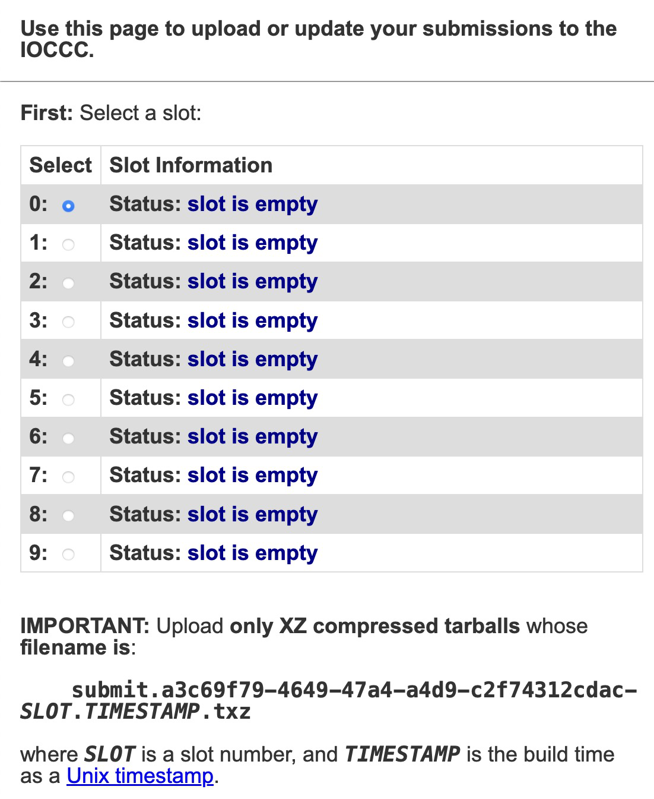
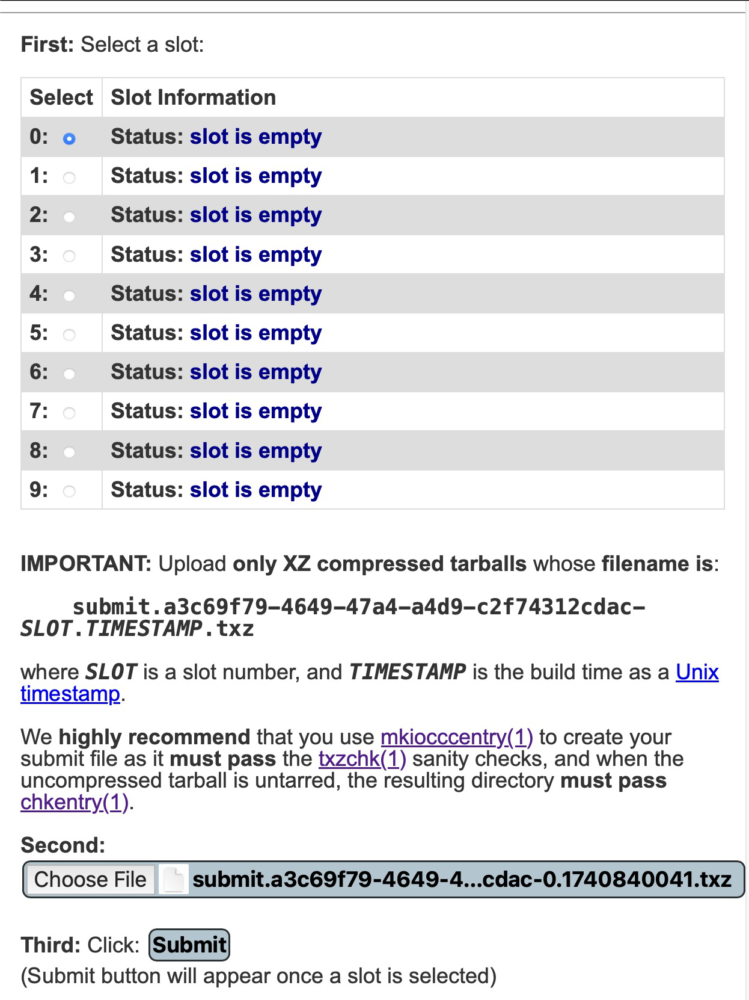
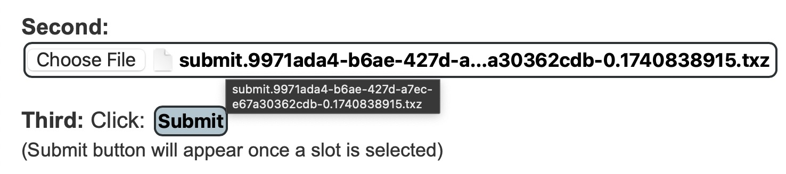
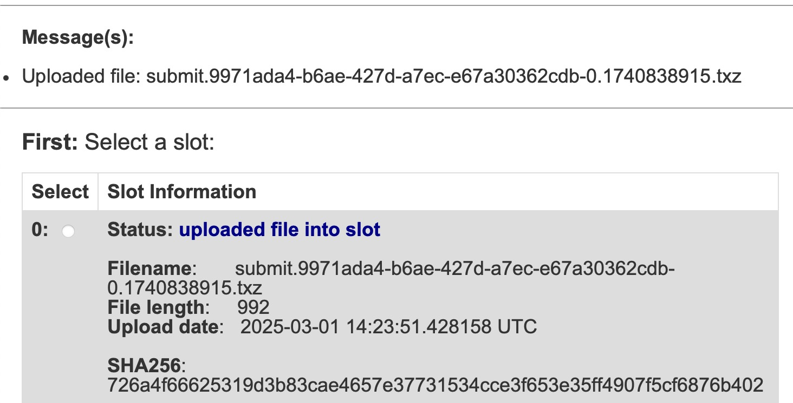

# How to upload your submission to the IOCCC

**IMPORTANT NOTE**: The [IOCCC submit server](https://submit.ioccc.org)
is only ready for submissions
**ONLY WHEN THE CONTEST IS [open](../faq.html#open)**.

See [current status of the IOCCC](../status.html) for details on the contest status.
**IMPORTANT NOTE**: When the contest is [closed](../faq.html#closed), the
[IOCCC submit server](https://submit.ioccc.org)
might be offline and unreachable as a website.

To login, open [https://submit.ioccc.org](https://submit.ioccc.org)
in your browser. Fill in your login credentials and click "Login".
It might look something like:

**NOTE**: if the contest is NOT open you will see something like this instead:

Assuming it is open, and if you've not logged in before, you'll have to change
your password first. See the file [pw-change.html](pw-change.html) for more
details. After that you will have to log back in.

Once you've logged in, you will see submit slots. Each slot is for one
submission so if you update a submission, make sure you choose the right one so
you do not replace the wrong one!

Here is what it looks like without any uploads and no slot selected:

Select a slot and then select a file by clicking the button "Choose File". After
doing this, it should look something like:

If you need to change the file to upload, you can mouseover the file and click
it. If you wait a moment it'll show the current filename. It will look something
like this:

Once you're certain you have selected the correct file, click "Submit", below
the file selection step.

When it's uploaded it should look something like this:

Here you see the details, in particular:

- the status of the submission
- the filename, which will be in the correct format, assuming you used
`mkiocccentry(1)` which is **HIGHLY** recommended so that you do not break [Rule
17](rules.html#rule17)!
- the file length, which `txzchk(1)` will also verify (the file itself and the
tarball listing)
- the upload date
- the SHA256 hash of the file

Now if you're done, log out.

After the submission deadline is reached, you can log in to check the status of
your submissions. Here is what it will look like when the judges have verified
that your tarball / submission has been validated (NOT judged), by `txzchk(1)`
and `chkentry(1)`:

For details on `txzchk`, see the
FAQ on "[txzchk](../faq.html#txzchk)".

For details on `chkentry`, see the
FAQ on "[chkentry](../faq.html#chkentry)".

If you need more information on the two JSON files, see
FAQ on the [".info.json file](../faq.html#info_json)"
and the
FAQ on the "[.auth.json file](../faq.html#auth_json)".

<!--

    Copyright © 1984-2024 by Landon Curt Noll. All Rights Reserved.

    You are free to share and adapt this file under the terms of this license:

        Creative Commons Attribution-ShareAlike 4.0 International (CC BY-SA 4.0)

    For more information, see:

        https://creativecommons.org/licenses/by-sa/4.0/

-->
